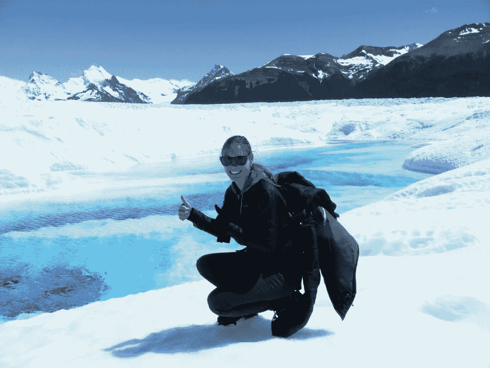

# 游客|旅行者|背包客|数字游牧者|旅行者|独立于地点|自由职业者|外派人员|企业家定义的差异

> 原文：<https://medium.datadriveninvestor.com/the-differences-between-the-definitions-tourist-traveller-backpacker-digital-nomad-a8f57349ca28?source=collection_archive---------5----------------------->

如果你已经关注旅游业有一段时间了，你可能不止一次遇到过“数字游牧者”和“位置独立企业家”这样的术语。这些术语很容易混淆，你几乎分辨不出它们的区别，因此这些术语经常被“交换”或互换使用。他们都被冠以旅行者、背包客、自由职业者、旅游企业家、外籍人士和企业家的称号。尽管有很多相似之处，但都略有不同。

最终，这个术语并不重要。我们不需要给每件事贴上标签，你觉得哪个术语最相关也没关系。一个并不比另一个更好，它们都只是略有不同，各有利弊。尽管如此，看到差异和相似之处还是很好的，希望在你读完这篇文章后，你会明白很多。

# 外国居民的形式

让我们花点时间来介绍一下你在国外会遇到的各类人。如果你是旅游新手，你可能会认为任何去外国旅游的人都是“游客”。然而，事实并非如此。旅行者不同于游客，游客不同于数字游牧者，数字游牧者不同于位置独立的企业家等等。那么我们有哪些外国居民呢？

# 游客

典型的**游客**可以很快被发现。他们经常被丢在更大的群体中，都戴着相机来捕捉他们一年一度的欢乐时刻。一个游客有备而来，他已经向旅行社预订了行程，旅行社为他们安排了一个很好的酒店，让他们放松，并了解他们一天活动和旅游的可能性。

游客大多不会说当地语言，因为没有必要。他们只呆一两个星期就回国。他们经常逗留在旅游胜地和大城市。

> *为了娱乐而旅行或参观某地的人*

旅行者

一个**旅行者**是对那些没有家也没有工作却不断旅行的人的统称。旅行者也可以被称为游牧者、流浪者、流浪者或流浪者。

游客越被动，旅行者越主动。他想安排好自己的事情。不需要每晚睡在同一家豪华酒店。一个旅行者很可能比一个旅游者更有冒险精神。他们计划得更少，做得更多。

对于一个旅行者来说，更多的是体验，而不是看一个地方和在沙滩上放松。旅行者探索目的地，而不仅仅是旅游景点。它熟悉当地文化，与当地文化互动，并希望向他们学习。他们住在本地，吃本地食物，见本地人。

> 在遥远的地方或外国旅行或已经旅行过的人

# 背包客

我们都认识，背包客。通常是那些高中毕业后离开的人，当他们度过间隔年或处于工作间隙时。有时他们得到保证，几个月后可以重返工作岗位，有时可以从头再来。一个背包客离开六个月或更长时间并不罕见。

一个**背包客**通常是一个年轻的、独立的、喜欢冒险的人，带着背包在世界上探索更长的时间，没有很多钱。这笔钱是预先存起来的，或者是在国外用工作假期签证挣来的。背包客试图过当地的生活。他们大多在旅馆或其他低成本的住处睡觉，乘公共交通工具去其他地方。

使这个术语与其他术语相关的不是工作部分，而是旅行部分。最大的不同是，一个背包旅行者并不一定要在这样做的时候谋生。

> *低价独立旅行的人*

# 数字游牧

数字流浪者这个词最近有点炒作。正如我们在以前的文章中所看到的，一个数字游牧者打算访问一个外国，了解那里的文化和人民，同时通过互联网工作来维持自己。他经常在短时间内这样做，每个目的地几周到几个月不等。

> *一个在国外以数字方式生活和工作的人*

# 旅游企业家

虽然你不像上面的术语那样经常听到这个术语，但是它也描述了很多人。对于那些不认为自己是数字流浪者，也不认为自己是位置独立的企业家的人来说，Travelpreneur 甚至可能是最佳选择。(也许这甚至是我最好的选择？)

> *不受地点限制经营业务的人*

# 独立企业家

术语“独立于位置”通常与术语“数字游牧”相混淆。虽然没有大多数人想象的那么相似。**地点独立企业家**是一个更加成熟的企业家或自由职业者，他们的企业足够大，即使没有他们的实体存在也能生存，或者他们的企业不依赖于特定的地点。这使他们有可能在国外生活更长时间。

> 一个想住哪就住哪的人

# 外籍人士

一个**外派人员**实际上是为了工作而移动国家，因此与上面的术语大相径庭。

外籍人士是指经常因为工作而居住在外国(多年甚至永久)的人。要么是因为他们选择了一个特定国家的新工作，要么是因为他们的雇主把他们送到了那里。外籍人士通常是熟练工人。上面的条件并不局限于某个特定的地点，一个外派人员对新工作的地点要求非常严格。

> 因工作而居住在国外的人

# 自由记者

自由职业者是一个自雇的人，因此不会长期受雇于雇主。他们可以由代理机构代理，独立工作或利用专业协会或网站来获得工作或客户。

自由职业者是一个最不相似的术语，因为它实际上并不是指那些除了自己的家乡之外一定想去任何地方的人。他可能出生的地方和他的家人在哪里。尽管与其他术语仍有许多相似之处。

> *按小时、天或工作出售工作或服务，而不是为一个雇主拿固定工资的人*

# 企业家

企业家，所有术语中最笼统的一个。这个词与旅行完全没有关系，但由于其自由因素，仍然有许多相似之处，以自己的方式生活。企业家是指建立一个或多个企业，承担金融风险以期获利的人。

> *企业家是指设计、创办和经营企业的人*

所有的术语都有自己的好处，每个人都有最适合的。一个并不比另一个更好，这完全取决于你自己的偏好和你在生活中或在你生活的特定阶段想要什么。

# 各条款在不同点上的差异

现在我已经定义了这些术语，让我花点时间来确定这些术语之间的一些差异，以便更容易理解它们是什么。

# 地点和在每个地点停留的时间

游客、旅行者、背包客、数字游牧民、旅游企业家、外派人员、位置独立企业家以及居住在本国之外的所有人。暂时的还是长期的。

一个旅游者或旅行者会在国外呆很长时间，最多几个星期就可以回国，回国后他们的工作在等着他们。他们去他们选择的地方是有原因的。这可能是观光或一项活动。

大多数数字游牧民、旅行者和背包客会在一个地方生活几天、几周或几个月，但会离开自己的国家一段时间。如果他们有家可以回的话。我认识的一些人要么在父母那里注册，要么根本没有注册(危险的家伙，我不建议这样)。

旅行者或背包客可能是这个群体中“最快”的旅行者，因为他们不一定需要完成工作。

外籍人士和位置独立的企业家在一个新的国家创建一个新的家，因为这是他们长期定居的地方。他们可能会进行短期旅行，但有某种回家的基地。他们将更经常地回到他们的“祖国”,并有一个真正的居住和返回的地方。这并不意味着他们的祖国或基地是他们出生或长大的地方。他们想去哪里都可以。

因此，虽然数字游牧者、旅游企业家或背包客总是在改变居住地点，但独立企业家、外籍人士、自由职业者或企业家会选择在一个特定的地方居住更长的时间。

作为一名游客、旅行者、背包客、数字游牧者或旅行者，你在某个特定地方停留的最长时间内只能获得旅游签证。这通常与其他术语不同。他们有不同种类的签证。

一个外国人经常因为工作而改变他的国家，这通常是作为一个办公室的雇员，由雇主安排某人的居留签证。这也意味着当你辞掉工作，你通常会得到一个临时签证，有时甚至没有签证。

一个位置独立的企业家可能会使用特定的投资签证，以便能够在一个不同的地方停留更长的时间。其他的签证是在某人的银行账户里有足够的钱的时候，或者是在一个地方进行了房地产投资的时候。

# 工作是如何完成的

作为一名持有旅游签证的外国人，在一个新的国家，没有太多选择从事体力劳动。背包客有时会遇到特殊的背包客签证，以便能够工作(例如在澳大利亚的工作-假期签证)或交换他们的技能，获得免费住宿和食物安排。(自由职业或编织)

如果背包客决定在某个地方工作，他们不一定使用笔记本电脑。他们可以在农场、旅馆等地方工作。这是与数字流浪者工作方式的主要区别，数字流浪者几乎所有的工作都是在互联网上完成的。它们“数字化”是有原因的；).

有时我们不都嫉妒那些游客和旅行者吗？当他们访问另一个国家时，他们根本不工作。难以置信但却是真的，我想有时候。我几乎有点嫉妒了。我几乎不敢大声说出来，但这是事实。

根据所选择的生活方式或职业，独立企业家可以作为非移民甚至是这个新国家的公民生活。因为他们不需要亲临工作场所。

他们通常在自己的国家有人为他们工作，或者他们并不扮演一个需要他们总是呆在一个国家的积极角色。他们也可以将部分或全部业务转移到新的国家，在那里长期工作。因此，并不是所有的位置独立的企业家都在数字化工作。

# 钱钱钱

在大多数情况下，游客、旅行者或背包客根本不工作。你可以把它看做是一个(延长的)假期，在这个假期里，有人不需要赚钱就可以探索世界。这主要是因为他们在开始度假或背包旅行前就存了钱。

一些背包客可能会在一个地方临时工作，以便能够在那里养活自己。通常是因为他们在国外能比在国内挣得更多，仅仅是因为最低税率更高(再次以澳大利亚的工作假期签证为例)。

尽管大多数人可能认为数字游牧者或旅游企业家比独立于地理位置的企业家挣得少，但事实并非如此。我知道赚很多钱的数字游牧民，尽管我也知道很多根本赚不到很多钱的数字游牧民。这两者之间的主要区别不是钱，而是选择的生活方式。

虽然你可以说，大多数数字游牧民是以这种生活方式开始的，他们可能会发现他们的空闲时间比他们银行账户上的金额更重要。数字游牧者要么是自由职业者，要么是在互联网上工作或提供离线服务的“单枪匹马的创业者”(单枪匹马的企业家)。顾名思义，本地独立企业家是指在自己国家的全职企业家或成功的自由职业者，甚至可能拥有一支活跃的团队并经营业务。

外籍人士为了他或她的新工作搬到一个新的国家。当地人通常做不了的工作。由于他们的技能，这肯定是外国人签证的要求之一。这意味着他们的工资通常比那些没有他们技能的人要高，并且通常比他们在自己国家的工作要高。

# 预算规模

预算没问题的时候；典型的游客，他们不介意花一个月的薪水去喝酒和参加有趣的活动，当他们终于有机会逃离他们每天的办公室时。如果我每天被关在四堵白墙里，我也会这么做。他们尽情享受，因为他们知道他们必须回到哪里。

大多数背包客都是按预算旅行(虽然不是全部)。这与这样一个事实有关，即一旦他们的钱用完了，他们就会考虑回到自己的国家，重新开始一种更有规律的工作生活。在这种情况下，你花在路上的时间越少，你可以离开的时间就越长。难怪这就是为什么你会在世界上更便宜的地方找到大多数长期背包客。在澳大利亚赚钱，在亚洲消费，是最常见的例子之一。

由于收入差异，数字游牧者的预算通常低于独立于地点的企业家。他们可能刚刚起步，有一些投资成本，而这些成本是独立创业者不再拥有的。这就是为什么数字游牧者通常生活在世界上不太昂贵的地方，只是为了降低成本，投资于自己和它的公司。

> 你去某个地方是因为那里便宜，还是因为那是你想去的地方？能够在任何地方工作是无价的。不要让你的预算决定去哪里，让目的地决定你的收入。

# 自由程度

成为数字游牧者或过其他提到的生活方式的主要原因之一显然是这些生活方式所附带的“自由”。理想情况下，数字游牧者、旅游企业家和独立于地理位置的企业家几乎可以住在他们想住的任何地方。然而，一个位置独立的企业家可以选择住在任何他们想住的地方，因为他们想住在那里，而不必考虑更高的费用太多。

由于大多数数字游牧民也关心预算和他们能在一个地方呆多久，他们很可能去“更便宜”的地方。虽然这在某种程度上满足了他们的目的，但有时会限制他们“随时随地想去哪里就去哪里”的初始自由，相比之下，位置独立的企业家(在这方面)比数字游牧民有更多的自由。

# 年龄、业务和生活经历

所有的定义都通过他们的生活方式获得了很多经验。然而，最有可能的是，他们并没有在生活的各个方面获得相同的经历。对一年的生活方式进行比较，背包客、数字游牧者或旅行者会去更多的国家，更有可能与当地社区互动。我会说，他们可能比游客、自由职业者、外籍人士或独立创业的企业家有更多的实际生活经验，这些人更可能有更多的家，并可能以不同的方式旅行。

另一方面，自由职业者、外籍人士或独立经营的企业家可能有更多的商业经验。他可能已经“做生意”很多年了，而其他人更可能是不到 10 年的个体经营者。

我想他们都有重要的东西可以互相传授。

如你所见，背包客、数字游牧者或旅行者比旅游景点独立企业家更年轻。不仅仅是因为经历，还有他们对事业和人生的选择。二三十岁的人更有可能去探索世界，而不是 50 岁的人。这并不意味着它不能反过来，肯定有所有年龄的数字游牧者，以及更年轻的位置独立企业家，这肯定是一个更普遍和常见的数字。

# 我与哪个术语有关？

我绝对认为自己是数字流浪者和旅行者的结合体。我喜欢旅行和探索世界，我一直在路上。我去过将近 100 个国家，在每个大洲都呆了一年多。虽然我有一栋房子，但我再也没有家可回了，我也没有足够的钱在世界上最昂贵的国家生活很长一段时间。

这并不意味着我不会去昂贵的国家，这意味着当我可以做一些家务，和朋友住在一起，并且比我在一个更便宜的国家预算更多的时候，我会去。

虽然我目前认为自己是一个旅行者/数字流浪者，而且我看不到这种情况会很快改变，但我确实渴望有一个更大的家，有时能够“回家”。我想这发生在你 5 年多来一直背着背包生活之后。

这并不意味着我看到自己回到了荷兰的家，而且肯定不会再呆在一个无聊的办公室里，这只是意味着一个家的基地，在某个地方，可以回到并感觉“在家”，与邻居交谈，享受一些非旅行时间。(有时候会很累，尤其是当你想完成一些工作的时候。)

我的旅行速度已经比以前慢了很多。旅行时工作比仅仅工作或仅仅旅行要累得多。在我不久的将来，一个家庭基地、缓慢的旅行和一些真正的旅行的结合将是理想的。

# 你的偏好是什么？

那么，你现在是哪一种人，或者你想成为哪一种人——数字流浪者、独立于地理位置的企业家，或者其他任何定义？我很想知道。

请记住，每一种生活方式都有自己的起伏，而不仅仅是职业道路。每种生活方式都略有不同，就像这个星球上的每个人都略有不同。所以挑一个最适合你的吧。如果你不喜欢一直在路上，数字游牧生活方式很可能不适合你。但这并不意味着你不能不受地理位置的限制，或者时不时地去旅行。无论你选择成为什么样的人，都应该是因为你选择成为那样的人，而不是因为你认为那样“更好”或“更有利可图”。

如果你有兴趣认识其他像你我一样志同道合的人，请随意查看我们即将开展的[工作](https://activeworkation.com/upcoming-active-workations/)，这样我们不仅可以提高工作效率，还可以相互学习。

最后但同样重要的是，不要太担心数字游牧者或位置独立企业家这些术语，它们只是术语。以你想要的方式创造和过你的生活，不管你最终如何命名它。祝你旅途好运！