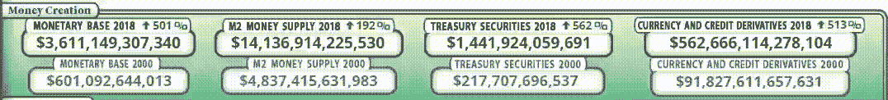
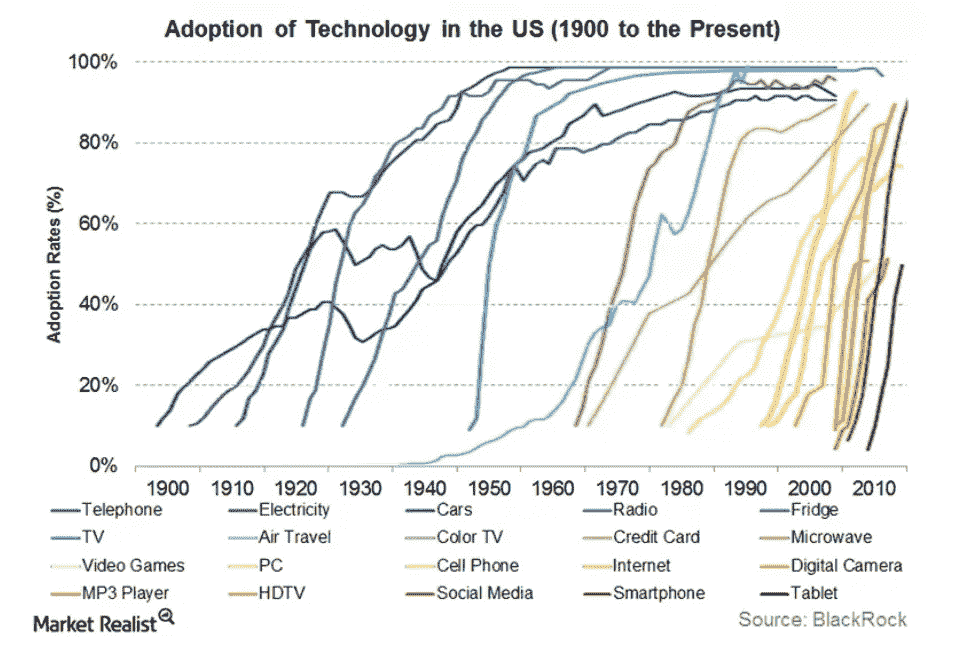
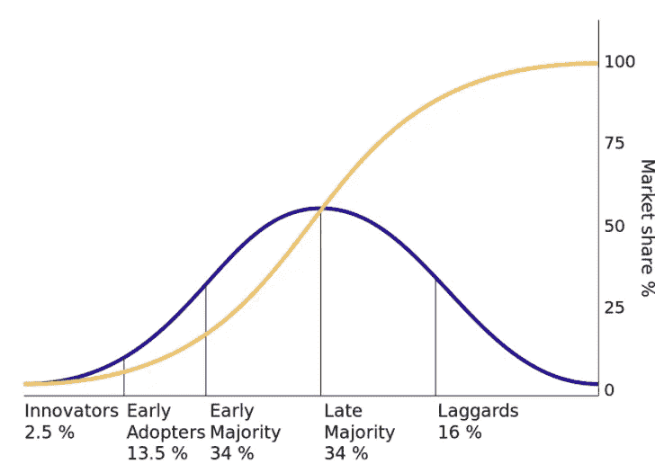

# 数字货币难题

> 原文：<https://medium.datadriveninvestor.com/the-digital-currency-conundrum-6b2a5edd9202?source=collection_archive---------9----------------------->

数字货币(DC)的数量激增，但其中最引人注目的仍然是比特币，因为它是 T2 加密货币概念的第一个证明，并从那时起一直主导着加密领域。比特币的流行是基于一个*无信任系统*的概念，它不依赖任何中央权威，而是分布在许多节点(计算机)上，有效地在很大程度上减少了中央故障点的脆弱性。它废除了重复消费的概念，并且受到加密保护。其基于 [*区块链*](https://medium.com/the-mission/a-simple-explanation-on-how-blockchain-works-e52f75da6e9a) 的分布式账本系统允许通过网络上各种节点间的共识系统实现透明度，从而消除了欺诈问题。此外，比特币在很大程度上是匿名的，通过比特币进行的交易无法撤销。

如今，密码市场上有许多可用的令牌，这些令牌可以大致分为三个领域；安全令牌、实用令牌和加密货币。本文将专门关注加密货币领域，特别是比特币，它是当代社会经济和技术环境中传统法定货币的挑战者。

# 货币简史

比特币在过去几年中获得了广泛的关注，但在 2008 年金融危机后，它在中本聪的庇护下迅速出现，他仍然是一个谜一样的人物。不足为奇的是，只有当我们意识到现有事物的易错性时，我们才倾向于寻找替代品。货币本身，无论是美元、英镑还是卢比的形式，也是同一现象的一部分——我们对这些货币的静态观点主要是因为我们没有看到其他任何东西，更不用说因为我们出生的时代而想象不同的可能性了。

但是如果我们深入研究货币的历史，我们会意识到货币和技术一样是动态的。我之所以比较这两者，是因为本质上，它们的目标保持不变，而形式却在不断演变。技术寻求通过效率和速度让我们的生活变得更容易，而货币有三个主要目的；作为交换媒介、价值储存手段和记账单位。这些功能在历史上的许多其他物品中充分存在，服务于当时的需求，从[牛、贝壳、黑曜石和珠子](https://theconversation.com/when-and-why-did-people-first-start-using-money-78887)到金属的提炼成为造币系统的先驱。

# 当前的系统是如何工作的？

2008 年金融泡沫的破裂不仅凸显了金融资本主义的自我毁灭机制，也揭示了创造货币的方式、由谁创造以及如何创造。因为最重要的是，这是一场金融崩溃；没有房屋被烧毁，也没有任何政治或社会动荡，而是价值在相对较短的时间内令人难以置信地下降。这一事件被通俗而正确地称为“*崩溃*”。这就提出了一个相关的问题，法定货币是如何创造的？

> “美国人民不理解我们的银行和货币体系，这很好，因为如果他们理解，我相信在明天早上之前就会发生一场革命。”亨利福特

我相信我们大多数人都是在法定货币的世界中长大的，法定货币是由每个国家的中央银行发行的，或者就欧元而言，是由该地区的中央银行发行的，或者更确切地说，是由一个帝国的发行机构发行的[非洲金融共同体法郎](http://roape.net/2017/05/18/cfa-franc-french-monetary-imperialism-africa/)(这本身就是一个完全不同的讨论)。严格来说，以美元计价，中央银行或美联储是一个私人实体或自主行为者，因为我们更愿意称其为负责货币政策的机构。它控制利率，因此直接影响经济中的信贷和货币供应。但更有趣的是，美联储和私人银行有能力通过储备创造货币。

[**言简意赅地说当银行放贷时，它们创造货币**](https://www.monetary.org/wp-content/uploads/2016/03/money-creation-in-the-modern-economy.pdf) **。**

等等，不切蛋糕怎么能吃蛋糕呢？这是通过[部分准备金银行](https://www.investopedia.com/terms/f/fractionalreservebanking.asp)系统实现的，这是货币经济学中的一个基本概念。

因此，如果我们都去银行，并试图同时提取我们的存款，大多数银行将关闭，因为他们没有等量的现金来匹配其存款；它是数据库中唯一的数字，我们称之为‘银行余额’(这在 20 世纪 30 年代的曾发生过)。

值得注意的是，情况并非总是如此，直到 1970 年代尼克松总统废除金本位制之前，美元都是由黄金支撑的。因此，美元，今天的全球交换货币，除了我们的集体信任之外，基本上没有任何支撑。结果，纸币随着时间的推移呈指数级增长，却没有任何支撑。

Source: [US Debt Clock](http://www.usdebtclock.org/index.html) as of 15th Aug 2018

始于过度贷款的危机经由信贷紧缩而崩溃，突显出银行和金融机构(FIs)扮演的重要中介角色，它们在历史上一直互为补充；前者创造金钱，而后者利用金钱作为实现自己目标的手段。由于它们都是紧密相连的，其中一个的故障会导致多米诺骨牌效应，波及整个经济，包括国内和国际。

# 为什么是中央权威？

货币在历史上被用作社会和政治控制的工具；最初由国王创建，以阻碍对等贸易，因此*国王的臣民*将永远依赖中央权力进行经济交易。中央对货币的控制允许征税以使精英阶层受益，同时创造了一种筹集资金以支持国家利益的机制。

如前所述，金钱有多种形式，被认为与时间的进步相关。特别是纸币，它是激发国际贸易和创造货币市场的有利机制。这反映了全球化的串联现象，自那时以来，这种现象已遍及全世界。全球化确实拉近了世界的距离，但我们经历的达到目前状态的动荡包括大规模种族灭绝、奴隶制和政治压迫，这些在今天仍然十分普遍，因为经济利益在很大程度上压倒了社会政治利益。

在两次世界大战后，各国之间进行着多种商品和服务的贸易，但贸易媒介主要是美元。我甚至可以说，美国仍然能够保持这种霸权的主要原因是因为它能够将美元作为全球贸易的唯一货币。利比亚领导人穆阿迈尔·卡扎菲试图重振黄金支持的货币的想法，这种货币将直接与美元和欧元竞争，但未能如愿。同样，[伊拉克领导人萨达姆和叙利亚领导人](https://www.iol.co.za/pretoria-news/dont-dare-dump-the-dollar-15264019)试图抛售美元以换取欧元。我想知道他们有什么共同点，当然是修辞上的。

但是，除了政治，我们在全球范围内交易、互动和合作的方式也在迅速变化。那么，是时候建立一种新的交易媒介、价值储存手段和记账单位了吗？一种更符合我们当前技术和生活方式趋势的货币形式？是时候转变了吗？还是我们已经在这个过程中了？

S 曲线或 Sigmoid 函数显示了一个变量相对于另一个变量的增长，并已被不同学科用于绘制趋势图。特别是在技术发展领域，它被用来描述采用率是如何随着时间的推移而增加的。下图说明了这一理论，反映了采用如何开始缓慢，指数增长，然后停滞不前，一旦它包含了大多数。

Technology Adoption Trends

有人认为，跟单信用证是一种类似的现象，我们可能处于早期采用阶段。这与当代社会互动中大量使用的时髦缩写词 FOMO(害怕错过)有关，这可能解释了图表中心的指数上升。

[What DC adoption may look like](https://bitcoinmagazine.com/articles/op-ed-bitcoin-not-bubble-its-s-curve-and-its-just-getting-started/)

# 为比特币搭建舞台

一方面，考虑到世界上的发达国家和发展中国家，我们已经看到在过去几十年中向数字化的巨大转变。显而易见，在发达国家，我们用卡而不是现金作为支付手段，也很少用现金支付。我们的银行账户只是屏幕上的数字，无论我们从哪里查看它们。我们越来越多地通过互联网进行交易，无论是通过网上零售平台、电子服务，还是最谨慎的网上银行。特别是在发展中国家，属于电子货币领域的移动银行服务呈指数级增长。所有这些东西在过去的半个世纪里并不存在，但在最近几十年里却令人难以置信地增长，而这些发展所基于的货币体系可以追溯到几个世纪以前。那么，我们当前的货币体系过时了吗？

另一方面，除了作为政府指定的货币，美元还有什么支撑？有什么内在价值吗？在全球背景下，这些问题最终将我们带回到一个基本问题，我们是否信任那些控制货币体系的人？在这个框架内，比特币似乎符合当前的趋势，实际上似乎是当代数字经济中法定货币的最终后代。对政府及其机制的幻灭和怀疑以呼吁变革和透明的 [*【占领华尔街】*](http://occupywallst.org/) 运动的形式达到了高潮。比特币不符合这种情况吗？政府领域之外的货币结构。

比特币被狂热分子视为摆脱与解放和自由相关的政府控制的救世主，利用其局限于黑暗网络的*丝绸之路*的原始用例，这本身就是一个巨大的争议点。底线是，有两个因素同时在全球市场**发生巨大的转变；首先，人们对政府、银行和金融机构的信任逐渐减少，并对它们不再抱有幻想，尤其是在不一致的激励措施方面；其次，人们盲目信任，或者更确切地说，依赖于我们的数字设备，而这些设备已经扩散到我们的生活中。许多纪录片被创作出来，许多文章被发表，讲述技术及其对我们社会结构的巨大影响，以及持续监视的现象。然而，我们已经被*迷住了*，并且越来越倾向于使用更加复杂的设备和软件，这些设备和软件因为其便捷、快速和高效已经成为我们生活的一部分。这些因素结合在一起，在意识形态上和系统上推动我们走向一个无所不包的数字化未来，在这个未来，数字货币似乎是一个更好的选择，在适当的情况下，我们会很乐意接受，特别是在*去中心化的旗帜下。***

# **威胁**

**尽管我们试图找到可供选择的意识形态来寄托我们的信任，但它们最终还是会出错。数字货币的底层协议，理论上区块链可以通过 [51%的攻击](https://www.investopedia.com/terms/1/51-attack.asp)被接管。如果比特币被广泛采用，它将允许没有责任或所有权追踪机制的货币存在。这最终会让谁受益？一个人有 1000 美元、100 万美元还是 10 亿美元？**

**隐私是跟单信用证的一个重要特征，但如果用于洗钱，也会带来巨大的风险。一些人可能利用它来逃税，但恶意行为者可能利用它来资助非法活动和违反公共利益的人。这个问题一直是各国在当前关于跟单信用证的辩论中争论的焦点，但重要的是要记住，几十年来洗钱一直是一种普遍的做法；你越富有，洗钱的渠道就越多。在没有比特币的帮助下，天堂文件和 T2 文件在全球精英如何隐藏他们的钱方面令人大开眼界。此外，全球[银行](https://www.theguardian.com/world/2017/mar/20/the-global-laundromat-how-did-it-work-and-who-benefited)一次又一次面临洗钱指控，它们支付了巨额罚金，但仍在公共领域运营。**

**甚至比特币也不是完全安全的——我相信到处都有漏洞；有些我们已经找到了，有些我们将会找到。本质上，它是一个人造的系统，因此也可以被人类破解，但显然是被那些有相关知识的人破解。在创造和编程技术的人和简单使用技术的人之间存在着巨大的鸿沟。有一个我们视而不见或者选择忽略的知识缺口；道格拉斯·拉什科夫的书《编程或被编程》中的一个基本概念。**

****

**正如我在上一篇文章中所重申的，技术是一把双刃剑，但它本身在很大程度上与政治无关；是用户和创造者引导其应用，从而赋予其价值、意义和方向。**

# **展望未来**

> **金钱并不存在于真空中，而是一个复杂的动态社会结构网络的一部分，人们在这个网络中行动和互动。因此，金钱是一种社会关系，因为它调节着人们之间的互动**

**代替这个想法，比特币象征着什么？一种超越国界、不受任何国家法律约束的统一货币？**

**公众对 DC 辩论的看法仍有分歧，但这种讨论的存在可能会给我们提供另一种看待事物的视角；过去，当著名的世界领导人试图摆脱美元时，美国政府积极寻求终止这一过程，但随着比特币的出现，美国政府正在寻求对其进行监管。美国的一些州甚至让 T2 接受用这种货币缴税。有人可能会说，政府只是在税收方面扩大了范围，但他们为什么要支持一个潜在的竞争对手来挑战自己的霸权秩序呢？此外，众所周知，大企业在[的政治权力走廊](https://www.theguardian.com/politics/2014/mar/12/lobbying-10-ways-corprations-influence-government)谨慎运作，产生巨大的影响力；这可能是他们争取更大全球优势的阴谋吗？**

**比特币或整个 DCs 可能看起来像是一种解放和自由的媒介，可以摆脱中央当局对货币供应的过度且往往不计后果的控制，但如果我们考虑到当今世界正在发生的平行发展，例如在爱沙尼亚最受欢迎的电子公民倡议，其中由国家颁发的数字身份处理从银行到医疗保健、从保险到投票的所有信息；数字货币可能只是存储在那张卡上的另一条信息。这将最终导致对公民个人可以获得的所有资源的集中控制，并可能导致与解放和自由完全相反的结果。**

**结合中国的社会评分系统；数字化货币可以有效地成为系统的延伸，并由一个中央机构控制。再加上这些发展，发展中国家如何融入大局？**

**从短期来看，我们可能都认为这是一个创造利润的机会，但从长期来看，随着采用率的增加，这可能是灾难性的，因此，随着这一现象的发展，我们必须谨慎行事。好与坏是一个视角的问题，但被告知是一个必要性的问题。对我们来说，学习、理解和解读正在全球展开的地震转变是至关重要的。**

**在我看来，DC 难题说明了一个更大的想法；它可以被视为一个完全全球化的世界的先驱，在这个世界中，贸易将不会受到任何国家边界的阻碍，因为贸易媒介将不会受到任何国家实体的控制。这可以有效地让强大的私营企业产生巨大的经济、政治和社会力量。**

**这些转变将如何实现？它们将如何实施？它们需要什么？谁将最终受益于这种转变；普通人还是大企业？这些都是有待探索和理解的问题，但想象各种可能性对于拓展我们的思维范围至关重要。**

**当我写这篇文章的时候，一场始于土耳其里拉的法币危机正在隐现，但现在已经蔓延到其他发展中地区的货币，加剧了对危机蔓延的恐惧。如果这场危机据称会发展成一场全面的经济危机，人们会怎么做？他们会转向比特币作为价值储存手段吗？**

**此外，伊朗危机的加深在两个历史盟友之间制造了裂痕；即美国和欧洲。鉴于当前的事件，德国一再呼吁[结束对美国支付系统](https://www.dw.com/en/germany-urges-swift-end-to-us-payments-dominance/a-45242528)的依赖，据称德国已经开始研究替代手段。各国是否有可能创造自己的发展中国家，以规避传统的货币机构？这将如何改变权力平衡？它对全球范围有什么影响？**

**这些问题和意见只能随着时间的推移来检验，但对我们所有人来说，重要的是要看到更大的图景，否则我们可能会被欺骗，陷入我们的集体征服。**

## **参考资料:**

**温纳林德(2001 年)。金钱会说话，但它在说什么呢？货币与社会控制的符号学。*《经济问题杂志》*，*第 35 期* (3)，第 557 页。**

***发表在 Ourworld.io 上——重新定义话语***