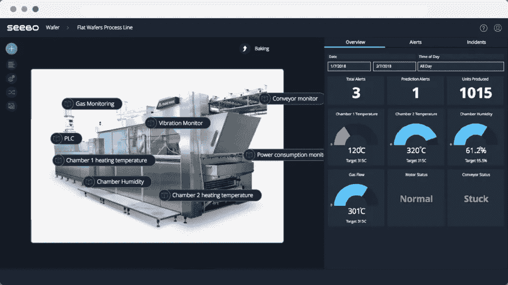
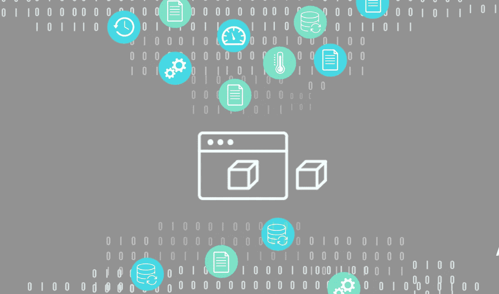

# 数字双胞胎:工业 4.0 的强大用例

> 原文：<https://medium.datadriveninvestor.com/the-digital-twin-powerful-use-cases-for-industry-4-0-cdf5b0ebf8ae?source=collection_archive---------0----------------------->

如今，物联网、机器学习和其他形式的工业人工智能等技术正在融合，并被用来改变我们收集和分析数据的方式。这一点在工业数字双胞胎及其用例的出现中表现得最为真实。

A digital twin in a food production line showing sensor readouts. The Seebo Platform.

数字孪生技术实际上已经存在了一段时间。美国宇航局开发了早期的数字双胞胎来模拟阿波罗 13 号上的条件，今天利用数字双胞胎来监控整个航天中心。

虽然制造业不能吹嘘像营救被困宇航员这样戏剧性的用例，但将[数字孪生技术](https://www.seebo.com/digital-twin-technology/)应用于产品和制造过程本身正在解决令人痛苦的业务问题，并为工业部门带来可量化的改善。

# 什么是数字孪生？

> *到 2021 年，一半的大型工业公司将使用数字双胞胎。*
> 
> *–*[*Gartner*](https://www.gartner.com/smarterwithgartner/prepare-for-the-impact-of-digital-twins/)

数字孪生是一个物理系统的虚拟表示，同时又是一个独立的实体。这个数字拷贝是嵌入在物理系统中的信息的“双胞胎”,和物理部分一样多。

随着物联网的出现，数字双胞胎可以从传感器持续收集数据，并在系统的整个生命周期中与物理双胞胎相互传递信息。从制造过程到传感器输入，再到外部管理软件，一切都可以输入并组织在数字双胞胎中。

Digital twins aggregate data, making it easy to identify patterns in historical events, spot root causes, and optimize line processes.

这种从物理产品或系统及其周围聚合数据的能力，以及作为数字替身的功能，为新用例的惊人广度开辟了道路。

# 数字孪生用例:生产过程和产品性能

**想象如下:**

一家化学制造厂每年生产价值 5 亿美元的产品。每条生产线都包含高度专业化和昂贵的机器，以及用于生产最终产品的原材料和机器设置的详细“配方”。

现在想象工厂中生产线的数字副本，包括从生产线机器收集的传感器数据(通常存储在数据历史库中)；原材料、生产订单和配方的 ERP 数据；和质量管理系统数据等。

制造商需要通过减少计划外的机器停机时间、减少每次生产中产生的“废料”数量以及最大限度地减少代价高昂的生产质量故障来不断优化产量。

通常情况下，他们的团队从查看堆积如山的数据开始，慢慢缩小可以帮助他们的信息范围。只有在彻底的研究之后，他们——或许——才会开始注意到可以帮助他们优化这个复杂的资产和指令系统的相关性。

**现在添加数字孪生:**

好的 [digital twin 软件](https://www.seebo.com/digital-twin-software/)将从相关的 IT 和 OT 来源获取数据，并显示在生产线的虚拟副本上。过程工程师、QA 团队和其他人可以了解机器、原材料和整个生产线环境中的数据。

如果 digital twin 系统与[根本原因分析工具](https://www.seebo.com/root-cause-analysis-software/)相结合，它甚至会指出哪些变量需要紧急关注，从而加快根本原因调查和优化过程。

# 监控生产线和单个机器的健康状况

数字双胞胎首先是制造业的 EKG 监视器——它们可视化并跟踪生产线的脉搏。

熟练的操作员只要触摸一下机器的表面就能发现它有什么毛病。digital twin 通过显示问题是如何通过数据反映出来的，帮助调查团队更快地发现资产中的问题，甚至在未来缓解同样的问题，从而将这种直觉向前推进了一步。

相关:[通过预测性维护实现卓越制造](https://blog.seebo.com/predictive-maintenance-machine-learning/)

此外，所有这些洞察力都可以远程获得。工程师可以通过 digital twin 对设备进行远程故障排除，与仅通过查看历史记录、mes 或质量管理软件上的数据相比，可以更快、更准确地缩短事件解决时间。

为什么？因为语境的重要性。

# 使用数字双胞胎理解上下文中的数据

生产线数据存储在不同的系统中:一些数据保存在数据历史记录中，一些保存在 ERP、MES 和质量系统中；一些手动存储，一些自动处理。

当数据没有以易于理解的方式进行聚合和组织时，它对于获得准确和可操作的见解是无用的。

以每批生产 10，000 块砖的生产线为例，在生产过程结束时有 1.5%的废料。随着时间的推移，每一批都会产生更多的废物和更少的产量。

为了确定问题的根源，工程师首先需要通过监控机器停机时间来查明他们损失生产量的流程步骤。

但是查看不同来源的停机时间数据非常耗时，并且很难找出相关的指标。digital twin 提供了环境因素、单个机器以及它们如何相互影响操作质量和资产性能的更综合的视图。

该工程师在数字孪生机上查看停机时间，可以快速准确地[查明问题的根本原因](https://www.seebo.com/root-cause-analysis-examples-in-manufacturing/)(例如烤箱中的低温)以及导致报废的一系列事件。

# 原始设备制造商的数字孪生用例:控制和可见性

单个产品的数字孪生产品(例如，包装机)推动跨越整个产品生命周期的商业利益:

*   产品开发——工程师、设计师和开发人员创建数字原型，然后运行模拟来测试产品的可用性。原始设备制造商可以通过在产品上市前减少缺陷来削减开发和生产成本。
*   通过 digital twin 设置:可以从远程服务中心激活产品，从而降低消费者的服务成本。
*   生产后故障排除——当有关实时产品行为的所有数据都在数字双胞胎中捕获时，工程师就可以轻松排除产品中报告的错误。

# 数字双胞胎的未来

随着制造商的不断创新，数字孪生用例也是多种多样。随着人工智能、图像识别和其他技术的进步，数字双胞胎将适应它们，并为工业制造开发令人兴奋的新应用。

关于原始帖子，请点击下面的链接:

 [## 工业 4.0 的数字孪生用例:监控、优化等

### 如今，IIoT、机器学习和其他形式的工业人工智能等技术正在融合，并被用于…

blog.seebo.com](https://blog.seebo.com/digital-twin-use-cases/)