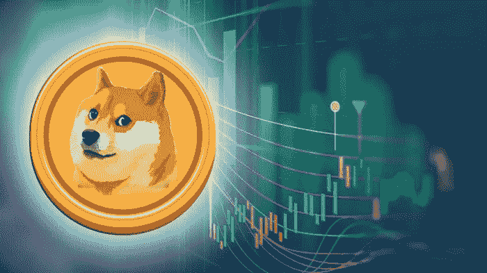

# 今年美元走势很大，第二季度美元升值了 60%

> 原文：<https://medium.datadriveninvestor.com/the-dogecoin-is-moving-greatly-this-year-and-currency-made-60-in-quarter-2-ece5aeee8bf8?source=collection_archive---------11----------------------->

*(免责声明:文章所表达的观点和看法仅属于作者，不一定反映 DDI 的立场。这篇文章无意成为投资建议。我们建议你通过多种渠道进行自己的独立研究。)*

自 2013 年以来，加密货币 Dogecoin 已经进入发展阶段。这种货币的实际所有者希望创造出像比特币一样有趣而不无聊的东西。他们认为有趣的加密货币会比比特币等传统货币在加密货币市场上吸引更多的人。

 [## 总部位于瑞士的 ETP 进入加密交易市场|数据驱动的投资者

### 虽然金融市场几乎没有沉闷的时刻，特别是在引入…

www.datadriveninvestor.com](https://www.datadriveninvestor.com/2019/03/10/swiss-based-etp-enters-the-crypto-trading-market/) 

今年,[币](https://www.thecoinrepublic.com/dogecoin-value-analysis-the-3-months-chart-shows-doges-value-firmness-in-spite-of-the-downfall/)的受欢迎程度增加了，知道并关注加密货币的人肯定听说过它。这种货币在互联网上也有很多粉丝。twitter 和 Reddit 上的大多数人总是称赞和支持 Dogecoin。狗的象征“柴犬”在民间也很受欢迎。

对于互联网上的人们来说，这是一种有趣的加密货币，但在加密市场上，它也是一种严肃的加密货币。这种密码源自莱特币的变种，代号为“幸运币”。“幸运币”也基本基于比特币。Dogecoin 和 Litecoin 利用类似的名为 Scrypt 的挖掘算法，这就是为什么 Dogecoin 比比特币获得更小的块周期。由于加密，使用专用集成电路挖掘硬币是非常困难的。

Dogecoin 一点也不好玩；它在密码市场也做了一些重要的生意。2014 年早些时候，该货币为牙买加有舵雪橇队参加索契冬奥会筹集了约 25，000 美元。另一方面，Dogecoin 具有通货膨胀性，不像比特币那样具有 2100 万的有限挖掘价值。根据 CoinMarketCap 的数据，流通中的货币超过 1200 亿多戈。

**Dogecoin DOGE/USD 上一年的表现:**在 2015 年 7 月至 2017 年 3 月的两年时间里，该货币在 0.0001 美元至 0.0004 美元之间波动，波动非常小。该货币在 2017 年年中至 2018 年初左右升值。

该货币的价值在 2017 年 5 月 23 日达到了 0.003747 美元，而在几天前的 2017 年 5 月 16 日，它的交易价值为 0.001066 美元，使其价值上涨了近 251%。不幸的是，到 9 月下旬，该货币的价值下降到 0.001134 美元。幸运的是，到 11 月下旬，人民币汇率再次接近高点。

在 2017 年至 2018 年冬季期间，Dogecoin 在虚拟货币高点附近获得了历史最高价格。该货币在 2018 年 1 月 7 日达到大约 0.017491 美元的值，并且该货币增加了 1，442%。另一方面，其他货币的价值在 2018 年后大幅下跌。然而，Dogecoin 的价值显示了两次看涨的反弹，第一次是在 4 月份左右，当时价值从 0.002708 美元达到 0.005868 美元，第二次是在 8 月下旬，在两周的时间内，货币的价值从 0.002321 美元达到 0.006575 美元。

2018 年 12 月，该货币的交易价值为 0.002360 美元，与 2018 年 1 月初相比，该价值大幅下降。较 1 月份的历史高点下跌了约 86%。

**Dogecoin/USD 第二季度:**在 2019 年第一季度，该货币开始在 0.002 美元附近交易，在 4 月份左右，该货币开始在市场上交易走高。现在，人民币的价值正在缓慢上升。

在第一季度末，Dogecoin 约为 0.002075 美元，在接下来的四天里，货币价值约为 0.003854 美元。不幸的是，货币再次面临看跌压力，价值下跌至 0.002873 美元。市场上注意到了货币的下跌，但货币仍然比 Q1 的起始价值高 38%。

货币在第二季度获得了两次牛市运动，第一次是在 5 月中旬左右，5 月 16 日[美元从 5 月 10 日的 0.002480 美元上升到 0.003388 美元。不幸的是，该货币的价值在 24 小时内下跌了 16%，达到了 0.002849 美元。第二次是在 5 月底左右；价值从 0.002968 美元上升到 0.003578 美元。但是，该货币在 2019 年 6 月 6 日再次下跌至 0.003010 美元。](https://www.thecoinrepublic.com/dogecoins-price-analysis-the-indication-is-positive-and-pointing-towards-surge/)

所有这些价值的增加和突然减少可能看起来令人不安，但货币迄今为止一直很好，对长期投资者来说更有成效。第二季度结束时，人民币升值了 60%;它以 0.002086 美元的价值开始，以 0.003356 美元的价值结束，伴随着它在市场中的起伏。

第二季度的主要亮点:这种货币是互联网上非常受欢迎的迷因，但这对加密技术来说并不坏，另一方面，它也是在感兴趣的人群中推广这种货币。这也为交易者带来了乐趣。

这种货币成为互联网上的一个亮点，当时特斯拉首席执行官埃隆·马斯克在推特上说“Dogecoin 是他最喜欢的加密货币”，为了增加更多的乐趣，他在推特上更改了自己的简历，称其为“Dogecoin 首席执行官”，但过了一段时间后，他又将其更改为“Dogecoin 退休首席执行官”。马斯克的这条推文和简历的变化吸引了更多对货币的关注。

此外，在 4 月份，该虚拟货币被火币网评为全球十大虚拟货币交易所。根据 CoinMarketCap，Huobi 是 Doge 的前 20 大市场之一。它于 4 月 4 日上市，当天货币价值开始回吐上一季度的涨幅。这种对上市的预期对人民币的价值起到了积极的刺激作用。

另一份声明来自世界上另一个大型加密货币交易所币安，它也将 DOGE 列入他们的交易所。7 月初，币安通过将 DOGE 上市结束了这一新闻。密码的价值增加了，给 Dogecoin 第三季度一个好的开始。

**对 Dogecoin 第三季度的预测:**doge coin 在不同交易所上市可能会使该货币的价值在第三季度大幅上升。货币仍然必须保持它在上一个季度显示的价值和力量。这种货币已经显示出一些升值势头的信号。

专家们认为，由于第二季度的货币价值很少令人不安，短期预测看起来很好。不过，Dogecoin 对第三季度的前景还是乐观的。

**新闻来源** : [公开](https://www.thecoinrepublic.com/the-dogecoin-is-moving-greatly-this-year-and-currency-made-60-in-quarter-2/)