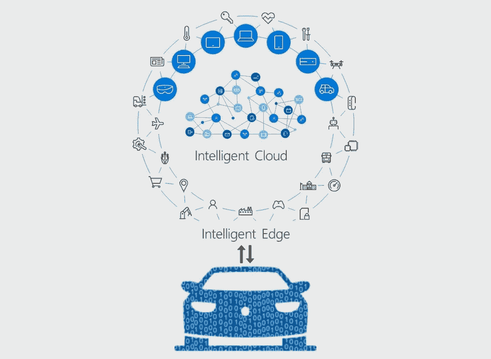

# 智能边缘计算的驱动力？

> 原文：<https://medium.datadriveninvestor.com/the-drive-towards-intelligent-edge-computing-f6db3c425332?source=collection_archive---------0----------------------->

在过去的十年中，用户的期望迅速发展，期望服务可以在任何时间、任何地点、任何设备上使用。如果你在看网飞，你希望能够在你的电视、平板电脑或手机上观看。无论你是在加州还是加拿大，你仍然希望能够在任何时候观看你最喜欢的网飞节目。网飞如何满足这些期望？很简单，他们的服务内置在云中。互联网的繁荣以及计算和存储成本的降低引发了云革命，公司开始使用大型数据中心托管的远程服务器网络(称为云)来存储、管理和处理数据，而不是使用本地服务器形式的内部服务。网飞还知道你在看哪些节目，看了多长时间，这样他们就可以根据你的喜好来策划他们的节目。这方面的数据来自你用来观看节目的智能设备，Gartner 预测，全球联网设备的数量将从 2017 年的 84 亿增长到 2020 年的 204 亿。这些物联网(IoT)和智能设备正在产生海量数据。想象一下，如果网飞的 1.25 亿用户都开着自动驾驶汽车，每辆车每秒产生高达 1GB 的数据。如何处理所有这些数据，如何以最小的延迟实时做出决策？

## 汽车行业对边缘计算的需求

越来越多的运行软件和生成数据的设备将需要连接到云来存储和处理大量的数据。将这些数据发送到云中所需的能量和带宽是巨大的，存储这些数据所需的空间也是一个巨大的挑战。对于网飞秀或视频游戏来说，一毫秒的延迟并不是什么大问题。但对于自动驾驶汽车来说，经历时间滞后完全是另一回事。哪怕是几分之一秒的失误，也是撞上另一辆车和避免碰撞之间的差别。这实际上是一个生死攸关的问题。平均来说，大量数据从云端来回传输大约需要 100 毫秒。自动驾驶汽车需要来自周围环境和云的信息来做出快速决策，以便尽可能快速和安全地运输乘客和货物。因此，它们不断地感知和发送天气、路况、位置和周围车辆的数据。在自动驾驶汽车的情况下，每秒钟产生 1 GB 的数据，由于处理延迟，即使将 TB 级数据的一小部分发送到中央云或数据中心进行解释也是不切实际的。那么，我们如何减少关键数据通信的延迟呢？

答案是[边缘计算](https://en.wikipedia.org/wiki/Edge_computing)，在网络边缘处理数据的方法，尽可能靠近数据源，而不是在大规模的集中式数据仓库(云)中。边缘计算减少了堵塞网络的压力，并通过减少数据处理和将数据传输到车辆之间的时间延迟来提供更好的可靠性。虽然云对于某些任务来说是必要的，但自动驾驶汽车需要一种更加分散的方法。例如，摄像机可以分析自己的视频源，确定视频中的哪些帧需要关注，并只将这些数据发送给服务器。这种分散式架构减少了数据传输过程中的网络延迟，因为数据不再需要通过网络传输到云中进行即时处理，它们可以在一天结束时发送到云中。在边缘计算中，设备仍然连接到互联网，仍然可以接入云计算服务。但他们通常比过去拥有更强的板载计算能力，可以独立完成更多事情。最终结果是网络更加平坦，跳数更少，延迟更可预测。得益于海量的传感器数据、关键的本地处理能力以及连接回云中更高级数据分析工具的同等重要的需求，自动驾驶汽车正在推动高级边缘计算的发展。边缘计算部署也非常适合联网汽车，因为它们不断移动，可能在某些区域连接不良，缺乏与云的持续连接。

## 边缘计算为什么要智能化？

边缘计算的一大驱动力可能是人工智能的快速发展，这可能需要大量的处理能力立即可用。联网和自动驾驶汽车的安全性至关重要。为了路上的安全，自动驾驶汽车必须确保它们保持在自己的车道上，识别红灯和停车标志并停下来，识别行人和骑自行车的人，并确保给他们让路。所有这些都要求汽车在每次行驶的每一秒钟实时处理大量的传感数据。云服务速度很快，但是，如果考虑到网络延迟，它们的速度还不足以对当前的驾驶状况或即时危险做出实时响应。边缘计算将计算能力推向网络边缘，在终端设备附近实施数据分析。因此，自动驾驶汽车或智能交通灯等机器不再需要调用云来获取指令或数据分析，而是可以自己对数据流进行一些分析，并与其他设备通信来完成任务。因此，边缘计算还可以加快分析过程，使决策者能够比以前更快地根据见解采取行动。

由于机器学习算法是在不断刷新的数据源上重复执行的操作，因此这些算法也可以部署在更接近其数据收集和聚合位置的服务器上，从而使处理后的数据可以更快地用于决策，或者与自动化系统一起创建实时反馈环路。每辆自动驾驶汽车都需要足够的计算能力，才能成为“车轮上的数据中心”。考虑一下 [Aptiv 的智能车辆架构](https://www.aptiv.com/media/article/2018/01/11/aptiv-s-smart-mobility-architecture-unlocks-features-solves-industry-s-toughest-challenges)，它具有针对电源故障、网络故障甚至计算故障的三层保护。它还能够动态地重新路由和驱动网络流量，甚至做出决策，让自动驾驶汽车安全停下来。除此之外，智能系统还具备边缘计算功能，可提供具有预测分析功能的板载诊断功能，这样您就拥有了一个可以在其生命周期内不断增长和发展的系统。

在即时信息流时代，需要数据分析来做出关键决策。自动驾驶汽车可以自己导航，因为即时数据输入会告诉它去哪里或什么时候停下来。人和机器之间的相互依赖意味着实时信息传输的速度至关重要。人工智能和物联网设备的激增正在推动某些类型的数据处理从云转移到传感器或设备的“边缘”，因为它通过确保快速、可靠和安全地处理数据来减少数据传输的延迟。边缘计算意味着[补充云](http://www.businessinsider.com/edge-computing-and-fog-computing-explained-2018-2)，而不是完全取代它。对于技术提供商来说，在云中可以完成多少处理和应该在边缘设备上完成多少处理之间找到正确的平衡将成为最重要的决策之一。

**免责声明:本文表达的观点和意见仅代表我个人，不代表任何其他人或公司。所有内容都受版权保护。*