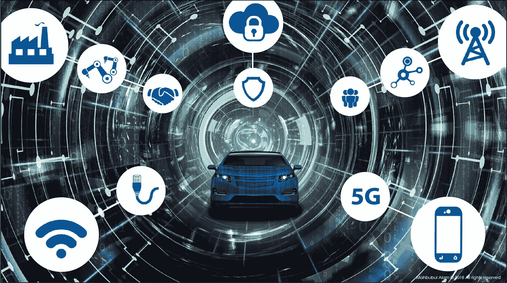
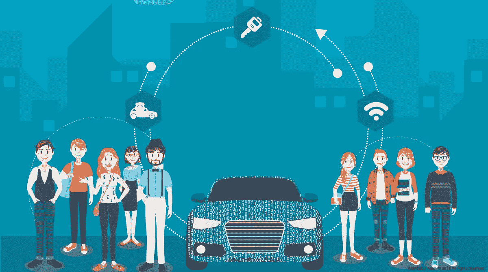

# 汽车技术变革的驱动力

> 原文：<https://medium.datadriveninvestor.com/the-drivers-of-change-in-the-automotive-technologies-95d381d3eb51?source=collection_archive---------2----------------------->

The Drivers of Change in the Automotive © — Mahbubul Alam

每个人都在思考[软件定义的工具](http://mahbubulalam.com/the-software-defined-car-convergence-of-automotive-and-iot/)的威力。尚不清楚的是，这场技术革命将如何扰乱汽车生态系统，并改变相关的行业参与者。软件定义的汽车有能力改变我们的生活，但它也将改变汽车的构思、设计和制造方式，从汽车制造商到一级供应商，一直到供应链的底部。

# **什么是颠覆性变革？**

> **颠覆性变革是指创造新市场和价值网络的创新，最终颠覆现有的市场和价值网络，取代现有的市场领先公司、产品和联盟。**

这是我们经常忙于工作而看不清楚的事情。有时我们需要退后一步，从不同的角度审视我们的行业，以预测未来将带我们走向何方。彻底颠覆世界的技术变革的例子包括印刷术如何第一次使廉价和广泛传播思想成为可能，以及电话和后来的互联网如何使我们不仅能够交流，而且能够不分地理位置进行合作。每一次技术变革都开辟了全新的商业、技术和可能性的道路，但是，当然，也摧毁了许多现有的商业——有墨水瓶的僧侣、马车、秘书池等等——所有这些都与新技术的引入无关。

# **汽车行业的主要颠覆者**

联网汽车开始颠覆传统经销商服务模式的许多方面。随着从汽车获得诊断和数据的能力，以及对其重新编程的能力，非机械经销商功能将逐渐被淘汰。随着我们学习如何分析和洞察这些车辆数据，我们开始看到一些颠覆性的潜力被最大化。汽车行业的三个关键颠覆者——云、连接和环境——将决定未来几年软件定义汽车的发展步伐。让我们更详细地看看每一个。

**1。** **云:**IT 基础设施的民主化创造了以低成本访问拥有众多应用程序的强大数据中心的机会。除了集中式模型之外，我们还需要一个更加分布式的数据存储模型，让每个家庭都成为自己的迷你数据中心。当车辆在家时，它应该能够安全地将其数据卸载到本地集线器。[据英特尔称，一辆无人驾驶汽车每小时会产生约 4 TB 的数据](https://www.lightreading.com/enterprise-cloud/data-strategy-and-analytics/intel-pivots-to-data-centric-future/d/d-id/745342)，而且并非所有数据都可以传输到云中，因此差异数据将变得非常重要。差异数据量必须降至当前水平的百万分之一。多级过滤以判断数据的关键性质，区分数据并根据需要压缩数据的能力将成为软件定义的工具的基本流程。

**2。** **连接:**随时随地电话、电子邮件、社交媒体和互联网连接的激增也是物联网(IoT)出现的原因，物联网是推动互联网发展的下一波浪潮，其速度符合摩尔定律，每 18 个月计算能力、存储和网络就会翻一番。电子设备、传感器和致动器的持续小型化正在降低成本，并允许收集和分析所有类型的数据。随着通用数据保护条例(GDPR)和其他数据隐私法的引入，数据的收集和使用将由生成数据的最终用户决定。汽车行业还需要采用[基于区块链技术和软件定义的边界](https://movimentogroup.com/media-coverage/next-generation-automotive-cybersecurity-software-defined-perimeter-blockchain/)的下一代汽车网络安全架构，以保护软件定义的汽车免受网络威胁。

3.**背景:**过去需要固定硬件和软件的东西，现在可以使用适应路况、用户背景和最新创新的硬件进行动态重新编程，跟随网络行业软件定义无线电和软件定义网络以及基于云的安全中使用的软件定义外围设备的成功脚步，引领软件定义世界。环境意识以及人工智能(机器学习和深度学习算法)这些创新将使汽车能够区分工作日和私人时间，前者是指准时参加会议并找到最近的停车场或贴身男仆至关重要，后者是指我们可能愿意做出不同选择的时间。例如，找一个更便宜的停车位，最大限度地减少步行时间，或者找到你最喜欢的餐馆。这将使软件定义的车辆比以往任何时候都更加个性化。

Change in consumer expectations are driving technology disruption in Automotive © — Mahbubul

# **在破坏性地震中幸存**

> 想要在混乱中生存下来的企业的关键因素是他们必须具有创新性和适应性。创新和适应性不仅适用于技术，也适用于商业模式。如果我们不愿意离开一个已经受到威胁的现有企业，当变化来临时，我们可能无法足够快地适应。我们需要尽可能利用云、连接和上下文信息的现有颠覆性力量，以帮助我们走在颠覆的前面。

颠覆性变革的成功取决于三件事:

1.跨行业合作。

2.拥抱新的颠覆性商业模式。

3.在未来价值链中定位公司。

变化是现代商业环境中不可避免的一部分，在这种环境中，组织和其中的人必须不断地重新发明自己以保持竞争力。持续的成功取决于组织拥抱和适应变化环境的能力。

> **今天，我们开始看到颠覆性技术的加速发展，无论是在影响还是频率上都是如此。仅仅维持一种产品已经不够了，如果企业想要在颠覆性技术中生存下来，就必须拥抱变化，着眼未来进行创新。**