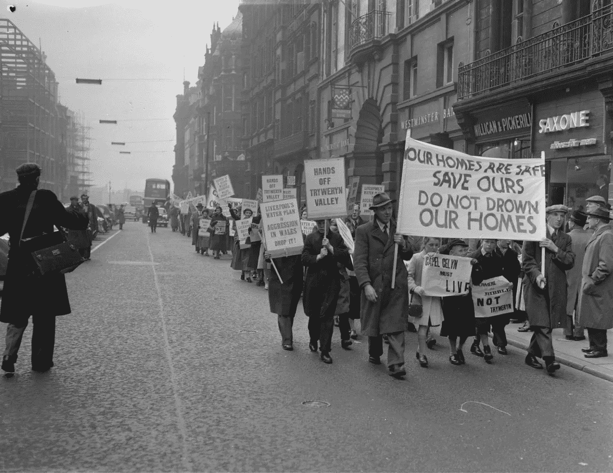

# 卡佩尔·塞林的溺死

> 原文：<https://medium.datadriveninvestor.com/the-drowning-of-capel-celyn-109496dc611e?source=collection_archive---------1----------------------->

## 北威尔士的一个小村庄被洪水淹没，为利物浦修建水库。每隔几年，当水位降到足够低的时候，卡佩尔塞林幽灵般的废墟就会显现出来。

Photo: Wikimedia Commons

1955 年，利物浦是英国最缺水的城市之一，正努力寻找可靠的水源。由于港口繁忙，贫民窟鳞次栉比，规划者计算出这座城市每天需要 6500 万加仑的水。这需要采取激进的行动。

利物浦市议会决定在附近的北威尔士新建一座水库。一个问题是，在 Tryweryn 山谷，规划中的水库的景点，坐落着 Capel Celyn(威尔士的 Chapel Holly)小村庄。Capel Celyn 是 67 人的家，有一所学校，当然还有一个小教堂。他们是最后几个只说威尔士语的社区之一。修建水库的计划会完全淹没他们的村庄。

这不是利物浦第一次向威尔士寻求供水。1888 年，他们对 Llanwddyn 的[村做了同样的事情，花费了三个客栈、两个小教堂、10 个农舍和一个大庄园。](https://jamescrocket.us19.list-manage.com/track/click?u=96a22b3d26d922269da89799b&id=33c1b1ca4e&e=a79c8ea15c)

卡佩尔·塞林的人口很少，他们开始保卫他们的村庄，成立了特里韦林防御委员会，并派代表团去利物浦参加议会会议。但当他们站起来发言时，他们被喊了下来，并被赶出了大楼。利物浦街头的抗议游行也好不到哪里去。村民们一边走，一边搭乘公交车进城，并悬挂横幅，上面写着“你们的家很安全——不要淹没我们的家！”城市居民向他们吐口水并投掷腐烂的水果。利物浦认为威尔士农村居民是妨碍城市发展的麻烦制造者。

这个村庄不在利物浦的控制范围内，这意味着市议会必须向当地规划委员会申请修建水库的许可。但通过在伦敦的英国议会发起一项法案，他们可以绕过这一点。1957 年，该法案获得通过——尽管威尔士 36 名议员中有 35 名投了反对票。这意味着水库可以在没有与 Capel Celyn 的居民进行任何协商的情况下建造，他们的村庄和周围的农业用地将在几年内被淹没。

在强制购买土地后，建筑公司竖立了一个英语专用标志。

*建造 Tryweryn 水库。*

*用人单位:利物浦委员会*

*承包商:停机坪土木工程有限公司*

在这个牌子上，一位居民潦草地写道:*为什么不淹死利物浦？*’

1962 年，当局开始驱逐居民。摄影师杰夫·查尔斯来到这个村庄，捕捉它最后的日子。

对这个村庄命运的愤怒已经超越了特里韦林山谷。当教堂举行解散前的最后一次仪式时，一群远远超过全村人口的人前来表达他们的敬意。曾经教育了几代当地儿童的当地学校最后一次关闭了。在教堂的墓地里，尸体被挖出并转移到其他地方。

村民们离开后，紧张局势并没有消失。1962 年，来自格温特的两个年轻人参观了这个地方，很快损坏了拆除设备。他们都被罚款 50 英镑，这笔钱是由支持者支付的。[一张拍摄于《时代周刊》的照片显示，威尔士党主席 Gwynfor Evans 在法庭外与他们握手。](https://jamescrocket.us19.list-manage.com/track/click?u=96a22b3d26d922269da89799b&id=a37c311f0f&e=a79c8ea15c)

第二年，三名男子因在现场放置炸弹而被送进监狱。爆炸造成了严重的损失。当英国政府官员试图在大坝竣工时举行开幕庆典时，抗议者切断了他们麦克风的电线。

不管怎样，水被打开了，Tryweryn 水库慢慢开始蓄水，水慢慢流向破旧房屋的残桩、教堂的瓦砾和空坟。

废墟消失在水库下，卡佩尔塞林变成了郡主塞林——冬青湖。但是这场斗争帮助威尔士人[意识到他们对英国政府和英国大城市的需求是多么无能为力。这些事件导致了更高的政治参与度，以及为威尔士议会竞选的 Plaid Cymru 的声望上升。](https://jamescrocket.us19.list-manage.com/track/click?u=96a22b3d26d922269da89799b&id=4335a0292c&e=a79c8ea15c)

几年后，在 1989 年，在一次长期干旱期间，林泽林的水位下降到足以揭示村庄鬼魅般的废墟。他们出现在一个新威尔士，比以前更有权力，在英国政府中有一个国务大臣，并有更多的本地运营的服务。再过十年，威尔士就会有自己的政府。威尔士自来水公司——在水库建设时并不存在——决定用小匾来标记建筑物所在的碎石。伊斯戈尔。学校。Eglwys。教堂。游客们沿着以前的街道漫步——这些街道现在已经变得泥泞不堪。

然后，当终于又开始下雨时，废墟和它们的牌匾再次滑落到水下，看不见了。

[*【怪异的西班牙】*](https://weirdspain.substack.com/) *是一份时事通讯，面向那些想要更深入了解他们的第二故乡及其人民的移民，以及世界各地想要更多了解这个神奇国家正在发生什么以及为什么会发生的西班牙爱好者。* [*在这里订阅，在你的收件箱里收到这些文章。*](https://weirdspain.substack.com/subscribe)