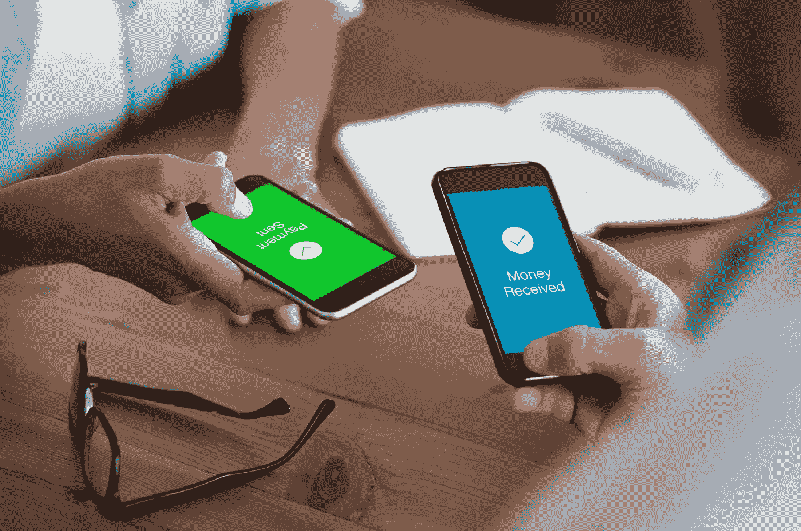
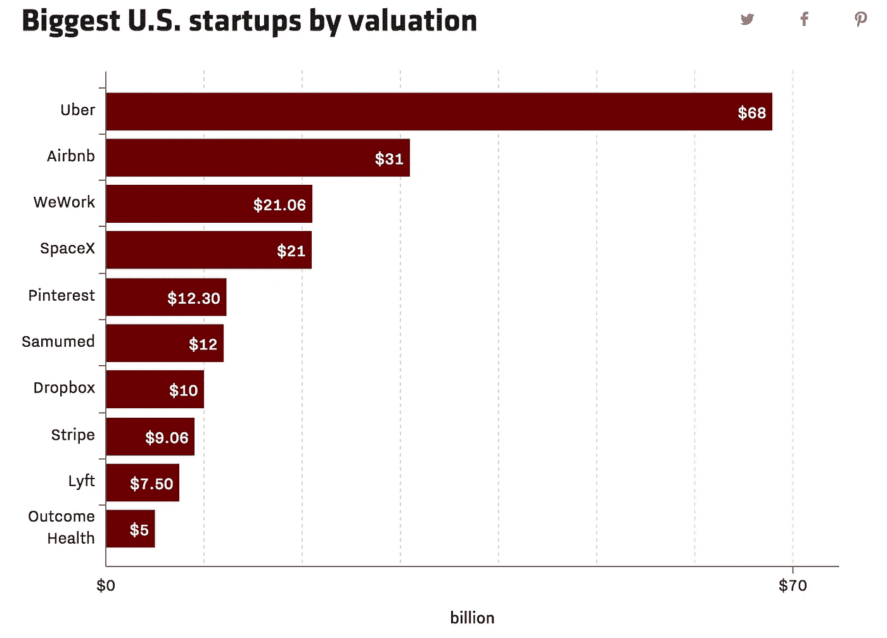
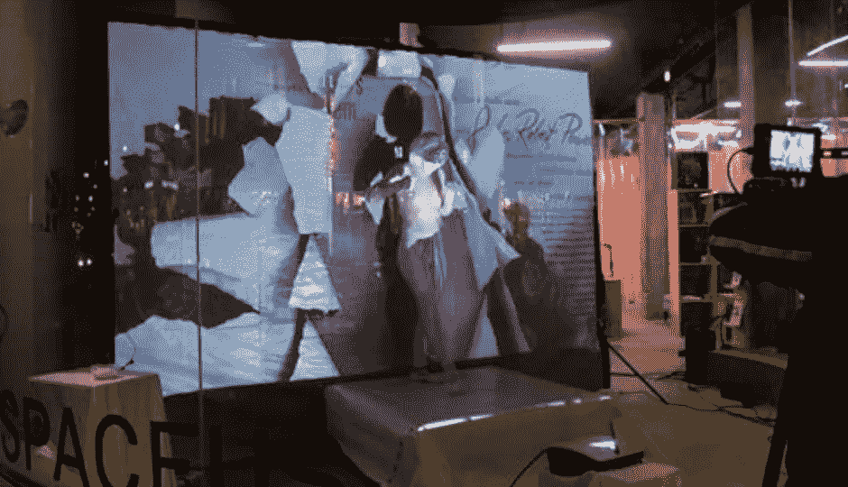

# 地球是满的

> 原文：<https://medium.datadriveninvestor.com/the-earth-is-full-adbf65509922?source=collection_archive---------18----------------------->

我们将需要 4 个地球来提供足够的资源，以维持当今地球上 70 亿人口的生活方式。世界上的资源是有限的，我们正在以不可持续的速度消耗它们。引用环保活动家[保罗·吉尔丁](https://www.ted.com/talks/paul_gilding_the_earth_is_full?language=en)——**地球满了**。除非有人有几个多余的地球可供我们借用，否则我们就有麻烦了。

经济衰退、气候变化和贫困水平上升一直是我们一直在测试的警告信号，就像限速一样。当我们经过一名警官时，我们会暂时减速，但一旦他离开我们的视线，我们就会踩油门继续行驶。问题是:我们不能只为这张超速罚单支付罚款——大自然只接受以我们未来的形式支付。

## 核心问题

很明显，有些事情需要改变，否则我们将不会有一个可以毁灭的世界。幸运的是，人们终于认识到了这一现实，并开始采取行动。技术和人类的聪明才智联合起来，颠覆和改变了许多对我们星球的毁灭贡献最大的大型产业。

“共享经济”是人类试图解决问题以摆脱迫在眉睫的厄运的爆炸性结果。在最基本的层面上，共享经济是由点对点交易推动的，而不是通过中介。随着年轻一代开始占人口的大多数，我们正在目睹大众生活方式从过度消费(旧的经济模式)向合作消费(新模式)的转变。

## 要做的工作

这种生活方式的转变正在推动人们接受“新规范”。例如，一个人拥有自己的资产(汽车、房子、商品)曾经是至关重要的，但现在不再是这样了。这并不是说共享经济的消费者不需要从 A 点到 B 点，住在一个屋檐下，或者看电视——这仅仅意味着他们不在乎如何发生。新一代理解并认同“要做的工作”理论。他们不关心谁拥有汽车、房子或电视，只要他们能使用它。

## 资源影响

地球上的所有资产都是有限的，但有些资产比其他资产更有价值。空间和大气层是最有限和最宝贵的资源。少数敢于接受保护这些重要资源的挑战的公司经历了火箭般的增长。

Source: [PitchBook data as of Aug. 8, 2017](https://pitchbook.com/)

优步、Airbnb 和 WeWork 等共享经济巨头都是通过将传统上未得到充分利用的资源(汽车、房屋、办公空间)转化为效用最大化的资产而获得成功的。这些公司只是促进拥有这些资产的人和需要这些资产的人之间的交易。

现在，新的创业公司开始出现，意图扩大共享经济的范围。例如， [Spaceus](https://spaceus.co/Information) -一家总部位于波士顿的初创公司-正在将以前空置的零售店变成弹出式精品店。

Photo by Ellen Shakespear

共享经济的关键是专注于充分利用未被利用的东西，并找到更有效地利用它的方法。这一使命带来了我们经历过的一些最伟大的人类创新，而且(谢天谢地)这一趋势没有放缓的迹象。