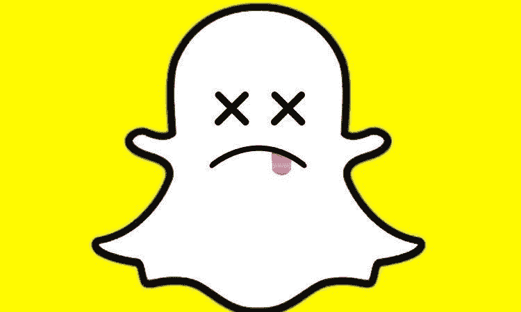
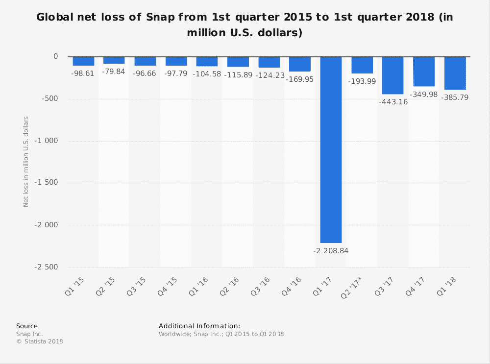
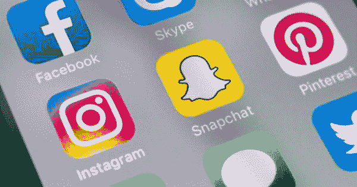
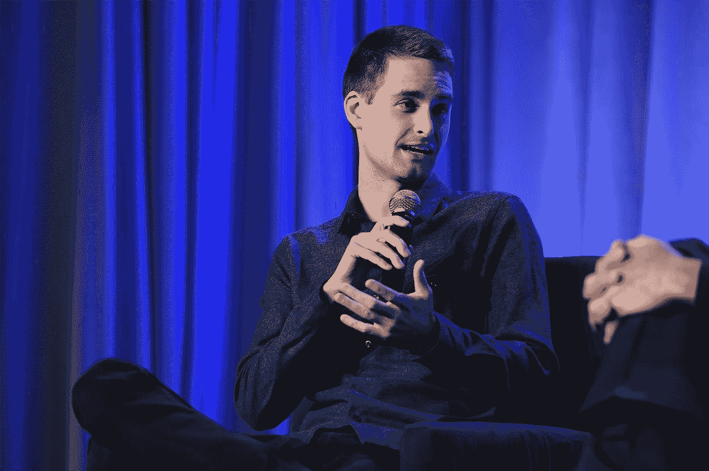
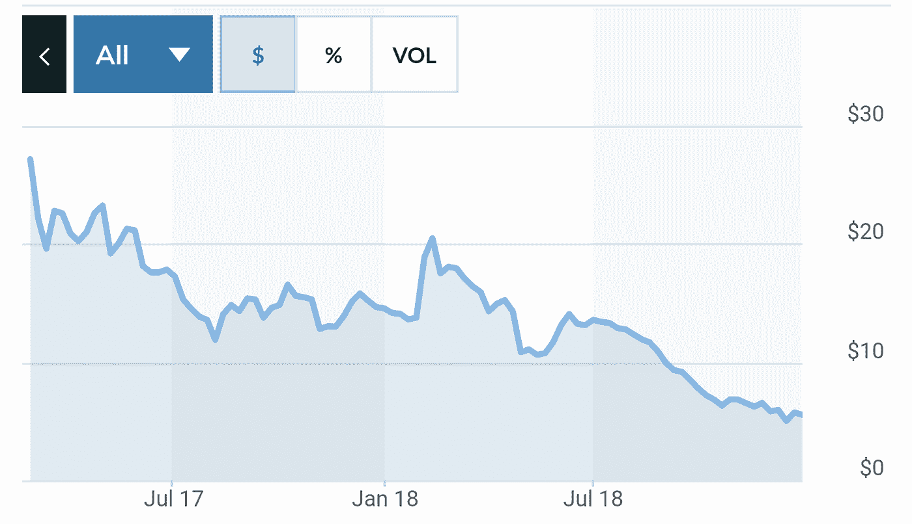
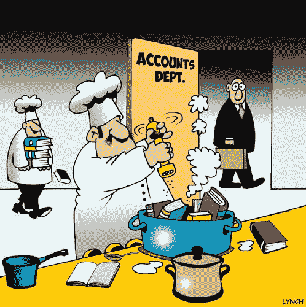

# 2019 年最容易短

> 原文：<https://medium.datadriveninvestor.com/the-easiest-short-of-2019-90be2db22b36?source=collection_archive---------8----------------------->

*   以其热门应用 Snapchat 而闻名的 Snap Inc. (SNAP)一直受到困难的困扰。
*   该公司已表现出无力盈利，需要持续融资才能维持运营。
*   公开交易的股票没有投票权——这是管理层的一个严重的中指。
*   管理层没有增加债务，而是选择稀释现有股份。
*   由于这些关键方面，我认为 SNAP 的内在价值等于或接近 0 美元，将是一个出色的短线投资。

# 我为什么做空 SNAP

Snap Inc .尚未实现季度盈利——该股受到这一事实的困扰，再加上糟糕的重新设计和低收入。

股票稀释继续损害现有股票，其中 30%由内部人士持有，另外 34%由机构持有。此外，内部人士在 3 个月和 12 个月的时间框架内都是净卖家，表明对股票表现缺乏信心。

像脸书和谷歌一样，没有严肃的深度数据支持的广告收入不是一个可行的盈利计划。尽管截至 2018 年 Q2 奥运会，SNAP 拥有 1.88 亿用户，但它不断亏损，并一次又一次地用无效的应用设计让用户和广告商感到沮丧。

由于异常糟糕的管理和对股东价值的极少关注，我认为 SNAP 股票被严重高估了——而且由于几乎没有能力进行重大的企业改革，它们的价值相当于零。

# **盈利困难**

如上所述，Snapchat 从第一天起就一直在努力创造一个积极的财政季度。为了获得更多的广告收入，一些应用程序的革新(越来越令人讨厌)把重点放在了针对年轻受众的付费广告和媒体上。作为 Snapchat 的用户，我发现每次推送的更新都让我感到疏远，减少了我的使用——这表明了最近更广泛的趋势，即[活跃用户实际上已经下降了一段时间](https://www.bloomberg.com/news/articles/2018-10-25/snapchat-lost-users-in-quarter-and-says-decline-will-continue)。

Snap 只是缺乏访问相对海量的用户数据的途径，而这些数据使脸书和谷歌能够在广告货币化方面取得成功——这不可避免地导致用户目标更少，广告商的投资回报率更低。尽管管理层几乎肯定在积累用户数据，但他们缺乏多样化的服务，而其他公司可以利用这些服务来建立每个用户更完整的广告档案。因此，由于从根本上打破了收入模式，这一挑战肯定不会有任何进展。

由于脸书和 Instagram 增加了消失的直接消息——从 Snap 转移了潜在的广告收入，脸书在窃取市场份额方面的无情加速了这些。

尽管 SNAP 最近进行了一些改进和成本削减，但仍将在一段时间内难以盈利，最终要么破产，要么被迫出售以继续运营。股权稀释只能到此为止。

# **份额稀释**

众所周知，SNAP 在首次公开募股后一直在[发行新的](http://fortune.com/2017/02/22/snap-ipo-dilution/)股票。这迫使股价自 2017 年首次公开募股以来暴跌超过 76%，使许多潜在的成长型投资者退避三舍——谁会想把钱扔给一个明显对此毫不在乎的人呢？

股票稀释象征着管理层对股东价值更广泛的态度——也就是说，让它见鬼去吧。这个平台可以通过 SaaS 模式轻松实现盈利(尽管这肯定会导致用户减少)。

内在价值来源于对股东未来现金流回报的预期，扣除了感知的时间延迟和信用风险。如下，一个不关心股东的公司根本不会给他们回报价值——导致内在价值为 0 美元——尽管资产负债表上持有每股约 1 美元的现金，这是完全无效和不可获得的。

# **无权无势的股东**

Snap 的致命一击是，管理层完全不对股东负责，选择剥夺公开交易股票的投票权。这确保了价值永远不会被充分地传递给股东——同样，重大改革只有在被迫的情况下才会到来。

诚然，如果管理层表现出一些能力，这就不是问题了。然而，如上所述，他们在价值创造方面表现出相反的情况。

Snap Inc .首席执行官埃文·斯皮格尔因向投资者撒谎而受到批评。据《福布斯》报道，他在首次公开募股中获利超过 6.3 亿美元，身价约 14 亿美元。

SNAP 公布了令人震惊的-50%的股本回报率，说明了他们对股东的漠视。在公司短暂的公众生涯中，创始人埃文·斯皮格尔(首席执行官)和罗伯特·墨菲(首席技术官)通过糟糕的公司管理摧毁了超过 230 亿美元的股东财富，而且没有停止的迹象。

管理层也表现出了对投资者撒谎的明显意愿，前增长领袖安东尼·庞普利亚诺正在联邦法院起诉[。投资者和监管者都应该认真对待这样一段不诚实的历史。SNAP 自 IPO 以来的表现反映了市场的不认可。](https://www.businessinsider.com/snapchat-sued-in-federal-court-for-allegedly-lying-ahead-of-ipo-2017-5)

*Snap Inc .——自 IPO 以来的股价*

# **威胁短论文**

*   SNAP 几乎没有负债，唯一的主要负债是应付账款，因为管理层强烈希望保持独立于利益相关者。这些仅通过现金和应收账款就能很好地覆盖，这使得管理层在以有利的利率筹集现金方面有一定的灵活性，但代价是增加了现有股东的下行风险(这种风险已经很大)。如果有效部署，这可能会减少空头头寸的上涨潜力。
*   竞争对手(最有可能是已经试图收购 Snapchat 的脸书或谷歌)的 M&A 行动可能会给管理层带来重大的积极变化。在这种情况下，短论文可能完全无效。但是，管理层能够独自做出该决定，并表现出对保留公司唯一控制权的坚定承诺。这虽然很糟糕，但却是一个非常边缘的案例。

*   篡改他们的损益表以显示一个盈利的季度([就像特斯拉最近做的](https://seekingalpha.com/article/4219237-tesla-q3-accounts-receivable-mystery))可能会导致卖空，因为在撰写本文时约有 21%的股票被卖空。即使真正的营业利润也可能是短期的，但可能对市场产生类似的影响。因为管理层并不受制于债券市场——他们也没有表现出烧掉卖空者的愿望——这在未来几年内都不太可能发生。我认为这是本文最严重的风险，因为即使低于预期的损失也可能导致股价显著上涨。在这种情况下，我会查看他们的损益表和资产负债表，以确定是退出空头头寸，还是以更不现实的估值加倍下注。

# **催化剂**

*   利率上升必然导致风险资产的转移，比如不盈利的科技公司。
*   股权稀释会将更多的股东挤出去——而且应该会进一步。
*   内部人士纷纷抛售股票，进一步使管理层和股东的利益不一致。

*   最近关于数据收集、第四修正案权利、剥削性服务条款，特别是非法内容([在 Kik Messenger](https://www.forbes.com/sites/thomasbrewster/2017/08/03/kik-has-a-massive-child-abuse-problem/amp/) 等类似平台上猖獗)的技术丑闻如果发生，可能会导致 SNAP 的估值进一步下降。尽管这只是猜测，但在当前的监管和政治环境下，这并不奇怪。

*   2019 年，Snap 将被迫发行更多股票或筹集债务，以弥补预计 2019 年的 [$3B 净运营亏损——其中一半不是现金。当确切的时间变得明显时，我预计股价会大幅下跌。这显然是这篇短文的最强催化剂，我们只需等待它对我们有利。](https://www.nasdaq.com/symbol/snap/earnings-forecast)

# **结论**

坦率地说，Snapchat 能够保持 70 亿美元的市值，同时亏损数亿美元，而且没有停止的迹象，这让我感到惊讶。随着糟糕的管理决策被曝光，最近的价格走势验证了这一论点，尽管该股可能会波动。我仍然看跌该股，并敦促现有股东尽可能地退出。对于我们这些喜欢冒险的人来说，我建议在这个论点被打破或股价触及 0 美元之前，保持适度的大空头头寸。

*免责声明:我不清楚您的财务状况，您独自负责进行尽职调查。我是一个非专业的投资者，我观察的目的是讨论和分析金融市场和投资选择。这并不是对证券买卖的建议。*

*披露:我通过 2019 年 1 月 11 日 5.5 认沽期权持有 SNAP 的空头头寸。*