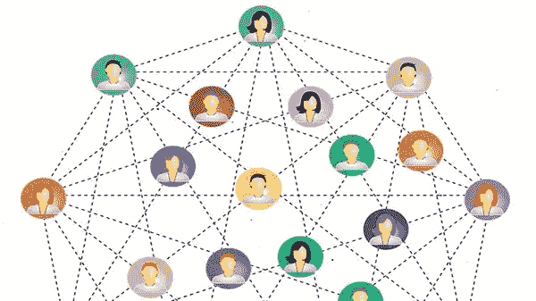

# 关于网络最简单的事情

> 原文：<https://medium.datadriveninvestor.com/the-easiest-thing-about-networking-4d263b8e6c2f?source=collection_archive---------48----------------------->

Gerard O'Donovan 经营的教练博客，我们的目标是不断为那些寻求改善生活的人带来价值。因此，我们有一个政策，出版我们重视和欣赏的客座作者的文章和材料。今天的嘉宾作者是****(美国)。****

**对我们中的一些人来说，一想到参加社交活动，脑海中就会浮现出相亲失败的画面。也许你对去一个你会认识任何人的地方感到不舒服，也许你对可能(或可能不会)发生的事情害怕得要死。当你去参加一个社交活动时，你会说什么？你是做什么的？想到它会带来不愉快的回忆或恐惧的感觉吗？也许对你来说，没那么严重。然而，对于某些人来说。**

**也许你一开始就不明白去那里的意义。多数情况下，你会对人际关系网产生偏见，使之成为一件令人不快的事情。如果这描述了你或你认识的人，我有好消息要告诉你。网络实际上是有史以来最伟大的工具之一！**

**网络无非是认识人和建立关系。实际上，你一生都在建立关系网。这可以追溯到(也许)托儿所或幼儿园。想想吧。它无处不在(见人和建立关系)。**

**今天的孩子有“玩耍日”联网！**

**在你成长的过程中，你有没有为学校的项目卖过东西(包装纸、水果、杂志等等)。)?联网！**

**询问朋友是否认识富兰克林先生英语课上的那个男生或女生？联网！**

**你明白了。**

**无论你是发起者还是接受者，你都和其他人一样在对话中扮演着举足轻重的角色。你会惊讶于你认识的个人和专业人士的数量。所有这些人都是你人际网络的一部分。永远不要低估你社交能力的力量。**

**就社交活动而言，它们不一定是世界上最糟糕的事情。更好的是，你不需要一个事件来建立关系网。让网络变得如此有价值的是行动的号召。这是对话的一部分，以“你认识谁…？”开始举例:你认识谁在 ______ 工作？或者；你知道谁在找谁吗？**

**你会惊讶于这个世界有多小。这些问题的答案并不难找到。你和你(或你认识的人)想要见面或联系的人之间通常有 2 到 3 度的距离。**

**大多数人都想以某种方式提供帮助。当我们被问到一个问题时，我们通常会试图回答它。更好的是，一旦这个问题被问及，心理名片夹(和我约会)就开始旋转。视情况而定，这个问题会一直留在(大脑中)直到得到答案；即使这个问题是为了寻找答案而向别人提出的。**

**关键是，社交比大多数人认为的要容易得多。把这些想法记在心里会帮助你认识到关于网络最简单的事情就是你自己！**

**在这里阅读更多内容，不要忘了订阅我的教练博客网站获得免费的教练报告:[https://www . coaching-blog . com/the-easy-thing-about-networking/](https://www.coaching-blog.com/the-easiest-thing-about-networking/)**

**请访问我们的网站，订阅免费的教练杂志:【http://www.international-coaching-news.net/ **