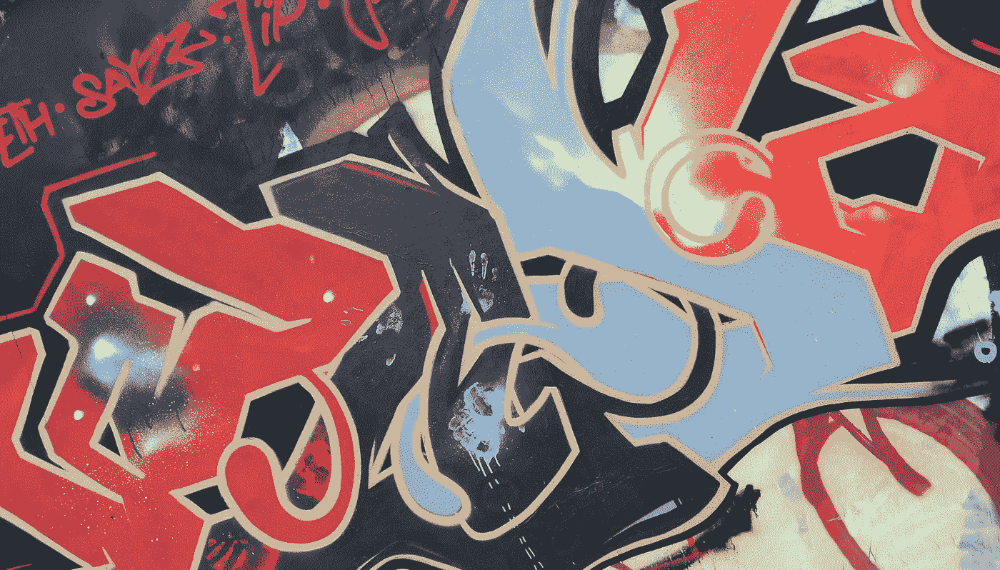
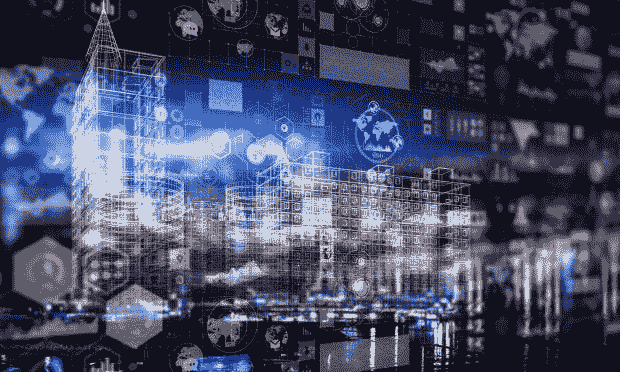

# 人们对隐私的不理解是什么？

> 原文：<https://medium.datadriveninvestor.com/the-economics-of-privacy-and-the-tradeoffs-for-convenience-e3591465cf21?source=collection_archive---------4----------------------->

你知道那种感觉。无论是访问应用程序、订阅还是你最喜欢的运动鞋。

你按下“添加到购物车”，完成网上购物，并在结账时填写付款细节。就在你点击“购买”按钮之前，有一个非常重要的方框需要检查:条款和条件。

在交易过程的最后阶段出现大量的 3 点字体并非巧合。

抛开熟悉的烦恼感，你点击“同意”。

通过同意这些小词所说的内容，您承认放弃了您的个人数据以及随之而来的后果。

在当今日益由数据驱动的世界，这可能会产生深远的影响。

# 学会对你不知道的事情达成一致

如今，我们正牢牢地处于数据的淘金时代，与决定是否隐藏或披露我们的个人信息相关的经济学变得尤为重要。

随着公司可以获得越来越多的客户数据，使用个人信息的经济利益和成本似乎都在被所有相关方放大——消费者、公司和整个社会。

获得个人消费者数据(并形成这些数据的集合)使公司能够以前所未有的方式识别和描述客户特征——例如客户可能支付的价格、支付方式、他们倾向于一起购买的产品组合，以及许多更具创意的组合。

不仅如此。

除了公司收集的 1 和 0 之外，他们还开发越来越大、越来越深的数据集来学习。甚至他们自己也不知道他们能从金矿中生产出什么。

这是信息不对称的一种特殊形式。

尽管双方都不完全确定将来能从这些数据中学到更多的知识，但随着时间的推移，一方肯定会比另一方知道得更多。

然而，顾客得到的是相当确定的——满足他/她的即时满足或强制上瘾。这里的重点是，客户同意放弃价值未知但不断增加的信息，在[交换](https://www.datadriveninvestor.com/glossary/exchange/)今天将体验到的公用事业。

# 深度学习的深层问题

卡耐基梅隆大学的信息技术和公共政策教授 Alessandro Acquisti 引用了他自己的研究，他观察到，在没有隐私保护的地方，消费者的情况无疑会更糟，消费者剩余完全被卖家榨取:[“这里的重点是，隐私有一个非常清晰和明显的经济原理。”](https://blogs.lse.ac.uk/mediapolicyproject/2016/07/27/the-economics-of-privacy/)

这就引出了一个问题:作为个体，我们是否能够哪怕是很远的距离来衡量我们的隐私现在或将来有多少价值。

鉴于上面讨论的动态信息不对称，公司只有在你同意(强迫性地点击手指)后，才合理地支持技术和能力，以从他们刚刚从你那里收集的所有数据中提取更多价值。

公司阻止不了。随着利润的增加，他们的股东可能会认为公司做得非常出色。专业人士(如律师，或“合规”人员)进行例行检查，以确保事情是合法的*。立法者，学习和反应缓慢，制定法律来保护我们。*

*除了已知的问题，数据科学家和编码人员渴望提高他们超人的技能，以便从日益丰富的数据集中提取更多的价值！*

*我会说，对企业界来说，这是一个相当无风险的赌注。*

*好像用食指点击“同意”还不够。很快你甚至应该给他们竖起大拇指！因为他们对你了如指掌。*

**

# *工程便利*

*当这个世界随着更多的数据而得到如此好的优化时，人们会想知道这些知识用在了哪里。*

*可以用来做更好的牙刷。它可以让我们在工作中更有效率，旅行更快，在更短的时间内实现更多的目标。*

*它还能让我们按需注意*，让我们对刺激做出可预测的最佳反应。个人特质被研究得如此透彻，以至于这些见解甚至可以在市场上出售。**

**关于我们的新见解将越来越商品化，以换取万物更好的用户体验。随着时间的推移，更好的用户体验伴随着更可预测的群体行为，产生更少的惊喜和更低价值的数据。**

**为了让游戏升级，洞察力的*“竞争性提取”只能导致两种结果。***

***要么提取更精细的客户数据并提供给市场，因此有更多的特质和模式可供学习(即更高价值的数据)，要么获取私人数据的成本变得低廉，这是由于精心策划的努力，以设计您体验到的便利、效用或快乐(例如成瘾)，或者两者兼而有之。***

***5G 网络和物联网技术的可用性将最有可能实现前者的效果。***

# ***已知问题***

***更不用说披露我们个人的、通常是敏感的信息的其他非金钱陷阱，尤其是如果这些数据最终落入坏人之手。身份盗窃和数据泄露等问题在过去一年左右已经广为人知。如果信息落入意想不到的人手中，个人甚至会付出[的社会代价。](https://en.wikipedia.org/wiki/Ashley_Madison_data_breach)***

***鉴于这一系列的未知，我认为我们还没有一个准确的概念，当我们放弃我们的隐私时，我们放弃了什么。***

***如果我们这样做了，我们就可以更现实地决定我们应该牺牲多少来换取我们从所购买的产品中获得的效用。***

***当然，在某些情况下，放弃我们的个人数据可能会带来一些好处。如果你把你最喜欢的电影类型贡献给一个在线内容供应商，你将会收到更多关于下一部电影的定制推荐。或者在网络广告的情况下，你可能会看到更多符合你兴趣的产品的定向广告，这对你和广告商都有利*。****

**但是，放弃这些信息的代价是消费者无法准确评估的。供应商可能开始用更昂贵的电影瞄准你，或者广告商开始以你最初没有想到的方式使用你的数据，也许是通过把它卖给第三方。**

**— –**

**展望未来——一个越来越依赖于数据挖掘和分析所揭示的洞察力的未来——人们想知道事情会变得多么精细。可以想象的是，我们可能最终不得不“同意”规定的条款，只是为了完成最常规、最世俗的行为，如使用公共厕所或乘坐公交车。**

**考虑到客户的需求可以被设计和优化，我们将会以更高的精确度和可预测性被“研究”。**

**对于一些经济学家来说，这可能不是问题，特别是如果他们认为失去隐私只是大数据将带来的伟大事物的代价。但是有哪些*大事呢？*是一种哲学视角，与社会的价值体系有很大关系。我们将在以后的文章中讨论这些话题。**

***原载于 2019 年 4 月 11 日*[*【www.datadriveninvestor.com】*](https://www.datadriveninvestor.com/2019/04/11/privacy-and-convenience/)*。***