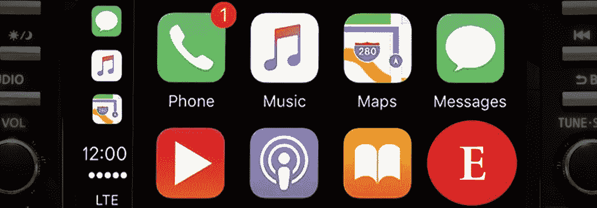

# 苹果 CarPlay 的经济学人 App 求求你！

> 原文：<https://medium.datadriveninvestor.com/the-economist-app-for-apple-carplay-please-58f6bd48e864?source=collection_archive---------7----------------------->

I want to see the big ‘E’

在我谈及对《经济学人》杂志的具体要求之前，让我们先讨论一下背景，以充分把握眼前的情况。

**什么是 Apple CarPlay？**

苹果 CarPlay 可以让你在开车时有限地使用应用程序。如果你开着一辆新车，有一部更新的手机，那么你每天都在使用[苹果 CarPlay](https://www.apple.com/ios/carplay/) 或[安卓 Auto](https://www.android.com/auto/) 。如果你不是，那么你可能需要买一辆新车或一套新的音响系统。亚马逊以大约 300 美元的价格出售这些东西。

苹果 CarPlay 的主要好处是你最喜欢的导航系统变成了你汽车的导航系统。利用“谷歌地图”或“Waze”应用程序的力量。第二个好处是，你可以说，“嘿，Siri，播放这张专辑”或“播放这个播客”。唯一的缺点是你可能会在车里分心，你开始用手指(和眼睛)在屏幕上敲击，而不是用声音来控制东西。轻敲屏幕对你和你的乘客都有危险。但是，总的来说，如果你能在 Siri 上使用你的声音让事情发生，你是安全的。

**设置 CarPlay**

在[启用手机上的 CarPlay](https://support.apple.com/en-us/HT205634)后，您需要在汽车上设置它。

苹果 CarPlay 最令人沮丧的事情之一是，当你插入它时，不容易让它自动启动。理想情况下，你只需插入手机，每次启动汽车时，手机就会显示你的应用程序。[日产连接常见问题](https://www.nissanusa.com/connect/faq#apple-carplaytm)在这里没有帮助。对于最重要的问题“我如何在我的日产汽车上自动启动苹果 CarPlay？”没有列出答案

你需要做的是找到你的汽车触摸屏的“设置”，到右边查看更多设置，然后选择“苹果 CarPlay 设置”。将“始终启动 Apple CarPlay”选项设定为“开”位置。这只有那些已经知道这件事的人才会明白。

一旦你有了 CarPlay，每次你插上电源打开你的车，然后看看苹果快捷方式。最好的一个叫“家 ETA”。当你上车时，你可以对 Siri 说一句特定的话，比如，“发送回家预计到达时间”，然后你的手机会根据当前的交通状况直接向你的另一半发送一条短信，告诉他确切的到达时间。最后，我们作为一个社会到达了！毫无疑问，某个人什么时候会回家吃晚饭。

**为什么我要向*经济学家*要一个应用程序？**

我希望能够设置一个快捷方式，告诉 Siri“本周播放经济学人”。我希望 Siri 开始播放我的应用程序中下载的当前一周的音频。我们需要经济学家*为此提供支持。我甚至发现有人似乎已经开始了这个项目。屏幕可以是这里看到的。没有解释为什么这个项目在 2016 年停止。*

*我的解决方法是在我启动汽车之前，在应用程序中启动音频播放。然后它会在 CarPlay 屏幕上显示内置的“正在播放”应用程序。这并不像决定从听音乐转向听新闻那样方便。拿起手机，切换应用程序，这是在拿我的生命冒险。我必须收回我先前说过的话，我们还没有成为一个社会。*

*拜托，*经济学家*，昨天给我建个 app！这是第一世界需要解决的一个重要问题。那 1%的知识分子基本上都死在这里了。；-)*