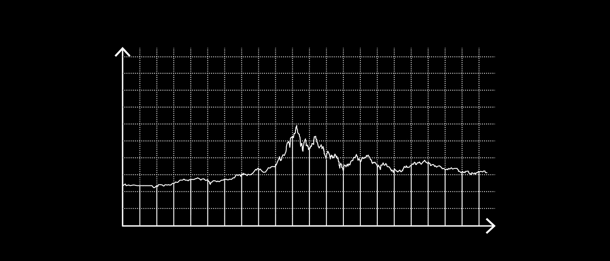

# 比特币期货的推出对比特币收益波动性的影响

> 原文：<https://medium.datadriveninvestor.com/the-effects-of-the-introduction-of-bitcoin-futures-on-the-volatility-of-bitcoin-returns-b8a7f1113f59?source=collection_archive---------0----------------------->

受监管的比特币期货在 2017 年底大张旗鼓地首次推出，巧合的是，就在这个时候，比特币和加密货币市场整体达到了顶峰。在 [**宣布**](https://www.coindesk.com/cme-groups-leo-melamed-well-tame-bitcoin) 时，一名从事期货工作的高管称，这种金融衍生品将把比特币“驯服”成一种“常规”投资工具，他指的是加密货币和整个市场一直经历的剧烈波动。

为了研究比特币期货的推出与比特币日内波动性之间的长期关系，韩国研究人员 Wonse Kim、Junseok Lee 和 Kyungwon Kang 分析了比特币期货首次推出前后六个月五家领先加密货币交易所的数据。他们的研究结果发表在 2019 年的论文“ [**推出比特币期货对比特币回报波动性的影响**](https://apograf.io/articles/39895/) ”中

 [## 如何创建自己的加密货币，让您的企业为未来做好准备|数据驱动…

### 加密货币是如何工作的？如何制作加密货币？如何推出我的加密货币？所有这些问题必须…

www.datadriveninvestor.com](https://www.datadriveninvestor.com/2019/03/25/how-to-create-your-own-cryptocurrency-and-make-your-business-ready-for-the-future/) 

# 比特币期货

期货合约允许交易者在设定的到期日押注某项资产的价格会上涨还是下跌。通过这种期货，投机者可以做空资产，这在比特币期货推出之前是不可能的。

2017 年 12 月，随着芝加哥期权交易所(CBOE)允许交易员签订比特币期货合约，比特币市场朝着更成熟的方向迈出了第一步，一周后，芝加哥商业交易所集团也采取了这一举措。最近，由于缺乏交易量，CBOE 宣布，一旦最后一份期货合约在 6 月到期，他们将停止比特币期货。然而，芝加哥商业交易所集团的期货交易量一直在逐步增加，纳斯达克(与范埃克和洲际交易所合作)等多家知名金融机构正在推出自己的期货合约。

根据本研究中使用的数据集的时间框架，只有 CBOE 和芝加哥商业交易所的期货合约被考虑在内。

# 前期研究

期货合约对其相关市场的影响已被广泛研究，正如在股票市场的案例中发现的那样，对于它们的影响可能有两种相互矛盾的解释。第一种观点认为，不知情的投机者通常会很快被市场淘汰，之后，消息灵通的投机者进行期货交易会稳定市场。

第二种解释是，期货的推出导致交易量从实际资产比特币转移到期货市场，降低了流动性，实际上增加了波动性。

> 之前已经有关于比特币期货推出的影响的研究。最引人注目的是由 [**Hale 等人(2018)**](https://www.frbsf.org/economic-research/publications/economic-letter/2018/may/how-futures-trading-changed-bitcoin-prices/) 提出，比特币期货的推出让悲观者进入市场，有效地促成了衍生品推出后资产价值的快速下跌。以及 [**Corbet 等人(2018)**](https://apograf.io/articles/29540?query=Bitcoin%20Futures%20-%20What%20Use%20are%20They) ，他们表明，在比特币期货推出前后，波动性增加。

Kim，Lee & Kang 通过分析比特币价格稳定性与推出长期期货合约之间的关系，着手扩展这些先前的研究。

# 方法学

为了研究这种关系，研究人员采取了两个方法步骤。首先，比特币期货推出后的比特币价格波动性使用偏差修正的已实现波动性分析进行了研究，其结果使用离散傅立叶变换进行了更详细的探讨。

傅立叶变换提供了更真实的结果，因为它允许无模型方法，并增加了波动性分析的稳健性。通过两种技术的结合，产生了关于日内波动与推出比特币期货之间关系的详细、稳健和现实的结果。

在研究期间，比特币基地、币安、Bitstamp、Coincheck 和 Bitflyer 这五家最大的加密货币交易所的比特币一分钟价格变化数据被用来研究这种相关性。使用的数据来自 2017 年 6 月 1 日至 2018 年 6 月 26 日，因此是芝加哥商业交易所和 CBOE 推出首批期货的前后六个月。

# 调查的结果

> 样本的时间范围分为 4 个阶段，阶段 0 涵盖期货推出前的 6 个月，随后的 3 个阶段各包含 2 个月，期货推出后。基于此，研究人员发现，与未来前的 0 期相比，比特币的波动性在 1 期(比特币期货开始后的两个月)显著增加。然而，在第 2 期和第 3 期，波动性逐渐降低，与后期货期 0 相比，第 3 期的波动性显著降低。所有五个交易所的不同数据集证实了这些发现。

额外的分析(侧重于因果关系)表明，虽然在第 1 期和第 2 期的期货和日内波动性之间可能没有因果关系，但发现第 3 期波动性的下降与比特币期货的推出有显著联系。这表明，从长远来看，比特币期货有助于稳定比特币市场。此外，研究人员发现，在比特币期货推出后的短时间内，与推出前的数据点相比，波动性有所增加。

# 结束语

随着比特币价格目前不断上涨，未来几个月将推出大量比特币期货，Kim，Lee & Kang 的研究结果揭示了这些新推出的期货合约如何影响比特币的长期价格波动。

> 根据这项研究的结果，比特币期货合约虽然最初可能会增加波动性，但随着时间的推移，似乎已经导致该资产的价格稳定性增加。这不仅是一个有趣的发现，因为比特币的新期货即将推出，还因为以太和 XRP 等其他主要数字资产的期货合约可能会推出。

正如研究所证实的那样，期货合约似乎的确给市场增加了一定程度的稳定性，迄今为止，市场一直变幻莫测。

点击[此处](https://apograf.io/main)，阅读 Apograf 上的完整文章并浏览超过 40，000 篇其他研究论文。