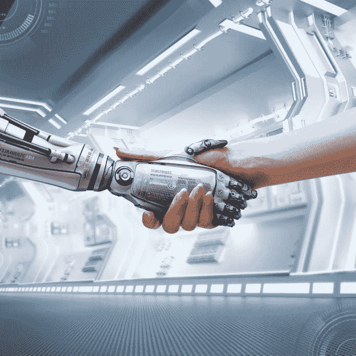

# 以就业为基础的经济将很快失败:我们能做些什么来避免灾难？

> 原文：<https://medium.datadriveninvestor.com/the-employment-based-economy-will-soon-fail-what-can-we-do-to-avoid-disaster-8ad1d7773420?source=collection_archive---------10----------------------->

让我们来看看我们所确定的:

1.  [人工智能](https://www.datadriveninvestor.com/glossary/artificial-intelligence/) ( [AI](https://www.datadriveninvestor.com/glossary/artificial-intelligence/) )即将超越人类完成复杂任务的能力。现在，[利用现有的技术，人工智能可以比人类更好地完成 50%以上的有偿任务。](https://www.mckinsey.com/featured-insights/future-of-work/jobs-lost-jobs-gained-what-the-future-of-work-will-mean-for-jobs-skills-and-wages)
2.  大约 20-30 年后，[人工智能](https://www.datadriveninvestor.com/glossary/artificial-intelligence/)将能够处理由技术工作替代创造的全新工作。这是因为[我们预测到那时人类水平的机器智能将会出现](https://www.mckinsey.com/featured-insights/future-of-work/jobs-lost-jobs-gained-what-the-future-of-work-will-mean-for-jobs-skills-and-wages)。这种人工智能的智能能力相当于或优于人类，与机器人技术相结合，并与互联网相连，将比任何人类工人都更具生产力。因此，为了保持他们在生产率方面的竞争优势，公司将不可避免地尽可能使用最大量的最先进的人工劳动力。

 [## 模式和机器人:一个复杂的现实数据驱动的投资者

### 哈耶克的名著《复杂现象理论》(哈耶克，1964)深入探讨了复杂性的话题，并断言…

www.datadriveninvestor.com](https://www.datadriveninvestor.com/2019/03/04/patterns-and-robotics-a-complex-reality/) 

由于人工智能已经可以比我们更好地完成我们工作中 50%的任务，并且我们将在未来 30 年内达到 100%，现在是开始思考未来工作的好主意。许多专家都在讨论这个话题，但我从专家那里读到的大部分都是关于如何让员工继续工作的争论。大多数专家都在试图寻找策略来维持当前基于就业的经济，但事实上，这种经济无法在这一代生存下去。

我们必须规划一个我们的生产力完全不依赖于人类工人的世界，而不是试图保持事物的原样。我们应该为我们的社会设计一个更美好的未来。

我们必须弄清楚如何利用自动化来管理我们的经济，把人类从经济的生产力部分中剥离出来。

经济是我们生产、管理和消费可用资源的方式。我们利用机器和人力，利用现有的自然资源进行生产。这些年来，我们通过利用越来越复杂和高效的机器，生产效率越来越高。我们利用计算机支持的管理专家进行管理。由于计算能力的提高和专家软件的发展，我们管理资源的能力变得更强了。人类唯一关心的是经济的消费方面。我们如此努力生产和管理资源的原因是为了消费。

作为管理稀缺资源的一部分，我们的社会创造了货币，这使我们能够根据每种货币对其生产和管理的贡献大小来分配资源。

所以，当人类成为有效生产和管理自然资源的障碍时，我们最好不要参与进来。

虽然听起来令人困惑，但自我学习的人工智能与执行器(机器人、自动化机器、手臂、腿、轮子等)相结合。)可以取代地球上的每一个工人，如果我们试图从根本上改变我们做事的方式。我们可以利用现有技术，在没有人类参与的情况下，为一个比现在生产力高得多的经济做好准备。智能学习软件将很快能够完成所有人类任务，包括发明、修理、资源收集、运输。因此，这些自动学习系统将保持并改进任何复杂的供应链，这将允许我们人类消费任何我们想要的东西，而不会错过任何东西或破坏我们的环境。

我们在这样一个经济体中的角色只会被消耗掉。

**我们就是问题**

虽然这听起来像科幻小说，但这种水平的技术今天已经可以用于一些供应链。老牌公司已经 100%自动化了。如果我以农业供应链为例，已经存在专门从事[建造 100%自动化农场](https://www.forbes.com/sites/lanabandoim/2018/09/25/first-fully-automated-indoor-farm-being-built-in-ohio/#123abab06404)、 [100%自动化散装食品运输](https://www.theverge.com/2019/1/11/18174275/daimler-tesla-self-driving-trucks-tusimple-ces-2019)、 [100%自动化杂货店](https://venturebeat.com/2019/01/12/how-automated-supermarkets-are-shaping-up-for-2019-and-beyond/)和 [100%自动化送货上门](https://www.bbc.com/news/technology-47880288)的公司。目前，这些公司和服务彼此没有联系，但这些公司将在市场上掀起波澜，通过消费者需求和对保持低成本高收入的关注，它们将彼此完全整合。今天，食物从农场到餐桌，没有一个人参与是可能的。想象一下 10 年、20 年、30 年后…其他行业和供应链已经处于类似的发展阶段。

我们的问题是我们需要工作来生存。我们不喜欢这些机器人和人工智能，因为它们的存在威胁着我们的生计。太吓人了。我们的生计依赖于我们成为供应链的一部分，或者至少是服务的一部分。如今，70%的北美工作是服务性工作或与服务相关的工作。当然，我们会保住这些工作来养家糊口，对吗？没有。服务性工作，就像大多数其他工作一样，是为了让我们更有效率而存在的。有些是为了娱乐，有些是为了那些我们不想让机器人为我们服务的人，所以到处都有对人类的需求，但当其他一切都变得自动化以实现最高效率时，这种需求远不足以保持整个以就业为基础的经济运转。

几个月前，我写了一篇关于 2040 年工作的未来的文章，描述了人类将如何在这个过渡时期及以后为社会服务。现代经济是以供给和需求为基础的，如果有现成的人类需求，就会有可供服务的供给。重要的是要记住，没有足够的“纯人力”服务工作来维持我们的经济。

如果我们不打算在将人类从工作奴役中解放出来的同时整合自动化系统，自动化将伤害许多人，因为它不可避免地接管了几乎所有有现金价值的任务。

一个全新的经济

从以就业为基础的经济向以消费为基础的经济转型需要激进的思维和大规模的社会经济变革。我更愿意称后者为以人为中心的经济，因为在这个重新设计的时候，不妨想想我们从根本上想要和需要什么:食物、住所、安全和参与社会的方式。

虽然就业在历史上一直是向人们分配食物、住所和安全的有用工具，并且在赋予我们大多数人社会意义方面做得很好，但我们并非生来就是雇员。

从生物学上讲，我们生来就是为了一件事:感受。我们所做的一切都是为了感受快乐，避免负面情绪。它一直驱动着我们所有的行为。我们的身体消耗食物来维持我们的生命，并给我们能量来感受我们的环境。我们通过参与娱乐活动来尽可能地享受生活，我们吃更多的食物来恢复失去的能量和修复细胞损伤。当我们感到疲劳，我们的身体需要再生时，我们就睡觉。我们社交、玩耍、自愿贡献时间、组建家庭，这一切都是因为我们喜欢这样做。

我们就是这样。

我们设计机器人和人工智能来做我们不想做的事情，并管理经济，以便我们可以自由地感受我们的环境和宇宙。

既然我们有工具把这个地方变成一个虚拟的天堂，在那里我们可以，人类历史上第一次，自由地成为我们自己，难道我们不应该努力为我们自己建设这个未来吗？

创造新经济意味着动员政府与私营部门合作，实现所有供应链的自动化。我们在未来几年致力于此，政府必须确保所有公民的基本需求得到满足。这意味着我们的领导人必须确保所有人在过渡期间都能获得食物、住所、安全、医疗保健和教育。一个普遍的基本收入计划将是一个伟大的方式，让我们走上未来没有工作的道路。

然后，当足够多的自动化系统到位，自我修复和自我维持，我们就可以摆脱公司，金钱和任何其他阻止我们真正摆脱强迫劳动的约束。

从现在到那时，我们的生活会有多长，会有多混乱，取决于我们是否意识到这样一个事实:我们能够而且应该这样做。

越快越好。

**想了解更多关于如何建设人类友好未来的信息**，请阅读[“工程天堂:你准备好了吗？”](https://www.amazon.com/Engineering-Paradise-Are-You-Ready-ebook/dp/B078YHQLZD/ref=sr_1_fkmrnull_1?keywords=sylvain+rochon&qid=1557787487&s=gateway&sr=8-1-fkmrnull)

*原载于 2019 年 5 月 20 日*[*【https://www.datadriveninvestor.com】*](https://www.datadriveninvestor.com/2019/05/20/the-employment-based-economy-will-soon-fail-what-can-we-do-to-avoid-disaster/)*。*