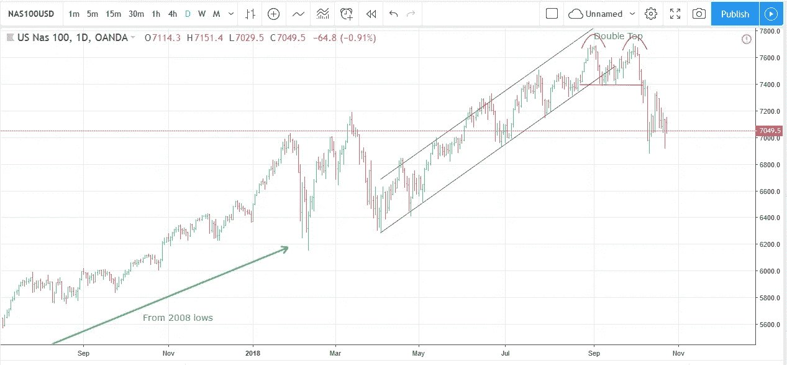
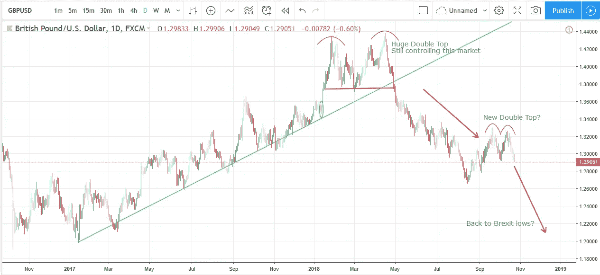
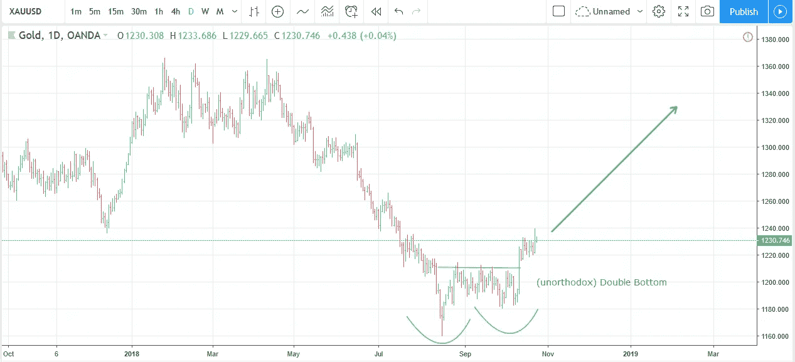
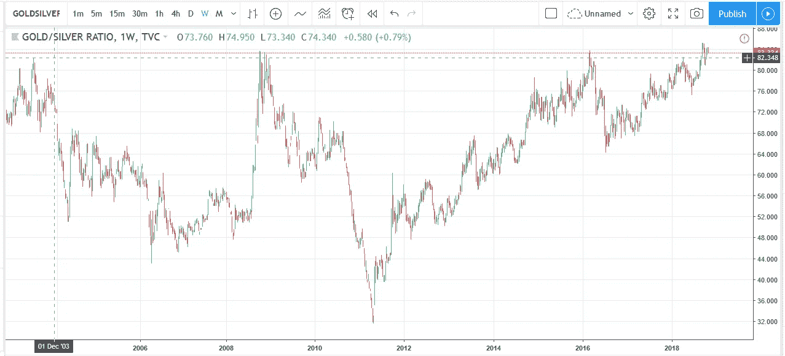

# 10 年牛市的终结？

> 原文：<https://medium.datadriveninvestor.com/the-end-of-a-10-year-bull-market-the-gbp-19b09fae1859?source=collection_archive---------26----------------------->

股市大幅下跌后，全球市场经历了忙碌的几周。牛市结束了吗？在货币方面，英镑处于一个非常关键的区域。贵金属在极低水平找到了支撑。我相信在这三个领域都可能会有很好的交易机会。

## 股票牛市终结？

在经历了长达十年的牛市之后，尤其是在美国，我们在过去的几周里经历了一次严重的股票市场指数下跌。最引人注目的是美国纳斯达克技术指数(见下图):

这从明显的双顶形态开始，一旦价格跌破该形态的支撑和上升通道(两条平行线)，价格就会快速下跌。

但是我们接下来要去哪里呢？

目前，价格在一个非常关键的区域交易——回到上周的初始低点。如果价格在这里找到一些买家，我们可能会回升，再次挑战之前的高点。否则，价格可能会突破最近的低点，这种下降趋势可能会很快变得更糟。随着美国中期选举的快速临近，我们可能在那之前(大约两周时间内)看不到明确的解决方案，因为交易者在承诺下一步行动之前等待结果。

然而，我们似乎正在接近这轮牛市的终点，因为许多个股已经形成了非常熊市的形态，表明高点已经过去。

在这种市场环境下，我当然会考虑减少股票市场的长期投资，因为目前的风险远远高于潜在的回报。

## 关键地区的英镑

过去几个月，英镑一直在一个交易区间内上下波动。然而，我们现在正处于这种情况即将得到解决的时刻。除非我们在未来几天找到一些重要的支撑，否则英镑看起来可能会继续走低，重新测试英国退出欧盟会议后不久的低点。

## 贵重金属

贵金属最近日子不好过。但在低点盘整后，它们突破了交易区间，确认了一个非正统但仍然有效的双底。从这里开始，我们可能还有很长的路要走。白银和铂金价格走势相似。

让我们看看更大的图景:

我们正在形成一个(巨大的)倒黄金头肩顶的右肩吗？这将预示着未来几个月和几年(更)高的价格。

贵金属市场的一个很好的指标是黄金/白银比率。与历史价格相比，我们目前正处于这一比率的高点。这是市场触底的可靠指标。下图显示了多年来的这一比例:

正如你所看到的，我们位于 83，这是这个比率的历史价格的极限。所有之前的峰值都与黄金和白银价格的主要底部相吻合。看好这个空间！

## 关于迈克尔

我是一名职业交易员，从 2013 年开始做交易。我想通过培养一群有决心、有奉献精神的人，来分享交易给我的机会和自由。

通过这个详细的免费培训视频学习我的简单技术。

本文最初发表于 mangrovetrading.com/end-of-a-bull-market