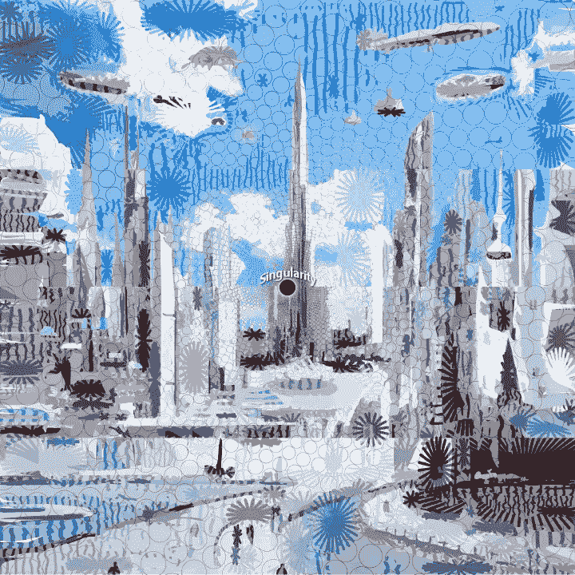
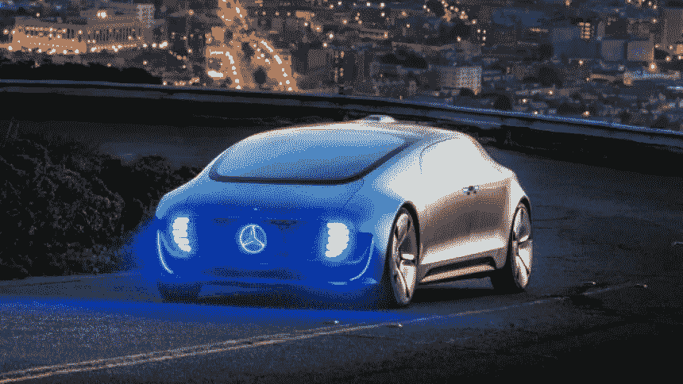
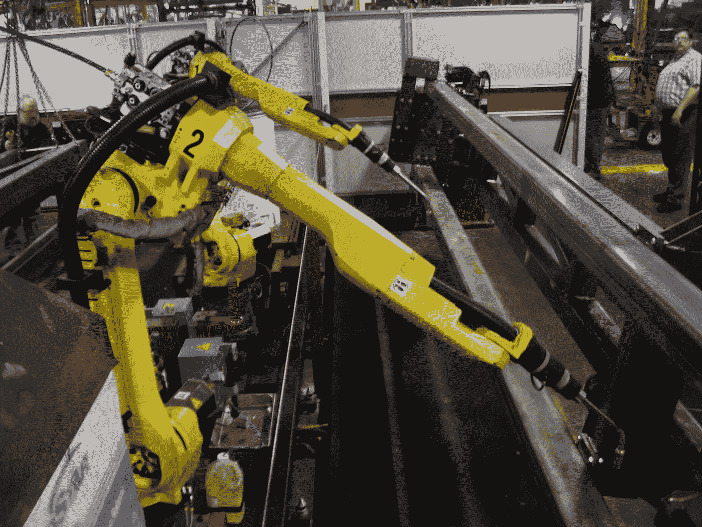
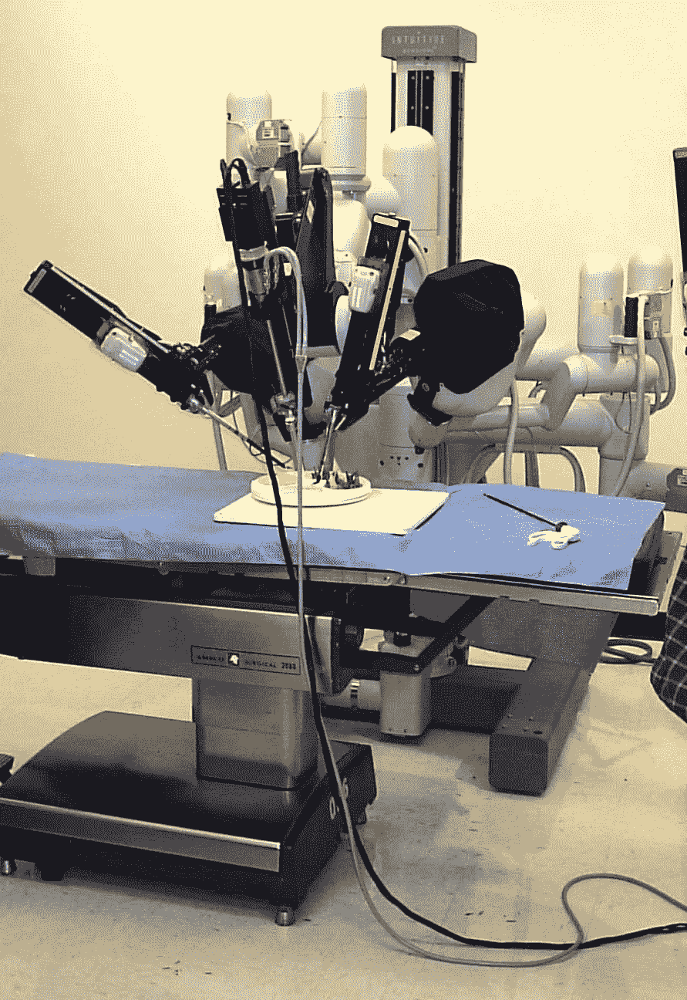

# 商业的末日即将来临

> 原文：<https://medium.datadriveninvestor.com/the-end-of-all-business-is-coming-f324de82fbc9?source=collection_archive---------8----------------------->

从中国和埃及的古代商人到苹果和 Alphabet 这样的现代巨头，商业经历了巨大的发展。一直以来，它为数十亿人提供了工作和致富的途径。它也有许多关于剥削、奴役和灾难性活动及结果的黑暗故事，如大规模石油泄漏或大规模气候变化。它一直是竞争进化的引擎，推动企业发明更好的产品，以更少的成本生产更多的食物。甚至商业运作的规则也在演变，给了我们带薪休假、5 天工作制和更安全的工作环境。商业已经完全改变和渗透了我们的生活方式。很难想象一个没有商业的世界，但这样一个世界正在向我们大步走来，许多人仍然没有意识到或者宁愿盲目忽视这些迹象。

> 无论企业规模有多大，范围有多广，在不久的将来，它存在的目的将会消失，取而代之的是更好的东西，因此我们所知道的所有企业都将不复存在。

如此多的企业已经因为各种各样的原因或需要来来去去:时代变迁、管理不善、经济衰退、战争、过时等等。企业从来就不是社会的永久固定装置(就像某些灭绝的物种不会继续存在一样)，尽管至今仍有许多百年历史的企业，如 Bass Ale，尽管它可能很少与最初的相似。除了生产一些其他人愿意为之付费的商品或服务的一群人之外，什么是企业？当制造商品或提供服务的成本超过销售所能承受的限度时，企业就变成了一种负债，不再具有经济意义。在这种情况下，一个企业不需要员工来生产商品或提供服务，它就失去了存在的社会合理性，成为一个工作破坏者。在任何业务都可以完全自动化的这一点上，所有的业务都将如此自动化，并将失去所有的盈利动机，在这个世界上，没有人被雇用或从数据库中已经由 1 和 0 组成的虚拟货币中获得报酬。

> 完全可以想象，随着自动化和人工智能(AAAI)以几何级数增长，任何可能的业务或服务都可能完全自动化。AAAI 是一种进化力量，它诞生于企业、学校和政府，其结果是企业的消亡，尽管这听起来很奇怪。

我们知道一个事实，有些工作已经被自动化淘汰了，比如某些装配线工作、接待员、呼叫中心和其他工作。这一趋势将加速，更多的蓝领工作将从工厂、运输相关、仓库、码头、快餐、建筑等开始自动化。那么，人工智能将很容易侵占会计、税务准备、法律服务等白领岗位。最后，高级、高技能工作将实现自动化，如医疗、手术、诊断、警务等。随着每个领域都被超越，越来越少的人甚至会冒险接受必要的教育和培训，以完成机器人/机器人做得非常好的事情，如果不是完美无缺的话，因此这些人类技能可能会消失——但专业知识不会，它们将存在于智能系统和维护它们的系统中。

This is already yesteryear’s model. Tomorrow’s model is almost here.

智能系统不仅仅是智能的，它们还将超越卓越、准确、博学，利用整个人类知识库，基于复杂的推理做出明智的决策，每秒进行千万亿次或更多的计算。这些系统将自我改进到未来学家雷·库兹韦尔预测他所谓的 [*奇点*](https://en.wikipedia.org/wiki/The_Singularity_Is_Near) 的程度，在这一点上它们将完全脱离我们理解它们的能力，就像达到一种精神逃逸速度。这既是令人恐惧的，也是令人渴望的。恐惧，如果控制不当，欲望，如果用同情和智慧为地球人服务。

 [## 不管准备好了没有，革命就在我们面前|数据驱动的投资者

### “对于技术如何影响我们的生活和重塑经济，我们必须形成全面的全球共识……

www.datadriveninvestor.com](https://www.datadriveninvestor.com/2019/02/12/ready-or-not-the-revolution-is-upon-us/) 

未来的孩子们会认为在高速公路上手动驾驶汽车是不可思议的，因为在高速公路上，自动汽车以光速交流，像电子一样呼啸而过。事实上，他们甚至不会称之为驾驶，只是骑行。许多会干扰早期过渡世代的事情将会成为生活的事实，但是每一个改变肯定会到来，一次一个，无情地。

Autonomous cars and trucks are here. Soon to follow: trains, boats, drones and planes.

但你会说，“所有这些智能系统的所有者和投资者仍然会从他们的零劳动力运营中获取利润。将会有相互竞争的系统来争夺我们的业务。”是的，开始时，毫无疑问会有许多这样的组织获得创纪录的利润，增加了“所有者”和“消费者”之间的差距。但这将是一个收益递减的游戏。消费者也是有技能和聪明的人，所以当他们的工作和生活被剥夺时，他们不会无所事事，他们会坚持要求法律保护他们和生活水平。社会主义将不再是一个时髦的词，而是坚持财富共享和生活水平保持在一个高质量水平的消防水管。谁愿意住在一个没有任何便利设施的寒冷小屋里？谁想吃残羹剩饭？没有人，当他们掌握自己的命运时，他们为什么要这样做？但这并不是传统意义上的真正的社会主义，在传统意义上，人们仍然有工作，并支付高额税收来换取国家控制的福利。这是一个更加深刻的变化。这一变化将对不再适合的旧模式提出质疑。这种变化将导致笨重的公司恐龙灭绝。幸运的是，即使是最狂热的资本家或股东也会同样受益，而不会受到伤害。称之为*生活主义*。

我已经建立了几个成功的企业，实际上我不认为人工智能和机器人能够很快做到我们所做的事情，即创新和以勤奋和灵感响应客户需求。我很难想象一个酿酒大师或葡萄酒商或任何手工企业会被轻易取代，但他们将面临另一个压力——员工激励。即使是最狡猾的工作场所也需要有献身精神的工人，他们有经济上的激励来整天努力工作，并在工作中获得薪水。如果这些人已经享受到自动化建设、食品生产和配送、绿色能源和交通作为“基础设施”一部分的好处，他们还会愿意免费工作吗？如果没有，那么谁来制造这些东西呢？这可能是因为这类事情得到了复兴，创造了一种补偿或物物交换或*社会信用*的灰色市场，那些做这份工作的人真正热爱这份工作，并决定以这种方式度过他们的时间。我们不知道。我所能说的是，一项活动越人性化，越多的人会被这些活动所吸引，并让系统提供生活必需品。

只有当钱是生活所必需的时候，营利性企业才是必要的。如果一个人可以过着相对奢侈的生活，不需要花钱买东西，那么就不会有经营企业或为企业工作的经济动机，除非他热爱这种活动本身。如果给人们免费的钱来生活，那么他们可以把钱花在东西上，那么这些东西就真的是免费的，给钱来买这些东西在这个过程中是一个愚蠢的，不必要的步骤。随着时间的推移，这一点将变得更加清晰，整个货币概念将作为一个过时的骗局被重新审视，从我们不得不工作制造东西的古雅时代开始。因此，最终金钱也会消亡，被赋予其真正的价值——无用的、无意义的、多余的、没什么可担心的。

Welding robots never tire or complain and work for free.

如果你问大多数人，他们工作中最喜欢的是和他们一起工作的人，以及把事情做好的满足感。许多工作既艰苦又乏味，而且不是为了享受，而是为了生存。关于大众自动化最常见的问题是“我们将如何利用我们的时间？我们会有什么目的？”这是因为我们被编程来通过我们的工作和职业来看待我们自己，而不是作为完全控制我们在地球上的时间的经验存在。谁说你每天开车 30 英里去上班，然后在那里待 8 个小时，还要在早上 8 点打卡？当然，如果它给你带来了真正的成就感和生活满足感，那就意味着你找到了适合你的职业，那太好了。然而，如果作业是自动化，那会怎样呢？停止自动化？这是一个答案。防止整个大规模自动化发生在一个工作保护法案。我看得出来。但是，也许这将是割下我们的鼻子来气我们的脸。我们，被给予选择纯粹的自由或进行奴役，选择奴役。

如果你喜欢和人一起工作，喜欢做事的满足感，那么你很幸运，因为大规模自动化永远不会阻止这一点。唯一会改变的是活动和进行这些活动的原因。如果我们认为大众自动化系统是一个大机器，它使生活运转，增加自由，帮助我们享受在一起的时光，那么它就成为一个共同的事业，充满爱心地关注系统的质量、治理和正确运行。我们都尽自己的一份力量来维护它，这本身就是一种工作，与其他动物为了生存不得不做的事情没有什么不同。当然，会有纯粹的吃白食的人，他们只从系统中拿走东西，但由于荒谬的慷慨，他们对系统的健康没有任何影响，因此成为一个非问题，除了社会可能强加给他们的某种清教徒式的判断。基本上，一些国家已经有一年 6 周的带薪假期，所以在某种意义上，所有将发生的是这将稳步增加，直到它更像每年 40 周！有那么可怕吗？18 岁“退休”。

在一个新的知识产权由人工智能创造的世界里，专利和商标的概念将变得过时，这些东西将被视为*无主和公共领域*。事实上，伴随金钱和商业而来的所有东西都将变得多余，如:银行、保险、税收、广告、营销、销售、合同和协议等。这将极大地简化生活，这将是我们在现代世界中为自己创造的日益增加的复杂性、焦虑和压力的一个可喜的喘息。毕竟，我们是有限的存在，我们改变和承受压力的能力在某种程度上融入了我们的生物学，我们已经将它推向了极限。

Surgical Robots will precisely perform operations in the most efficient manner any time of day.

不要哀悼营利性企业的损失。他们已经完成了他们的目的，让我们进入进化的下一个阶段，但是我们必须进化。事实上，这甚至不是真正的商业死亡，而是它向下一级企业的自然进化，因为许多现有的企业将会并且正在创建大规模自动化系统的基础。未来的历史学家将会惊叹于我们是多么的勤劳和专注于我们的家庭，为了提供住所、温暖和食物，我们牺牲了我们生活的基本结构和我们在地球上的时间。但是这些东西以及更多的东西可以由我们为了所有人的利益而控制的系统来提供。这不仅是一个没有贫困的世界，而且是一个传统财富没有特殊价值的世界，因为每个人都共同享有它。就像数十亿年来每天 24 小时都有足够的阳光来温暖和滋养地球一样，有足够多的东西可供人们使用。这将解放我们去探索宇宙，享受具有壮观景色的零重力栖息地，吃最好的食物，享受难以置信的长寿和健康。财富仍将存在，但本质上将是精神和心灵上的，那些被认为是真正富有的人将不会有成堆无用的黄金和财富(普通的东西)，他们将拥有平和的心态、智慧和对活着的美好事物的欣赏，并有意识和自由地享受与他人的友谊。

Don’t count future robots out of any capability we have, since we are their makers.

最后，不要假设我个人正在推动这个未来的展开，或者没有看到它是一种反乌托邦的噩梦。我只是在解读我所看到的趋势，并推测如果走向极端，它们最终的社会影响。我非常想解决我们正在经历的许多问题，从贫困到社会衰退、医疗保健、环境到国际和跨文化问题。如果这些工具可以帮助我们超越目前暴力和贪婪的自我，并为他们提供一个伟大的普遍生活标准，我会支持它。我仍然对我们做正确的事情和看到全局的能力保持警惕和非常怀疑，因此给它 35%的机会以正确的方式发生。

这篇文章在一定程度上基于我的书，我在书中深入探讨了即将到来的变化，如自然的作用、宇宙资源、治理等等:[财富和金钱的终结:自动化乌托邦](https://www.amazon.com/dp/B07QGPF6L8)