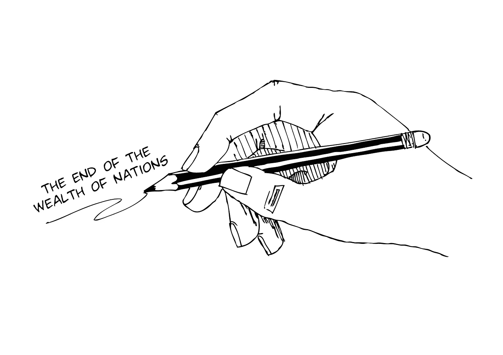

# 国富论的终结

> 原文：<https://medium.datadriveninvestor.com/the-end-of-the-wealth-of-nations-3b5d0df1b760?source=collection_archive---------6----------------------->

1776 年，社会哲学家、经济学之父亚当·斯密出版了《国富论》。在接下来的 100 年里，这本书用“看不见的手”解释了经济是如何运转的，以及为什么工业革命让北欧在 19 世纪比其他任何地方都富裕。随着时间的推移，对“看不见的手”的解释多种多样；事实上，亚当·斯密在他出版的著作中提供了三种不同的解释。

史密斯的“看不见的手”类比试图解释每个人的自私欲望是如何被以某种方式引导，从而在无意中使整个社会受益的。在那个时候，个人在没有任何集体利益的情况下运用他们的劳动，通过市场在一个更富裕的国家中取得了成果，这似乎是一个奇迹。也就是说，尽管他们自己；随着时间的推移，每个人都变得更好了。

 [## 为什么包容性财富指数比 GDP 更能衡量社会进步？|数据驱动…

### 你不需要成为一个经济奇才或金融大师就能知道 GDP 的定义。即使你从未拿过 ECON 奖…

www.datadriveninvestor.com](https://www.datadriveninvestor.com/2019/03/08/why-inclusive-wealth-index-is-a-better-measure-of-societal-progress-than-gdp/) 

这一对现代经济学的首次尝试将收入的产生定义为经济繁荣的决定性因素。重要的是，当史密斯在苏格兰的一边写下这篇开创性的文字时，在苏格兰的另一边，詹姆斯·瓦特发明了现代蒸汽机——这是工业革命的基础。斯密根本不是一个反建制主义者，然而将土地和非熟练劳动力作为生产的主要投入转移到资本和熟练劳动力确实是反建制的。无意中，史密斯预言了资本家的崛起。

人们通常错误地认为这一时期是一个简单的时代，没有多少现代思想的应用。然而，斯密的时代并非没有价格泡沫；郁金香狂热或股市崩盘已经过去了一个多世纪；1769 年东印度公司价值崩溃后的危机已经切身感受到了。然而，它没有两个重要的现代弊病——银行危机和萧条。

1825 年和整个 20 世纪 30 年代提供了这些事件，并在随后的几年里促进了经济学的重大进步。新经济学认为“看不见的手”不时需要一些帮助。这种帮助主要是以国家作为需求提供者在经济中的角色的形式出现的。也就是说，斯密对市场供给方面的关注表明，当太多的人想要或不得不储蓄时，“如果你制造了它，就会有人购买它”就失去了一些东西。

其结果是，经济的建立是为了消费生产出来的东西。以 20 世纪 50 年代中期设计过时的汽车为代表，美国经济成为“消费有益”口号的旗手。在过去的五十年里，作为经济中最大的需求创造者，权力从国家转移到了个人手中。这促使人们的非理性本质被纳入经济理论，但总的来说，后现代经济学除了鼓励我们的可支配社会之外，没有促进经济的其他本质。

经济学已经从 18 世纪晚期的一盏明灯变成了今天的古董地图，这是多么奇怪啊。社会不再以消费主义的未来为目标，然而经济学并没有为后消费主义经济提供方法。在 21 世纪，个人的理性行为正在取得与 200 年前完全相反的效果。全球经济正走在一条不可持续的道路上，其目标是让每个人的未来都变得更糟。鉴于能源、水、清洁空气和碳的新短缺，看不见的手正引导我们的私欲走向国家财富的尽头。