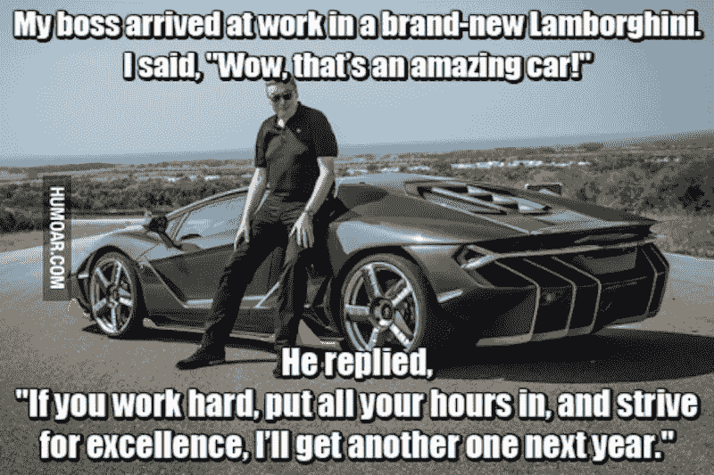
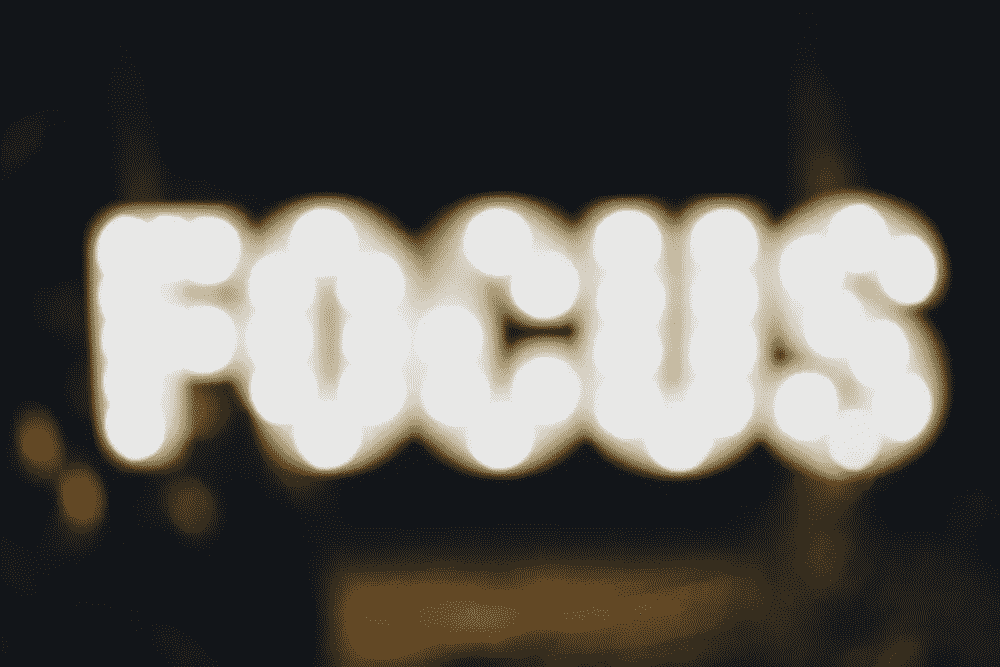
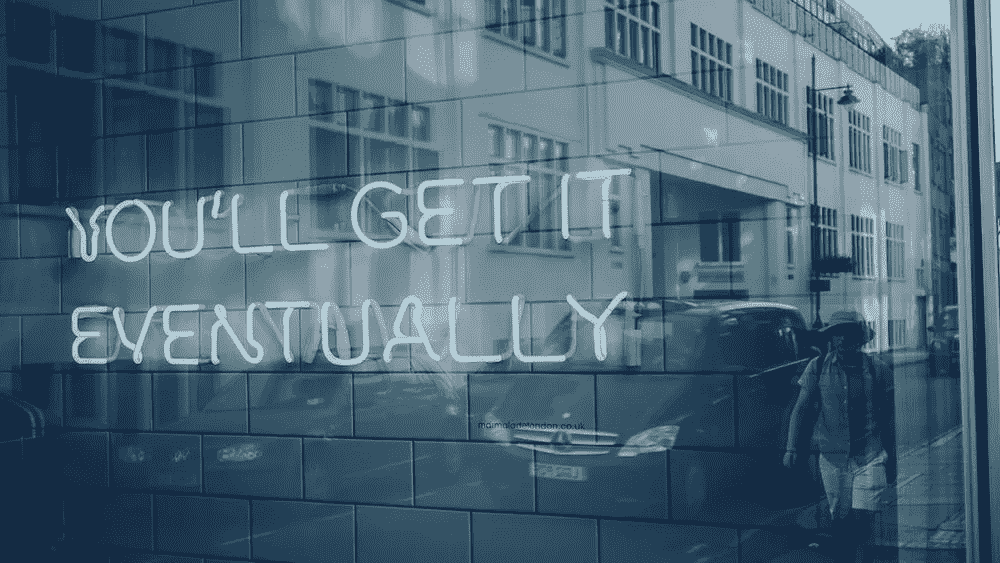

# 企业家系列:幻想家还是受虐狂？

> 原文：<https://medium.datadriveninvestor.com/the-entrepreneur-series-visionary-or-masochist-aa4f84fe9a1f?source=collection_archive---------26----------------------->

这篇博文将以一种不同于我之前文章的方式挑战你。创业不仅仅是实现你的梦想和建立财务自由。全程自我反省是可持续性的关键。我将讨论几件我认为应该放在你们脑海中最重要的事情。

会有不确定性，太多的不确定性。学会相信自己是成长过程的一部分。失败测试你是否真的想要它。失败也揭示了你是否有勇气，这一点我稍后会谈到。

在 2016 年和 2017 年的一些时候，我处于一个创意死亡区，在我开始 Black Davis Management 后，当人们不相信我时，我努力重新发现是什么激励了我。回想起来，虽然那是一段非常艰难的时期，但它让我明白，无论布莱克·戴维斯的管理层发生了什么，我从来都不是为了打造别人的梦想。

你能接受失败、动荡和缓慢的开始吗？

抛开所有迷因不谈，尽管当我第一次浏览它时，它对我产生了巨大的影响。现在是 2018 年 9 月，我拥有布莱克·戴维斯管理公司快 3 年了，我的创业之旅经历了许多意想不到的转折。作为一名专业的数字营销人员，你可能会认为开展和维持营销业务很容易，请再想想。当我从硅谷搬到洛杉矶时，这并不容易，因为我的第二个城市完全是我自己的，在自己创业一年后，很难重新融入企业界。我必须真正努力，放下自尊，在邮局之类的地方工作，直到合适的角色出现，因为企业家通常被视为对包括雇主在内的大多数人的威胁，而不是一种资产，尽管所有的招聘广告都写着“企业家思维”。到目前为止，这是我人生中第二艰难的时刻，它向我展示了你真正拥有的是你自己和实现它的动力。

在洛杉矶呆了一段时间后，我来到了一个十字路口，看到了“娱乐”行业是如何运作的。刚开始的时候，赚钱是残酷的，几乎是不可能的，作为一名女商人，这对我来说是行不通的。所以我决定砍掉 Black Davis Management 的人才代理部门，专注于我热爱并擅长的数字营销。我必须承认，我觉得自己很失败，因为我没有看到我犯的一些错误，我开始时浪费的金钱和时间，但我可以看到这是整个过程的一部分。我彻底改造了我的网站，推出了“千禧一代商业指南”，这是让愿景重新成为焦点的第一步。

**重塑是这个过程的一部分**

现在，即使在洛杉矶的数字营销中获得了一些 9-5 分，我仍然能感觉到缺少了一些东西。我得到的角色需要我和我的时间。这让我怀疑自己是否想继续担任领导职务。虽然领导力通常意味着更多的金钱和责任，但这是正确的目标吗？错了，我发现领导越多，我就离营销和创意越远。我其实是想做这份工作，继续磨练自己的手艺。

永远不会有完美的职位，但我相信总有一份全职工作能让我学习、拓展人脉、展示才华，并为我的事业留出空间。是的，商业复数 lol。这是我们在创业之旅中右转的地方。在一家代理公司工作时，我意识到自己对建立自己的电子商务业务的兴趣。

我多年来一直在管理电子商务商店及其营销，我问自己“为什么我不为自己做这些？”因此，在真正的千禧年时尚，我去了！我在 1.5 周内从零开始在 Shopify 上建立了 2 个直运电子商务商店。Athlexis.com 和 Alexandnolan.com 分别代表着同一个目标的重塑:财务独立、我对营销的热爱以及建立多种收入来源。有时很难认识到自己的才能，尤其是当你是一个完美主义者时，现在我独自在两个不同的平台上建立了三个网站，我不得不说我认为我在这方面非常擅长。28 岁，我觉得我才刚刚意识到知道自己的价值和加税的意义。

**你有勇气吗？**

什么是勇气？好吧，在我看来，就是重塑自我，相信自己，永不放弃自己的能力。无论如何，我不知道所有的事情，但我知道我注定要成为伟人。对我来说，伟大意味着有能力以我想要的方式生活，照顾好我的家人，看看这个世界。对我来说，成为一名企业家是实现这些目标的唯一途径，这意味着永远不要放弃我的事业。尽管道路喧嚣而孤独，但我真的相信我以一种独特的方式看待这个世界，这就是我与众不同的地方。你最亲近的人会试图阻止你，不会在你觉得他们应该支持你的时候支持你，或者根本不理解，但对我来说，这只是意味着我在做一些事情。

那么这一切意味着什么，“幻想家还是受虐狂？”我认为答案是两者皆有，因为要成为一个企业主，你必须有点疯狂。有那么多时间的工作、研究、压力和创造，人们看不到，但你不能试图说服任何人。在这个旅程中，你唯一的责任是对自己负责，永远不要忘记你为什么开始，并确保你仍然在工作中找到乐趣。用备受争议的科林·卡佩尼克·耐克广告词来说，“去做吧！”执行这个想法、创建公司或设计网站从来都没有完美的时机。

我很想听听你们的故事，欢迎在评论中或通过电子邮件与我聊天。

*最初发表于*[*【www.blackdavis.com】*](https://www.blackdavis.com/blog/visionaryormasochist)*。*