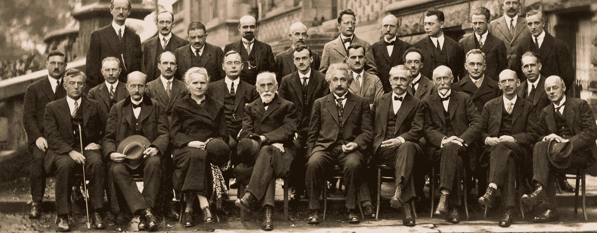

# 众包的认识论

> 原文：<https://medium.datadriveninvestor.com/the-epistemology-of-crowd-sourcing-64ff43552e25?source=collection_archive---------34----------------------->

人工智能如何推进公共知识

约阿布·罗森博格，Epistema 首席执行官

Fifth Solvay Physics Conference (1927) — Even Einstein was working within a community

很多年来，学术界和工业界都在探索众包，将其作为一种获取真相的有趣工具。显然，当许多人被问及对一个事实问题的看法时，他们可能会发现很难单独得到正确的答案，但作为一个集体，他们确实得到了正确的答案。典型的例子是猜测一头牛的体重，这个例子是统计学家弗朗西斯·高尔顿在 1906 年观察到的。高尔顿注意到，虽然个人很难仅仅通过看一头公牛来猜测它的重量，但所有人群猜测的平均值惊人地接近正确答案。James Surowiecki 的《群体的智慧》是以更通俗的方式介绍群体外包的主要书籍。这本书突出了一种可能性，那就是以一种合作的精神将大众团结在一起，找到个人无法解决的问题的解决方案。

Philip Tetlock 和 Dan Gardner 在“超级预测”中提出了一种更为详尽的方法来解释人类如何预测社区中的事件。他们展示了一项由美国情报部门进行的实验:3000 名参与者(不全是专家)被问及对世界大事的预测。每个参与者必须给事件分配一个概率(例如，“特朗普会在 2020 年连任吗？”)，并可以根据她所属的小组内出现的新事实或新想法随时改变它(一些参与者单独工作，一些参与者被分配到小组)。事后，特洛克和加德纳研究了最佳预测者，即超级预测者，并试图理解是什么让他们比其他人更优秀。因此，泰特洛克和加德纳代表了一种更先进的众包方式，这种方式不是基于民主，而是基于参与者的精英管理。

同样的想法在金融领域的应用被称为“预测市场”。这种方法允许大众对未来事件下注。通过整体研究这些押注的模式，对市场的良好预测正在浮现。

众包以多种方式证明了社区可以合作获得非常接近事实的答案。但是支撑这种能力的认识论基础是什么？认识论是研究我们人类认识世界的方式的哲学专业。它起源于古希腊柏拉图的著作，但是西方世界在启蒙运动和科学革命期间已经学到了很多了解世界的方法。我想分享一些认识论的基本观点和概念，试图更深入地理解众包，并指出通过使用现代人工智能技术来促进我们理解和使用它的可能途径。

认识论传统上提供了我们人类认识世界的四种方式的分类法:感知、记忆、推理和证词。感知与可感知的事物有关，即我们用感官感知的事物，例如，阳光灿烂或我听到附近有狗的声音。推理是我们从一件事推断另一件事的能力，例如，如果今天早上阳光明媚，我今天就不需要带伞。记忆对于我们提升知识是必不可少的，否则我们现在所拥有的知识只是“原子”,不会带到未来，例如，如果我没有记忆，我就不知道当早晨阳光灿烂时什么能做，什么不能做。证词是我们在人类之间交流知识的方式，它远远超出了法庭证词的世俗意义。自然，我们的许多知识我们自己并没有察觉到。其他人向我们见证，无论他们是我们童年的父母和老师，还是我们成年后的教授和导师。如果我们每个人都必须亲身经历一切，才能获得他人已经获得的知识，人类很可能不会进步。

传统上，哲学家将感知和推理视为知识的主要来源，将证词视为次要来源。记忆和证词都被认为是知识的“非生成性”来源，即保存和传递通过感官和推理获得的知识的方式。科学革命是基于启蒙的原则，根据这一原则，个人应该通过自己的头脑和感官来认识世界，摆脱圣经和牧师的旧权威(因此实际上删除了 Devine 启示作为知识的可能来源)。从伽利略到爱因斯坦，个人英雄被认为是具有天才能力的个人，以独特和创新的方式感知和思考世界。正如行人所描述的那样，科学首先是通过我们的感官在实验室中收集关于世界的数据，然后通过使用我们的大脑概括我们所感知的东西，将这些数据转化为关于世界的理论。同样，同行评议(类似于证词)总是被认为是必要的，但只是作为一种次要手段，以确定实验进行的方式或证据和定律推导的方式没有错误。

但是在过去的几十年里，人们对证据产生了新的哲学兴趣。更多的哲学家和社会学家意识到，证词或知识群体在我们了解事物的过程中扮演着至关重要的角色。我相信我所知道的、我没有亲自核对的陈述数量是巨大的。我是许多社区(高科技、哲学、我的犹太生活、以色列左翼政治)的一部分，与他们分享知识，甚至对某个知识库的承诺。对证词这一新研究的主要贡献者是科亚迪的《证词》，库什的《协议性知识》，以及莱勒的《科学与社会中的理性共识》。

这些不同的知识获取概念在人工智能和大数据领域是如何发挥作用的？顾名思义，大数据和数据科学伴随着科学的荣耀。“大数据时代”只不过是一种说法，即当今的传感器和存储技术(例如，数据量及其通过云和互联网的可访问性)允许我们以前所未有的方式研究数据。一个 40 年前工作的海洋学家不能真正研究海洋，所以她必须有一个模拟海洋的实验室。每隔一段时间，她可以去一趟海洋校准结果，但她永远无法实时研究海洋。但是今天，我们有非常便宜和小的传感器，我们可以把它们扔进海洋，让它们通过卫星把它们的记录(例如温度、风、压力)直接传输到云上，在那里它将实时提供给研究海洋的整个社区。在数字医疗保健中，我们可以将传感器放入 Apple watch，测量每个人的日常步数、心跳、温度和许多其他变量。它可以全部储存在网上，由医生和统计学家研究，以更好地了解疾病。人工智能和机器学习技术应用于原始数据，以找到相关性和异常，这样我们就可以以更快更好的方式探索海量的可用数据。因此，大数据是科学方法的现代应用，优先考虑原始数据及其数学模式，因此优先考虑感知和推理。

证词呢？在人工智能和大数据的世界里，它几乎不存在。人工智能的狂热分子甚至声称人类的思维不再是必要的。大脑是一个混乱的机器，有许多感官限制(例如，我们人类看不到红外线)和许多推理问题(例如，我们遭受的心理偏见)。更不用说人类记忆的局限性了。计算机已经远远超过我们的记忆很多年了。有了无监督的机器学习，甚至不需要人类来完成标记示例以帮助机器学习的蹩脚任务。

众包似乎在技术和数学上都落后了。大多数应用程序使用简单的平均方法，甚至手动方法来研究群体的智慧。像“Wikistrat”这样的公司雇佣数百名分析师来成功预测未来的战略事件，但这是通过人类编辑和调解人来实现的，他们必须浏览所有的评论，并设计一份文件来总结结果。“超级预测”是一种创新的方法，但关于超级预测者为何成功预测的研究是由作者手工进行的。

我们可以通过使用机器学习技术来推进证词和公共知识背后的基本思想吗？我想建议我们可以。这就是我们在认识论中所做的。我们正在以一种允许我们给每个参与者分配不同特征的方式跟踪人类的讨论。我们跟踪他们在不同话题上的争论，并研究他们在相关社区中的同龄人之间达成一致和分歧的巧妙模式。通过将人工智能算法应用于公共争论，而不是原始数据，我们设法为特定问题的不同答案分配一个概率。人工智能在人类集体中的应用有助于加速人类在群体中的思维。除了大多数数据科学家将最现代的数学技术应用于感知和推理的方式之外，我们还找到了一种将最现代的数学技术应用于证词的方式。足够令人惊讶的是，数据似乎比证词更重要:通过研究专家群体之间随着时间推移达成一致和分歧的聪明模式，我们可以在不实际查看数据集细节的情况下说很多关于世界的事情。甚至可以通过社区对每个特定数据集的使用和反应来检查数据集。显而易见，将数据集上的“正统”数据科学与 Epistema 跟踪专家讨论的方式相结合，将会产生更好的预测。无论如何，我们通过以现代方式研究专家资源来展示进步的独特能力证明了证词是感知的第二位的旧哲学观点是明显错误的。此外，它证明了告别人类思维还为时过早。通过人类的合作和知识共享，以及我们从“大数据”的好处中获得的新统计结果，可以取得良好的结果。

欲了解更多信息，请访问