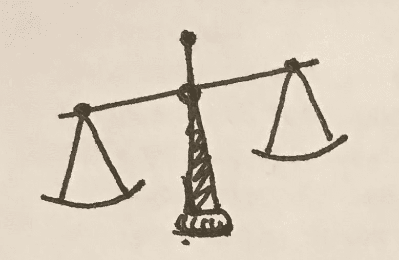

# 智能事物的伦理中心

> 原文：<https://medium.datadriveninvestor.com/the-ethical-center-of-your-smart-things-ed4483c216d0?source=collection_archive---------9----------------------->

目前有一种观点认为，人工智能系统和智能物体应该被编程为具有基于云的“道德意识”。这种程序化的是非观使它们能够报告主人的非法活动。

现在，这种想法可能针对的“非法活动”类型将是家庭暴力、入室抢劫等。这是一个高尚的想法。如果有人破门而入或者争吵升级到伤害，你的助手可以帮你报警。但是我们已经有了这种技术的“笨”版本。这叫做警报系统。如果被触发，它可以/会给你的报警公司打电话，一个活生生的人会打电话来决定是否需要警察介入。但这里的关键是一个活生生的人打这个电话，而不是基于云的人工智能。

允许你的助手对你的家庭活动做出决定很快就变成了一种只能以眼泪收场的监视状态。当外面很安静，你一个人在家时，消费级语音命令只能勉强接受足够的听写来运行谷歌搜索。你可以试着和 Siri 说话，或者在一屋子健谈的 10 岁孩子之间或者在一场家庭大讨论中用谷歌搜索。他们不具备(可能永远不会具备)仅基于音频信息分析一个人活动的保真度，当然也达不到做出判断所需的水平。

> [DDI 编辑推荐——学习构建亚马逊 Alexa 技能&与机器对话](http://go.datadriveninvestor.com/alexa1/matf)

永远要记住的是，智能设备和相关物品应该让我们的生活变得更简单。它们应该让我们以高于平均水平的效率运作，在我们没有牛奶时提醒我们，或者找到如何打亨萨克结的指导。判断不应该介入此事。我们不期望他们评判我们的购物选择，或者提醒我们这个星期我们已经在家里开了 4 个小时的暖气，这两项任务都在这些助手的能力范围之内。

但是，有理由证明情有可原。如果你的亚马逊 Alexa 可以告诉你，你正在用厨房的勺子打你的孩子，那么也许应该报警。这比让你的隔壁邻居报警更糟糕吗？因为他们能透过你公寓薄薄的墙壁听到你的尖叫。但是，你可能会说，警察是活生生的人，一旦他们到达现场，肯定会做出明确的决定。你的助手只是触发呼叫，而不是做出判断。

但是当一台计算机向一个活生生的人传递信息时，人们会更加认真地对待它。许多人对信任机器有一种根深蒂固的反应，因为机器不容易受到情绪反应的影响。机器不能用种族偏见或糟糕的观察技能来影响它的决定。机器(就大多数人而言)是无辜的、合乎逻辑的、事实的。

我们这些技术人员知道这是一个谎言，但你不是在和技术人员打交道。你面对的是警察和人们，他们对人工智能的印象基本上是由电影和电视塑造的。他们是消费者，从消费者的角度理解机器应该是多么可靠。

因此，根据机器指示的紧急程度，一队警察被派出。如果电脑判断这是一个值得报警的紧急事件，那么警察就会假定电脑是正确的。他们不会有额外的关心和谨慎，可能会去回应一个善意但有缺陷的人类邻居的电话。

人类状况的一部分是判断的艺术。除了极少数例外，每一条规则都是可以变通的(经常是为错误的人变通，或者只为某些人变通而不为其他人变通，但那是另一个不同的讨论)。这就是为什么我们有“法律的文字”和“法律的精神”之间的辨别力。这些例外几乎总是基于生活经验。这就是为什么我们用陪审团来评判人们。那些不得不付房租、买杂货、有坏老板的人，他们了解所有相关的微观压力，会驱使一个人选择选项 A 而不是选项 b。

如果我们放弃这个决策。如果我们允许一个非模糊的机器，一个没有这些日常生活中的共同点的机器，我们正在改变我们社会的本质。

我认为我们还没有准备好。我不认为这种改变对我们，对整个人类都有好处。如果我们放弃了我们的判断，那么我们就放弃了让人类能够一起工作的东西。

所以，对于那些呼吁在我们的家用设备中安装“道德决策”的人，我要说的是，别再敲了。就像我拥抱未来一样；在未来，机器智能旨在改善我们的生存状态，我觉得我们离开发一台与我们有足够共同点来理解我们的机器还有很长的路要走。如果你不能理解我们，你怎么能判断我们呢？