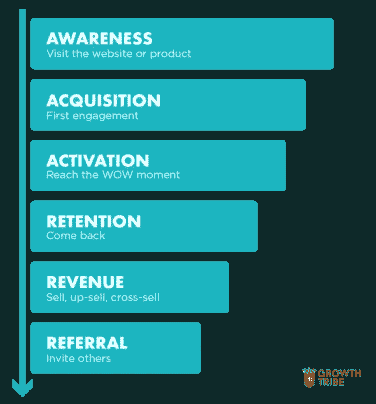
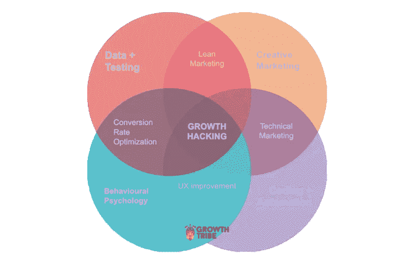
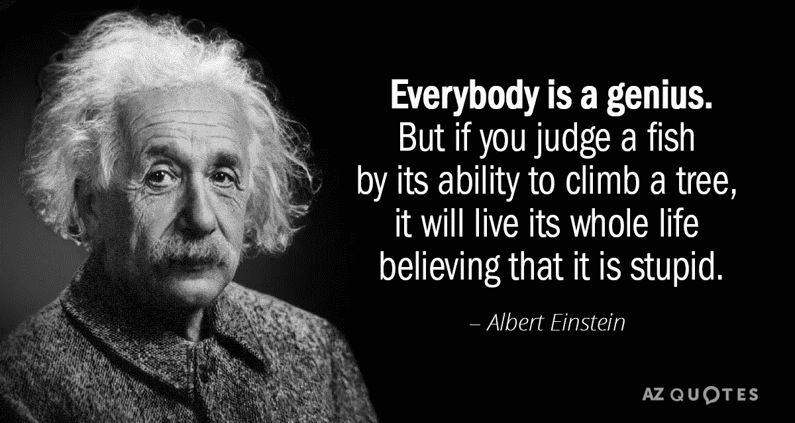
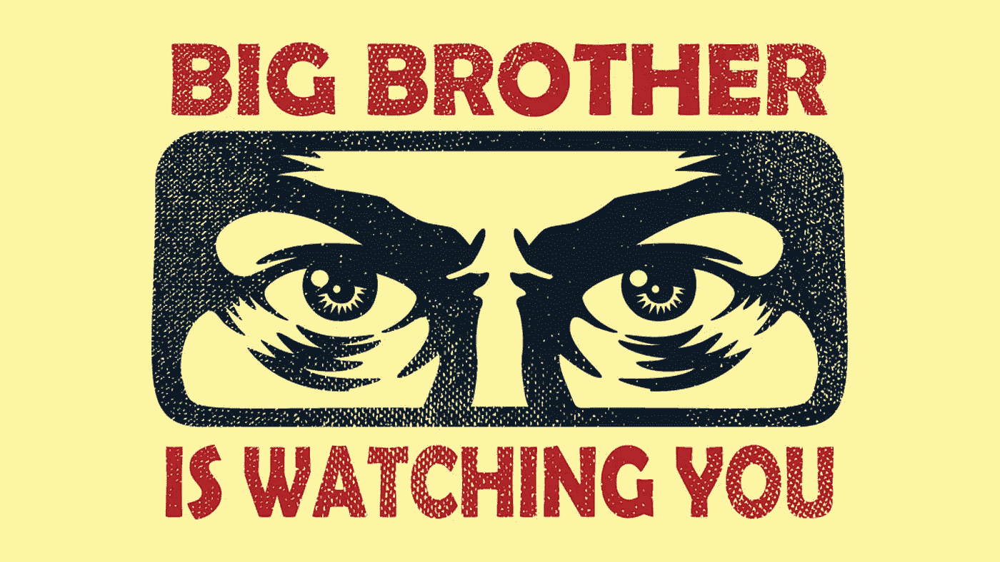

# 政治增长黑客的伦理

> 原文：<https://medium.datadriveninvestor.com/the-ethics-of-political-growth-hacking-72b340a84f4e?source=collection_archive---------11----------------------->

[source](https://www.motherjones.com/politics/2019/07/justice-democrats-indivisible-netroots-pelosi-aoc-tension/)

自从剑桥分析公司丑闻以来，我一直在考虑创办一个增长黑客机构，为那些试图改善世界的小人物创造动力。

想象一下用增长黑客的力量为非政府组织如[大赦国际](https://www.youtube.com/watch?v=RoWuZRBDHfY)或者为[当前的香港革命](https://www.youtube.com/watch?v=VfmR54giIJA)创造更多的支持。

 [## 保护主义、政治和经济动荡|数据驱动的投资者

### 美国股市昨日出现 400 多点的大幅反转，为未来的事情发出了警告信号。市场…

www.datadriveninvestor.com](https://www.datadriveninvestor.com/2018/06/28/protectionism-politics-economic-turmoil/) 

# 强大的

不要低估增长黑客在政治中的力量。

塞缪尔·J·伍兹(Samuel J Woods)、[乔纳森·奥弗雷(Jonathan Aufrey)](https://www.growth-hackers.net/donald-trump-growth-hacking/)、[塔鲁奎尔·汗(Taruquel Khan)](https://medium.com/@opu/five-marketing-growth-hacks-from-donald-trump-7470e26ebf2a)，我同意特朗普在总统选举中使用了增长黑客技术。我相信他正在利用政治增长黑客来巩固他的权力地位。

相比之下，草根运动利用这种力量来改变竞争环境，就像网飞的纪录片[推倒房子](https://www.youtube.com/watch?v=_wGZc8ZjFY4)中的[亚历山德拉·奥卡西奥·科尔特斯](https://www.youtube.com/watch?v=TJlpS4vhKP0)不顾一切地击败了当权派。

或者 [Joshua Wong](https://www.youtube.com/watch?v=7lN9_mQq2mQ) ，他利用社交网络煽动香港民众进行[雨伞革命](https://www.youtube.com/watch?v=6HxbHY86CZc)反对中国人的压迫。

# 生长黑客解释说

增长黑客是营销和销售之间的空间。

我们是让人们说服自己购买产品和服务的人。

在《增长黑客》中，我们有一个精益的心态:

a)除非有数据证明，否则所有陈述都是假设。

b)数据从不说谎，但人们可以看到无用的统计相关性。

c)当某样东西起作用时，你就从实验转向优化。

我们有实际的增长黑客。

我们用实验来测试盗版营销漏斗中的每一个假设。

[source](https://growthtribe.fr/growth-hacking-academy/2-day-crash-course)

当这些实验的结果是决定性的，我们创建内容，增强显示，自动化过程等。，提高转化率。

不要混淆增长黑客和数字营销，因为我们同时在多个领域开展业务。

[source](https://www.sprout.nl/artikel/growth-hacking/dit-moet-je-weten-over-growth-hacking)

# 道德

正如你在政治例子中看到的，增长黑客可以改变世界。

但是积极影响大众观点有许多道德含义:

*   是否应该允许一群人推动一个群体做出“更好”的决定？
*   这种更好的世界观不是天生就有偏见吗？
*   危险能超过好处吗？

# 推动

所以改变行为对大多数人来说很难。

我们是喜欢顺应现状的常规动物。

自帝国诞生以来，政治学就质疑社会中的“知识分子”应该保护那些不太知情的人免受伤害的观点。

这个世界上所有的独裁者都按照人民的意愿行事，

中国的正式名称是中华人民共和国；同样，俄罗斯被称为俄罗斯联邦。

“极权主义”政府用古罗马的面包和游戏原则来证明权力的支配地位。

换句话说，用经济收益或军事征服来取悦你的人民。

在阅读了大量的哲学和生物学之后，我得出结论，智力上的差异是一个骗局。

每个人都可以战胜自己内心的恶魔，在生活的所有消极方面都可以找到教训。

问题在于关于谁聪明谁不聪明的集体思维。

[source](https://www.azquotes.com/quote/369274)

我强烈主张消除制度和教育上的障碍。

在过去，你的工作能力取决于你的技术水平，而不是花哨的平均绩点。我对招聘机构的建议是，寻找独创性而非行业优势，寻找精通经验。

当我们推动人们有更高层次的意识时；我们允许人们改善他们的生活方式，让他们超越自我。

因此，当政治增长黑客的动机是为了提高大众的意识水平时，应该被允许。

# 偏见

> 我们无法逃脱人类的偏见，因为有太多的思维陷阱，我们关注的对象不断变化。

因此，政治增长黑客攻击是有偏见的。

乔治·奥威尔的反乌托邦小说 *1984* 创造了灌输是邪恶的形象。

在我看来，我们应该翻转这张图片以获得正面效果。

Photo by [Jyotirmoy Gupta](https://unsplash.com/@jyotirmoy?utm_source=unsplash&utm_medium=referral&utm_content=creditCopyText) on [Unsplash](https://unsplash.com/search/photos/meditation?utm_source=unsplash&utm_medium=referral&utm_content=creditCopyText)

如果我们教导孩子恐惧并不存在，因为我们强化了他们的身体、思想和灵魂；例如，通过武术训练、冥想和自我发现。

这种学到的教条会是一种犯罪吗？

对我来说不是，我们不应该让孩子按照 18 世纪的思维发展，而是应该让他们为现代生活做好准备。

现代生活不是关于信息记忆，而是快速学习。

我们不应该教导我们的孩子成为我们社会体系中最优秀的人，而是应该教导他们变得真实可信。

> 我们已经忘记了意义是激励我们的力量，而不是财富、成功或认可。

> 因此，偏见应该被用来根除这个世界上的恐惧、愤怒和焦虑。

我不主张抑郁症不存在。

但是我相信，如果我们用我们的思想和感情创造一个脆弱和开放的全球空间，我们就能减少痛苦。

再加上鼓励人们健康饮食、锻炼和冥想习惯，抑郁率将会显著下降。

# 危险

对于任何仍然天真的人来说，你可以在脸书观众工具中看到几乎所有的东西，比如政治派别、婚姻状况等等。

谷歌更惨；据我说，他们追踪你的位置，并通过谷歌助手监听，没有征求你的同意。

我曾经有过很多次，当我说话的时候，谷歌助手就会打开。我的最新发现是，当有人在我用扬声器听的播客上说了些什么时，谷歌助手就开始了。

> 所以，恕我直言，隐私已经不存在了，很多年了。

醒醒吧，接受你的数据只是现实中许多镜头的一个片段。总会有人利用你的个性。

数据是中性的，没有好坏之分。

比如因为数据，你可以和 LinkedIn 上最好的工作机会匹配。

但是数据也可能被用来对付你，因为谷歌会对你的搜索进行个性化处理，让你呆在自己的信息泡泡里。

[source](https://www.panmacmillan.com/blogs/literary/george-orwell-quotes-1984-animal-farm)

创建一个政治增长黑客机器在独裁者手中可能是危险的。

我打赌他们已经在用它了，所以我们应该用它来解决全球问题。我们应该为气候变化、政治变革、动物灭绝意识、亚马逊森林砍伐筹集更多的资金。

增长黑客技术的进步来自金融界(加密货币、风险资本家、银行)、营销界(设计机构和营销咨询)和数字企业(初创企业、扩大规模企业、跨国公司)

> 增长黑客的破坏性影响可以创造一个人间天堂。

但前提是我们要禁止像[误传](https://www.youtube.com/watch?v=qRrAPKOhHL0)、[投机](https://www.youtube.com/watch?v=LtITDtZPYEw)或[假跟风者](https://www.youtube.com/watch?v=ahqFg9CK5mU)这样的成长型黑客行为的发展。

# 问题

> 只有当你彻底接受你当前的状态时，你才能成长。

以下是一些需要反思的问题。

你能接受增长黑客不再被排除在政治之外的事实吗？

你看到了吗, [GDPR](https://www.youtube.com/watch?v=j6wwBqfSk-o) (通用数据保护条例)不会阻止公司滥用你的数据，除非他们被当场抓住。

你同意政治增长黑客应该被用于增加地球上所有居民的意识吗？

*注意:这篇博文包含了许多观点和主张。我有两年自由成长黑客的背景，帮助初创企业、自由职业者和组织。这些是我的观点，你可以用来作为思考的工具。*

*这篇博文是 30 天博客挑战*的第 22 篇