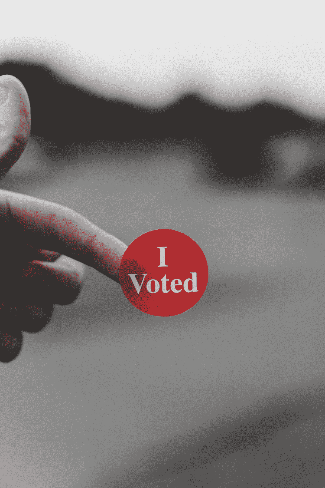
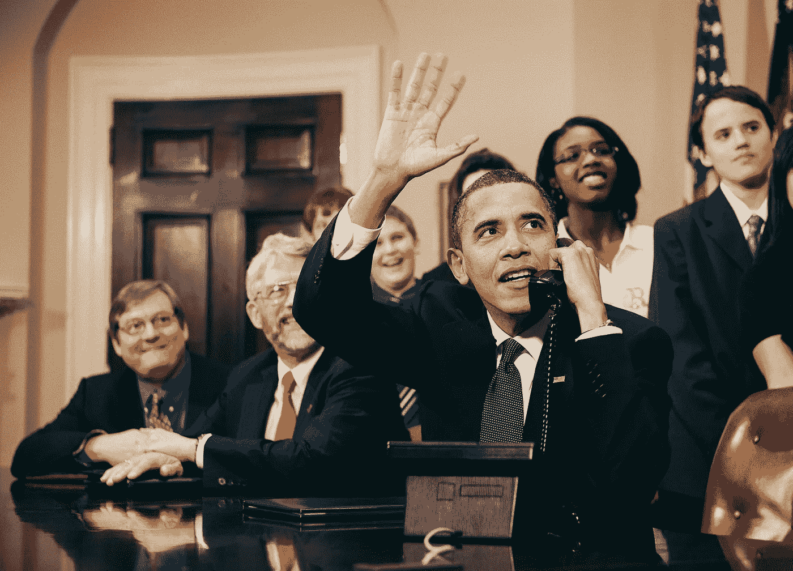
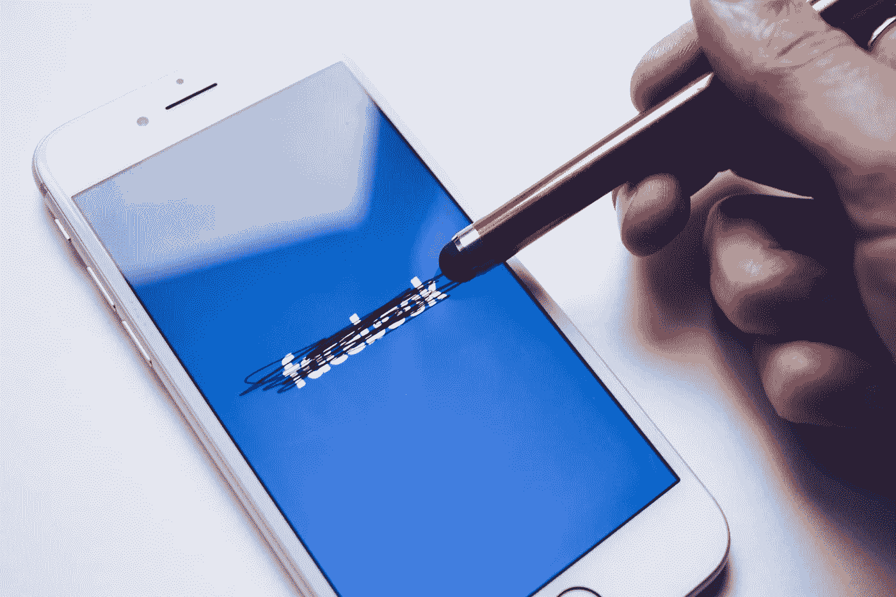
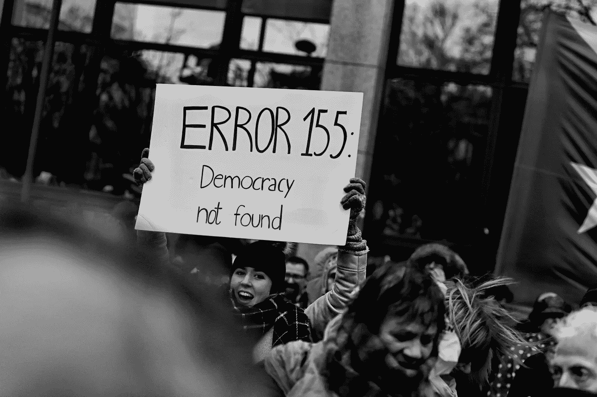

# 政治微观目标的伦理

> 原文：<https://medium.datadriveninvestor.com/the-ethics-of-political-micro-targeting-c3b0be245607?source=collection_archive---------0----------------------->

# 概观

事实上，大数据时代已经来临。在带来诸多好处的同时，它也制造了新的问题，“政策真空”和不可预见的挑战。其中许多问题都围绕着隐私和访问个人数据的权限。我们大多数人都很清楚营销的力量，以及它如何塑造我们的决定——从我们购买的汽车、鞋子和衣服到我们听的音乐——但这些策略如何被用来塑造我们国家的政治就不那么明显了。在我们开始之前，重要的是要注意，我们必须从伦理的角度观察以下问题，所有人都被认为是平等的。这一点，再加上我们天生对不公正和偏见的敏感性，对于帮助我们识别潜在的伦理问题至关重要(Bynum，2004，第 80-81 页)。

在信息时代之前，政治广告相对稀少，而且就像你想象的那样简单。在 1948 年的总统竞选中，哈里·杜鲁门据说行程超过 31000 英里，和 50 多万人握手。德怀特·戴维·艾森豪威尔是第一批利用第二十二届电视广告的总统之一，他的“艾森豪威尔回答美国”营销活动非常成功(Suggett，2016)。但是自然地，随着信息时代的发展，基于数据的营销占据了主导地位，政治广告也随之发展。

比尔·克林顿是第一位有效利用非传统广告形式的总统，比如出现在日间脱口秀和 MTV 上(Suggett，2016)。这是一个非常进步的方法，但巴拉克·奥巴马在 2012 年大选中真正改变了这一范式。如果他的 2008 年竞选活动是由社交媒体定义的，那么他的 2012 年竞选活动是由数据科学和微定位定义的。营销活动基于两种策略:针对对手米特罗姆尼的负面广告，以及在关键摇摆州动员 18-24 岁的美国黑人、拉丁美洲人和单身女性。这四种人口统计的投票率高达 70%，有效地为他赢得了选举(Young，2012)。这种策略的主要工具是所谓的微定位。

一般来说，“微定位是一种营销策略，它利用消费者的人口统计学、心理学、地理和行为数据来预测他的购买行为、兴趣、观点，并在超目标广告策略的帮助下影响该行为”(Pawha，2018)。当应用于政治时，微观目标是将选民细分为非常具体的群体并为他们定制信息的能力。澄清一下，奥巴马竞选团队并不是第一次使用微观定位的竞选团队。布什竞选团队利用微观定位帮助他赢得了 2000 年和 2004 年的选举，但奥巴马竞选团队在更大的规模上实施了微观定位(Young，2012)。他们建立了一个由行为科学家和数据科学家组成的大型分析团队。他们建立的档案包括选民历史、人口统计和基于个人兴趣的大量数据点，以帮助他们确定目标“可说服”群体。这些数据是通过*奥巴马支持美国*应用程序挖掘的，该应用程序被超过一百万人下载(Tobias，2018)。

当你读这篇文章时，你可能会把 2012 年奥巴马竞选和最近的*脸书* x *剑桥分析*丑闻联系起来。那是因为基本方法确实是一样的。2014 年 6 月，亚历山大·科岗为脸书制作了一款个性测试应用。大约有 27 万人在他们的脸书账户上安装了这个应用程序(Meyer，2018)。有趣的是，根据脸书当时的 API 数据访问规则，科岗的应用不仅可以访问他的应用用户的数据，还可以访问他们的朋友的数据。虽然理论上奥巴马竞选团队也可以访问用户朋友的数据，但他们没有像科岗和剑桥分析公司那样使用这些数据；科岗的应用程序没有立即删除数据，而是将数据存储在一个私人数据库中。这个私人数据库后来被提供给选民分析公司 Cambridge Analytica，他们随后制作了 3000 万份选民的“心理分析”资料。

这些心理工具被用于为英国退出欧盟“离开”竞选活动、2016 年特德·克鲁兹竞选活动和 2016 年川普竞选活动制作微定向在线广告(Meyer，2018)。那么，如果剑桥分析公司使用了与 2012 年奥巴马竞选活动类似的策略，那么为什么公众和媒体对剑桥分析公司的反应是负面的，而对 2012 年奥巴马竞选活动的反应是正面的？有人称之为双重标准。

# 双重标准？

约翰·麦凯恩的这句话反映了大多数保守媒体的观点:

> “这发生在奥巴马执政时期，被媒体称赞为天才，现在在特朗普竞选下，这是剑桥分析丑闻”(Tobias，2018)。

他是对还是错？是这种特定应用的微定位不好，还是所有的微定位都不好？通过本文的其余部分，我将对政治微观目标进行伦理分析；特别是剑桥分析公司做的微定位。为此，我将把 2012 年奥巴马的竞选策略与剑桥分析公司(Cambridge Analytica)的策略进行比较。具体来说，我将从两个不同的伦理视角来分析它:*功利主义*——主要由杰里米·边沁和约翰·斯图亚特·穆勒提出——和*义务论*——最初由伊曼纽尔·康德描述。

微定位之所以特别有趣，是因为它在许多不同的领域引起了轩然大波:伦理、计算机科学、市场营销、数据科学以及我们国家的公共政策。《剑桥分析》的问题如此广泛，以至于马克·扎克伯格不得不在国会作证。最近的这些事件造成了一种政策真空。目前的法律相当不透明，尤其是当数据在国家之间转移时，而且没有政策明确指导这种方式。我的第一个想法是，微定位并不是天生不道德的。因此，真正的问题在于细节。数据是如何被访问的？数据是如何使用的？就我个人而言，如果知道我的个人信息被用来——未经我同意——对我进行微操作，以此作为影响我政治观点的手段，我会感到不安。*政治*微观目标选择似乎是一个比一般微观目标选择更敏感的问题，因为人们几乎普遍尊重选择投票的自由。我们的国家就是建立在这个原则之上的；没有选择的自由，那投票还有什么意义？

功利主义的一个基本启发是“最大多数人的最大利益”(Anderson，2014)。因此，我们必须考虑政治上的微观定位——以及奥巴马竞选团队和剑桥分析公司应用这种定位的方式——是否利大于弊。对于义务论来说，基本原则是总是遵循你希望每个人都遵循的规则，而不要把理性的存在当作仅仅是东西(拜纳姆，2004 年，第 87 页)。

# 数据是如何被访问的

首先，让我们分析一下数据是如何被访问的。如前所述，奥巴马竞选团队通过下载超过一百万次的*奥巴马支持美国*应用程序来获取数据(Tobias，2018)。从功利主义的角度来看，这似乎有利于几乎所有相关的人。奥巴马和他的团队受益，因为他们获得了应用程序下载和与潜在选民联系的机会，他的支持者受益，因为他们获得了他们可能希望访问的应用程序(他们注册了，对吗？).2012 年奥巴马竞选在线组织指南贝琪·胡佛说:

> 任何个人都可以决定使用这个应用程序。当他们点击应用程序时，会弹出一个屏幕，显示他们授权应用程序让我们访问哪些数据，以及我们将如何使用这些数据。所以在那个时候，脸书说你让我们访问你的社交网络是完全合法的。你让我们接触你在脸书的朋友。(胡佛，2018 年)

一个问题是，应用程序用户的朋友没有允许奥巴马竞选团队使用他们的数据。然而，从功利主义的角度来看，可以认为这些人没有受到伤害，因为结果只是一个脸书朋友推荐的 *Obama for America* 应用程序的一条消息；可能有点小麻烦，但没什么害处。所有用于建立微观目标模型的非脸书数据都是用明显的“白帽”数据建立的:民主党竞选活动使用的来自选民历史数据的数据点(Tobias，2018)。从道义论的角度来看，奥巴马竞选团队似乎遵循了他们希望所有人都遵守的规则。一切都是“照章办事”，符合脸书当时的政策。然而，可以说奥巴马竞选团队*使用*他们的应用程序用户作为联系“有说服力的人”的手段按照道义标准，这可能被视为不道德。接下来，我们来分析一下剑桥分析公司是如何访问他们的数据的。

与奥巴马竞选活动类似，剑桥分析公司也使用了一款应用来挖掘数据。然而，与*的奥巴马支持美国*应用不同，剑桥分析应用的用户并不知道他们的数据会被用来帮助任何政治活动。这款应用被简单描述为一个性格测试，将由剑桥大学的研究人员使用。随后，剑桥大学的一名研究人员(亚历山大·科岗)将这些数据卖给了政治咨询公司剑桥分析公司。最后，剑桥分析公司将他们的服务卖给了特德·克鲁兹竞选团队、Thom Tillis 参议院竞选团队、Trump 竞选团队以及其他一些人。很快，脸书发现这些数据在未经用户同意的情况下被共享，他们要求最初的个性应用程序和剑桥分析公司删除这些数据。数据没有被删除(Tobias，2018)。

从功利的角度来看，这是谁帮的忙？科岗通过出售数据获得了金钱上的利益，剑桥分析公司则通过获取数据用于他们的咨询服务。然而，许多人也受到了伤害。脸书因其宽松的数据隐私政策而受到公众的愤怒，数千名原创个性应用程序用户被公然欺骗。然而，最受伤害的可能是这些原始应用用户的朋友，因为他们的数据在没有得到任何同意的情况下被出售。就我个人而言，我发现很难量化这种“伤害”，尤其是因为朋友们已经把他们的数据给了脸书。

从道义论的角度来看，很明显亚历山大·科岗和《剑桥分析》都不道德地将人作为达到目的的手段。科岗用他的应用程序挖掘数据，然后卖给剑桥分析公司，目的与最初的个性应用程序完全不同；公众被误导了。最明显的伦理问题是，科岗和剑桥分析公司都没有在脸书要求后删除数据。接下来，让我们更深入地了解数据的实际使用情况。

# 数据是如何被使用的

在奥巴马竞选的例子中，微定位被用来负面宣传对手米特罗姆尼，并向*奥巴马为美国*应用程序用户推荐他们应该向他们的哪些朋友发送竞选消息(最“可说服”的朋友)。有趣的是，虽然奥巴马竞选团队理论上可以访问他们的应用程序用户的朋友数据，但他们并没有直接使用这些数据进行微观定位。相反，他们将脸书数据与他们自己的模型(用非脸书数据创建)中的数据进行匹配，以确定“可说服性”(Tobias，2018)。从功利主义的角度来看，这似乎让奥巴马和他的团队、奥巴马的支持者以及大多数使用*奥巴马为美国*应用的人受益。另一方面，这可能伤害了罗姆尼和他的团队，罗姆尼的支持者，以及任何对通过应用程序接收信息感到困扰的“可说服的”朋友。

从义务论的角度来看，数据被用来推荐一个“可说服的朋友”列表以向其发送消息似乎不是一个问题，因为这似乎是一个普遍规则(如果你知道我可能喜欢某样东西，你就有权告诉我的朋友我可能喜欢它)。然而，这肯定是有限度的(我不希望你为了了解我可能喜欢的东西而监视我，这样你就可以告诉我的朋友我可能喜欢某些东西)。此外，如前所述，可以认为*奥巴马支持美国*应用程序的用户被用作联系更多可能选民的手段。“可说服的”一词本身表明，这些人被利用仅仅是因为他们容易被说服投票。相比之下，让我们考虑一下剑桥分析如何使用数据。

剑桥分析公司(Cambridge Analytica)利用脸书的数据结合个性调查结果，建立了“心理特征”档案，用于微观定位。这种微定位是他们向政治家出售的咨询服务的一部分(Tobias，2018)。奥巴马竞选团队使用数据的方式和剑桥分析公司使用数据的方式之间的显著区别是，剑桥分析公司直接针对应用程序用户的朋友。或者，奥巴马竞选团队使用他们的*奥巴马支持美国*应用程序来推荐*应用程序用户*可以锁定的“可说服的”朋友。

从功利主义的角度来看，受益最大的是雇佣剑桥分析公司提供咨询服务的政客，以及他们的间接支持者。本质上，他们获得了一个非常有价值的营销工具。另一方面，这种数据的广泛使用继续玷污脸书的声誉，数百万人的隐私受到严重侵犯。从道义上来说，很明显剑桥分析公司利用这些人来建立心理特征，然后卖给政客。这些人被货币化，他们的数据未经同意就被出售和使用。虽然可以说奥巴马竞选团队也利用了人，但剑桥分析公司的规模更大，方式也更迂回。

# 判决

在我对 2012 年奥巴马竞选的微定位分析中，没有什么让我觉得特别不道德，所以让我们把注意力集中在剑桥分析公司(Cambridge Analytica)的微定位上。首先，功利主义的观点似乎可以用来证明任何政治微观目标的合理性(不管数据是如何被访问或使用的)。当然，你可能会侵犯一些人的隐私，但这些“个人资料”可以作为一种无价的营销工具，让许多人受益。此外，似乎很难量化有人利用你已经提供给脸书的数据所造成的伤害。危害有多大；是否可以忽略不计？尽管如此，我不认为功利主义是适用于这种情况的适当的伦理框架。

当应用于政治微观目标时，功利主义观点在这里并不太有用，因为很难从道德上证明未经同意使用私人数据所获得的“好处”。似乎采取道义论的视角更合适。从义务论的角度来看，剑桥分析公司访问和使用他们数据的方式显然是不道德的。人们以许多不同的方式被用作达到目的的手段，我怀疑是否有任何像样的论点可以证明他们遵循了“每个人都应该遵循的普遍规则”。政客们利用剑桥分析公司作为确保政治权力的手段，剑桥分析公司利用人们的私人数据作为增加政治咨询服务深度的手段。这个链条可以一直追溯到科岗、脸书和个性应用。因此，政治微观目标并非本质上不道德，而是脸书和剑桥分析所应用的不道德。

# AAPC 道德准则

这一结论得到了美国政治顾问协会(AAPC)职业道德准则的进一步支持。《剑桥分析》的微观目标实践明显违反了第一条规则:“我不会沉迷于任何腐败或贬低政治咨询实践的活动”(加入 AAPC)。显然，在公众和相关专业人士看来，剑桥分析公司所做的活动破坏了政治咨询的实践。也可以说，雇佣剑桥分析公司的政客违反了第九条规则:“我不会支持任何诉诸本准则所禁止的做法的个人或组织”(加入 AAPC)。

将奥巴马的竞选策略与剑桥分析公司的策略进行比较是有益的，因为它描绘了一个逐渐的转变，在这个转变中，奥巴马的竞选活动大部分是在界限内进行的，而剑桥分析公司显然突破了隐私的界限。从一个角度来看，这是有益的，因为它充当了一种“叫醒电话”举个例子，这次失败促使脸书收紧了他们的数据隐私标准。在 NPR 的一次采访中；北卡罗来纳大学媒体与新闻学院的教师丹尼尔·克里斯说:

> 关于这个丑闻的事情是，它将许多人们不知道的事情带入了公众的视野，这些事情只是标准的操作和做事方式。你知道，人们会有点害怕。(克瑞斯，2018)。

总之，分析政治微观目标的伦理需要深入探究数据是如何被访问和使用的。当应用于剑桥分析微观目标时，道义论的观点——认为他们的活动不道德——似乎是最合适的。虽然功利主义的观点*可以被用来为他们的行为辩护，但我发现承认科岗未经同意出售数据和剑桥分析公司未经同意建立心理特征所获得的“利益”在道德上应该受到谴责。*

展望未来，我们的国家有必要全面制定数据隐私法，以保护我们的政治体系不被微目标利用。需要建立明确的界限，以便两个政党(共和党和民主党)都意识到界限和后果。微观目标，当与交易政治(一个团体承诺为某人做这件事，如果有人为他们做那件事)结合在一起时，可能会导致我们政治的“游戏化”。这不是我们应该前进的方向。

# 参考

k .安德森(2014 年 12 月 22 日)。功利主义:最大多数人的最大利益。检索自[https://probe . org/utilitarism-the maximum-good for the maximum-number/](https://probe.org/utilitarianism-the-greatest-good-for-the-greatest-number/)

拜纳姆，T. W. (2004)。计算机伦理中的伦理决策和案例分析。在*计算机道德和职业责任*(第 80-85 页)。布莱克威尔出版社。

胡佛，B. (2018 年 3 月 25 日)。《剑桥分析》(Cambridge Analytica Flap)与奥巴马的竞选战术相比如何？【l·加西亚-纳瓦罗采访】。检索自[https://www . NPR . org/2018/03/25/596805347/how-does-Cambridge-analytic a-flap-compare-with-Obama-s-campaign-tactics](https://www.npr.org/2018/03/25/596805347/how-does-cambridge-analytica-flap-compare-with-obama-s-campaign-tactics)

加入 AAPC。(未注明)。从 https://theaapc.org/member-center/code-of-ethics/[取回](https://theaapc.org/member-center/code-of-ethics/)

kreiss d .(2018 年 3 月 22 日)。剑桥分析公司丑闻引发了关于微观目标的新的伦理问题。检索自[https://www . NPR . org/2018/03/22/596180048/Cambridge-analytic a-smoke-raises-new-ethical-questions-about-micro targeting](https://www.npr.org/2018/03/22/596180048/cambridge-analytica-scandal-raises-new-ethical-questions-about-microtargeting)

r . Meyer(2018 年 3 月 20 日)。剑桥分析丑闻，在 3 个简短的段落。检索自[https://www . thealantic . com/technology/archive/2018/03/the-Cambridge-analytic a-smoke-in-three-paragraphs/556046/](https://www.theatlantic.com/technology/archive/2018/03/the-cambridge-analytica-scandal-in-three-paragraphs/556046/)

Pahwa，A. (2018 年 2 月 24 日)。什么是微观目标？从 https://www.feedough.com/what-is-microtargeting/[取回](https://www.feedough.com/what-is-microtargeting/)

Suggett，P. (2016 年 11 月 7 日)。看看我们政治广告的历史。检索自[https://www . the balances careers . com/a-brief-history-of-political-advertising-in-the-USA-38925](https://www.thebalancecareers.com/a-brief-history-of-political-advertising-in-the-usa-38925)

Tobias，M. (2018 年 3 月 22 日)。比较脸书数据的使用。检索自[https://www . politifact . com/truth-o-meter/statements/2018/mar/22/Meghan-McCain/comparing-Facebook-data-use-Obama-Cambridge-analyit/](https://www.politifact.com/truth-o-meter/statements/2018/mar/22/meghan-mccain/comparing-facebook-data-use-obama-cambridge-analyt/)

Young，A. (2012 年 11 月 20 日)。数据和微观定位如何为奥巴马赢得 2012 年选举。检索自[https://www . media village . com/article/how-data-and-micro-targeting-won-the-2012-election-for-Obama-Antony-young-mindshare-north-America/](https://www.mediavillage.com/article/how-data-and-micro-targeting-won-the-2012-election-for-obama-antony-young-mindshare-north-america/)