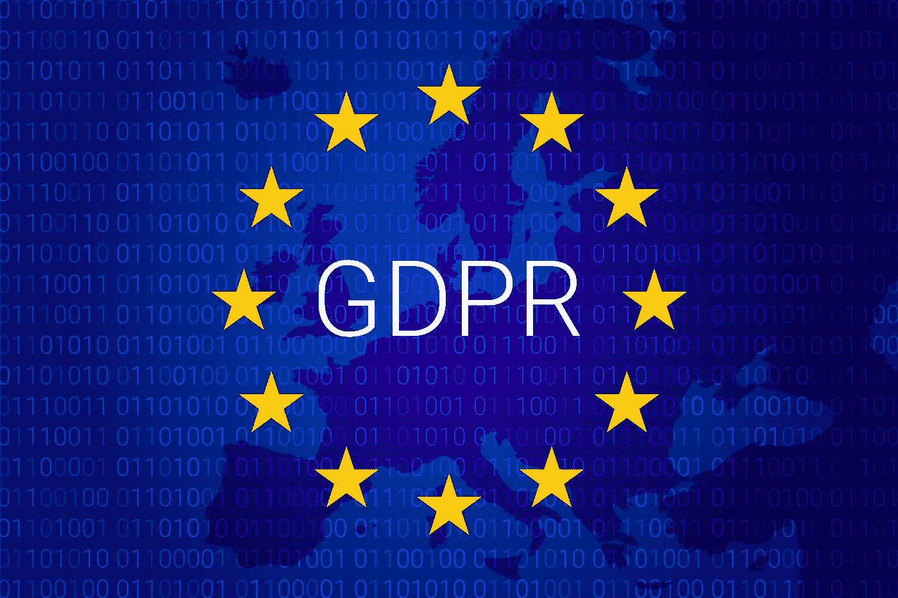

# 欧盟通用数据保护条例和区块链

> 原文：<https://medium.datadriveninvestor.com/the-eu-general-data-protection-regulation-and-the-blockchain-bc1c50186340?source=collection_archive---------1----------------------->

欧盟的[通用数据保护条例](http://eur-lex.europa.eu/legal-content/EN/TXT/PDF/?uri=CELEX:32016R0679&qid=1490179745294&from=en)([GDPR](https://www.eugdpr.org/eugdpr.org.html))将于 2018 年 5 月 25 日生效，并将要求处理欧盟公民数据的企业考虑加强隐私保护。其中重要的变化包括**删除权**，也被称为“被遗忘权”或永久删除用户数据的权利**数据可移植权**(向服务提供商提供个人数据的人可以要求该提供商将数据“移植”到另一个提供商)以及**反对分析的权利**(不受仅基于自动化处理的决定影响的权利)。

GDPR 旨在保护数据隐私，包括:姓名、地址、联系方式、生物特征数据、种族/民族数据、政治观点、网络 IP 地址、Cookie 数据、位置等。

被发现不遵守新法规的组织可能会因滥用、利用、错误处理个人信息等行为而被罚款，例如，遭受数据泄露的公司必须在得知此事后 72 小时内通知其客户，否则将面临罚款的风险。

鼓励公司更新其**服务条款**和**隐私政策**以包括:

*   额外关注控制个人数据；
*   与其他企业(商业伙伴)共享个人数据的透明度和控制；
*   以及如何共享数据以防止伤害、遵守法律和服务公众利益的清晰性。

*哪些公司属于 GDPR？*

*   存储或控制欧盟公民数据的公司，无论该公司是否在欧盟境内，都容易受到 GDPR 法规的影响。
*   员工超过 250 人的公司。
*   员工少于 250 人，但数据处理系统可能影响欧洲居民的公司。

*企业必须实施哪些变革？*

Systweak.com 认为，公司必须采取各种方法，例如:

*   确保有一个安全的地方存储敏感数据和数据加密。
*   确保使用的任何服务提供商也符合 GDPR。
*   向[信息专员办公室](https://ico.org.uk/)(**ICO**)报告信息，如果发生违规行为(在 72 小时内)。
*   随着问题的出现和人们越来越意识到自己的隐私权利，保持与时俱进。
*   任命一名数据隐私官(“ **DPO** ”)，以确保合规和保护，同时避免利益冲突。
*   修订和更新您的数据保护计划，使其符合 GDPR 要求。
*   GDPR 允许用户完全透明，以努力避免类似**剑桥分析公司**滥用脸书用户数据的情况。因此，用户可以要求公司更正或删除他们的数据，这种要求必须及时兑现。
*   这个[网站](https://gdprchecklist.io/)也为公司提供了一个有用的工具。

*GDPR 将如何影响区块链技术？*

被遗忘权对《区块链公约》的实施提出了挑战，因为《区块链公约》基本上是为永久持续而设计的。它的基本元素是“哈希”，这意味着存储的数据不能被反向工程或更改。这允许引用先前的块，并且不能以改变整个链的风险来改变它们。[Venturebeat.com](https://venturebeat.com/2018/05/23/how-to-design-a-gdpr-compliant-blockchain/)通过**加密**为这一挑战提供了一个可能的解决方案。

> *“用密钥加密所有个人数据，并应擦除请求删除密钥，会使任何人都无法访问这些数据，通俗地说，这等同于删除。然而，GDPR 并没有定义“抹去”什么意思，所以在没有定义的情况下，法律上的一致性倾向于回到对一个词的字面理解*

GDPR 不禁止区块链，但它提出了一些程序要求。由于这项技术仍处于早期阶段，符合 GDPR 标准的区块链企业很可能将开始商业化。像微软和英特尔这样的公司已经加入了 GDPR 边缘的分布式区块链解决方案平台来提供技术支持。该平台的一名代表说:

> *“数据保护机构、审计人员和数据治理专业人员以及任何其他数据收集者或处理者都可以使用这个集中的存储库，这意味着增加了问责制、信息透明度、准确性、效率和可听度。”*

虽然修改区块链上的数据确实非常困难，而且许多人认为 GDPR 与区块链技术不兼容，但是随着 GDPR 的生效，除了在两者之间找到一个合适的媒介之外，还会有一系列可行的解决方案。

*GDPR 获得更多资源&区块链:*

*   [链辙叉](http://www.chainfrog.com/wp-content/uploads/2017/08/gdpr.pdf)
*   [区块链与法律](https://www.blockchainandthelaw.com/2018/04/blockchain-personal-data-and-the-gdpr-right-to-be-forgotten/)
*   [绊网](https://www.tripwire.com/state-of-security/security-data-protection/blockchain-gdpr/)