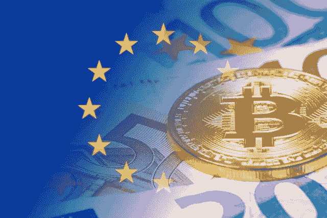

# 欧盟投票支持加强对加密货币的监管

> 原文：<https://medium.datadriveninvestor.com/the-eu-votes-for-tighter-regulation-of-cryptocurrencies-21f9549dfcc2?source=collection_archive---------3----------------------->

***欧洲议会投票决定加强对加密货币的监管，这对您的企业意味着什么？***

2018 年 4 月 19 日星期四，**欧洲议会投票支持 2017 年 12 月与欧洲理事会的协议**。总体而言，该协议主要基于**防止使用加密货币资助恐怖主义和洗钱**。

根据一份新闻稿，该动议以 574 票赞成、13 票反对和 60 票弃权获得通过。

新的立法旨在解决围绕数字金融行业的灰色地带，并遵循去年 12 月达成的共识协议，该协议旨在打击欧盟范围内的有组织洗钱犯罪。

人们认为，新协议的部分原因是 2015 年(巴黎)和 2016 年(布鲁塞尔)的恐怖袭击，以及巴拿马文件泄露。

## **这项新法规将如何影响您的业务？**

具体的加密货币反洗钱法规现在将要求**加密交易所和托管钱包提供商实施更严格的尽职调查流程**。

例如，作为验证过程的一部分，您需要让每个客户或实体注册交易所和钱包。

改革还将赋予公民接触在欧盟运营的企业的任何受益所有人的权利。因此，这应该有助于根除洗钱和避税的公司。本质上，这应该让你在与其他企业一起使用加密货币时感到安心。

这些制裁将在《欧盟公报》公布三天后生效。在此之后，欧盟的每个国家都有 18 个月的时间将新规则纳入国家法律。

欧洲议会议员兼共同报告员 Krisjanis Karins 说:

> 犯罪行为没有改变。犯罪分子利用匿名来清洗他们的非法所得或资助恐怖主义。这项立法通过允许更多地获取公司背后人员的信息，并通过收紧监管虚拟货币和匿名预付卡的规则，帮助解决我们的公民和金融部门面临的威胁。

另一位欧洲议会议员兼共同报告员 Judith Sargentini 补充说:

> 根据这项新的立法，我们采取了更严厉的措施，扩大了金融实体对客户进行尽职调查的责任。

# **您的企业需要考虑的事情**

**新的加密货币反洗钱法规是一件积极的事情**，适用于保护客户和企业免受洗钱。

当然，这很容易被认为是“另一个圈”，你的企业需要跳过这个圈。但必须永远记住的是**合规领域的每一个微小举动都会改变企业的面貌**。合规不仅仅是一套保护公司免受起诉的机制、政策和程序，它们还能让世界变得更加美好。此外，如果你有正确的策略和专家指导你应对数字货币不断变化的面貌，你就可以履行每一项合规责任。

*您对新的加密反洗钱法规有何看法？请留言告诉我们。*