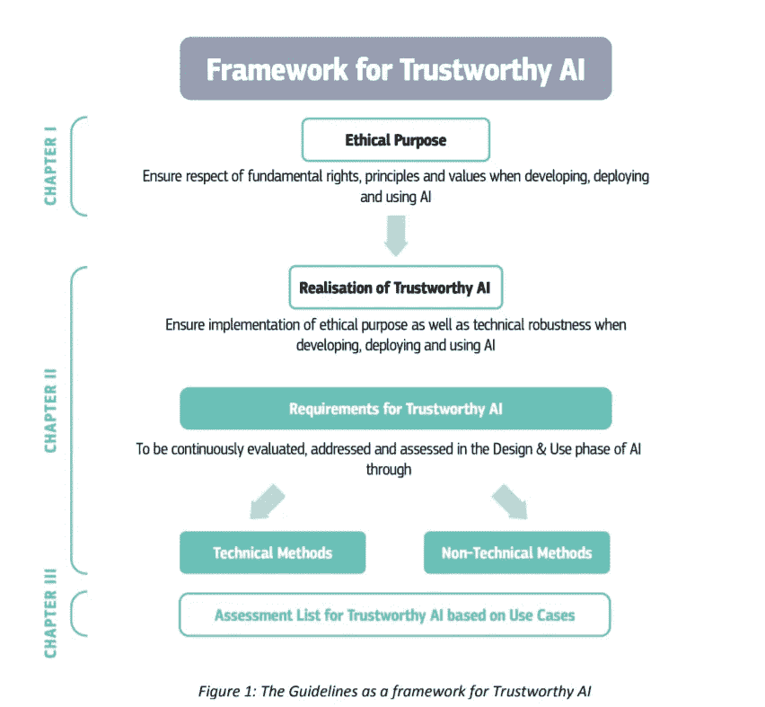

# 欧盟委员会关于可信人工智能的道德准则草案

> 原文：<https://medium.datadriveninvestor.com/the-european-commissions-draft-ethics-guidelines-for-trusthworthy-ai-7d05fa7c1fec?source=collection_archive---------15----------------------->

📚该工作文件构成了欧盟委员会人工智能高级专家组(AI HLEG)制定的人工智能道德准则草案，其最终版本将于 2019 年 3 月发布。

[*🔗您可以通过此链接*到达报告草稿 T3](https://ec.europa.eu/newsroom/dae/document.cfm?doc_id=56433)

> 欧盟副主席兼数字单一市场专员安德鲁斯·安西普说:“人工智能可以为我们的社会带来重大利益，从帮助诊断和治疗癌症到减少能源消耗。但是，为了让人们接受和使用基于人工智能的系统，他们需要信任它们，知道他们的隐私受到尊重，决定不会有偏见。”

可信人工智能有两个组成部分:(1)它应该尊重基本权利、适用的法规和核心原则，确保“道德目的”；以及(2)它应该在技术上是健壮和可靠的。然而，即使出于最好的意图，人工智能的使用也可能导致无意的伤害。因此，与其他小组相比，AI HLEG 已经开发了一个框架来实际实现可信的 AI，并为其实现提供了具体的指导。

在第一章中，他们阐述了基本权利和一套相应的原则和价值观，这些原则和价值观支撑着人工智能的伦理目的。

在第二章中，他们提出了有助于实现和实施可信人工智能的技术和非技术方法。

最后，在第三章中，他们提供了一个评估列表，有助于实现可信赖的人工智能。设想了一个流程，将允许利益攸关方正式认可这些准则的最终版本，该版本将于 2019 年 3 月到期。人工智能专家组欢迎所有感兴趣的利益攸关方通过欧洲人工智能联盟提出意见，作为本草案磋商过程的一部分。必须记住，这份草案代表了高级别专家组目前的工作文件，应当在此时此刻的背景下加以处理。

> 数字经济与社会专员玛利亚·加布里埃尔表示，人工智能的使用必须“始终符合我们的核心价值观，维护人权”，并指出指导方针草案的目的是确保这些价值观在实践中得到体现。

✍️The 草案的最终版本将于 2 月 1 日公开征求意见，并将根据意见和反馈于 3 月公布。

[*🔗*您可以点击此链接提供反馈意见。](https://ec.europa.eu/futurium/en/ai-stakeholders-consultation/stakeholders-consultation-draft-ai-ethics-guidelines)

## 来自 DDI 的相关故事:

 [## 数据科学和软件工程哪个更有前途？—数据驱动的投资者

### 大约一个月前，当我坐在咖啡馆里为一个客户开发网站时，我发现了这个女人…

www.datadriveninvestor.com](https://www.datadriveninvestor.com/2019/01/23/which-is-more-promising-data-science-or-software-engineering/)  [## 用 7 个步骤解释深度学习——数据驱动投资者

### 在深度学习的帮助下，自动驾驶汽车、Alexa、医学成像-小工具正在我们周围变得超级智能…

www.datadriveninvestor.com](https://www.datadriveninvestor.com/2019/01/23/deep-learning-explained-in-7-steps/)