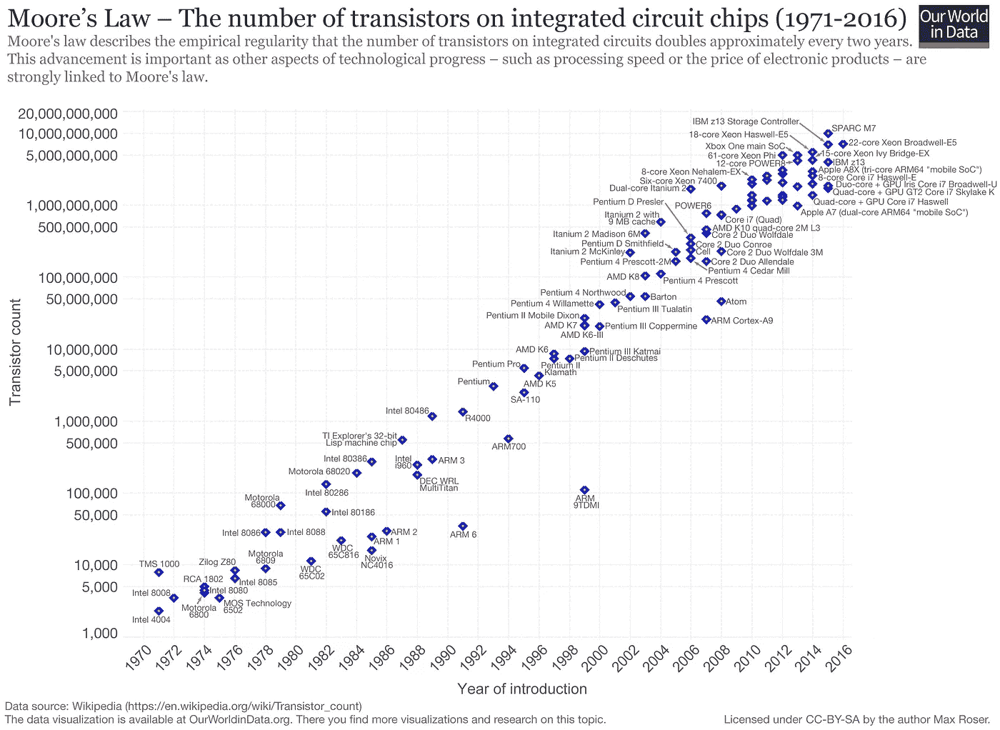
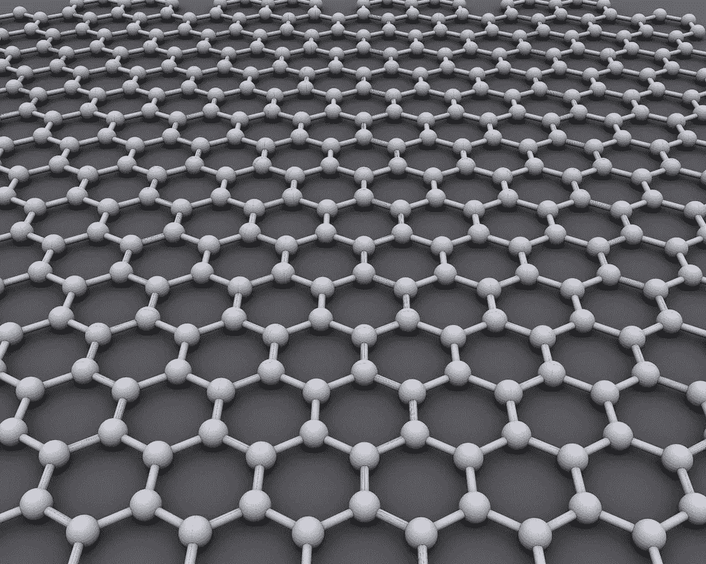
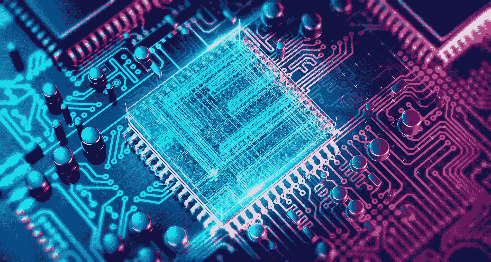
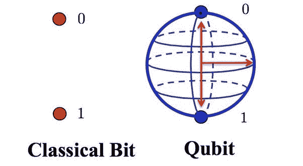

# 摩尔定律的最终消亡和高性能计算的未来选择。

> 原文：<https://medium.datadriveninvestor.com/the-eventual-demise-of-moores-law-and-alternatives-for-the-future-of-high-performance-computing-88ff86dc1534?source=collection_archive---------4----------------------->

1965 年，英特尔的创始人之一戈登·摩尔观察到，集成电路中的晶体管数量大约每两年翻一番。基于这一观察，他预测这一趋势将持续到可预见的未来。这一观察结果就是现在众所周知的摩尔定律。虽然这种情况已经持续了大约 60 年，但许多人开始争论这项法律是否终于要走到尽头了。

Number of transistor in chips over the years (Wikipedia)

新的处理器密集型应用，如深度学习或比特币挖掘，正在要求更小、更强大的芯片，比这些芯片的开发速度更快。在可用空间有限的情况下，在我们面临漏电等问题(衡量晶体管在“关闭”位置时允许通过的电流量)之前，我们可以在芯片区域中塞入多少晶体管以及可以将晶体管做得多小是有限制的。例如，漏电会导致芯片在空闲状态下使用更高的功率。诸如此类的问题使得芯片制造商很难满足其用户的性能需求。

# 能做些什么？

尽管存在这些潜在的问题，对非传统计算方法的研究有望在未来获得更高的性能。

***石墨烯***

A view of the molecular structure of graphene.

过去几年的热门词汇之一是石墨烯(碳纳米管)。石墨烯基本上是一层极薄的石墨，没错，就是铅笔“铅芯”的同一种材料。尽管石墨烯来自石墨，但它具有一系列独特的性质。它具有 130 吉帕斯卡的极高拉伸强度，这实质上意味着它比钢强 100 多倍。但是就计算应用而言，石墨烯也是高度导电的。正因为如此，它有可能被用在半导体中，以大大提高数据流动的速率。

 [## 信息图:云之旅|数据驱动的投资者

### 聪明的企业领导者了解利用云的价值。随着数据存储需求的增长，他们已经…

www.datadriveninvestor.com](https://www.datadriveninvestor.com/2018/09/22/infographic-journey-to-the-clouds/) 

利用传统石墨烯作为半导体的主要缺点之一是缺乏带隙。带隙是材料中价带和导带之间的间隙，当它们交叉时，允许电流流动。这使得像硅这样的材料可以根据它们的电子是否被推过带隙而具有不同的“开”和“关”状态。石墨烯没有带隙，因此，电荷像任何金属一样简单地流动。然而，新的研究有可能解决这个问题。根据《化学世界》的一篇文章，

> 美国佐治亚理工学院的 Edward Conrad 和他的同事通过外延生长制造了石墨烯。在这种方法中，碳化硅(SiC)衬底被加热到 1360°C 的温度，在这一点上它开始分解并形成石墨烯层。研究人员发现，这些层中的第一层，通常称为缓冲层，形成了大于 0.5 eV 的带隙，因为它以高度周期性的方式键合到 SiC 衬底上。

0.5 eV 的带隙足以让石墨烯发挥半导体的功能，因此，这可能是在不久的将来看到基于石墨烯的芯片的一个有希望的起点。

***量子计算***

量子计算利用了亚原子粒子在任何时候以一种以上的状态存在的能力。通过利用这种行为，操作可以比传统计算机更快、更节能地完成。在经典计算中，一个比特是一条信息，它可以以两种不同的状态存在——1(“开”)或 0(“关”)。量子计算使用量子比特(又名“量子比特”)来代替这些传统比特。与传统比特不同，量子比特可以存储比 1 或 0 更多的信息，因为它们可以以这些值的任何叠加形式存在。这实质上意味着量子计算机可以用比经典计算机更少的能量存储更多的信息。

Traditional transistors can hold single piece of information, either 1 (charged) or 0 (non charged). In contrast, qubits hold two states of up and down simultaneously using superposition spin mechanism.

当前量子计算机方法面临的主要困难之一是相干性。流行的量子位方法包括冷却到接近绝对零度的超导导线和由激光控制的离子。随着系统中量子比特数量的增加，它们越有可能与外部世界相互作用，从而降低它们的量子状态。这个过程被称为相干，本质上使量子比特无用。这个问题的一个潜在解决方案是使用光子，而不是电子。光子不与环境相互作用，所以不像电子那样有很短的相干时间。目前基于光子的量子计算的研究由中国长沙国防科技大学副研究员肖刚强领导。

截至 2018 年，实际量子计算机的发展仍处于初级阶段，在很大程度上是一个理论概念，但已经开展了一些研究，其中对少量量子比特进行了计算操作。对量子计算的研究仍在继续，许多国家政府和军事机构都在资助量子计算研究，希望开发日常使用的量子计算机。目前，一台 20 量子比特的小型量子计算机作为 IBM 量子体验项目的一部分存在。

# 结论

随着新的和要求更高的计算机应用的出现，传统的制造更快更小芯片的方法正迅速变得过时；然而，石墨烯或量子/光子芯片等替代计算方法的研发提供了一种开发更快、更节能芯片的方法。