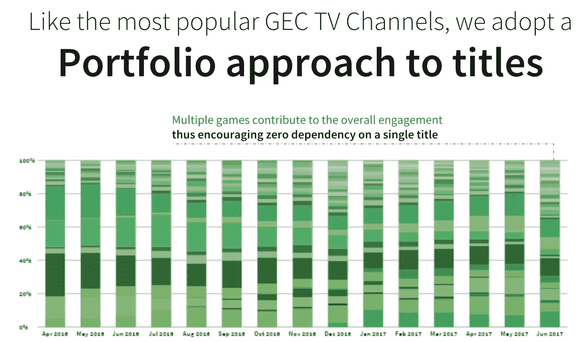

# 游戏开发者的进化

> 原文：<https://medium.datadriveninvestor.com/the-evolution-of-game-developers-c2ee35f50fab?source=collection_archive---------4----------------------->

在我的[上一篇文章](https://medium.com/datadriveninvestor/the-future-of-gaming-c90523ca605c)中，我给出了游戏生态系统的宏观观点。现在，我想花时间在每个游戏类别上，以定义它们是什么，它们如何通过功能、特性或用例进行创新，以及每个类别中的顶级初创公司是什么。这篇文章将只关注游戏开发者。这一类别在游戏行业占据主导地位。他们占整个游戏生态系统资金(71 亿美元)的近 60%，并建立了许多初创公司(447 家)。

# 游戏开发者

游戏开发商类别主要关注寻求创造、收购和发行新游戏的工作室和发行商。由于其成功率和失败率，这是整个创业生态系统中最独特的类别之一。在我调查的 447 名游戏开发者中，约 23%已经退出，约 10%已经关闭。

用正确的策略、技巧和风格来构建游戏确实是一门艺术——只有最好的游戏开发者知道如何去做。对于这篇文章，我不会触及游戏性，但我想强调我在用于创建游戏的工具中看到的模式，增加的功能以推动参与度和游戏开发者的目标人口统计。

> [DDI 编辑推荐—虚幻引擎 C++开发者:学习 C++制作电子游戏](http://go.datadriveninvestor.com/unreal/matf)

**大多数开发者追随的基础趋势游戏**

*   移动正在成为最重要的游戏发布平台。
*   大多数游戏开发者都在开发免费游戏。
*   每款游戏的盈利来源于广告或游戏内购买，如皮肤、助推器或优质产品。
*   跨所有平台(游戏机、移动设备、电视和虚拟现实)开发游戏似乎也是一种标准。
*   创建一个竞争性的多人生态系统或提供奖励是推动参与的必要条件。
*   似乎越来越多的开发者试图通过任何可能的方式——聊天、面对面的聚会、联盟等等，围绕他们的游戏建立社区。
*   所有开发者都必须迎合有影响力的人，以吸引观众和游戏玩家。
*   建立自己独特的 IP 或使用现有的有价值的 IP 是建立一个成功游戏的关键。

# 功能

游戏开发者如何通过他们用来构建游戏的工具或游戏为之构建的平台来区分。

**1 —用于玩游戏的新平台**

游戏开发商正在寻找新的游戏平台。对于游戏开发商来说，这看起来是一个在别人还没有的地方成长的机会。例子包括:

*   *音频*:像 [Drivetime](https://www.drivetime.fm/) 或 [Sensible Object](http://sensibleobject.com/) 这样的开发者允许用户在 Alexa 上或驾驶汽车时玩音频琐事游戏。
*   *智能手表* : [Everywear Games](https://everyweargames.com/) 和 [Pocket Gems](https://pocketgems.com/) 正在为安卓和苹果智能手表开发游戏。
*   *聊天应用* : [Knock Knock](http://www.knock-knock.us/) 一直在脸书 messenger 中构建游戏。[海王](http://neptunegames.co.kr/)一直在和 Kakao 合作。腾讯的迷你程序已经在微信上引发了一系列游戏。Mojiworks 正在为 Messenger 和微信开发游戏。这看起来像是一个令人兴奋的短期休闲游戏类别——电信或 CPaaS 解决方案应该注意的领域。
*   *渐进式网络应用程序:*这些应用程序加载起来像普通网站，但提供更多功能。 [GAMEE](https://www.gamee.com/) 联合创始人[博泽纳·雷扎布](https://www.linkedin.com/in/bozenarezab/)提到，“谷歌和微软都在大力推动渐进式网络应用。就连苹果也宣布了他们对 PWAs 的首次支持。”GAMEE 创建了一个本地应用和 PWA，让玩家可以在 GAMEE 或聊天应用中与朋友一起玩游戏。这一部分与上面的聊天应用部分紧密相关。
*   传统的桌游或玩具似乎越来越多地与电子游戏融合在一起。Workinman Interactive 公司正在为迪斯尼、Nickelodeon、Atari 和 Fisher-Price 等品牌制作互动玩具。[巨熊游戏](https://mightybeargames.com/)创造了控制游戏难度的心率监测器。[感性对象](http://sensibleobject.com/)创造了一个独特的硬件游戏，在这个游戏中，Jenga 遇到了 pokemon。
*   *电视* : [Nazara](http://nazara.com/) 也与亚马逊结盟，在 Fire TV 上提供本地化的印度游戏体验。对于手机和个人电脑之外的更多出版商来说，电视似乎正在成为一个重要的平台。这会阻碍主机增长吗？
*   *VR/AR* : [Niantic](https://nianticlabs.com/) ，[叶尾实验室](https://www.leaftaillabs.com/)，[抢夺](https://www.snatchvip.com/)， [Next Games](https://www.nextgames.com/) ，[占位](http://placeholder.co.jp/)和[市府](https://www.playshifu.com/)都是主要利用手机来创造社交、互动、协作的 AR 体验。VR 也是开发者拓展现有 IP 的首选平台。[分辨率游戏](https://www.resolutiongames.com/)作为一个例子，把愤怒的小鸟带到了 VR。其他人则更进一步，在 AR/VR 中增强游戏体验。Subdream 正在打造自己的可用于 VR 游戏的硬件。Meleap 甚至为 ar 游戏创造了自己的竞技场。
*   主题公园 : [沉浸式游戏实验室](https://immersivegameslab.com/)和 [Survios](https://survios.com/arcades/) 建造了一个室内电子游戏主题公园，人们可以在那里玩游戏。VR/AR 室内主题公园已经成为一种趋势有一段时间了，但管理它们的经济学有点不稳定。

***为什么这很重要？***

新平台能够以不同的方式接触新的或现有的游戏玩家。首先在这些新平台上发布游戏可以定义一个新的游戏类别。例如， [Mech Mocha](http://mechmocha.com/) 声称 96%的手机游戏玩家没有 PC/主机游戏的历史。新平台也会伤害现有平台。[腾讯](https://www.tencent.com/en-us/articles/17000391523362601.pdf)在他们的年度报告中提到，由于移动游戏的转移，他们的 PC 游戏收入受到影响，并将继续下降。

**2——开发者创建自己的游戏引擎**

对于许多开发者来说，用于构建游戏的引擎变得和游戏本身一样重要。这似乎是开发商进化成出版商的成长策略。

*   *游戏引擎发布* r:像 [Epic Games](https://www.epicgames.com/store/en-US/) Unreal Engine 或[Niantic](https://nianticlabs.com/)Real World Platform 这样的公司是开发人员开发成功游戏并与其他开发人员共享平台的例子。像 [The Ready Games](https://www.getready.io/) 这样的开发者将发布使用他们的开发者平台构建的游戏，主要好处是用户不必知道任何构建游戏的代码。 [Workinman Interactive](https://workinman.com/) 提供物联网硬件模拟器。
*   *内部游戏引擎*:像[超级邪恶超级公司](https://www.superevilmegacorp.com/)和 [Mojiworks](https://www.mojiworks.com/) 这样的开发者创造了他们自己的游戏引擎来驱动他们的手机和聊天游戏，并没有授权的意图。这条路线似乎让工作室在游戏性能和游戏开发速度上有了更多的自由。Dapper Labs 采取了一种稍微不同的方法，允许开发者使用他们的代码在他们的游戏生态系统中创建游戏。目的是围绕 [Dapper Labs](https://www.dapperlabs.com/) 品牌游戏创造更多迷你游戏。FRVR 的技术堆栈帮助他们在几乎任何手机上在不到一秒的时间内提供优质游戏。
*   *游戏工具*:许多开发者也在使用授权工具来提高他们自己游戏的性能、发行或参与度。 [Teatime Games](https://www.teatime.games/) 提供游戏内的广播和视频聊天。[重装游戏](https://www.reloadedinc.com/)提供游戏内音乐工作室和工具来加速游戏下载。点石成金创造 2D 动画软件。

*为什么这很重要？*

游戏基础设施和工具的未来很可能来自游戏开发者。游戏开发的未来集中在开发者能多快、多便宜、多投入地开发一个新游戏。这是开发者成为主要发行商的敲门砖。

**3 —构建的游戏数量**

少数工作室和发行商似乎正在积极为新游戏设定生产或收购目标。也许这源于寻找合适的 IP，这将为工作室创造巨大的回报。一些发行商，如 [Games2win](https://games2winmedia.com/) 鼓励对单一游戏的零依赖。 [Hypixel](https://hypixel.net/) 、 [Mighty Bear](https://mightybeargames.com/) 或 [Flowplay](https://www.flowplay.com/) 尝试在现有的成功游戏中构建多个迷你游戏。MZ 工作室设定了每 6 个月发布一款游戏的目标。准备好的游戏试图每 48 小时发布一款游戏。开发商或发行商名下游戏的大致数量示例:

*   [流量间隙](https://www.flowplay.com/) 200+
*   Pogo 176+
*   [NoodleCake 工作室](http://www.noodlecake.com/) 140+
*   Playstudios 100+
*   团队 17 100+
*   [制表](https://www.tabtale.com/) 100+
*   Gamee 75+
*   [Zgames](https://www.zgames.com/) 40+级
*   [亚像素](https://hypixel.net/) 22 以上
*   [FRVR](https://corp.frvr.com/) 26+

开发人员似乎正在这样做，这样他们就不会把所有的鸡蛋放在一个篮子里。下面是一个关于 [Games2win](https://games2winmedia.com/) 投资组合策略的图表。他们推出多个游戏，所以他们不依赖于一个 IP。

*为什么这很重要？*

快速开发高质量的游戏是很困难的，[凤凰实验室](https://phxlabs.ca/)提到需要近 200 人来制作他们新的 PC 免费合作狩猎游戏。如果做得好，游戏每天可以带来几十万甚至几百万的收入。开发商和出版商似乎一直在寻找他们的下一个大赢家。随着游戏引擎的发展，制作游戏变得更加容易，你应该会看到这个生态系统充斥着越来越多的内容。

[救赎游戏](https://www.redemptiongames.com/)提到，“移动游戏业务已经成为世界上有史以来竞争最激烈的行业之一。app store 中有成千上万的游戏，要想脱颖而出，需要技巧和努力的独特结合，从游戏的设计到营销以及作为直播服务的运营。没有灵丹妙药，也没有捷径。”

**4 —工作室合作**

开发一款游戏是一门艺术，美工不断协作。有一些开发者为了技能、知识产权或地区分布而合作。显然，许多公司与出版商合作，以获得制作和发行方面的帮助。像 Hutch 这样的其他开发者更喜欢自助出版。尽管如此，媒体、内容和游戏 IP 的融合将不断产生令人兴奋的新玩法。协作示例:

*   半砖工作室与机甲摩卡合作，在印度本地化并重新推出他们的游戏。
*   Workinman 与上瘾的游戏合作，创造了一个激烈的战斗游戏，以反映该系列的精神,《战士》。
*   [数字游戏工作室](https://www.digitgaming.com/)与 [Scopely](https://scopely.com/) 合作打造好莱坞 IP《星际迷航舰队司令部》。

# 特征

本节重点介绍开发者如何通过他们的 IP 或他们游戏的特性来增加粉丝参与度。

**1——媒体、品牌、图标与游戏的合并**

许多开发商正在围绕现有的流行品牌开发游戏，以推动即时吸引力。其他开发商试图围绕电影或电视节目内容开发游戏，以进一步构建他们的游戏 IP。一些开发商正在他们的游戏中制作丰富的媒体内容，以创造更好的游戏体验。以下是游戏如何与媒体融合的例子:

*   游戏的媒体图标:几乎任何电视、电影或演员的流行媒体图标都已经或将要被嵌入到游戏中。例子包括利用哈利波特的[Niantic](https://nianticlabs.com/)；[果酱城](https://www.jamcity.com/)利用家庭盖伊和漫威；[第二顿晚餐](https://seconddinner.com/)也使用漫威； [Scopely](https://scopely.com/) 使用行尸走肉和幸运之轮； [nWay](http://nway.com/) 带动力游侠； [MZ 游戏](https://www.mz.com/gamestudio)使用最终幻想；[月蛙实验室](https://www.moonfroglabs.com/)使用印度票房最高的电影和最著名的演员； [Funtactix](https://ftxgames.com/) 根据大片创作游戏。Neptune 正在与消息平台 Kakao 合作，并使用他们的角色来构建游戏。总部琐事另辟蹊径，邀请摇滚、劳勃·狄·尼诺、戈登·拉姆齐、尼尔·帕特里克·哈里斯和艾丽西亚·希尔维斯通等名人加入他们的游戏。利用流行媒体构建游戏的一个非常独特的例子是 Hypixel。他们从制作自己的搞笑 youtube 视频开始。这个 youtube 频道获得了足够的关注和关注，帮助他们根据自己的 Youtube 视频制作自己的《我的世界》小游戏。
*   游戏到媒体(Games To Media):为了进一步利用现有的游戏知识产权，开发者们正在围绕他们的游戏创造媒体。它可以很简单，像 [Kixeye](https://www.kixeye.com/) 创建视频和博客，告诉他们如何打败他们的游戏。或者它可以远到 [Niantic](https://nianticlabs.com/) ，他们正在围绕他们的游戏入口创作一个电视节目。Telltale 每月发布关于他们游戏的互动内容。[尤溪谷](http://youxigu.com/)参与投资制作了两部院线电影和动作类型电影。创造书籍、杂志、玩具、交易卡、音乐专辑、电影和狗垫。
*   品牌到游戏:开发商也与标志性品牌合作开发游戏。例如， [Playstudios](https://www.playstudios.com/) 与拉斯维加斯的赌场合作提供奖励。[Ready Games](https://www.thereadygames.com/)与顶级品牌合作，打造定制游戏体验。 [Animoca Brands](https://www.animocabrands.com/) 为美泰制作游戏。 [704Games](https://nascarheat.com/) 创造了六款全是关于纳斯卡的游戏。
*   游戏到游戏:经常看到开发者改造现有的流行棋盘/街机游戏。机甲摩卡制作了一款关于当地流行的印度棋盘游戏 Ludo 的游戏。基于 20 世纪 80 年代流行的街机游戏 Galaga 开发了一款虚拟现实游戏。 [Jackpocket](https://jackpocket.com/) 帮你在手机上玩州彩票游戏。Scopely 为 Yahtzee 开发游戏。超级固体正在模拟人生的基础上建造。这样的例子不胜枚举。

为什么这很重要？

打造一个成功的游戏 IP 是非常困难的。让一个曾经成功的品牌存活下来更具挑战性。任何受欢迎的内容都不可避免地会被开发者迅速吃光。那些发现了成功游戏 IP 的人会围绕它创造媒体来留住玩家。我认为我们将在未来看到更多的媒体和游戏的碰撞，尤其是当制作和分发游戏和媒体变得越来越容易的时候。

**2 —游戏所有权**

给玩家游戏的所有权似乎是开发者的一种趋势。出售游戏中的物品已经成为大多数免费游戏的盈利标准。然而，开发者正在开放他们的游戏，允许玩家创建、出售和交易物品、地图等等。这种趋势的例子:

*   [Dapper Labs](https://www.dapperlabs.com/) 开放了他们的代码，允许开发者利用他们的游戏知识产权开发游戏。
*   [Epic Games](https://www.epicgames.com/store/en-US/) 和 [Funcom](https://www.funcom.com/) 发布 mod，让玩家可以在热门游戏中创造自己的世界。
*   神话游戏公司将把下一款游戏的重点放在用户创造的内容上，玩家和有影响力的人可以交易他们创造的数字资产。
*   [巴生游戏](https://www.klang-games.com/)允许玩家创建和管理多个角色。即使玩家被注销，这些角色仍然存在。
*   [口袋宝石](https://pocketgems.com/)允许用户在游戏中创建自己的故事情节，与其他玩家分享。
*   IMVU 为玩家创造的游戏内风格创建了自己的时尚博客。他们的头像可以被命名为顶级模特，并在游戏横幅上得到认可。

*为什么这很重要？*

数字资产变得越来越有参与价值，也成为游戏赚钱的新手段。未来的游戏将允许玩家建立他们自己的游戏，个人资料，皮肤，故事情节等等。游戏发展的未来很可能会来自玩家。

**3 —赛事、比赛&竞赛**

开发商和发行商增加参与度的另一个趋势是为他们的游戏举办比赛。这可以在游戏中完成，也可以通过举办活动来完成。这有助于开发者推动参与度和新的盈利策略。一些例子包括:

*   Niantic 为他们的 AR 游戏玩家创建活动和本地聚会。其中一些聚会是游戏的核心部分。此外，他们还为开发者举办竞赛。
*   在[腾讯的年度报告](https://www.tencent.com/en-us/articles/17000391523362601.pdf)中，他们提到他们能够通过电子竞技比赛和直播活动增加用户参与度。
*   [Nazara](http://nazara.com/) Technologies 获得了 ESL 在印度组织和运营 ESL 竞赛的多年独家许可权。
*   [Funplus](http://www.funplus.com/) 和[千禧电竞](https://www.millennialesports.com/)举办电竞赛事和联赛。[千禧一代电竞](https://www.millennialesports.com/)其实在拉斯维加斯有自己的游戏场。
*   像[准备好的游戏](https://www.thereadygames.com/)和[总部琐事](https://itunes.apple.com/us/app/hq-trivia-words/id1232278996?mt=8)这样的游戏每天都会在游戏中举办奖品竞赛。

*为什么这很重要？*

电子竞技是一项发展迅速的运动。开发合作和竞争游戏似乎成为一种要求。参与电竞行业是开发者必须要做的事情。

**4 —社交**

无论大小，所有的游戏都加入了社交元素。这可以是聊天、视频直播或虚拟世界中的任何内容。为游戏添加实时社交组件正成为所有开发者的必备条件。例子包括:

*   机甲摩卡专注于为他们的游戏构建社交组件。他们的 DAU 平均每天花 25 分钟在游戏语音聊天上。
*   茶点游戏公司为他们面对面的赛车对战游戏提供现场视频。
*   Funplus 手机应用程序使用户能够流式播放他们的游戏并与观众互动。
*   [Flowplay](https://www.flowplay.com/) 创造了一个虚拟世界，让玩家可以互动，一起玩游戏。

为什么这很重要？

社交互动似乎推动了参与度，但也成为分发游戏的一种新方式。

[GAMEE](https://www.gamee.com/) 的首席执行官 Bozena Rezab 提到，“AppStore 和 Google Play 仍然是让玩家玩手机游戏的最主要方式，然而，一些趋势显示出变化的信号。首先，内容分发的变化越来越分散，从社会联系开始。聊天应用的兴起正在创造地球上最大的覆盖网络，其花费的时间比社交媒体加起来还要多，成为分享和分发内容的枢纽。微信有迷你程序、Messenger、Viber、Telegram 机器人，以及人们在与朋友或群组交谈时进行的大量共享操作。所有聊天应用都在向支持团体和社区的方向发展，注意到它们的力量远远超出了一对一的对话。”

# 用例

这一部分着重于游戏开发者关注的受众类型以及他们的公司如何发展。

**1 —人口统计目标**

值得注意的是，有少数游戏开发商迎合了特定的人口统计数据。以下是常见的人口统计数据示例:

*   *地域* : [机甲摩卡](http://mechmocha.com/)感觉地域特定游戏有差距。他们专注于赢得印度境内的小区域。 [Games2Win](https://games2winmedia.com/our-games/) 也宣称专注于打造本地化内容。
*   性别:奇点 6 即将到来的游戏希望女性成为他们的主要观众。Nix Hydra 专注于开发面向女性的游戏。Gram Games 实际上创造了一个名为 Project 22%的运动来迎合女性。
*   *竞技类* : [Gamelynx](https://gamelynx.gg/) 正在手机上开发基于团队的竞技游戏，因此电子竞技变得更加普及和全球化。
*   *专业* : [Level Ex](https://www.level-ex.com/) 为医生创造捕捉行医挑战的视频游戏。虚拟现实训练系统通过可视化比赛，帮助足球运动员为即将到来的比赛做好心理准备。它还允许足球运动员在没有受伤风险的情况下练习。

为什么这很重要？

迎合特定的人群可以为开发者带来新的增长机会。例如， [Nazara](http://nazara.com/) Technologies 提到，“无论哪种情况，拥有 5 亿玩家市场的印度都有潜力建立自己的英雄联盟。"

**2 —授权影响者**

影响者是游戏开发者营销策略的主要组成部分。[凤凰实验室](https://phxlabs.ca/)指出，“事实是，大多数玩无畏的人来自 Twitch 上碰巧玩的人，或者 YouTuber，或者绝大多数人来是因为他们的朋友玩，他们想和他们的其他朋友一起玩。”游戏开发者如何与有影响力的人互动，对于推动他们的新开发项目的流量至关重要。出版商用来迎合影响者的创新方法示例:

*   [Funcom](https://www.funcom.com/) 预制捆绑包专为有影响力的人准备，帮助他们为观众创造更好的内容。
*   [Epic Games](https://www.epicgames.com/store/en-US/) 支持创作者计划使创作者能够从 Epic Games 商店的堡垒之夜和其他游戏中赚钱。
*   [Seriously](https://www.seriously.com/) 通过与 YouTube 有影响力的人围绕慈善活动开发一系列活动并根据游戏更新安排时间，取得了成功。
*   [proclassy](https://www.proletariat.com/)构建完整的直播流集成和工具，允许观众在游戏中与他们最喜欢的广播公司互动。

*为什么这很重要？*

有影响力的人，如果不是已经成为新游戏发布的主要渠道。为了让有影响力的人满意，游戏开发者需要帮助他们为观众提供更好的内容。我们应该看到更多的合作和独特的方式，游戏开发者将与有影响力的人合作。

**3 —游戏创业公司的演变**

游戏开发商一直在寻找在现有 IP 基础上进行扩展的方法。许多公司从开发迎合玩家的游戏转向为新游戏开发者提供平台和专业知识。

*   *收购组合增长*:许多成功的游戏开发商开始收购或投资其他工作室以求增长，即[果酱城](http://www.jamcity.com/)、 [Scopely](https://scopely.com/) 和[腾讯](https://www.tencent.com/en-us/)。
*   *开发者到发行商*:许多开发者使用他们自己开发的游戏引擎来构建他们的发行组合。作为一个例子， [Epic Games](https://www.epicgames.com/store/en-US/) 利用他们的游戏引擎作为一种手段来发展发行商。 [Paradox Interactive](https://www.paradoxinteractive.com/en/) 也在打造一个数字发行平台。 [Rumble Games](https://rumblegames.com/) 为开发者提供发布和运营游戏内服务的工具。
*   *开发者到服务提供商*:[workin man](https://workinman.com/)Interactive 为寻求开发游戏的品牌创造设计、物联网玩具、艺术、展览和更多服务。 [ZGames](https://www.zgames.com/) 提供游戏设计文档开发、艺术创作、原型制作和受众研究，以及应用商店发布和发布后基于分析的调整和服务器支持。 [Virtuos](https://www.virtuosgames.com/) 还为游戏艺术家提供扩展的游戏服务和培训。
*   *产品开发者* : [Mind Candy](https://mindcandy.com/) 打造一个成功的 IP，扩展到书籍、宠物产品、宠物应用、喂食垫、交易卡、杂志、玩具、音乐专辑和电影。

为什么这很重要？

创造传奇游戏几乎是不可能的。因此，开发者总是不得不寻找新的方法来发展、成长和赚钱，否则他们将不可避免地失败。理想情况下，开发者应该继续推出新游戏，但也应该有 b 计划。

# 值得关注的顶级游戏开发商

[Hypixel 工作室](https://hypixel.net/)、[沉浸式游戏](https://immersivegameslab.com/)、 [Niantic](https://nianticlabs.com/) 、[果酱城](http://www.jamcity.com/)、[第二次晚餐工作室](https://seconddinner.com/)、[机甲摩卡](http://mechmocha.com/)、[神话游戏](https://mythical.games/)、 [Everywear 游戏](https://everyweargames.com/)、 [BigBox VR](https://www.bigboxvr.com/) 、 [Embark 工作室](https://www.embark-studios.com/)、 [Drivetime](https://www.drivetime.fm/) 、 [Dapper](https://www.dapperlabs.com/) [叶尾实验室](https://www.leaftaillabs.com/)， [GAMEE](https://www.gamee.com/) ，[奇点 6](https://www.singularity6.com/) ， [1939 游戏](https://www.1939games.com/)，[704 游戏](https://nascarheat.com/)，[海王](http://neptunegames.co.kr/)，[敲敲](http://www.knock-knock.us/)， [Scopely](https://scopely.com/) ， [Jumpship](https://jumpship.co.uk/) ， [FRVR](https://corp.frvr.com/) ， [Klang 游戏](https://www.klang-games.com/) [KIXEYE](https://www.kixeye.com/) ，[数字游戏工作室](https://www.digitgaming.com/)， [Level Ex](https://www.level-ex.com/) ，[凌空](https://volleythat.com/)， [HQTrivia](https://itunes.apple.com/us/app/hq-live-trivia-game-show/id1232278996/) ， [Trailmix](https://trailmixgames.com/) ， [Caret Games](https://www.caretgames.com/) ， [nWay](http://nway.com/) ， [Manitcore Games](http://www.manticoregames.com/) ，[心灵糖果【t](https://mindcandy.com/) [Portalarium](https://www.shroudoftheavatar.com/?page_id=68618) ，[口袋宝石](https://pocketgems.com/)， [Seasun](https://www.seasungames.com/) ，[下一场游戏](https://www.nextgames.com/)，[无敌舰队互动](https://armadainteractive.com/)，[厨卫](http://www.hutchgames.com/)， [PlaySimple 游戏](https://playsimple.in/)，[篝火工作室](http://www.bonfirestudios.com/)，[宋旻浩游戏](https://minogames.com/en/)，[认真对待](https://www.seriously.com/)，  [德比游戏](http://derbygames.com/)， [Kingnet](https://www.kingnet.com/main) ， [Playdots](https://www.dots.co/) ， [cloudcade](https://cloudcade.com/) ， [Flaregames](https://www.flaregames.com/) ， [Octro](http://www.octro.com/) ， [Nix Hydra](http://www.nixhydra.com/) ， [Thatgamecompany](http://thatgamecompany.com/) ， [Funplus](http://www.funplus.com/en/) ， [Cocone](https://www.cocone.co.jp/) [重装游戏](https://www.reloadedinc.com/)，[心灵零食](http://www.mindsnacks.com/)，[红色机器人实验室](http://www.shortroundgames.com/)，[当乐](http://www.d.cn/)， [SNSplus](https://www.snsplus.com/) 还有几个。

# 结论

游戏开发是一个极其困难的行业。创造一个受欢迎的游戏只是挑战的一半。通过建立自己的知识产权、创建社区和扩展游戏平台来保持相关性，将有助于开发者更长久地生存。游戏引擎的未来将由开发者构建。下一个最佳出版商将是一个新的成功的游戏开发商。看到开发者如何在各种平台上创建新的沉浸式游戏将是令人兴奋的；他们将如何与电子竞技行业建立联系；以及它们如何与传统媒体融合。下一篇文章我将分析这个行业的其他部分。

编辑披露:编辑有时会发布有用资源的链接。如果你发现它们有用并购买，我们会赚很多钱。不，我不是说要把我的薯条做大。我说的是超大披萨上的意大利香肠。感谢您一直以来的支持，我们将继续为 p̶e̶p̶p̶e̶r̶o̶n̶i̶出版而努力。