# 机器人智能的进化:第二部分

> 原文：<https://medium.datadriveninvestor.com/the-evolution-of-intelligence-in-robots-part-2-43aea6985b8f?source=collection_archive---------2----------------------->

这篇文章的第 1 部分概述了我们在将智能机器带入现实世界时面临的一些挑战。这些挑战的核心是机器人难以应对的成本价值比。这篇文章建立在[第一部分](https://medium.com/@simon.kalouche/the-evolution-of-intelligence-in-robots-part-1-2ad38a92800?source=friends_link&sk=bc7cff8c2ba902d05735f95cbf34af0f)的基础上，通过调查最近的机器学习、机器人学和计算机视觉研究，使机器人在面对多样化的现实世界时更加灵活。

# 监督学习

行业中最成功的深度学习类型是监督学习，但使用这种类型的学习是有成本的。监督学习的关键是需要标记数据，这通常是费力和昂贵的收集。像 [Scale](https://scale.com/) 和亚马逊的机械土耳其人(mechanical turk)这样的服务通过提供外包和众包劳动力，让收集注释变得更加容易。然而，确定标记数据的方法只是第一步。

当确定任何任务的标签类型时，有许多设计选择要做。一些选项包括[运动轨迹](https://youtu.be/rEQ8CGLV0o0?t=41)、[关键姿态](https://youtu.be/kfe5bNt35ZI)、[关键点](https://youtu.be/fm5RZ-ht1y0)和[对象](https://youtu.be/gVX_gLIjQpI) [姿态](https://youtu.be/SsE5-FuK5jo)等等。

[[source](https://arxiv.org/abs/1903.06684)]

## 联合与笛卡尔空间

如果您决定使用运动轨迹，轨迹应该在关节空间(机器人关节的位置)还是笛卡尔空间(机器人手爪或工具的位置)进行标记？

关节空间支持端到端学习，可用于最小化能量消耗或避免碰撞，以优化冗余自由度的使用。然而，联合空间学习更需要数据，因为神经网络被迫学习不必要的东西，如反向运动学和低级电机控制器——这两者都已经有了常规的解决方案，无需深度学习就能快速运行并工作良好。关节空间学习也是机器人特有的，因为每个机器人都有不同的关节运动学配置。因此，与笛卡尔空间策略相比，联合空间学习不容易跨不同平台转移。

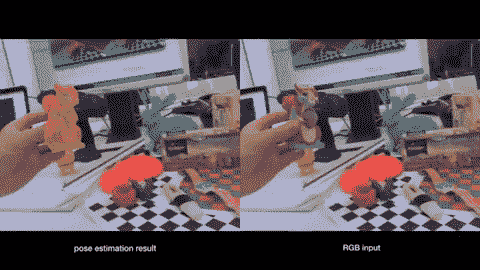

[[source](https://www.youtube.com/watch?v=gVX_gLIjQpI&feature=youtu.be)]

## 回归与分类

下一步是决定如何设计学习问题。当我们的神经网络对如何行动做出预测时，它可以**将**回归到姿态和速度，或者它可以**将**采样的行动分类为好或坏。回归在动作空间中是连续的，允许更精确的运动，但是它受到学习多个有效动作的[平均值的影响，这实际上可能是无效动作。同时，分类可以处理多个正确的动作模式，但是是离散化的，并且需要采样和评估许多可能的动作，这增加了计算时间。](https://medium.com/analytics-vidhya/anchors-and-multi-bin-loss-for-multi-modal-target-regression-647ea1974617)

## 端到端与流水线学习

作为构建学习问题的一部分，我们可以选择使用端到端模型，其中卷积神经网络(CNN)从图像中摄取像素，并像真正的黑匣子一样返回底层联合命令，从而管理整个机器人管道。或者，我们可以使用流水线方法，其中机器人的每个处理步骤都有不同的模块:传感器预处理、传感器融合、感知、策略、运动规划、运动学解算器和电机控制。在流水线方法中，CNN 可以被隔离来执行感知部分，而其他模块执行剩余的计算。

**虽然没有对错之分，但当今机器人领域的现实成功都使用了流水线方法。**

这是因为流水线方法简化了学习问题，使得整个系统更加鲁棒。它最大限度地减少了遇到奇怪错误的机会，这些错误是由于对黑盒神经网络如何做出决策缺乏透明度而引起的。

端到端学习的论点是，它可以更通用地在许多不同的场景和任务中使用相同的软件和算法。端到端模型可能适用于低成本、低性能的机器人，这些机器人的传感器有噪音，执行器不精确，计算能力有限。

*通过流水线方法，我们可以使用相对较少的数据和相当数量的定制工程，训练机器人稳健地执行单一挑战性任务。或者，使用端到端方法，我们可以创建一个更通用的模型，该模型可以从相同的软件中学习许多任务，但需要* ***更多的数据。***

以下是一些研究方向，这些方向最终可能导致神经网络执行越来越多的机器人堆栈。

# 虚拟到现实

鉴于机器人面临的先有鸡还是先有蛋的问题，目前还不清楚为机器人收集 [ImageNet](https://en.wikipedia.org/wiki/ImageNet) 模拟是否容易处理。然而，通过利用现代 [GPU 加速和并行化](https://arxiv.org/pdf/1810.05762.pdf)模拟器，我们可以在几个小时内以非常低的成本生成“数年”的合成机器人体验。除了快速和便宜之外，模拟器还可以提供自动数据注释的优势，消除了人工标记的需要。

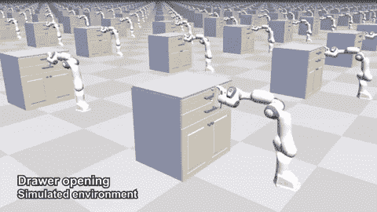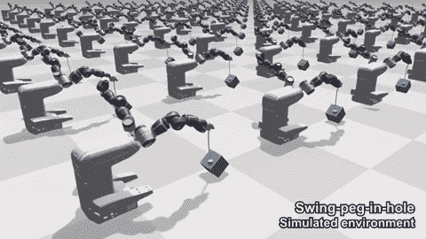

[[source](https://sites.google.com/view/simopt)]

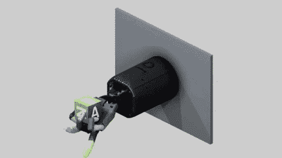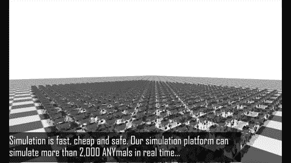

[[left](https://openai.com/blog/learning-dexterity/)][[right](https://www.youtube.com/watch?v=aTDkYFZFWug&feature=youtu.be)]

合成数据的巨大挑战是模拟器( [Unity](https://unity3d.com/machine-learning) 、 [Gazebo](http://gazebosim.org/) 、 [Mujoco](http://www.mujoco.org/image/home/mujocodemo.mp4) 、 [PyBullet](https://pybullet.org/wordpress/) 、 [V-REP](http://www.coppeliarobotics.com/index.html) )及其物理引擎( [PhysX](https://www.engadget.com/2018/12/03/nvidia-physx-open-source/) 、Bullet 等)。)不能准确地表示真实世界的视觉和物理复杂性。模拟器努力精确地模拟摩擦、静摩擦、齿轮系动力学、接触模型和负载下可变形材料的行为。

类似地，通过渲染虚拟场景捕捉的合成视觉数据与从真实相机捕捉的图像属于不同的数据分布(即，看起来不同)。这种分布不匹配使模拟到现实(sim2real)策略转移变得复杂，其中在模拟中训练的模型无法在现实世界中的机器人上同样良好地工作。

下图所示的机器人模型被训练成[在模拟中执行杂技](https://xbpeng.github.io/projects/DeepMimic/index.html)动作。这种习得的行为还没有被证明可以转移到真正的机器人身上。

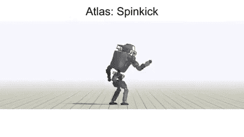

[[source](https://xbpeng.github.io/projects/DeepMimic/index.html)]

虽然最近波士顿动力公司的视频可能会提出不同的看法，但他们的机器人在校准的环境中使用基于物理模型的经过良好调整的控制器来完成这些机动——而不是机器学习。Boston Dynamics 已经证明，掌握传统控制、状态估计、逆动力学和轨迹优化(MPC、LQR 等。)在机器人控制方面，流水线方法仍然胜过机器学习……目前！

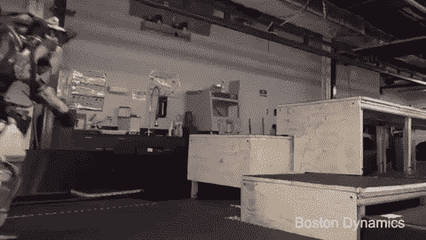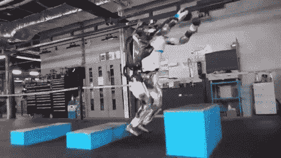

[[source](https://www.youtube.com/user/BostonDynamics)]

**总结一下**，在模拟中从虚拟传感器收集的合成数据*看起来*不完全像从真实传感器收集的数据。这种差异导致了一个被称为“转移问题”或“现实差距”的基本挑战，即在模拟数据上学习到的政策过度适应模拟器的参数，而不是推广到现实世界。

## 域随机化

一种叫做**领域随机化**的技术可以帮助弥合“现实差距”。通过在数百万个模拟情节上训练策略，并向模拟环境的参数添加随机抖动或噪声，我们可以防止过度拟合任何一组视觉和动态参数。这迫使网络专注于学习对完成任务重要的细节，而不是学习欺骗模拟器的简化规则。

**sim 2 real transfer 期间的目标是在真实世界中运行在模拟中训练的策略，并期望对于训练过的网络来说，真实世界看起来就像它被训练的许多随机模拟环境中的一个的另一个实例。**

这种训练方法允许网络在模拟和真实观测上都表现良好，而只对前者进行训练。

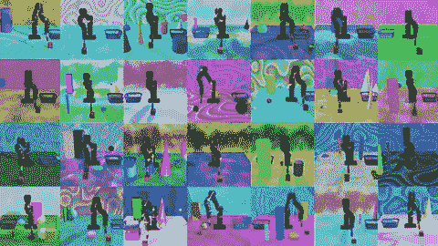

[[source](https://youtu.be/k7dom7fRb8I)]

OpenAI 的一篇[论文](https://d4mucfpksywv.cloudfront.net/papers/solving-rubiks-cube.pdf)在普通领域随机化的基础上引入了自动领域随机化(ADR ),这对学习有两个关键的好处。ADR 不是为每个抖动参数手动定义随机化的界限，而是从参数值的窄分布开始，并且仅当学习模型可以在其随机化模拟数据的当前分布上很好地执行任务*时，自动加宽该分布**。这 1)迫使模型逐渐学习广泛分布的复杂任务(比非渐进学习更容易), 2)不需要工程师手动调整随机化的界限，这是不直观和不可扩展的。***

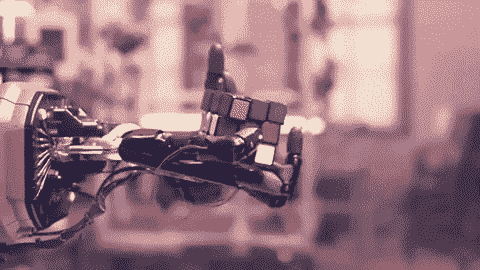

[[source](https://spectrum.ieee.org/automaton/robotics/robotics-hardware/openai-demonstrates-sim2real-by-with-onehanded-rubiks-cube-solving)]

GraspGAN 的作者在转移现实差距时采取了不同的方法。他们训练的不是看起来很迷幻的随机模拟数据，而是一个 GAN。GAN 的生成器是一个神经网络，它从模拟器接收简单的图像，并学习生成另一个神经网络 discriminator 无法从真实相机图像中区分的图像。使用这种方法，他们可以创建一个“看起来”更真实的大型合成数据集。视觉运动策略然后可以在这个看起来真实(但仍然是假的)的数据上被训练。

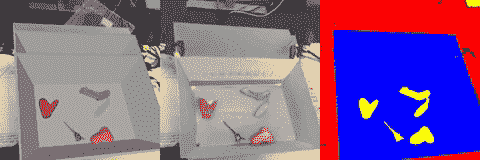

The left image shows the simulated data from a virtual camera. The middle image shows the output of GraspGAN which takes as input the simulated image and generates an image that looks like it was taken from a real camera. [[source](https://ai.googleblog.com/2017/10/closing-simulation-to-reality-gap-for.html)]

最近， [RCAN](https://sites.google.com/view/rcan/) ，或随机到规范适应网络，在看不见的物体上实现了与最初的 [QT-opt 模型](https://ai.googleblog.com/2018/06/scalable-deep-reinforcement-learning.html)相同的 86%的抓取成功率，但使用了不到 1%的最初在**真实机器人**上收集的 580，000 个训练样本。RCAN 方法通过使用 pixel2pixel cGAN 跨越了现实差距，该 cGAN 学习将域随机化的合成图像转换为其等效的非随机化的规范版本。这反过来允许实像也被转换成简化的规范图像。然后，抓取策略 [QT-opt](https://ai.googleblog.com/2018/06/scalable-deep-reinforcement-learning.html) 被输入这些简化的规范风格图像，并且不具有处理不同视觉输入的挑战。

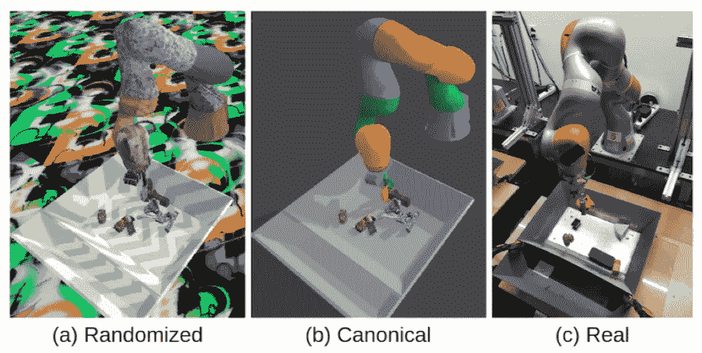

[[source](https://sites.google.com/view/rcan/)]

虽然模拟现实方法在过去几年中取得了重大进展，但对于“现实差距”还有一个非常重要的区别。在学术界,“真实”通常没有严格的定义。大多数时候，学术界将“真实”定义为在真实机器人上工作的任何东西，而不是模拟机器人。这意味着“真实”通常最终被定义为一个高度简化的实验室环境，一个任务的简化版本只需要工作 40%的时间。在工业中,“真实”被定义为完整的任务，在复杂和动态的环境中运行，需要 99.9%的时间工作。**因此，真正的现实差距不是 sim2real 而是 lab2industry。**

**混合模拟真实学习**

有一种方法可以帮助弥合从模拟和简化的实验室环境到行业的差距，那就是将模拟中的学习与真实世界中的学习结合起来。模拟数据可用于模拟-真实工作良好的任务，真实数据可用于模拟数据不足的任务。

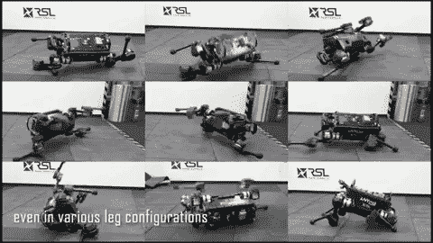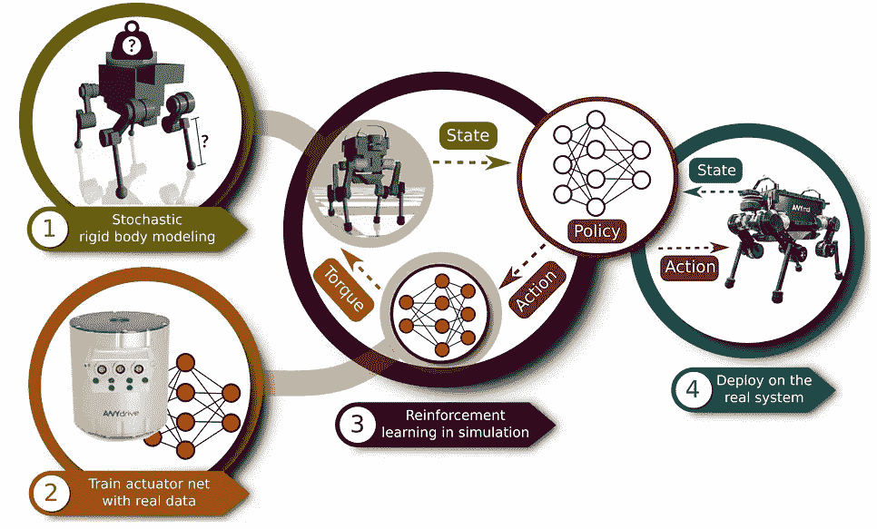

[[source](https://www.youtube.com/watch?v=aTDkYFZFWug)]

学习复杂腿部行为的第一个模拟真实演示就是这样做的。[作者](https://www.youtube.com/watch?v=aTDkYFZFWug)训练一个用于腿部运动的端到端控制器。他们的关键见解是在真实的机器人数据上训练致动器的**扭矩**控制器，其中包含极难精确模拟的动力学，并使用模拟器学习**位置**控制器，这可以很容易地用运动学模型进行模拟。

然而，对于某些任务，在合成数据上进行训练根本就不够好，因此我们必须获得真实数据并进行训练。

# 真实世界强化和自我监督学习

模仿学习和强化学习的一个关键区别是“奖励”信号的强度。模仿学习使用专家演示，主要是编码任务应该如何完成，而不是任务应该如何完成。强化学习既使用好的例子，也使用坏的例子，但是因为错误的方法通常比正确的方法多得多，所以试错数据收集过程是非常低效的。

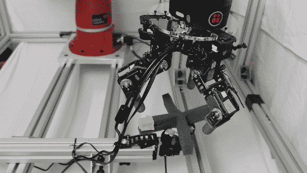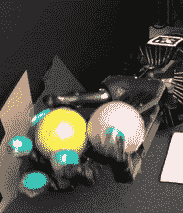

[[left](https://bair.berkeley.edu/blog/2018/08/31/dexterous-manip/)][[right](https://sites.google.com/view/pddm/)]

确定成千上万个可能的行动中的每一个的成功(即奖励)对于自动化来说是具有挑战性的。奖励通常是为特定任务手工设计的或*形状的*，建立一个适用于许多不同任务的高度通用的奖励函数并不简单。

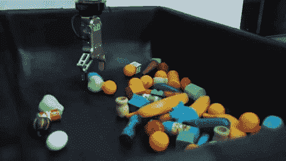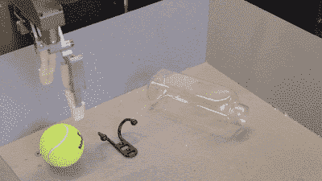

[[left](https://tossingbot.cs.princeton.edu/)][[right](https://ai.googleblog.com/2018/06/scalable-deep-reinforcement-learning.html)]

一种类型的 RL，基于模型的 RL，首先学习一个近似底层系统动态的模型，然后使用这个模型来规划或随后训练策略。基于模型的学习使得能够在一个环境中修改机器人的目标，因为该环境的动态被理解。

另一种类型，无模型 RL，直接学习策略，而不需要系统动态的显式表示。虽然更一般化，但无模型 RL 也有更多数据饥饿的经典权衡。

尽管前景看好，但机器人强化学习在工业应用中还没有取得太大成功。有几个原因。

首先，现实世界中的 RL 非常耗时，因为与模拟器不同，实验数量在时间和硬件方面无法并行化。此外，真正的机器人 RL 需要大量的工程工作，以确保在数据收集过程中东西不会损坏。这种限制自然导致数据多样性减少，因为机器人只能在工程环境中探索，而不是在任何环境中探索。**更少的数据多样性通常意味着机器人只能在类似于它被训练的环境中表现良好，这种环境违背了目的。**

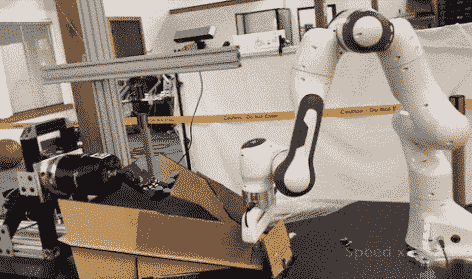

[[source](https://sites.google.com/view/pddm/)]

关于 RL 挑战的更详细的总结，请看 Alex Irpan 的博客[帖子](https://www.alexirpan.com/2018/02/14/rl-hard.html)。

# 遥操作和模仿学习

虽然自我监督学习可以用来通过试错收集大量真实的机器人经验，但这些方法是数据低效的——它们需要探索巨大的状态和动作空间。此外，定义好的和坏的行为(即奖励形成)可能是不直观的，会导致意想不到的行为...请参见下面的船只控制器。

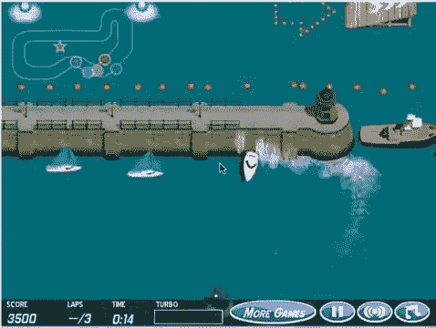

[[source](https://openai.com/blog/faulty-reward-functions/)]

通过从以人类演示为中心的非常窄的分布中采样，可以显著减少 RL 的搜索空间，但是获取大量的人类演示需要控制机器人的直观方法。为机器人收集人类演示的一个好方法是通过遥操作。

远程操作机器人有各种接口，从带有虚拟现实耳机的复杂触觉控制器到硬件极简系统，如移动设备和无标记姿势估计。更灵活通常意味着更多的硬件和成本，但众包界面应该利用无处不在的硬件。在理想情况下，机器人数据收集可以是有用的、众包的远程机器人劳动的副产品。

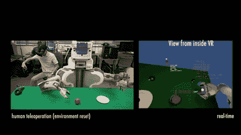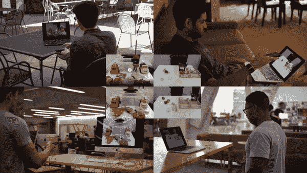

[[left](https://sites.google.com/view/vrlfd)][[middle](http://roboturk.stanford.edu/)][[right](https://sites.google.com/view/dex-pilot)]

虽然众包遥操作在概念上很吸引人，但远程遥操作的一个实际挑战是处理延迟。与控制 3400 万英里外的 [7 分钟](https://www.youtube.com/watch?v=Ki_Af_o9Q9s)延迟的火星探测器相比，控制 1 英里外 20 毫秒延迟的机器人将是完全不同的体验。

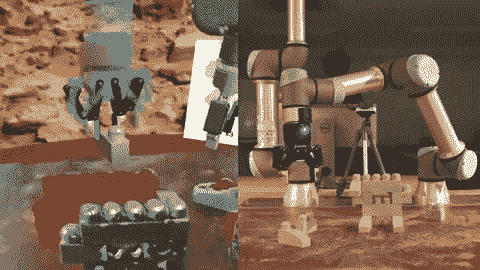

[[source](https://spectrum.ieee.org/tech-talk/robotics/robotics-software/construction-robots-learn-to-excavate-by-mimicking-humans)]

减少延迟的一个方法是使用异步控制——NASA 就是这么做的。这种权衡是对精细的时间运动控制和快速反应能力的牺牲，这就是为什么在 [DRC](https://spectrum.ieee.org/automaton/robotics/humanoids/darpa-robotics-challenge-robots-falling) 的遥控操作者不能挽救他们的机器人免于坠落。

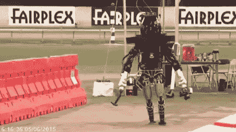

[[source](https://spectrum.ieee.org/automaton/robotics/humanoids/darpa-robotics-challenge-robots-falling)]

## [第三人称模仿学习](https://arxiv.org/pdf/1703.01703.pdf)

除了遥控操作，用人类学习的方式教机器人也很方便——通过观察他人。用机器人做这件事的挑战在于，在学习一项技能时，领域发生了根本性的转变，而这项技能是以不同于机器人的形态表现出来的。人类手臂和手的外观和动作与机器人手臂不同。要求机器人用不同的“身体”执行相同的任务只会增加学习的复杂性。第三人称模仿学习的优势在于，我们可以从成千上万已经存在的 YouTube 视频中训练机器人策略。

## [从玩耍中学习](https://learning-from-play.github.io/)

寓教于乐结合了仿真和遥操作的优点。它的想法是让人类通过遥控虚拟机器人在虚拟环境中互动来玩游戏。*游戏*数据与*任务演示数据*的区别在于，与实现任何单一结果状态相比，游戏对理解环境更感兴趣。这一特性允许人们有效地探索与环境互动和利用环境的各种方式。

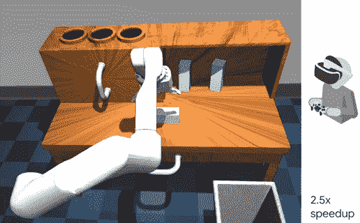

[[source](https://learning-from-play.github.io/)]

从玩耍中学习的动机是让机器人能够通过学习如何**准确解码可重复使用的潜在计划**来导航并与环境交互，而不是学习整个状态-动作空间的庞大编码。此外，与专家演示相比，游戏的特性允许学习到的策略对于扰动更鲁棒，并且更有效地从故障中恢复。

# 下一步是什么？

机器学习和人工智能的圣杯是人们称为 AGI 或人工通用智能的东西。它本质上指的是机器的智能水平，只要对任何新任务进行一次或几次演示，就可以达到或超过人类即时学习新技能的能力。

围绕这个术语有很多宣传，虽然还不清楚它是否以及如何实现，但有一个松散的共识，即我们的算法需要通过层次结构推向可推广性。转移学习、[元学习](https://arxiv.org/abs/1906.03352)和[神经任务](https://stanfordvl.github.io/ntp/) [图表](http://openaccess.thecvf.com/content_CVPR_2019/papers/Huang_Neural_Task_Graphs_Generalizing_to_Unseen_Tasks_From_a_Single_CVPR_2019_paper.pdf)是朝着正确方向迈出的步伐。这些方法在所有任务的子集上训练模型，目标是通过共享以前学习的低级技能(如抓取、推动和移动)来创建一个可以轻松转移或推广到任何新任务的模型。几乎所有的操纵任务都需要这些低级技能的某种顺序组合。因此，任何任务都可以表示为由较高级别的控制者在时间和空间上协调的低级技能的组合。这种分层框架支持转移和推广，因为不需要为每个新任务在大型数据集上重新训练模型。相反，相同的低级技能是共享的，并且这些低级技能的较高级组合构成了大多数任务，是每个新任务的学习重点。

# 摘要

虽然并不详尽，但我已经概述了机器人专家在开发更智能的机器人以帮助我们走出工厂时面临的一些最突出的挑战。更重要的是，我概述了一些我看好的潜在研究途径。对于那些想要深入研究机器人学习的人来说，这里有一份最近的[调查论文](https://arxiv.org/pdf/1907.03146.pdf)引用了 440 份其他出版物！

# 我对自动化的乌托邦式的看法

所有这些机器人的最终目标不是让我们所有的工作自动化。相反，自动化应该将人类从我们每年花费在单调体力劳动上的数万亿小时中解放出来，否则这些时间可以重新专注于解决我们似乎无穷无尽的更具影响力的问题，如治愈疾病、解决全球变暖、扩大清洁能源和食品生产以及使人类成为星际物种。对我来说，这听起来比利用人类——以及我们拥有的许多超能力——每天整天挑选和放置东西要好。

# 关于我

我是[斯坦福视觉和学习实验室](http://svl.stanford.edu/people/)的机器人学博士生，也是 [Nimble](https://nimble.ai) 的创始人，这是一家创建机器人蜂巢思维以自动化仓库中复杂任务的初创公司。

感谢我的好朋友和同事们[奇普·胡恩](https://huyenchip.com/)、[埃文·阿克曼](https://spectrum.ieee.org/author/ackerman-evan-)、[安德烈·库伦科夫](https://www.andreykurenkov.com/)和乔丹·道森，感谢他们对这篇文章的反馈和建议！

推特: [@simonkalouche](https://twitter.com/simonkalouche)