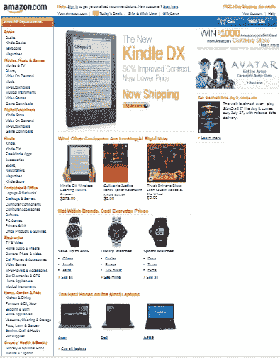
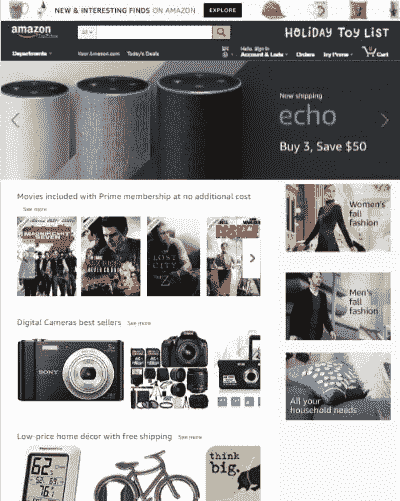
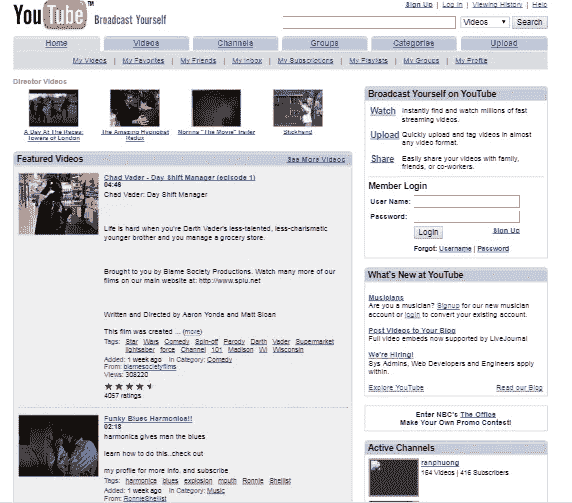
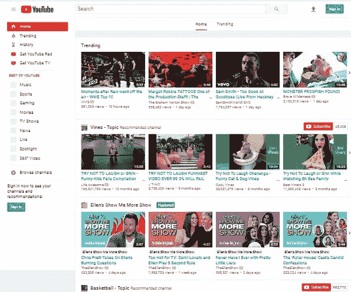

# 网页设计的演变，下一步是什么？

> 原文：<https://medium.datadriveninvestor.com/the-evolution-of-web-design-whats-next-edf5e164fb9a?source=collection_archive---------23----------------------->

以前的网页设计是什么样子的？它的未来是什么？过去是怎样，现在是怎样，将来会是怎样，这之间有很大的区别吗？

下面的图片比较了 2010 年的亚马逊网站和 2006 年的 Youtube 网站与它们现在的网站。

Screenshots are taken from [archive.org](https://archive.org)

使用 2006 年的技术，人们可以创建与 2017 年相同的界面。这是一个简短的故事。说来话长，这些年来，人们被训练上网冲浪，并培养出一种新的口味。这将我们引向未来。

# 网络应用中的虚拟现实

在 Google I/O 2017 上，一名谷歌软件工程师能够使用名为 WebVR 的 javascript API 在舞台上实时开发 360°图像画廊。

Javascript 是一种编程语言，被认为是任何网站背后的主要技术。所有互联网浏览器和设备都支持它，不需要安装任何插件。

API 是指应用程序编程接口。简而言之，一个软件开发人员创建一套方法和子程序来简化其他开发人员使用它和建立依赖它的应用程序。

由于 WebVR 是一个 javascript API，因此 web 开发人员应该很容易在他们的应用程序中应用虚拟现实体验。

webVR 的另一个优势是产生跨平台的应用程序，因为所有互联网浏览器和移动设备都支持 Javascript。因此，一个应用程序不仅可以在网络上运行，还可以在您的移动设备、平板电脑、安卓和苹果设备上运行。

# 使用 A 形框架更容易:

A-Frame 是一个框架，它依赖于 WebVR 来促进在您的 web 应用程序中构建 VR 体验。A-Frame 最初是由 Mozilla 开发的，正如他们所说的那样简单而强大。

安装非常简单——就像你在网页上添加 bootstrap 一样。只需将源代码放入

> *<脚本 src = "*[*https://aframe.io/releases/0.7.0/aframe.min.js*](https://aframe.io/releases/0.7.0/aframe.min.js)*"></脚本>*

# 挑战:

互联网用户过去常常点击链接并查看图像，而不是在虚拟现实空间的对象之间飞行。不管性能如何，提供一个完整的 web VR 应用对开发者和用户来说仍然具有挑战性。

**综上**，你认为未来的互联网用户会更熟悉 VR 兼容的网站吗？无论你是否同意，我们都很乐意在下面的回复中看到你的观点。

现在看 Google I/O 大会关于 WebVR 的部分

原刊[此处。](https://blog.plagscan.com/virtual-reality-web-applications/)