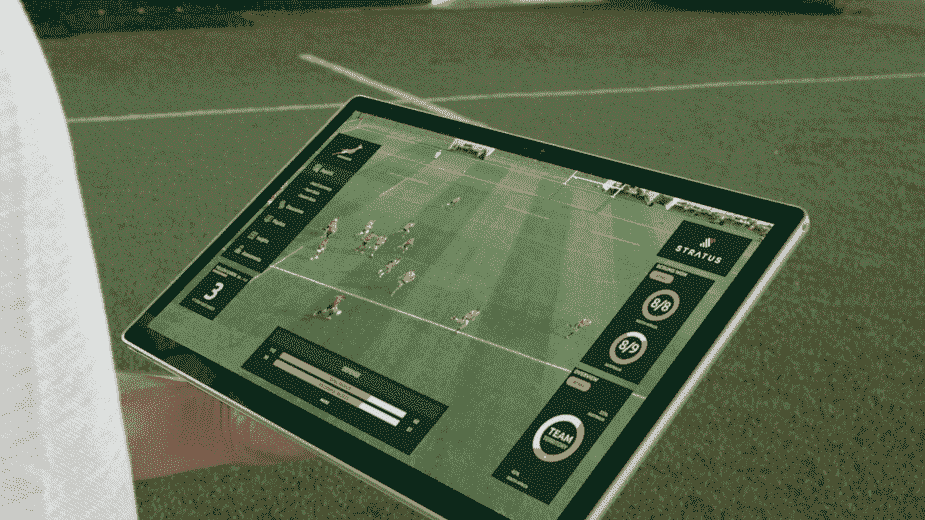
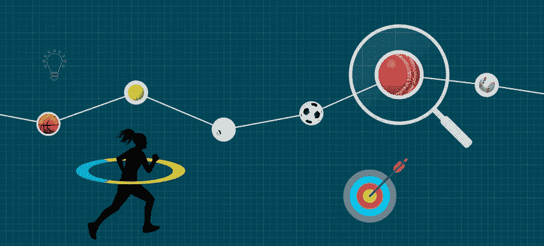
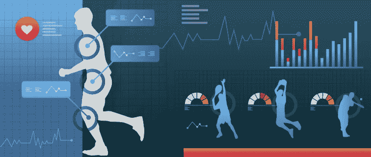

# 数据科学、统计和分析在体育运动中不断发展的作用

> 原文：<https://medium.datadriveninvestor.com/the-evolving-role-of-data-science-statistics-and-analytics-in-sports-df23ff56d669?source=collection_archive---------8----------------------->

Image from Microsoft.com

2019 年 3 月，就在橄榄球世界杯前几个月，南非橄榄球联盟宣布，他们与微软合作开发了一个成熟的数据分析和数字战略平台，以帮助他们为今年晚些时候举行的世界杯锦标赛做准备。南非橄榄球队首席执行官 Jurie Roux 强调，与微软的合作将为该队创造一个机会，开发创新的解决方案，做以前不可能做的事情，并最终将自己定位为一个赢得世界杯的球队，这最终在该队于 2019 年 11 月赢得第二届橄榄球世界杯时实现。该团队使用了一个名为 Stratus Reporting Engine 的平台，该平台使该团队能够组织和查看他们的所有数据，同时从 6，000 多个游戏中收集超过 4，000 万个数据点。

 [## 数据科学和软件工程哪个更有前途？数据驱动的投资者

### 大约一个月前，当我坐在咖啡馆里为一个客户开发网站时，我发现了这个女人…

www.datadriveninvestor.com](https://www.datadriveninvestor.com/2019/01/23/which-is-more-promising-data-science-or-software-engineering/) 

准备一直是任何体育活动的一个重要方面，运动员花费更多的时间准备比赛，而不是实际执行。随着技术和数据科学的进步，准备变得更加容易，也更加重要，因为现在不仅教练和球员，而且球迷和对手都可以获得高质量和大量的数据。

Image from Formcept.com

***那么其他团队是如何使用数据科学和分析的呢？***

数据科学使教练组和技术团队能够将数据转化为见解，教练和球员可以将这些见解转化为获胜的战术和战略。一旦所有的数据都被集成到各自的数据引擎中，机器学习和深度学习技术就被用来发现关键的学习和模型预测。

**使用高端摄像机捕捉玩家动作**

NBA、英国足球超级联赛、NFL 和 MLB 是一些顶级的体育活动，这些体育活动在其体育场和竞技场周围投资了非常高端的摄像机，以捕捉对每个球员、他们的位置、他们的比赛的最深入的分析，以及对对手的位置、比赛和移动的相应深入的分析。这些相机为数据科学家提供了一个机会，为教练人员提供简化的深度分析，这些教练人员以前必须浏览数小时的胶片，但仍然无法获得与当前技术和能力所提供的一样多的数据点，以将深度和机器学习工具应用于这些数据。这将允许团队尽可能具体地确定他们想要的数据点，准确地确定他们在确切的时间点需要什么。

***实时流和分析***

此外，体育数据分析的最前沿是在比赛进行过程中捕捉实时数据的能力，并帮助教练与分析部门就如何在比赛进行过程中做出改变或调整阵型进行沟通。拥有最先进的技术和分析团队的团队将有能力在游戏进行过程中快速将这些数据转化为实时的有洞察力的决策，并能够做出有影响力的更改和实时决策，例如谁需要休息，在游戏的哪个点，谁需要以什么样的具体指示被介绍。这成为一个非常关键的方面，对于没有资源或资金投资设备的团队来说，这是一个迫在眉睫的问题，数据专家将不可避免地处于不利地位。

Image from Georgetown.com

**运动员的健康状况。**

除了在比赛和训练期间监控运动员的摄像头之外，运动员还受到许多其他设备的监控，如心率传感器、加速度计甚至类似 GPS 的本地系统。数据被用于监控和分析运动员的健康状况，从而使团队能够为他们的运动员提供最好的条件和健康的环境，同时早期预测和检测任何疲劳、潜在伤害或疾病的迹象。

寻找新的天才

数据科学也正在改变团队搜寻新人才的方式。同样，数据提供了深入的分析，为战术和球员的优势和劣势提供建议

总之，随着团队不断寻找更好的方法来收集有关其球员、对手和其他可能影响团队成功的关键因素的更深入的数据，数据科学在体育中的作用越来越大，对体育的影响也越来越大。如果你有兴趣探索一些顶级的运动 API，这里有一个由 rapidapi.com 提供的列表

S **根据 rapidapi.com**评选出 2019 年度最佳体育 API

1.  [API-足球](https://rapidapi.com/api-sports/api/api-football) —最适合足球
2.  [板球直播比分](https://rapidapi.com/dev132/api/cricket-live-scores)——最适合板球比赛
3.  [API-NBA](https://rapidapi.com/api-sports/api/api-nba) —最适合 NBA
4.  [丛林奇兵](https://rapidapi.com/therundown/api/therundown)——最佳实时赔率和比分
5.  [实况体育赔率](https://rapidapi.com/theoddsapi/api/live-sports-odds)—NFL、NBA、MLB、EPL、& AFL 的最佳实况赔率