# 如何利用浏览器“开发工具”的例子

> 原文：<https://medium.datadriveninvestor.com/the-example-of-how-to-utilize-developer-tools-of-browser-1b17f3d56236?source=collection_archive---------17----------------------->

source: [https://web.facebook.com/healcounselingcenter/photos/a.1651162425116148/2191710561061329/?type=1&theater](https://web.facebook.com/healcounselingcenter/photos/a.1651162425116148/2191710561061329/?type=1&theater)

这是我关于网站开发的第一篇文章。尽管我在几年前就研究过这个话题，也做过几个网站主题的项目，但实际上我对网站编程并不感兴趣。这就是为什么直到今天我才在我的博客或媒体上发表关于 web 编程的文章。

在我目前的项目中，我需要建立一个管理仪表板，以便管理员可以轻松地编写、编辑或删除他/她的文章。为了实现这些，我需要一个好的所见即所得编辑器(所见即所得编辑器)。我做了一些谷歌搜索，发现了弗罗阿拉编辑器。

source: [http://www.romanianstartups.com/wp-content/uploads/2016/06/froala-logo-1.png](http://www.romanianstartups.com/wp-content/uploads/2016/06/froala-logo-1.png)

这个编辑器很漂亮，我决定在我当前的项目中使用它。我包含了所有的 JS 和 CSS，并按照 Froala 网站上的说明安装了 Froala 需要的 SDK。真正的问题开始了。为了上传一张图片到服务器，你需要设置这个函数的一个参数(根据 Froala 网站)。

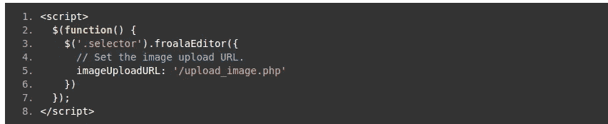

cropped from [https://www.froala.com/wysiwyg-editor/docs/sdks/php/image-server-upload](https://www.froala.com/wysiwyg-editor/docs/sdks/php/image-server-upload)

所以我在我的剧本里也这么做了。

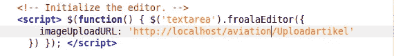

并构建一个脚本来处理上传的图像。在 Froala 网站上，是这样做的。

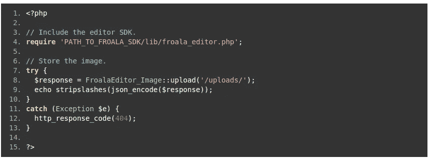

cropped from [https://www.froala.com/wysiwyg-editor/docs/sdks/php/image-server-upload](https://www.froala.com/wysiwyg-editor/docs/sdks/php/image-server-upload)

所以在我的剧本里，我是这样做的。

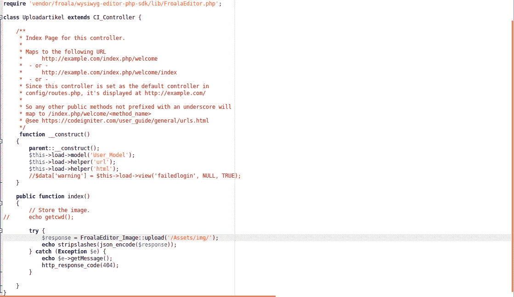

Yes, I am using code igniter

然后我测试网站

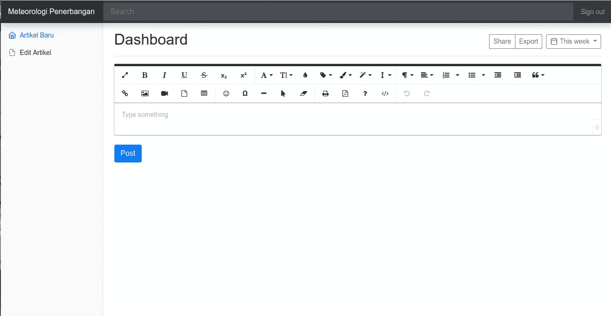

Looks good, there is no error.

为了测试，试着上传一些随机的图片。

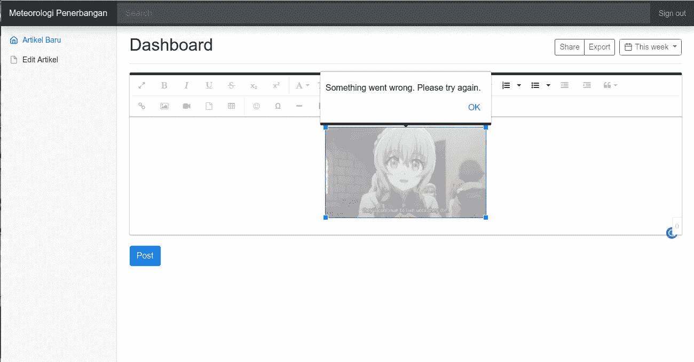

Aw snap, we got an error.

让这个错误真正难以调试的是**出现这个错误的原因有很多种可能**(无论是由于之前处理上传图像的 javascript 函数或 PHP 脚本中的参数错误)和**可见的错误消息“确实非常有用”**(“出错了。请再试一次。”谢谢大家的信息，真的很有帮助:)。

几天前我还在纠结这个错误，想着我的脚本中可能会出什么问题。我忘记了 chrome 等浏览器中的强大工具。

当我几乎要放弃时，我试图通过寻找其他娱乐来平静我的心灵，然后我意识到，我忘记了在帮助 web 开发人员工作方面非常有用的强大工具，它可以在 Chrome 这样的浏览器中使用。名字是

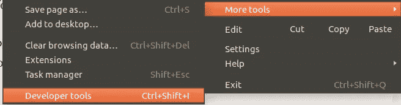

Developer tools

为了分析哪里出了问题，我们来分析一下我在 Froala 上传一张图片时的网络过程。

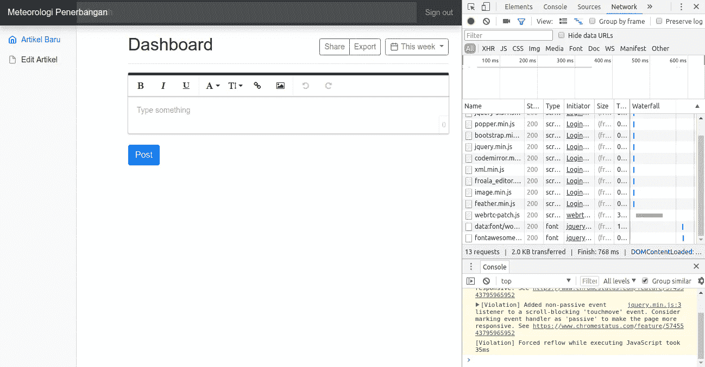

When I open the web page, seems like there is no error.

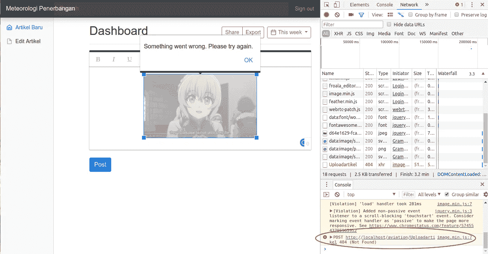

Voila, we got some interesting error message

这表明我在前面的 JavaScript 脚本中设置的 URL 是错误的。让我们来修复 URL。

并重新上传图像。

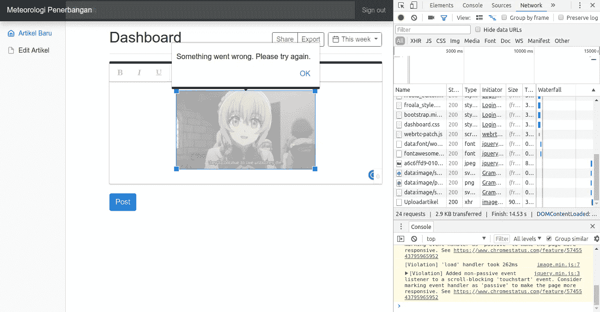

Still Fails

URL 现在是有效的，但不知何故仍然失败。让我们看看处理脚本的响应。

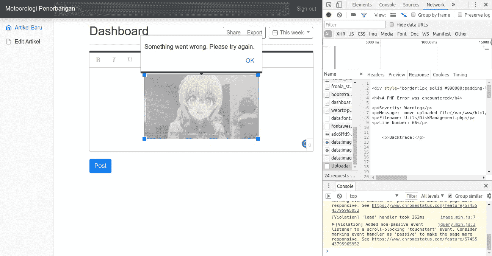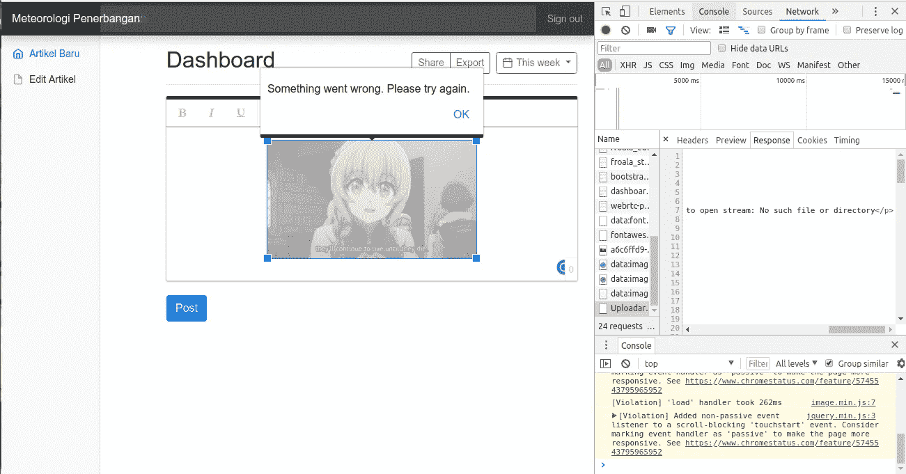

The error message is too long, so I need 2 screenshots to cover all the error message.

“没有这样的文件或目录”。这意味着我在处理脚本中提供的目录地址是错误的，让我们修复它。

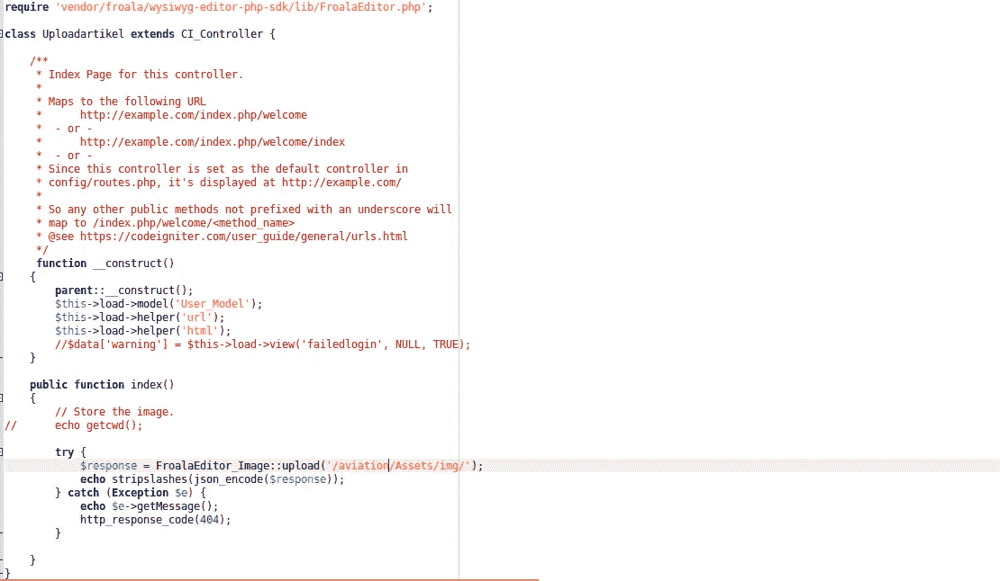

让我们刷新网页，重新上传图片。

Hooray, success!

图像已成功上传。

这是在浏览器中使用开发者工具的真实例子之一。如何将在这个编辑器中制作的文章上传到数据库是题外话(也许我会在另一个故事中解释，但我不确定什么时候也许永远不会)。另一个故事再见。