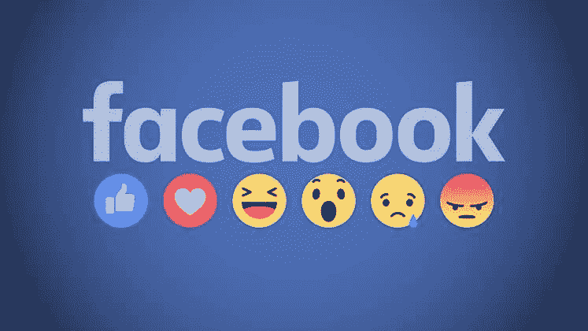
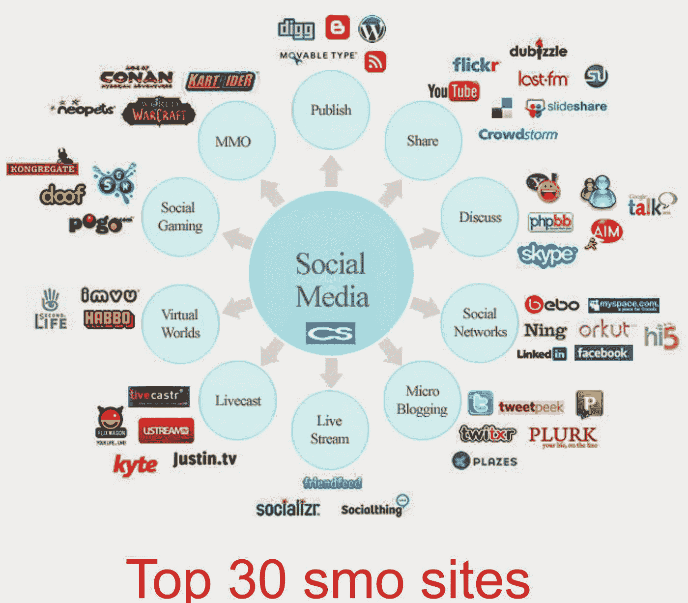

# 脸书难题

> 原文：<https://medium.datadriveninvestor.com/the-facebook-conundrum-c9a65ab0a34f?source=collection_archive---------35----------------------->

多年来，脸书是我唯一使用的社交媒体网站。他们的欢迎页面说明了一切，“脸书帮助你与你生活中的人联系和分享。”这是真的，不是吗？这就是为什么这些年来我一直和它在一起

甚至当我骄傲地宣称自己是社交媒体的勒德分子时，脸书是个例外，这就是原因。Twitter 对他们的字符限制和格式太肤浅了，感觉我永远跟不上对话。LinkedIn 太以商业为导向了，在我开始做自由职业者之前，我觉得没有必要。Pinterest 似乎面向妈妈群体。Instagram 和 Snapchat 显得太年轻，太相似，剩下的都是铺天盖地。

脸书是一个似乎拥有一切的地方。如果我想的话，我可以定制我的帖子的长度，关注专业或个人的更新，或者图片。我随时都可以把它弄混。有了 FB，我可以随心所欲地分享我的生活，同时选择我想看多少其他人的生活。这感觉就像是社会联系和个人距离之间的平衡，因为没有人想和他们的朋友和家人太亲近，对吗？

从事自由职业后，我开始使用其他网站。我看了很多关于 SEO 和营销策略的信息。大多数文章声称你必须出现在每个社交媒体网站上才能去任何地方。他们给出了商业与个人帖子的具体比例、行动号召，甚至是易于品牌识别的颜色设计。我在博客上花了很多功夫，我在社交媒体上推广自己，我用热门词汇和标签来定位搜索引擎。我确实看到了进步。生意有所起色，我有演出和截稿日期。但如果我从社交媒体营销中放松下来，去做我的有偿工作，我下个月的客户名单就会受到影响。我在脸书和其他网站上发布的信息越多，就越有可能成为像我一样的其他企业的广告算法的目标，或者成为可以帮助我扩张的顾问的目标。

大约在那个时候，我开始感到不知所措。我知道这和工作有关；我开始了自己的事业，我还在做兼职，我已经搬到了一个全新的城镇。在仔细审视了我的情况后，我知道我的压力很大一部分来自工作，但这对我来说很正常。毕竟大家不都是这样吗？工作不是应该有压力吗？不就是这样知道自己在努力吗？

即使知道问题出在工作上，我还是认为自己在做作为一名新面孔自由职业者应该做的事情，我在研究中找不到任何东西让我认为还有其他方法，所以答案肯定在其他地方。我读了所有关于压力的研究，拿了我喜欢的，决定成为一个极简主义者。

## 用大写字母 m 表示最简主义者

我读了《整理生活的康玛丽方法》。我听了 Ted 关于组织的演讲，特别提到了 Rory Vaden 的 [*如何倍增你的时间*](https://youtu.be/y2X7c9TUQJ8) 。当然，我尽可能地阅读了极简主义大师约书亚·菲尔兹·米尔本和瑞安·尼科德摩斯的作品。我的整个生活变得简单而高效。这似乎奏效了。

房子里的杂物少了，意味着我能更好地保持家里的整洁。这意味着我分心的事情更少，拖延工作的机会也更少。而且，知道我没有太多的清洁或准备工作要做，我更愿意邀请家人和朋友来我家，所以我感到社交充实，有更健康的关系。

但是随着环境干扰的消除，我很快发现我并没有解决真正的问题。当你为自己工作，没有人可以依靠时，工作压力通常是正常的。企业家工作时间很长，没有很多外部支持。你只能希望用你在做你喜欢的事情和投资你的未来来平衡它。我想我用山姆·奥文斯的智慧发现了我真正的问题，

> 你的业务正在遭受损失，因为你 80%的时间都花在营销上，而你只花了 20%的时间在实际产品上。

认识到这一点后，我研究了简化流程的方法。我研究了自动脸书广告、联盟广告和提高我的搜索引擎优化定位。这些策略中的一些确实有助于建立我的客户名单，但是每当我打开电脑时，压力仍然会增加。

在跟踪了我一个月的互联网使用情况后，我意识到我原来的解决方案并没有那么遥远，但现在我需要关注来自不同来源的混乱。万维网。网上有这么多事情可做，难怪有人抱怨无聊。我可以开始阅读关于深空探测的[未来的文章，并以数字零](https://youtu.be/EBebWBjpWIQ)的[起源结束。不要在意那些似乎总是找上你的消极的东西；广告、解说新闻、游戏促销，以及家人和朋友通常的谦虚吹嘘。](https://www.smithsonianmag.com/history/origin-number-zero-180953392/)

# 然后是拖延方程式。

大多数研究表明，在我们需要休息之前，我们一次大约有 2-4 个小时是有效率的，试图强迫自己工作超过这个限度往往会导致更多创造性的拖延方式。脸书让你很容易欺骗自己，以为自己比实际更有效率。也就是说，直到你看一看页面底部的字数。

我不知所措，我讨厌那种感觉。经验告诉我，任其溃烂会把拖延症变成逃避，或者使人虚弱的抑郁症。转向极简主义让我学会了摆脱那些让我沮丧的事情。

> 抛弃一切不能带给你快乐的东西。

这就是康玛丽方法，也是极简生活的核心。这不是数你拥有多少，永远不要让它超过某个数字。这是关于爱你所拥有的，并摆脱那些不会增加你快乐的东西。话说回来，幸福和饥饿往往是相互排斥的，而脸书对我的营销活动来说是相当必要的。我无法摆脱它，是吗？

每天我打开电脑，查看电子邮件，然后前往脸书。即使我没有在这个网站上花太多时间，这个标签一整天都是打开的。如果有人使用 messenger 或回复帖子，发送提醒，并在视觉上扰乱我的窗口。当我一整天都专注于社交媒体营销时，你可以想象从各种社交媒体网站打开的标签数量。他们让我相信，我只能通过他们、他们的算法、他们的用户来获得我需要的客户流量；毕竟，每个人都在脸书，对不对？

我想很快每个人都要做出我现在做的决定的时候就会到来。我在乎我堂兄的婴儿送礼会的消息必须通过第二手或第三手才能传到我的耳朵里，而不是通过我的新闻订阅得到照片吗？如果我解雇了脸书，我的生意会不会受到比我所能弥补的更大的打击？社交媒体的好处大于不便吗？

我们曾经想要能让我们一次看到所有东西的应用和软件。现在我们想要技术，让我们关闭一切。我们希望能够控制我们看到的东西和我们看到它的时间。不再有无限的滚动，或者新闻网站上的广告比我们试图阅读的文章占据更多的空间。

# 在一个信息爆炸的世界里，消费者正快速到达这样一个点，我们只希望我们看到的一切都有一个明确的结局。