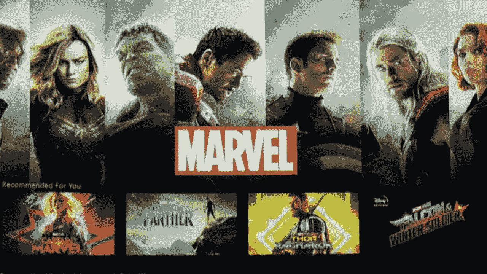
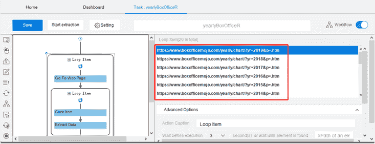
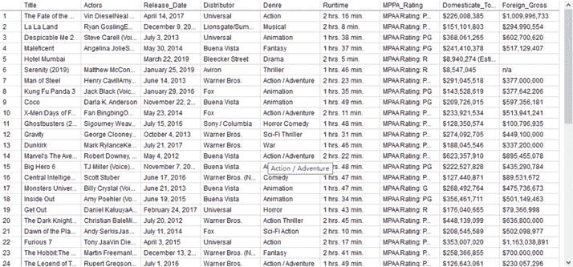
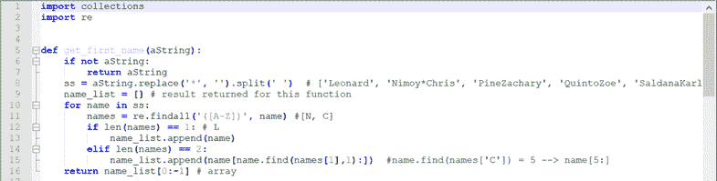
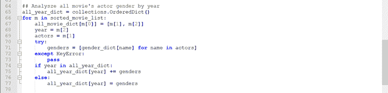
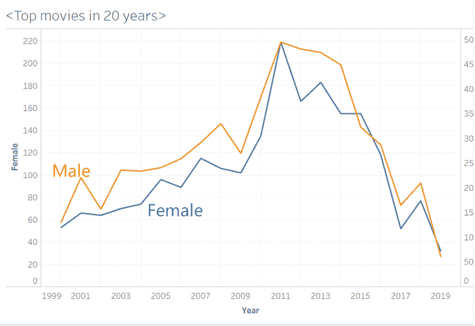
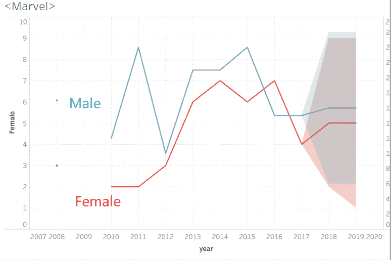

# 女权主义漫威电影背后的事实

> 原文：<https://medium.datadriveninvestor.com/the-fact-behind-the-feminist-marvel-films-f544be16942a?source=collection_archive---------10----------------------->

随着神奇女侠、杰西卡·琼斯、黑寡妇和惊奇队长的走红，我想知道是否有任何迹象表明电影业中性别平等的转变。我将分析近二十年来 2000 部电影中演员的性别比例。我们将能够看到电影工业中女性角色的变化以及女性社会地位的关系。然后，我们将仔细研究漫威电影中名人的性别，因为他们在英雄电影中具有代表性。

这个想法是对名人名字进行性别分析，并使用 python 计算每年每部电影中的性别出现次数。

首先，使用 Octoparse 从票房 mojo 中抓取电影信息。我已经用了很多次了，因为它是完全免费的，有无限的可刮页面。mojo 中年度票房的 URL 遵循一个固定的模式，在末尾有一个固定的主机名和一个年份标签。例如，票房的网址是 https://www.boxofficemojo.com/yearly/chart/?yr=2019[&p =。htm](https://www.boxofficemojo.com/yearly/chart/?yr=2019&p=.htm)2019 年和【https://www.boxofficemojo.com/yearly/chart/?yr=2018】T4&p =。2018 年 htm 。也就是说，如果我们遵循这种模式，我们应该能够获得 2000 年至 2019 年的 URL 列表，如下所示:

用 **Octoparse 加载这个列表。**它会自动创建一个循环提取列表。Octoparse 会引导你创建一年内电影的另一个提取列表，点击提取包括片名、演员、发行商、国内 _ 总 _ 毛、国外 _ 毛等数据。大约 20 分钟后，我们得到了 20 年中 2000 部电影的所有细节。

第二，使用 python 处理数据，使文本被标记化。

第三，得到一年电影中男女演员的数量。为此，我加载了一个性别字典列表，它分析名字并返回性别。

拿到列表后，我把数据可视化如下。

两条线朝同一方向移动。两条曲线在 2010 年前都向上移动，在 2011 年达到峰值，此后向下移动。演员的数量总体上在减少。这可能预示着电影业的衰落。两者之间的差距总体上呈缩小趋势，但 2011 年和 2015 年之间的差距有所扩大。也就是说，性别差异在电影业根深蒂固。男演员的数量是女演员的两倍多，尽管这表明了男女演员数量平等的倾向。

漫威怎么样？

相比之下，自 2012 年以来，两条线都向上移动，在 2012 年和 2013 年之间有一个陡峭的增长。经济复苏期间，英雄电影越来越受欢迎。此外，与 2012 年之前的数字相比，女演员显示出快速增长。这可能说明了电影业试图在英雄系列中引入更多女性演员的事实。2012 年经济的复活，在英雄电影中起到了平衡数字的重要作用。英雄形象代表着民族身份，其中蕴含着“自由”和“民主”的理念女性开始推动情节发展，而不是支持男主角。《分歧者》(2014)、《侠盗一号:一个星球大战的故事》(2016)、《饥饿游戏》(2012)、《露西》(2014)、《疯狂的麦克斯:狂暴之路》(2015)、《神奇女侠》(Wonder Woman)，我们在银幕上有了不同类型的超级英雄女性，超级英雄的受欢迎程度清楚地表明了女性的社会地位向救赎的迫切角色转变。

自 20 世纪 30 年代问世以来，超级英雄电影已经成为打击犯罪、社会正义、自我牺牲以及最重要的男性赋权的象征。超级英雄的形象如此成功，以至于人们被灌输了一种观念，即一个人生来就是拯救生命的。我说不出我有多感激玛丽·简，她是一个如此纤弱、美丽但脆弱的女人，注定要被坏人抓住，被蜘蛛侠拯救。我期待更多的有色人种女性像《疯狂的麦克斯:狂暴之路》和《惊奇队长》中的弗里奥萨一样坚强、独立，成为她们自己的英雄。

*原载于 2019 年 4 月 24 日*[*【https://www.octoparse.com】*](https://www.octoparse.com/blog/the-fact-under-the-feminist-marvel-films)*。*