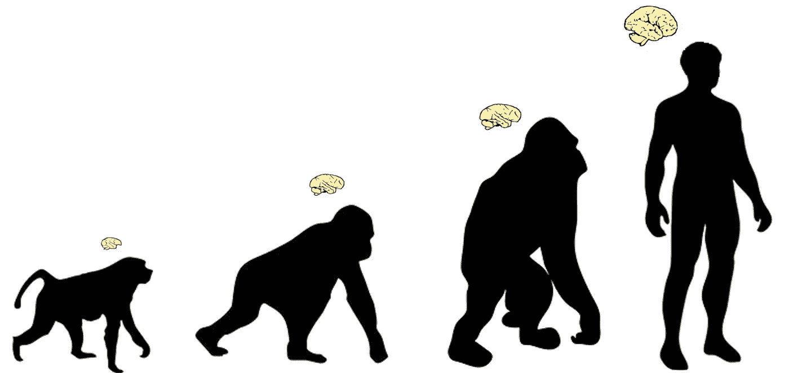

# 快速项目——简介:从进化过程中引导一般人工智能

> 原文：<https://medium.datadriveninvestor.com/the-fast-project-introduction-bootstrapping-general-ai-from-evolutionary-progress-6b2b2bccac61?source=collection_archive---------13----------------------->

> free Artificial Sentient Technologies(FAST)是一个开源项目，致力于研究和开发符合伦理的人工感知，以解决一般问题。它的灵感来自目前人类已知的最复杂的结构——人脑。

# 宗旨

这个项目声称，我们每个人都被赋予了自然界最引人注目的成就之一，即人脑——一种数据结构，其中驻留着足以反映人类意识的主观现象的过程和模式。它进一步认为这些过程和模式是自然选择的，并受自然物理定律的约束。因此，它们可以被模拟和复制。

直截了当地说，FAST 项目旨在将自己定位为一个合作和教育平台，不仅用于创造人工智能，还用于创造安全、道德和有用的人工感知。

## 介绍

我们所拥有的这种普通智力，目前只存在于有意识的人类领域中。因此，如果有一天要实现人工智能，可能需要理解导致我们感知体验的机制。

人类大脑的设计通过达尔文过程发生了大约 37 亿年，其等级结构现在促进了最令人费解的属性的出现，我们断言这是我们存在的证据——我们每个人的模拟“我”——我们的意识；尽管如此大量的时间是设计大脑所必需的，但这并不是生产大脑的必要条件。从法律上讲，至少可以在大约 24 周内制造出一个可行的人脑(Roe V. Wade，1973)。大自然母亲在子宫里组装每个人类胚胎时，根据精子和卵子表达的明确指令来完成这一壮举。有了我们自己的类似蓝图，以及神经成像和 3d 打印的进步，我们有理由假设有一天我们可能会建造自己的蓝图。然而，这几乎不是故事的结尾；随着时间的推移，感觉既是大脑输入和自我参照本性的产物，也是它的物质基础。因此，也必须开发计算模型(可能由量子计算的大规模并行性推动)来模拟它们。

为此，这个项目的目的是通过窥视成品的“引擎盖”来利用这 37 亿年的进化 R&D，自上而下地复制大脑的设计元素，以便更好地了解我们自己的意识，并最终在不受我们自身生物限制的空间中复制它的某些版本。

## 伦理问题导致开源和教育

> “面对全球人工智能的进步，如果我们打算继续任何类似于我们‘人类’的生活方式，这种方法可能是至关重要的”

追求人工感知的成功伴随着一些重大的社会问题，其中一些包括—

1.  它有可能成为一种非常有用的工具，或者是一种强有力的压迫性武器。
2.  几千年来宗教和传统思维方式的失效，可能会从根本上动摇社会法的基础。
3.  一个“自由意志”的存在，有它自己的对与错的定义。这就带来了一种可能性，一些在感知上看起来*正确*的行为可能明显*错误*，甚至对它的创造者是可怕的有害。
4.  鉴于自由被认为是所有有意识的事物的固有追求，与控制和剥削“存在”相关的伦理问题。

尽管这些影响很严重，但不应妨碍我们的进步。相反， [*共享* *主动性*](https://medium.com/@dustinfast/coronal-mass-ejections-and-the-ethics-of-adopting-risky-technologies-713124d6912d#9887) 方法可能会降低风险，如果这一方向的技术不是专有的或局限于少数专家，而是免费提供给所有人，让他们以民主和受教育的方式理解、考虑和贡献。

如果我们打算继续我们“人类”生活方式的任何外表，这种方法在面对全球人工智能进展时可能是至关重要的。考虑到这一点，FAST 项目是在 [GNU 通用公共许可证 v3.0](https://www.gnu.org/licenses/gpl-3.0.en.html) (GPLv3)下开源的。根据 GPLv3，项目资产可以免费使用和修改，但是禁止在任何“闭源”项目中使用。

我们在说你的语言吗？
“关注”作者，获取未来与项目相关的文章、更新和存储库链接。

**即将发布的文章** 快速项目——自上而下的设计:吹毛求疵
快速项目——先天知识:苏格拉底错了吗？
FAST 项目——人类自动机和失踪系统