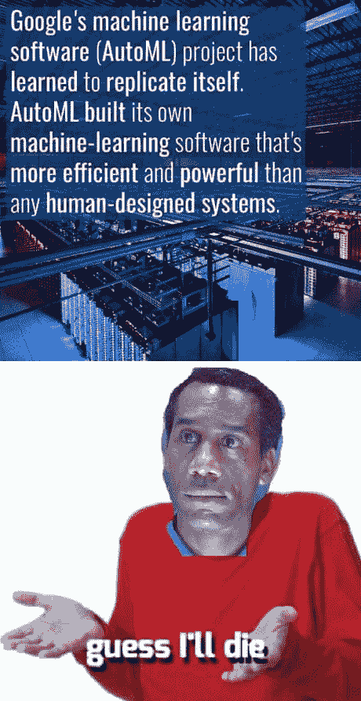
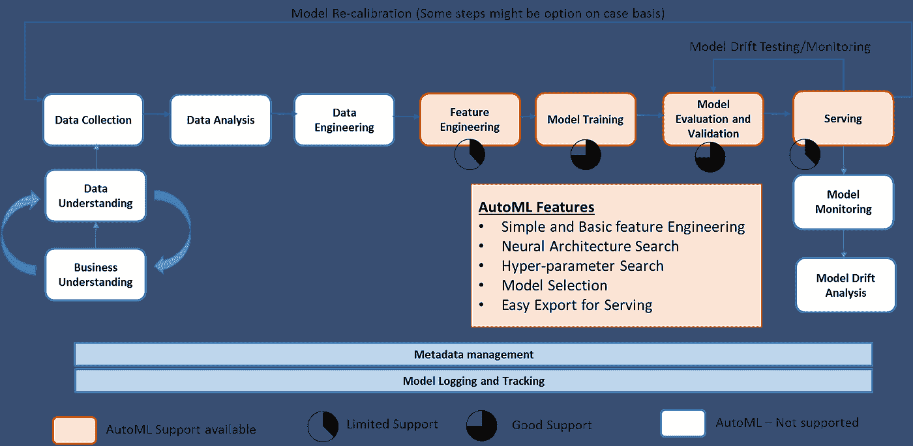
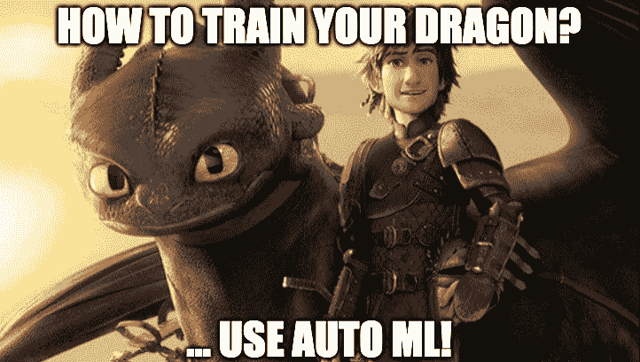

# 数据科学家称之为自动恐惧症

> 原文：<https://medium.datadriveninvestor.com/the-fear-in-data-scientist-called-autophobia-f875ffa58e8a?source=collection_archive---------3----------------------->

Image Source : [https://www.healthtopia.net](https://www.healthtopia.net)

让我从一个话题打破者开始，这篇文章的目的是消除对 AutoML 取代或放弃 data scientist 的恐惧。现在回到文章

自动恐怖症实际上是一种人格障碍，起因于**“那些生活在持续的恐惧中的人，如果他们的保护者或所爱的人抛弃他们，他们的‘世界’就会崩溃”**(你可以谷歌一下了解更多细节)

 [## 成为数据科学家所需的 8 项技能——数据驱动型投资者

### 数字吓不倒你？没有什么比一张漂亮的 excel 表更令人满意的了？你会说几种语言…

www.datadriveninvestor.com](https://www.datadriveninvestor.com/2019/02/07/8-skills-you-need-to-become-a-data-scientist/) 

自动恐惧症与数据科学家和 AutoML 有什么关系

当像 AutoML 这样的术语被营销公司利用时**“数据科学家生活在持续的恐惧中，如果组织投资 AutoML，他们的‘未来工作’将会过时”**

当一个流行的汽车网站引用下面的话时，为什么不害怕呢

“机器学习应用的快速增长创造了对现成的机器学习方法**的需求，这些方法可以轻松使用，无需专业知识**。我们将由此产生的以机器学习的渐进自动化为目标的研究领域称为 AutoML。”- **来源**-[https://www.ml4aad.org/automl/](https://www.ml4aad.org/automl/)

Jeff Dean 在 Tensorflow Dev summit 2018 上介绍他们的自动神经架构框架解决方案时也展示了这张幻灯片

我对它的看法…

AutoML 不会取代数据科学家。AutoML 虽然可以通过自动化部分枯燥的机器学习周期来提高数据科学家的速度和效率，并帮助数据科学家专注于将交付真正业务成果的活动

杰夫·迪恩会错吗？..

谷歌的杰夫·迪恩领导着一个研究大规模人工神经网络的团队

已有研究和事实证明，人工神经网络可以对图像和文本等非结构化数据进行自动特征工程。另一方面，当今企业处理的 90%的数据仍然是结构化的或表格形式的。即使是非结构化数据，企业也必须融合结构化信息才能获得相关结果

AutoML 的自动化特征工程部分不能代替对复杂业务流程的领域理解。**源自对数据和业务流程的领域理解的特征工程是有趣的模式所在，并且能够对模型结果和输出产生实质性的积极影响**

说到这个问题，“杰夫·迪恩错了吗？在某种意义上，他对谷歌试图解决的非结构化数据的复杂问题是正确的，在这种情况下，AutoML 可能是有益的，在数据是表格或结构化并具有复杂模式的情况下，AutoML 可以通过自动化一些日常活动来帮助数据科学家，但不是全部。

> 把 AutoML 想象成数据科学家的助手。在只有 CxO 拥有助手特权的组织中，数据科学家也有一个名为 AutoML:)的助手

当我读这篇文章时，我听到你心中有三个问题:)

**问题 1) KaggleDays SFO 竞赛是关于结构化数据的，Google AutoML 在排行榜上名列第二？**

**回答-** 大多数企业不得不将解释能力置于准确性之上。Google AutoML —神经网络搜索生成的模型大多是黑盒模型，难以解释。虽然有解释它的技术，但今天大多数都是不完全准确的后模型解释

**问题 2)研究人员声称，神经网络初始层捕捉直接从数据中学习的低级特征。AutoML 的基准识别性能优于精心制作的特征工程？**

**回答-** 以上对于非结构化数据是正确的，但对于结构化信息，神经网络所能设计的只是一堆**特征交叉和特征交互**。这些可能也不完全准确，需要通过领域理解来验证。除此之外，这些黑盒模型使得人们很难理解内部特征工程过程。在复杂的数据集中，特征工程不仅仅是这些黑盒模型所能做的

> 源自对数据和业务流程的领域理解的特征工程是有趣的模式所在，并且有能力对模型结果和输出产生实质性的积极影响

**问题 3)事实证明，使用 AutoML 产品可以节省大约 50%的成本。如果不去掉数据科学家的角色，会影响行业对数据科学家的需求吗？**

**回答-** 如今，AutoML 产品主要协助模型开发，尤其是模型和超参数选择。模型开发只占整个端到端模型管道的大约 10%到 15%,因此 AutoML 在端到端机器学习周期中的总体作用是最小的。

随着企业能够将 ML 的日常活动传递给自动化框架，企业将能够在实验中更快地得到假设。这将在整个企业中开启更多智能解决方案部署，为数据工程师、数据科学家和软件工程师创造更多需求

***如果您有任何具体的问题或意见，请使用下面的评论区，我们将很乐意回答您的问题***

在我们详细讨论 AutoML 可以提高数据科学家效率的场景之前，让我们先了解机器学习生命周期，然后了解 AutoML 在数据科学过程中的作用

如果您看到上面的机器学习生命周期表示，AutoML 在模型选择、架构搜索、超参数调整方面有很好的支持，而在功能工程和部署方面有非常基本的支持，在生命周期的一部分几乎没有支持，而实际机器学习工作的 80%都花在这一部分上

很少有产品声称可以自动进行数据分析，但大多数产品只支持简单的单变量分析、汇总统计，甚至更多。在这个阶段，数据科学家仍然需要做大量的手工工作

现在让我们来看几个领域，在这些领域中可以利用 AutoML 来交付更快的假设和人工智能项目的结果

*   创建基线模型-数据科学家通常通过多模型算法运行数据，以找出最适合底层数据的模型。基线模型通常是在项目开始时创建的基本模型，然后进一步迭代以得到更复杂的解决方案，从而获得更好的结果。与其为每个算法编写代码并运行它，不如让 AutoML 替你做。选择 top 2 模型算法并进一步迭代
*   超参数调整和神经架构搜索—神经网络很难设计，因为有数百种架构可能性和超参数组合需要寻找。若干层、每层中的神经元、卷积滤波器、学习速率等等。与其花时间手工计算，不如让 AutoML 来做它的工作。即使对于常规的机器学习算法，模型选择和超参数搜索也可以节省大量的时间和精力

*   模型的重新校准——这是我最喜欢 AutoML 的地方。当今的模型需要频繁地重新校准，因为基础数据和业务假设变化太频繁。对于一些复杂和关键的业务流程，它可以是每天一次，而对于其他业务流程，它可以是每周一次或每月一次。这些重新校准的模型可以作为当前模型的挑战者进行部署，并根据实时数据进行监控，直到它扮演冠军模型的角色。AutoML 是生产这些重新校准的模型的好方法，因为当我们进入重新校准阶段时，整个数据工程管道以及特征库已经就位

最后，AutoML 对数据科学家来说是无价的资产，拥抱它吧。

> 专注于交付更快更好的业务成果，而不是专注于算法和代码

这是交叉贴自我的 LinkedIn 文章-[*https://www . LinkedIn . com/pulse/fear-data-scientist-called-autophobia-srivatsan-srinivasan/*](https://www.linkedin.com/pulse/fear-data-scientist-called-autophobia-srivatsan-srinivasan/)

感谢我在谷歌图片搜索中得到的好模因背后的个人:)