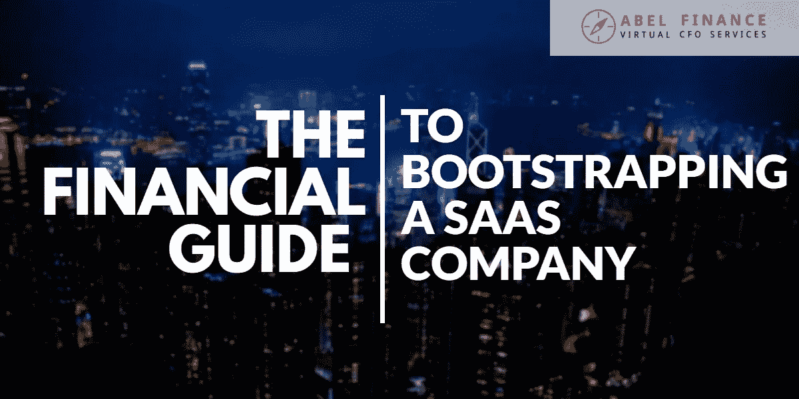

# 创办 SaaS 公司的财务指南

> 原文：<https://medium.datadriveninvestor.com/the-financial-guide-to-bootstrapping-a-saas-company-3a341d8abdd3?source=collection_archive---------10----------------------->

所以你正在建立你的 SaaS 公司，并且你已经决定启动它——因为你想以你自己的方式按照你自己的方式做事。

现在，如果你正在寻找商业建议和指导，你可以参考大量的在线资源。例如，我们发现[史诗般的 SaaS 创业指南](https://blog.gettamboo.com/the-epic-guide-to-bootstrapping-a-saas-startup-from-scratch-by-yourself-part-1-4d834e1df8c1)非常有用；这是克利福德·奥拉维奇写的，他是 SaaS 工具 Tamboo 的创始人。

一旦你读完了 SaaS 公司创业的最佳实践，一定要看看创业的财务方面。你的财务在影响你公司的成功(或失败)方面起着巨大的作用——所以不要只是把你所有的时间和精力都放在打造你的产品上，而忽视了你的财务状况。

在这篇文章中，我们将带你了解创业 SaaS 公司时应该牢记的六个要点。请继续阅读，了解更多信息！

# 1.回报是最重要的指标

作为一名 SaaS 企业主，你会希望关注不同的 SaaS 指标，包括收入增长率、毛利润、MRR 流失、客户获取成本、回收期、运营现金流、速动比率和流失风险。

(快速旁白:要了解关于这些指标的更多信息，请阅读我们的文章:[每个所有者必须管理的 8 个 SaaS 绩效指标](https://abel-finance.com/8-saas-performance-metrics/))。

在所有这些指标中，您应该关注的最重要的指标是回收期，它是使用以下公式计算的:

**回报= (CAC) /(每客户每年的毛利润)**

从本质上说，回收期衡量的是你需要多长时间才能赚回你的收购成本。如果你正在启动你的 SaaS 公司，你需要把投资回收期最小化——至少在一年之内(如果你想挑战自己，我们已经看到短至一个月)。

为什么投资回收期短很重要？简而言之:回报越快，你在客户身上赚钱就越快。你在一个客户身上赚钱越快，你就能越快地把钱花在获取更多客户上。换句话说，较短的回收期可以更快地释放客户获取资本，让您可以再投资于增长。

# 2.现金为王

你应该让你的客户提前付款，还是只在月底给他们开账单？这最终取决于你，但由于你正在启动你的 SaaS 公司，我们认为让客户预先付费是让你快速发展的关键。

考虑一下:受资助的公司手头有大量现金来支付营销成本、员工工资和杂项开支。另一方面，自力更生的公司正在用少得多的资源工作——一旦他们的初始资本没有了，他们将不得不赚他们想花的每一分钱。

考虑到这一点，我们建议提前向您的客户开出账单——这将为您提供扩大团队和投资营销所需的现金头寸。许多 SaaS 公司的做法是，如果他们的客户提前支付一整年的费用，就给他们一个很大的折扣——这让客户的利润更低，但也让你有现金更早地获得额外的客户，使总利润更高。

(快速旁白:要了解更多关于获得 SaaS 收入的信息，请阅读我们的文章: [SaaS 数字——预订量 vs 账单收入 vs 收入](https://abel-finance.com/saas-bookings-saas-billings-saas-revenue/))。

# 3.流失比你想象的要昂贵

在处理与客户流失相关的问题时，许多 SaaS 的创始人都有这样的心态:*不管我做什么，我永远无法完全消除客户流失。所以何必呢？我还有其他问题要关注。*

也就是说，这不是正确的方法。虽然你不可能将客户流失率降至零，但尽可能减少客户流失率仍然很重要。考虑一下:如果你每月有 5%的客户流失率，这意味着你一年将损失 46%的 MRR。这意味着你需要在新客户中吸引 46%的当前 MRR，仅仅是为了保持你当前的 MRR——这反过来意味着你的营销成本将增加。

在一天结束的时候，客户流失衡量的是一个公司在保持客户收入方面的有效性。如果你有一个高流失率，这意味着你的客户的终身价值较低，这限制了你可以用来获得客户的钱。那肯定不理想！

# 4.专注和纪律是关键

如果你在自举你的公司，当你在做你的产品时，你必须专注和自律。你没有资源(或时间！)花在自己喜欢的项目或想拥有的东西上。

同理，对于创业公司来说，*而不是*过分看重下载量和粉丝数等虚荣指标是很重要的。相反，关注真正重要的指标(转化数量、转化率等)，将有限的资源投入到这些关键指标的优化上。

# 5.控制您的成本

赚取收入只是难题的一部分——作为一家自助 SaaS 的所有者，你还必须学会如何有效地管理你的成本。

# 建立一个团队

说你想建立一个团队，但是你没有太多的资本花在工资单上。以下是我们的建议:如果你想招聘非关键职位，与自由职业者或独立承包商合作，这样你就可以根据需要扩大或缩小业务规模。

另一方面，如果你招聘的是一个重要的或能产生收入的职位，那么投资一流的人才是值得的。这些员工的工资可能会更高，但他们对公司的贡献会比正式员工大得多。此外，考虑远程招聘——这可以让你以更实惠的价格接触到一流的人才。

# 6.利用有限的信息做出决策

创业的一个关键部分是决策，SaaS 的创业者在创业时经常发现自己很难做出正确的决策，因为他们手头的资源有限。

在这里，你只需要习惯于利用手头有限的信息来做决定。帕累托原则(即 80%的结果来自 20%的原因)在这里发挥了作用——如果你能识别出对 80%的结果有贡献的 20%的信息或因素，你就能专注于这些因素，对不太重要的数据视而不见。

不幸的是，除了进行实验，进行反复试验之外，没有别的办法。记住——在商业中，快速构建一个最小可行产品(MVP)并不断迭代通常更好，而不是花费大量时间来完善你的产品(然后意识到它可能不太适合市场)。

# 最后，谈谈 SaaS 公司的发展

扶持一家 SaaS 公司绝非易事。你正在应对用有限的资源从零开始创业的所有挑战，你必须时刻关注你的现金流，以确保你不会耗尽资金。

如果你需要帮助，让你的 SaaS 业务步入正轨，或者了解经营 SaaS 业务的财务方面，可以考虑咨询 ABEL 的虚拟首席财务官。我们的虚拟首席财务官可以帮助您发现业务和收入增长的机会，并构建您的财务结构以优化现金流。

[预约免费咨询](https://calendly.com/abel-finance/30-min-call)

*原载于 2019 年 3 月 14 日*[*【abel-finance.com*](https://abel-finance.com/saas-bootstrap-guide)*。*