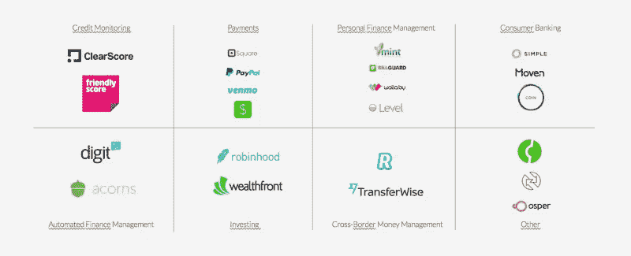

# 金融科技挑战？趋势、需求和未来。

> 原文：<https://medium.datadriveninvestor.com/the-fintech-challenge-trends-whats-needed-future-daab2fc83031?source=collection_archive---------4----------------------->

Photo by [Alex Kotliarskyi](https://unsplash.com/photos/ourQHRTE2IM?utm_source=unsplash&utm_medium=referral&utm_content=creditCopyText) on [Unsplash](https://unsplash.com/?utm_source=unsplash&utm_medium=referral&utm_content=creditCopyText)

如今最具创新性的领域是什么，我肯定是金融科技。所有的金融科技都面临着同样的巨大挑战，那就是要更上一层楼，成为下一个优步或脸书。

今天我从我的公司辞职了，手里没有工作，我在考虑做什么，更确切地说是我真正喜欢做的事情。不久前，我对金融科技产生了热爱&对人们在世界各地带来的创新有着浓厚的兴趣。但是这些创新的了不起的人会成功吗，或者我们需要更多。大家讨论一下。

研究排名前 50 位的金融科技(FinTech)初创企业，没有一家是银行或传统公司的子公司，这是否意味着创新在传统生态系统中已经死亡，或者他们只是在观察，在适当的时候收购这些公司中的一家，或者他们现在根本就不担心。

 [## 金融科技初创公司正在扰乱世界各地的银行业-数据驱动的投资者

### 传统的实体银行从未真正从金融危机后遭受的重大挫折中恢复过来…

www.datadriveninvestor.com](https://www.datadriveninvestor.com/2018/10/20/fintech-startups-are-disrupting-the-banking-industry-around-the-world/) 

主要是金融科技部门在几个领域进行创新。

1.借贷与储蓄(Wefinance，Digit)
2。B2C 支付和转账(支付宝、Paytm、Revolut)
3。B2B 支付和转账(Stripe，Payu，Wepay)
4。比较或生态系统协作(策巴扎尔，杜晓曼)
5。投资(Stash Invest，Robinhood)
6。其他:(奥斯卡健康，福特，广场)

类似下面的隔离，我增加了比较或生态系统合作

# 所有 FinTech 创业公司的共同点是什么？

> 数据+AI =便利=可以出售

所有这些创新公司的共同点是 AI/自动化主导的便利性。这些公司依靠大量的数据处理、机器学习和基于人工智能的决策来实现无缝连接。客户便利是创新的核心，也是每个金融科技初创企业/独角兽销售的主要好处。

> 自由进入=没有障碍=小额金融

进入壁垒被削减到最低限度，有时甚至没有进入壁垒。自动化是核心，客户不必担心财务规划，应用程序或服务会处理好一切，不需要主动参与财务流程，这在以前似乎很复杂。小额信贷是金融的未来。初创公司让每个人都变得如此容易，以至于初始价值并不重要，人们可以从几美元的投资、储蓄或信贷开始。

为什么传统生态系统或公司仍然强大？

因为他们很大，他们管理着世界，人们信任他们。这就是为什么人们不转向这些公司，仍然坚持传统的银行方式的原因之一。
*其中一个主要原因可能是便利性不是金融科技的一大卖点，也可能是该行业对人们转向他们的服务过于乐观，或者每位消费者的转换成本远高于早期的估计。*

金融科技初创公司提高了人们对如何做事的期望，但他们仍然无法创造新的生态系统。看来我们要走一段路才能到达目的地。

# 需要什么

数据共享+成本共享+利润共享

金融科技界必须明白，合作是成功的关键。那些愿意合作并愿意分享数据、成本和利润的公司最有可能成功，从而在一个特定的领域创造一个全新的生态系统。

跟踪消费者支出、贷款或储蓄产生的大量数据需要与现有的生态系统和监管机构合作。初创公司没有那种力量或能力，这正是需要大玩家的地方。

1.  基础设施:金融科技世界将需要来自亚马逊、微软、惠普和其他公司的大量基础设施来为公司存储和计算数据。
2.  访问控制:这将需要政府或监管机构介入并控制客户数据的访问和使用。
3.  平台:这将需要平台提供商的支持，以及摩根大通或瑞士瑞信银行等公司的数据分析。

当一切都连接在一起时，提供服务需要令人难以置信的前所未有的自动化水平。我们将需要像 TCS 或 IBM 这样的大公司来编写新软件，自动化和管理大量的操作。

# 未来会怎样！

**银行业的全球化:**世界各地和各地区的银行将开始共享相关的客户数据等。这意味着我可以在美国开一个银行账户，并可能开始股票交易或享受其他全球服务或创新。可能是我的银行账户让我能够进入全球金融中心市场，比如香港、新加坡、伦敦和纽约。信贷、转账和贷款将在全球范围内整合，更加无缝。

**整合:**金融科技创新者可以与金融巨头或银行的前端或后端进行整合。他们带来的创新将用于服务现有的银行客户和其他人。在带来这些创新方面，银行可能会超越彼此，但它们提供的便利很可能很快会被其他银行复制。

I **金融科技内部的整合:**金融科技创新者可能会相互合并，以便为最终客户提供更好的服务。储蓄和贷款公司可能会合并，以提供一站式解决方案，并利用彼此的创新。客户会寻找一个解决所有财务问题的方案，而不是多个。

**数字银行:**人们很快将只依靠数字媒介来连接银行。这将从开立银行账户到银行账户的无缝操作。不会数字化的公司或银行将很快看到市场将数字化作为唯一的服务方式，并可能关闭他们的业务。这些公司将会看到银行分支机构关闭，并被智能自动取款机和机器接管。

**新的行业:**新的行业将出现在金融科技中。他们可能会独树一帜，可能会成为生态系统中的独角兽或新的大玩家。一些例子。

1.【清税】节税(T6)2。创业信贷(Brex)
3。Social spending(一家可能自动化所有数字媒体购买的公司)
4。众筹
5。预测(通过观察你的消费习惯来预测你何时需要钱)

所有这些都将改变金融科技和世界。短期内，消费者和商家将从中受益，因为公司将鼓励快速采用这些服务，随后生态系统中的每个人都将受益于更高和更好的金融包容性。

总结一下我最喜欢的创新者之一:Brex

*Brex 的独特之处在于它提供专为初创公司设计的信用卡服务。但是，Brex 担保的是公司，而不是企业家，而不是基于创始人的个人财务稳定性的信贷限额。Brex 告诉我们的未来是，我们即将度过创业企业总是被认为有风险的阶段，我们正在走向一个时代，银行可能会开始青睐有好想法的创新创业公司，而不是不太灵活的老牌企业。*

像 Brex 这样的初创公司将有助于改变你周围的世界，并可能带来更多的创新者，带来积极的变化。

我最美好的祝愿给所有那些为我们这样的人创新和努力工作的了不起的人。我对人们带来的创新感到惊喜，在每一个可能的领域，这些创新已经准备好去影响和改变数百万人的生活。

这将是伟大的合作，并提供我所能。与我联系:

LinkedIn:[https://www.linkedin.com/in/chandanmishra/](https://www.linkedin.com/in/chandanmishra/)
insta gram:[https://www.instagram.com/mishchandan/](https://www.instagram.com/mishchandan/)