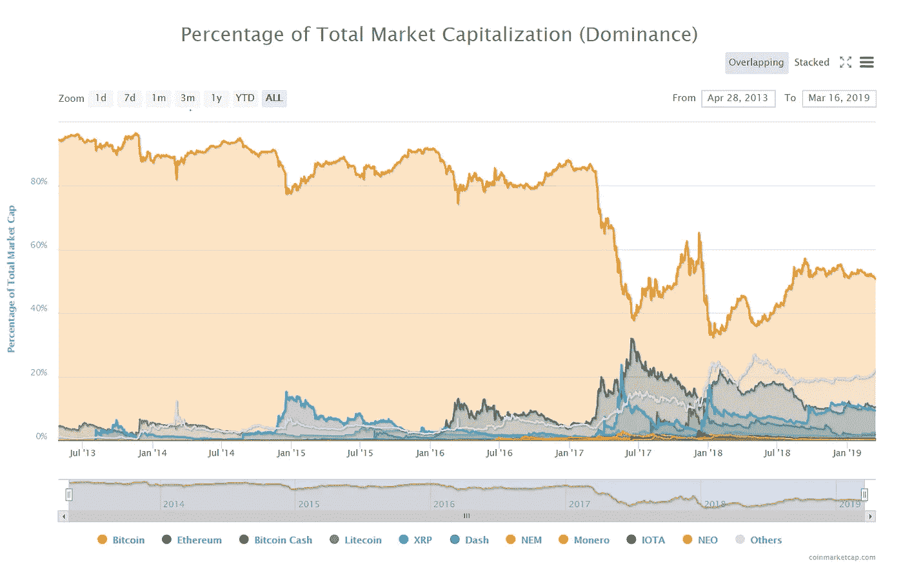
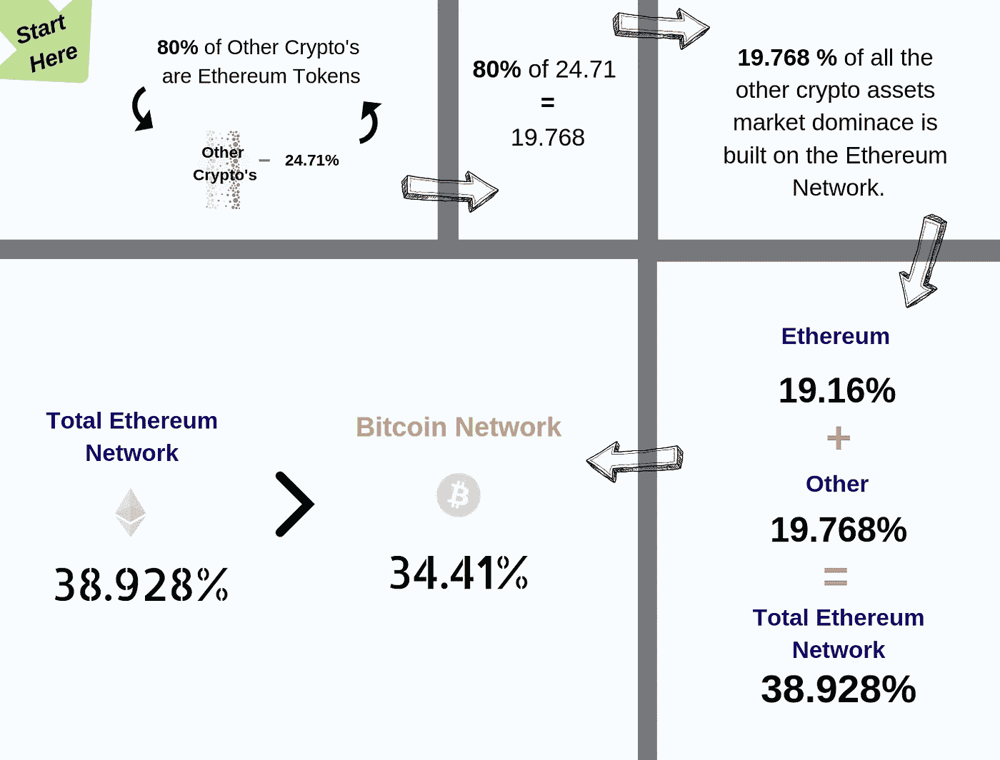

# 翻转没有电视转播！

> 原文：<https://medium.datadriveninvestor.com/the-flippening-was-not-televised-2a3f94d830de?source=collection_archive---------3----------------------->

## 也称为；你不知道的以太坊…

> 如果我向你展示以太坊作为网络比比特币更有价值；你会为了 ETH 卖掉你的 BTC 吗？更好的问题是你会相信我吗？
> 
> *🕋* 用区块链的话说: *🕋*
> 
> ***不信任。验证。***
> 
> 这是一个很好的例子，说明并不是所有的加密指标都是平等的…如果你对所展示的内容有异议，我急切地等待你的观点**证明我是错的。**

你知道:比特币比以太坊在加密市场占据了更大的份额？事实上，比特币获得的市场份额超过了所有其他加密资产的总和……它一直见证着比特币与其他家伙的较量。从来没有任何一个网络能够取代比特币占据市场主导地位。

或者他们是这么说的…

 [## 十大区块链课程-数据驱动的投资者

### 渴望在区块链发展吗？你想知道区块链是如何工作的，但不知道在哪里？或者就是太多了…

www.datadriveninvestor.com](https://www.datadriveninvestor.com/2019/03/08/top-10-blockchain-courses/) 

在 2017 年的加密热潮中，加密市场领域的主导地位开始大幅波动，比以往任何时候都更加剧烈。这是由于引入了一种新的加密“闸门”，称为 ERC-20。一个象征性的协议，允许一种筹款方法， ***通过简化数字经济的创建和实施方面，简化了整个区块链项目空间。*** 数千个项目启动。每一个都建立在以太坊之上(因此来自以太坊)，而以太坊又构成了属于以太坊网络的项目网络价值。

这在密码社区中引起了轩然大波。

人们开始唱以太坊取代比特币占据市场主导地位的歌。进入翻转。←如果你不明白这一点，请检查:[翻转观看](https://www.flippening.watch/)

以太坊在巅峰时期控制了 32.41%的市场份额。与此同时，比特币持有约 40.11%的份额(对那些感兴趣的人来说:比特币的最低主导水平是 32.48%)

😅差那么多😅

撞车发生了，翻筋斗被遗忘了…

但是，在市场的歇斯底里中，一个预言实现了！发生了翻转， ***类似于*** …

在 20 世纪 60 年代👩‍🚀整个加密市场的大约 80%建立在以太坊之上:

*   这意味着 CoinMarketCap 上列出的 80%的项目属于以太坊网络
*   他们筹集资金*主要是*以以太坊的形式(以及其他一些方式)

坚持当时的市场逻辑，我们可以得出结论:

好了，现在你知道🧐了

最重要的是要认识到，无论是否发生一些轻率的事情，市场将根据其在社会中的作用继续运行和繁荣。

如果以太坊对社会更有价值，那就这样吧……如果比特币更有价值，那就这样吧..

归根结底，我们聚集在这里的原因是一样的:

根除遗留系统，让它们物有所值→开放金融。公开贸易。开放信任。

♻再见菲亚特♻

🤓你好密码🤓

