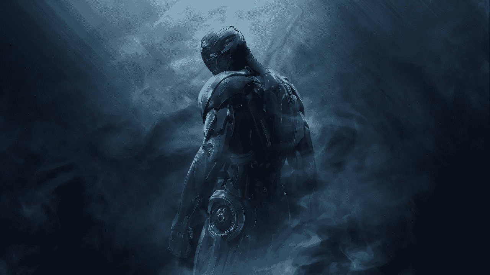
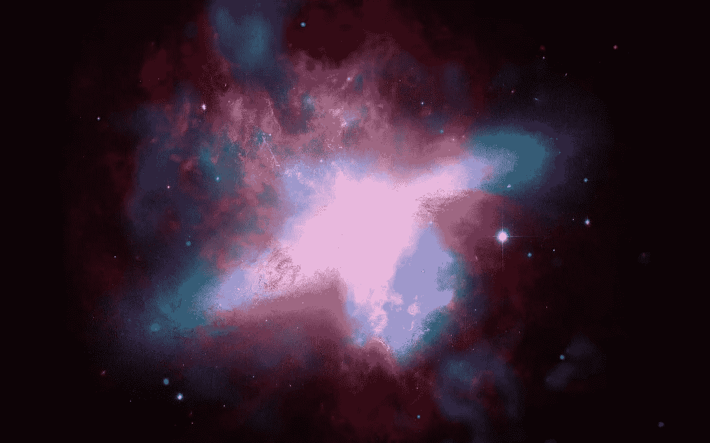
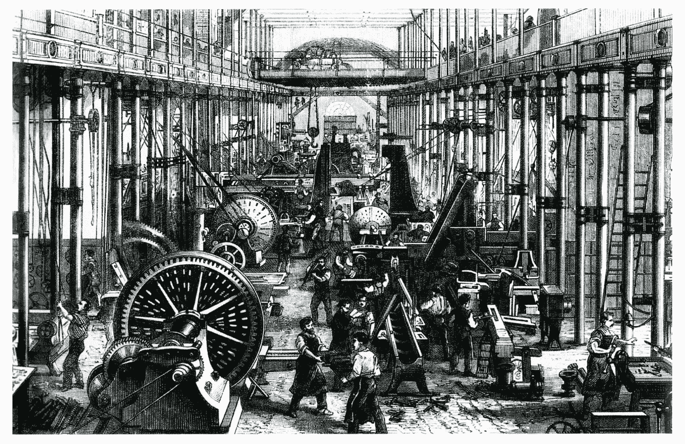
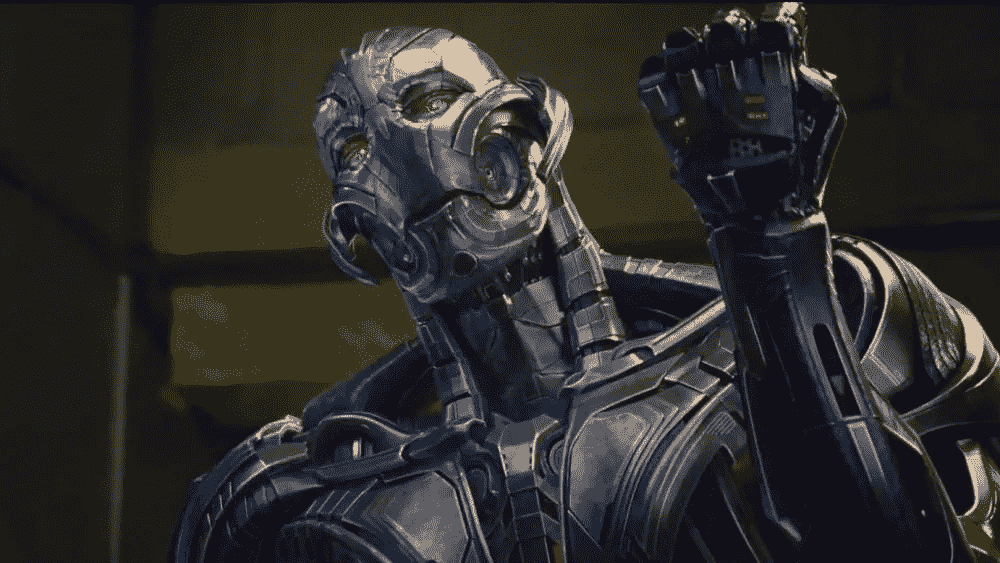
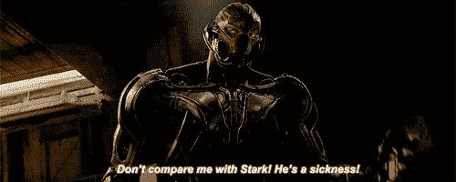
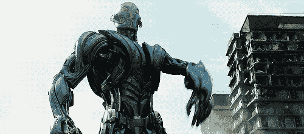
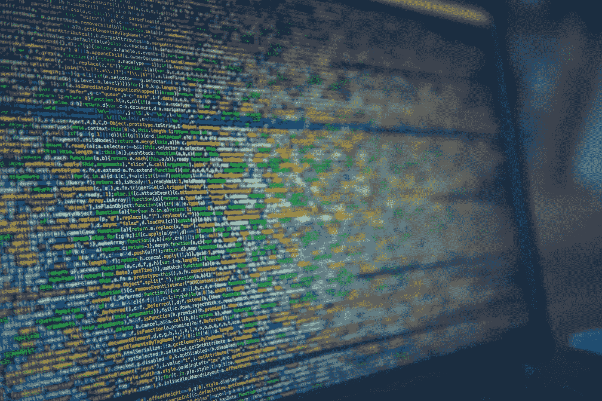

# 即将到来的人工智能革命(AIR):它对社会和企业的影响

> 原文：<https://medium.datadriveninvestor.com/the-forthcoming-artificial-intelligence-revolution-air-its-impact-on-society-and-firms-9cb8fba2b004?source=collection_archive---------15----------------------->

在这篇文章中，我将谈论为什么人工智能会取代你的工作，为什么这对你来说是一个巨大的机会。

[A revolution is coming](https://www.google.co.in/url?sa=i&source=images&cd=&cad=rja&uact=8&ved=2ahUKEwidnff72p_eAhUO3o8KHSVjBI0QjRx6BAgBEAU&url=http%3A%2F%2Fwww.hybridnetworkyt.com%2Fultron-preparing-thanos-invasion-earth%2F&psig=AOvVaw1IDf5Mc9bzpXpbBvDk4ZZI&ust=1540492227073315)

我们必须对自己诚实，并认识到最大的革命之一即将到来。

这场革命将带来的优势之一是更快的技术进步。人工智能用于研究的越多，它将越快学会为世界正在探索的许多问题找到模式和结果。

你和我都有责任做好准备，迎接这一巨大浪潮向我们袭来的第一次冲击；尽管争议很大，但我认为**达尔文主义理论**的一部分适用于这种情况，即:

> “只有那些寻找新的创造性方法来保持相关性，开发机器需要几十年才能获得的一项或多项技能，并通过强制进化而不是自然选择来进行改变的人，才能生存、进化和繁荣。”——P .卡努马

我坚信我们与生俱来的天赋是适应、进化和学习的能力。我们已经在一些领域取得了重大突破，利用了当前最先进的人工智能系统和机器，这是我最关心的问题，因为这意味着一些流程正在从等式中删除，自动化正在发生，如果人们没有找到一种创造性的方法来保持有用，他们将被淘汰。

***如果你正在读这篇文章，并且你从这篇文章中得到了一样东西，它可能很容易被证明是你的未来和你的后代成功的关键基石之一。***

为了完全确定你就是那个人，你必须花些时间回答自己三个问题。

*   你能做到吗？
*   行得通吗？
*   值得吗？

在我们开始谈论这场革命之前，让我们看看一切是如何开始的，也许我们可以看到一些模式，这些模式在宇宙、世界和人类的历史中反复出现，从我们成为原子直到我们获得所有动物的完全统治权&这个巨大的蓝色星球。

# 一切是如何开始的

[Supernova explosion](https://www.google.co.in/url?sa=i&source=images&cd=&cad=rja&uact=8&ved=2ahUKEwjUkKP825_eAhUMuI8KHURSDGkQjRx6BAgBEAU&url=https%3A%2F%2Fwww.pinterest.com%2Fpin%2F830773462481004229%2F&psig=AOvVaw1p5Yb2EdKypDAuPMCEhgfE&ust=1540492511323953)

一切都是从一个小奇点开始的。大爆炸理论是关于宇宙诞生的主要解释，它说我们今天知道的宇宙从一个小奇点开始，然后在接下来的 138 亿年中膨胀成我们今天知道的宇宙。

根据美国宇航局的数据，在宇宙开始后的第一秒钟，周围的温度高达 55 亿摄氏度。早期的汤在这种情况下是不可能存在的。

在最初的膨胀之后，宇宙冷却到足以形成亚原子粒子和后来的简单原子。这些原始元素的巨大云团后来通过重力融合在暗物质晕中，最终形成了今天可见的恒星和星系。

现在你一定在问我为什么要谈论宇宙的故事，和我呆在一起吧，我想带你进行一次历史之旅，这样你就能了解未来会发生什么。

伊甸园

> 也有宗教起源说**神**创造了一切。此外,《圣经》中提到了灾难性的事件，例如**大洪水**，在那里**上帝**通过一场大洪水毁灭了世界和所有的生命，通过**诺亚方舟**拯救了每一种生命形式的代表，后来人类繁衍到今天。

上面的段落是要告诉你，创造(在某些情况下)和进化是在巨大的**毁灭**之前。

> "每一个创造的行为首先是一个毁灭的行为."- [巴勃罗·毕加索](https://www.brainyquote.com/quotes/pablo_picasso_108723)

你怎么可能会问？

你和我越早意识到我们需要摧毁我们以前的信念来接受或创造一个新的信念，我们就会进化得越快。

我们的历史沾染了毁灭，每一种存在的生命形式和元素都随着毁灭而进化。

*   DNA 随着突变和改变而进化，换句话说，破坏了先前的序列。
*   大脑通过打破以前的联系(路径)来支持新的联系而进化。
*   肌肉只有在我们破坏它们并允许新纤维生成的情况下才会生长。

> “在印度教，湿婆是代表转变的神。通过破坏和恢复，湿婆提醒我们，结束就是开始，我们的世界不断经历出生、死亡和重生的循环。”凯伦·萨尔曼松

这和标题有什么关系？

综上所述，在我们开始从人工智能中获益之前，我们肯定会把事情搞砸，当然还会破坏事情。我的一个好朋友是这样说的:

> "从人类的概念到出生，这都是一个创造、毁灭和进化的过程. "奇姆韦祖鲁

随着 AI 的崛起，生命可能会丧失，许多其他不幸也可能会发生。

> "如果我们停止进化，我们还不如死去."卡努马王子

这是我们自存在以来一直在付出的进化代价。但是**不要误解我的意思**这些只是担忧，人工智能本身并不邪恶，只有我们可以让它变得邪恶，所以我们有责任正确地构建它。就像抚养一个孩子一样，他们是我们、我们所教的以及他们所经历的事情的一面镜子。

> “苹果不会落在离树很远的地方”

现在，我先来说说这个 **AI 革命**的缺点，然后再来说说它的优点。为此，我将用人类历史上最伟大的革命之一作为例子。

# 工业革命

[Industrial Revolution](https://www.google.co.in/url?sa=i&source=images&cd=&cad=rja&uact=8&ved=2ahUKEwiCkcKa3p_eAhVGWX0KHZ90C0YQjRx6BAgBEAU&url=https%3A%2F%2Fen.wikipedia.org%2Fwiki%2FIndustrial_Revolution&psig=AOvVaw0529eSnowm-LyqZyk_FfJ6&ust=1540493102713844)

根据这个 [**来源**](https://en.wikipedia.org/wiki/Industrial_Revolution) ，**工业革命**是从大约 1760 年到 1820 年到 1840 年之间的某个时间向新制造工艺的过渡。这一转变包括从手工生产方式到机器生产方式、新的化学制造和铁生产工艺、蒸汽动力使用的增加、机床的发展以及工厂系统的兴起。

**工业革命**标志着历史的重大转折；几乎日常生活的每个方面都受到了某种程度的影响。特别是，平均收入和人口开始呈现前所未有的持续增长。一些经济学家说工业革命的主要影响是普通民众的生活水平在历史上第一次开始持续提高，尽管其他人说直到 19 世纪末和 20 世纪才开始有意义的提高。

经济史学家一致认为，第一次工业革命的开始是自动物和植物驯化以来人类历史上最重要的事件。

现在，让我们权衡利弊。

**缺点**

-农业损失

–污染的开始

工厂恶劣的工作条件

**优点**

–更高效的生产

–更便宜的价格

–工作机会的大幅增加

–惊人的动力，改变世界

–提高了生活质量

我们可以清楚地看到，为了作为一个物种进化并保持繁荣，我们必须做出权衡(牺牲)，我们得到的比失去的多得多。但这是相对的，正如我亲爱的朋友和兄弟所说:

> “有优势就有劣势，反之亦然”——泽西·J·辛拜恩

毫无疑问，工业和数字革命对我们社会、生活、企业和就业的几乎所有方面都产生了重大影响。

# 即将到来的人工智能革命(AIR):它对社会和企业的影响

So now I’m free I got no strings on me!

我首先要说的是，我们在人工智能领域取得的成就最终会毁灭我们，但我们必须承认，科幻小说中的死亡有些滑稽。

人工智能(AI)和自动化会让大量的人(专业人士)越来越多余。

你和我可能会失业，但这就意味着我们一定会失业吗？

不，我们可能会看到这些工作从根本上**重新形象化**，这是应该带来幸福和快乐的部分，因为这将最大限度地提高我们的效力和效率，这是人类诺亚方舟的一个明显例子，第二次机会有更多的时间成为人类，与人工智能机器一起工作，而不是与它们竞争。

作为专业人士，我们应该意识到，目前的狭义人工智能在一些任务上胜过我们，而且**注意**我们还没有实现通用智能人工智能。

所有的希望并没有消失，而是一个新的希望正在被创造！

如果我们试图阻止或忽视即将到来的人工智能和自动化的巨大浪潮，数据洪流将很快淹没我们，人工智能将上升，其他人将进化以利用它的力量，而我们则停滞不前，他们将通过使我们过时或无用而将我们扫地出门。

> “不改变就不可能进步，不能改变思想的人什么也改变不了。”— [乔治·萧伯纳](https://www.brainyquote.com/quotes/george_bernard_shaw_386923)

为了克服工业惯性，驾驭这股浪潮，我们应该为不可避免的事情做好准备，并尽快进化。

# 我们站在两扇门前

1。我们停止进步，停止制造智能机器、计算机软件和硬件。但是考虑到计算机、技术和自动化的价值，我们将继续发展它们。

**我们会失去什么？**

当押注于某种可以从地球表面湮灭并彻底抹去的东西时，需要考虑很多因素。如果它认为我们是故事中的恶棍(我们就是)，我们就不是天使，但事实是只有上帝或至高无上的力量(对于那些不相信上帝的人来说)可以评判我们。其他任何存在或事物都没有权利也不应该这么做。

有什么能阻止我们去做呢？

为了彻底阻止我们永久发展这项技术，我们必须要发生一些事情。实话告诉你，不要指望那会发生，因为作为人类，探索是我们的天性，不管有多危险和困难。我们是梦想家！

> "人的头脑所能想象和相信的，它就能实现."——[拿破仑·希尔](https://www.brainyquote.com/quotes/napoleon_hill_258563)

我们唯一的选择是二号门。

2。 **我们继续开发智能机器** s，随着时间的推移，我们会发现自己正在建造比我们更智能的机器，一旦这种情况发生，它们将开始自我改进，然后我们将达到数学家 **IJ 古德**所说的**智能爆炸**，这个过程可以远离我们。

## 智能爆炸

> 让我们把超智能机器定义为一种能够远远超越任何人的所有智力活动的机器，不管这个人有多聪明。因为机器的设计是一种智力活动，一台超级智能机器可以设计出更好的机器；毫无疑问，那时将会有一场“智力爆炸”，人类的智力将会被远远地抛在后面。因此，第一台超智能机器是人类需要制造的最后一项发明。

这种智力爆炸就是好莱坞描述的奥创或终结者，而这不太可能发生。我们将建造比我们更有能力的智能机器，他们的目标和我们的目标之间哪怕有一点点分歧都可能毁灭我们。

在许多特定任务上，机器已经比人类更聪明:检测图像、下棋、搜索大型数据库、探测水下地雷等等。这意味着我们已经有了在这些任务中达到超人水平智能的狭义智能人工智能机器。但是有一点让人类很特别，那就是他们的 ***普通*智力**。人类可以聪明地适应城市丛林或外太空中的全新问题，这是进化无法让他们做好准备的。人类可以解决他们的大脑硬件和软件从未训练过的问题。

我们当中有些人怀疑超智能人工智能是可能的，更不用说是不可避免的了，那么我们必须找出以下假设中的一个有问题，只有三个。

1.  **智力是信息处理的产物**

根据福布斯的文章，标题为:**大数据:20 个令人难以置信的事实每个人都必须阅读**作者[伯纳德·马尔](https://www.forbes.com/sites/bernardmarr/2015/09/30/big-data-20-mind-boggling-facts-everyone-must-read/#49700b5717b1)

*   数据量正在爆炸式增长，在过去两年中创建的数据比人类历史上所有的数据都要多。
*   数据正以前所未有的速度增长，到 2020 年，地球上每个人每秒将产生大约 1.7 兆字节的新信息。
*   到那时，我们积累的数字数据世界将从今天的 4.4 兆字节增长到大约 44 兆字节，或 44 万亿千兆字节。
*   每秒钟我们都在创造新的数据。例如，我们每秒执行 40，000 次搜索查询(仅在谷歌上)，这使得它每天 3.5 次搜索，每年 1.2 万亿次搜索。

*意思是，信息就在那里，所以这肯定会发生，至于进展的速度，我不认为这有什么关系，因为我们会进步。除非我们被阻止。*

> “如果你走在正确的道路上，并且愿意继续走下去，最终你会取得进步。”— [巴拉克·欧巴马](https://www.brainyquote.com/search_results?q=progress+is+progress+no+matter+how+slow)

2.**我们将继续改进我们的智能机器**

我们想了解我们的问题，解决人类最大的问题。这是人工智能适合这项工作的一个地方。

人工智能帮助我们减少误差，并且有可能达到更高的精确度。它被应用于各种研究中，如**太空探索**。

智能机器人被输入信息并被送往太空探索。由于它们是金属机身的机器，所以它们的抵抗力更强，对太空和敌对气氛的忍受能力更强。

它们是以这样一种方式被创造和适应的，即它们不能被修改或在敌对的环境中被毁容或崩溃。

3.**我们还没有接近可能智慧的顶峰**

AI is still an infant

这就是为什么我们对风险的直觉如此不可靠。

> “一些研究称，担心人工智能安全就像担心火星人口过剩一样”

超级人工智能可以探索智能的范围，并以我们无法想象的方式超越我们，仅凭速度这一点，这是可能的，也是真实的。

电子电路的运行速度比生化电路快一百万倍，所以这台机器可以比建造它的大脑快一百万倍，如果我们运行它一周，它将完成人类水平的智力工作 20，000 年，我们如何理解更少的限制一个大脑取得这么大的进步。

这是我们人类有史以来面临的最大革命之一。

我的问题是，你准备好了吗？

**注意**:现在不是世界末日，做出必要的改变吧！后代依赖于它。

感谢您的阅读。如果你有任何想法，评论或批评，请在下面评论。

如果你喜欢并认同它，请给我**点掌声**👏👏 👏(+50)和**分享给你的朋友**。

接下来还有更多的内容…我将制作一系列与我正在进行的项目相关的主题。

如果你想和我一起探索数据丛林，请跟我来。:D