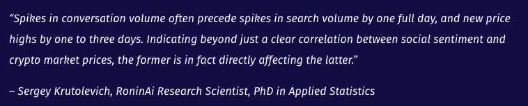
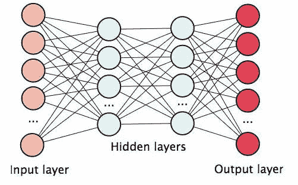

# 将彻底改变密码交易的四个主要人工智能核心特征:第一部分情感分析。

> 原文：<https://medium.datadriveninvestor.com/the-four-main-ai-core-characteristics-that-will-revolutionize-crypto-trading-part-1-sentiment-3216cba636ed?source=collection_archive---------30----------------------->

## 情绪分析是密码交易员的主要做法之一。这让他们在衡量整个市场的健康状况以及进行估值预测的能力方面拥有显著优势。低估它将是愚蠢的。原因如下。

密码交易者经常试图获得对竞争对手的优势；然而，当他们试图隔离加密货币市场价格的重要因素时，往往会遇到困难。许多个人，从该领域最熟练的人到刚刚接触加密货币的人，都认为社会情绪在决定加密货币估值方面发挥了巨大作用。

## 什么是情感分析，为什么它如此重要？

正如我们在前面的[文章](https://medium.com/predya/the-future-of-trading-belong-to-artificial-intelligence-bb1f2b96c68d)中提到的；情绪分析是对来自不同来源的大量数据的处理，如文章、博客、评论、社交网络帖子，甚至是视频转录，以计算出市场对某个主题的感受，从而确定它是积极的、消极的还是中立的。

无数研究得出结论，社会情绪是未来加密货币价格的有效预测因素，也是衡量任何给定时刻加密市场状态的有效预测因素。使用能够解析大量帖子或推文并转发数据的人工智能解决方案，可以给所有经验水平的加密交易者带来巨大的帮助。不仅仅是测量嗡嗡声，而是分析情绪是看跌还是看涨。

另一个有趣的发现是，这种情绪并不是由少数最健谈和最著名的 Twitter 账户驱动的。更确切地说，它是由那些很少谈论加密和不太活跃的人推动的，远远超过预期。这可能暗示，许多加密投资者更看重来自不影响专业人士或基于特定议程的加密货币社会情绪的来源的数据，这些数据在许多情况下被用于市场操纵。

## **情感分析和人工智能为竞争提供了无可争议的优势**

人工智能被许多人认为是第四次工业革命的关键驱动力。人工智能市场预计到 2020 年将增长到 470 多亿美元。人工智能的采用正由金融部门主导，预计在未来 3 年内支出将大幅增加，零售和消费市场很快就会发现这些令人兴奋的新进展的可能性。

机器学习和情感分析是应用于人工智能的具体策略。如今，为了能够处理和理解大量信息，情感分析和机器学习已经成为打开数据分析大门的必要方法。来匹配不断扩大的数据集。因此，分析它们的策略和技术自然也需要改进和更新。

事实证明，其中一项更新尤其有助于评估市场情绪。神经网络非常有效和准确，因为它们能够将每一个单词作为一个运算符和一个向量(矩阵)来处理，赋予它一种“直觉”形式，这是机器默认不具备的。因此，单词“not”通常是一个旋转矩阵，它作用于下一个词(例如),它通过旋转词“good”的向量来改变其极性，从而得出单词“not good”的组合是所分析的数据集的情感。这将是最纯粹的例子，说明神经网络的力量远远超出了人类大脑的想象。它的有效性可以完全取代情感分析的准确性。

对大量非结构化数据集的分析以及人工智能提供的自然语言处理所带来的机遇优化了情感分析。人工智能和情感分析的使用为任何需要管理大量数据、了解消费者共享的见解以及将所有类型的社交数据与其他数据流合并以发现客户需求、偏好和意图的公司或个人带来了巨大的优势，所有这些都具有前所未有的精确度。

*感谢您阅读我的文章，它最初发表在我的个人网站***。如果你想联系我，或者如果有你想让我报道的话题，请给我发电子邮件到 thesparkblog@renatozamagna.com。**