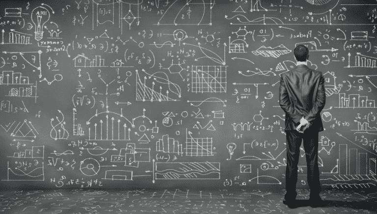

# 将彻底改变加密交易的四个主要人工智能核心特征:第二部分区块链分析。

> 原文：<https://medium.datadriveninvestor.com/the-four-main-ai-core-characteristics-that-will-revolutionize-crypto-trading-part-2-blockchain-bd8b92f8b70?source=collection_archive---------32----------------------->

## **区块链+人工智能=永远被动收入？在本文中，我们将探讨这种令人着迷的可能性。**

最后，人工智能的优势不仅仅局限于大公司。被认为是科幻小说的东西现在已经成为现实，当与区块链技术相结合时，人工智能突飞猛进就不足为奇了。虽然每当一项新技术出现时，人们经常想到的问题是:“实际上有利可图吗？”当看着区块链注入人工智能，这个解决方案确实是有益的。

## **AI 和区块链结合**

你很可能听说过国际象棋大师输给机器，或者你可能知道无人驾驶汽车？由于人工智能，这些情况都是可能的。我们创造人工智能是为了让计算机自己解决问题，基本上是让它们有能力针对面临的新问题生成代码。当与人工智能结合时，人类可以更好地理解区块链，使他们更加有效。

当谈到机器学习时，它们需要大量的数据来分析，就像人类一样。区别在于，人类被动地评估信息，我们用我们的五种感官来适应环境，我们储存在大脑中来产生事物如何工作的信念。

机器没有感情，它们需要信息，区块链能够帮助它们更快地获得信息以及无缝地获得其他信息(这要归功于去中心化/共享控制)。通过在交换中共享 IP/测试模型，一些人工智能系统可能比其他系统学习得更好，这为更快的开发提供了可能性(并使开发者受益)。一旦人工智能开始学习，我们追踪它找到答案的路线就变得简单多了，因为路径被保存在一条不可改变的轨迹上。人工智能发展的首要原因是让人们的生活更容易。一个例子是人工智能和区块链技术的结合，以提供被动和主动的收入流。

## **人工智能让区块链更上一层楼。它创新了创新**

区块链技术让用户能够制作一个不可信的程序，他们可以在其上运行智能合同，监控账本等等。人工智能和机器学习使无需人工干预的应用程序随着时间的推移变得更加有效。但是合并两者有很多好处。然而，这些是与数字经济最相关的。

**可扩展性** — AI 可以在没有集中数据集的情况下进行协作学习。

**安全** — AI 可以识别区块链系统入侵问题。

**隐私** — AI 能够改善哈希函数的功能。

**效率** — AI 可以预测任何节点完成特定挖掘任务的可能性。

人工智能对区块链的影响是显而易见的，在市场上领先的企业无疑将从这种远见中受益匪浅。来自改进的可扩展性、安全性/隐私性和更高的效率。总的来说，人工智能将使区块链的使用更实惠、更安全、也更容易。有一系列的例子，我们可以看到人工智能和区块链一起合作解决特定的问题。在加密交易领域，好处是惊人的。

## **加密货币交易&人工智能受益**

交易加密货币是有风险的，就像股市可能是危险的一样；更具体地说，当交易是由深受情绪影响的人进行的时候。当市场开始崩溃时，它开始进入

波动是一种集体恐慌，导致冲动抛售，当市场反弹到比以往任何时候都高的时候，这种抛售就变成了失望。这是历史上绝大多数人类交易者的陷阱。停止这些情绪错误的一个简单方法是使用人工智能平台来执行交换操作。如果人类交易员把自己(和他们的情绪)从这种情况中抽离出来，或者把他们的交易建立在人工智能产生的技术基础上，他们更有可能成功。

## **神经网络包含了人工智能和加密交易的一个缺失环节:非情感直觉**

神经网络是模拟人类思维特定特征的可训练算法。为他们提供独特的自我训练能力、形式化未分类数据的能力，以及最显著的基于历史数据的预测能力。

一个重要的误解是，大多数交易者认为神经网络是预测应用程序，可以提供如何在特定情况下采取行动的提示。尽管如此，它在预测上还是相当准确的，但是因为未来是不确定的，所以没有保证。无论如何，它的预测率比任何现有的人类技术分析师都要高得多。神经网络不做任何预测，因为它不是基于假设，人工智能是基于纯数学。相反，他们检查价格数据，也发现机会。使用神经网络，可以根据仔细分析的数据做出决策，而使用传统的技术分析方法并不总是如此。对于严肃、沉思的交易者来说，神经网络是下一代工具，具有不可思议的潜力，可以检测传统复杂分析方法无法发现的微妙的非线性相关性和模式。

研究表明，只有 9%的活跃交易者产生利润，意味着令人难以置信的 91%的失败。积累成功所需的数据量非常困难，这正是对冲基金、经纪人以及其他金融公司转向人工智能和机器学习的原因。最后，人工智能在人类失败的领域的强大优势正被带给更多的观众。关于区块链分析，人工智能是许多目的中唯一合理的解决方案，最重要的是由于它永不停息的特性。越来越多的项目，不仅仅是金融领域的项目，正在融入区块链科技，人工智能已经显示出对于这些项目的未来是不可或缺的。

*感谢您阅读我的文章，它最初发表在我的个人网站***。如果你想联系我，或者如果有你想让我报道的话题，请给我发电子邮件到 thesparkblog@renatozamagna.com。**