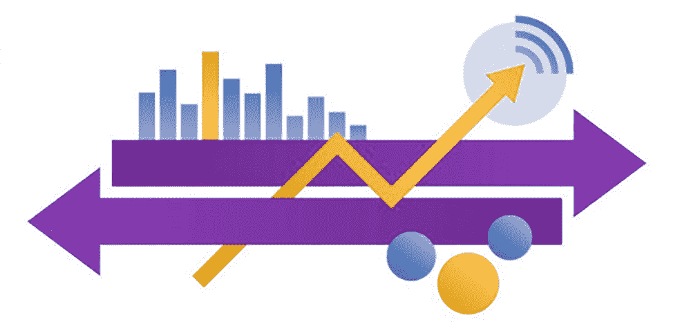
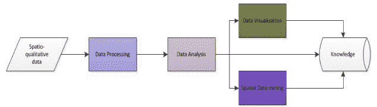

# 将彻底改变密码交易的四个主要人工智能核心特征:第三部分定量数据挖掘

> 原文：<https://medium.datadriveninvestor.com/the-four-main-ai-core-characteristics-that-will-revolutionize-crypto-trading-part-3-quantitative-1e93d85f49b8?source=collection_archive---------34----------------------->

## 今天人工智能的特性非常适合于测量定量数据挖掘，因为当需要快速分类大量信息时，今天的人工智能是有效的。首先，由于它可以处理比以前多得多的大量数据，它能够更准确地识别模式并进行分类。谈到加密货币交易，速度元素在不断变化的生态系统中至关重要。

AI 天生根植于数学模型，由数值数据推动。有人可能会认为这与定量数据挖掘的描述性动力学有些冲突。所有考虑的事情；定量分析涉及一套需要探索的方法；探究人类行为及其推理的深度。为了获得成功的定量数据挖掘，这种思想往往是非静态的、广泛的和上下文相关的，适度通常在用户友好性方面被量化，并且分析的信息基于文本、声音和视频数据。收集的信息可能被认为是“杂乱的”&不可估量的。如今，尽管如此，人工智能系统已经超越了简单的数字。他们现在已经准备好应对这些“混乱”的不可估量的信息。神经网络是最近人工智能改进的一个很好的例子；他们获得了一种特定程度的“直觉”，这种直觉以前只限于人。虽然机器永远不会有思想或感觉，但随着创新的出现，它们至少能够评估它，此外，神经网络假设能够在某种程度上“人工化”思想和感觉。

## 人工智能在定量数据挖掘中的优势

**社区参与洞察**

市场研究在线社区(MROCS)是提供大量定量数据输出的市场分析解决方案的一个很好的例子。许多天、几个月或几年产生的大量社区成员内容对于任何互联网社区管理者来说都是一个挑战。这些工具在社区参与意识、情感分析和文本方面的另一个令人兴奋的应用已经在定量数据挖掘中全面展开。通过对文本和情感分析、登录数据和个人资料信息的混合实施深度学习，市场分析可以利用人工智能在脱离发生之前预测脱离。这有助于(人类)研究人员主动控制成员参与度。此外，绝对没有什么可以阻止聪明的人工智能技术被扩展到参与研究，以帮助加密货币的估值预测。随着时间的推移，新的人工智能系统能够根据谁、在哪里、何时“学习”影响加密市场的因素。这有助于更好的反馈和更准确的预测。

## 对话激活洞察力

从仪表板式数据库的后部工作，入门级人工智能系统将有能力评估当前和历史数据，并以更容易以定量块处理的微小尺寸总结查询相关的见解。独特的客户角色人工智能系统甚至可能被编程为与加密货币投资者进行问答式讨论。

通过添加深度学习和神经网络，人工智能变得非常有用。这种强大的技术混合产生了更多的前瞻性和创造性的产出。基于人工智能系统的对话激活洞察力不需要在被调用之前等待；相反，它能够自动驱动洞察力。随着时间的推移，模型学习什么数据是相关的。在加密货币市场运动的情况下，它们成为一种有用的工具，可以根据谁在什么时间段以及使用的语言产生的交互来仔细评估数据。

## 评估助理

人工智能有效地“配备”了分析任务。分析助理将提供一定程度的交互式支持，以在人类无法加强参与的时候加强参与，即夜间、晚上、跨越不同时区的程序，或者使分析师能够专注于需要认知能力的任务。

## 定量数据挖掘和加密货币市场

与债券和股票市场相比，基于全面调查和适当开发的定性数据做出购买决定的成熟加密货币投资者要少得多。一般来说，散户投资者容易受到多种行为偏差的影响，这些偏差导致他们在价格上涨时买入，在价格下跌时卖出，通常是根据价格变动而不是价值基本驱动因素的变化进行交易。这些类型的市场参与者产生价值反射，并可能在几乎没有质量歧视的情况下推动估值上下波动。

许多人认为加密货币领域知之甚少。当高质量的信息通过定性数据挖掘出现时，它启动了高级投资者的进入，这几乎肯定不是人而是机器。见证项目如何相互评估以及成本分散如何随着时间的推移而演变将是一件有趣的事情。

加密货币技术分析师和数据挖掘专家正在全面拥抱人工智能，测试新的研究，并接近设置。可以预见的是，技术分析师和人工智能将一起工作，创造出以前无法想象的定性见解。人工智能已经成为永久的标志，任何希望享受加密货币交易好处的个人或机构都应该与债券和股票市场相比，将购买决策建立在全面调查和适当开发的量化数据基础上的复杂加密货币投资者要少得多。一般来说，散户投资者容易受到多种行为偏差的影响，这些偏差导致他们在价格上涨时买入，在价格下跌时卖出，通常是根据价格变动而不是价值基本驱动因素的变化进行交易。这些类型的市场参与者产生价值反射，并可能在几乎没有质量歧视的情况下推动估值上下波动。