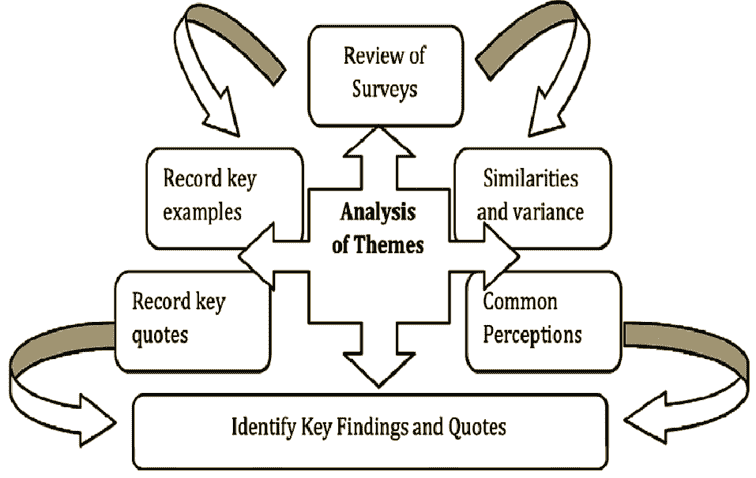

# 将彻底改变密码交易的四个主要人工智能核心特征:第 4 部分定性分析。

> 原文：<https://medium.datadriveninvestor.com/the-four-main-ai-core-characteristics-that-will-revolutionize-crypto-trading-part-4-qualitative-20a85ae32a12?source=collection_archive---------18----------------------->

## 定性分析用于评估具体的加密货币项目和整个行业。它依赖于基于不可量化数据的非常主观的判断，例如，管理专业知识、商业周期、研发和社区参与。定性分析与定量分析形成对比，定量分析侧重于资产负债表等报告中可用的数字，例如，尽管如此，两种策略一起使用能够分析加密项目运营并评估其作为投资机会的可能性。

**定性分析和人工智能**

定性分析涉及与经验和社会领域而非数学方法相关的无形、不精确的问题。这种方法依赖于机器在最新发展之前所缺乏的智能类型。正面关联、文化转变、竞争优势、客户满意度和管理可信度等方面很难用标准人工智能所依赖的数字输入来衡量。

特别是定性分析，对传统的人工智能模型来说是一种挑战，因为它需要人类的认知能力来处理。然而，人工神经网络(ANN)等人工智能方法的创新使其变得可行。人工神经网络是一种模仿人脑以及中枢神经系统的行为的人工智能。人工神经网络由许多层次的神经元组成，这些神经元连接到与连续层相关联的每个神经元。人工智能的发展，如人工神经网络，可以被视为模拟人类心理活动的人工智能。

**定性分析和加密货币估值预测**

尽管它在金融界有着不可思议的创新影响力。加密货币交易是一项高风险的业务。玩加密游戏需要尽职调查，因为市场以光速运行。随着行业的成熟，人类实时跟踪行业发展变得越来越具有挑战性。然而，人工智能技术的创新已被证明是衡量定性分析的缺失环节，而定性分析是用来预测市场走势的基本面分析的一部分。

基本面分析是一种用于评估加密项目的技术，旨在通过调查相关的经济、财务以及定量和定性因素来检验其内在价值。加密社区中的个人对他们的加密投资有现实的期望和策略是至关重要的。定性分析帮助加密投资者创造现实的短期、中期和长期市场预期。也就是说，持续的市场监测对于得出精确的分析是必要的。加密货币市场永远不会关闭，这就是为什么人工智能的最新模型是衡量基本面分析的重要工具，因为它分享了加密市场永不停息、永不停息的特性。

哪些数据有助于定性分析？

*   区块链倡议的核心特征是什么，以及它打算解决什么问题？
*   它连接到什么平台，在什么协议下？
*   区块链项目有具体的路线图吗？
*   谁是项目组织(团队)的一部分，他们的跟踪记录和证书是什么？
*   项目有没有投资(早期投资人/VC)？
*   与正在分析的项目相比，是否有任何竞争对手提供类似的解决方案？
*   项目有本地令牌吗？
*   令牌组学。

定性分析背后的概念是理解需要整体视角和基于事实的叙述的具体组成部分。背景是关键，这就是为什么人类通常进行它。例如，在某些情况下，一位没有完成大学学业的 CEO 将是一个危险信号。然而，史蒂夫·乔布斯和马克·扎克伯格是例外。直到最近，这种区别只有人类大脑的认知能力才能注意到。随着在一定程度上模仿大脑的 AI 中神经网络的兴起，它可以基于上下文处理信息。它为无数行业带来了难以置信的机遇。在加密货币生态系统中，这可能意味着一场革命，因为它加快了整个分析过程，并消除了等式中的猜测游戏。使加密市场更加健康，更加用户友好。为大规模采用数字经济作为新规范铺平了道路。