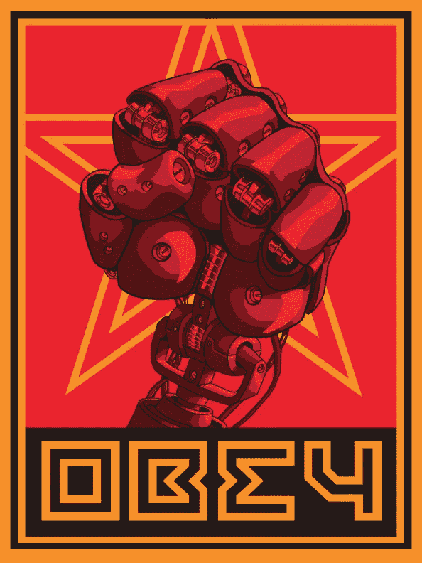

# 第四次工业革命就在我们身边，而我们几乎没有注意到它

> 原文：<https://medium.datadriveninvestor.com/the-fourth-industrial-revolution-is-among-us-and-we-barely-have-noticed-it-8c05eb146638?source=collection_archive---------18----------------------->

[https://www.deviantart.com/daxos/art/Robot-Revolution-Poster-2-342842071](https://www.deviantart.com/daxos/art/Robot-Revolution-Poster-2-342842071)

是的，人类已经经历了三次工业革命，现在，我们正站在一次新的工业革命的门口。一切都始于 1760 年的英国，当时主要是人和动物的工作被机械力所取代，被称为*工业革命*或第一次工业革命。后来，在 1870 年，主要基于一些金属和电力的工业化，发生了第二次工业革命。大约在 1950 年，随着信息和计算机的数字化，第三次工业革命据说仍在进行中。

革命一词可能涉及各种思想、概念或哲学，但在这种情况下，它与经济、生产、通信或工业化所涉及的任何其他方面的巨大变化有关。

事实是，关于上述领域的第四次革命已经发生，而我们甚至还没有意识到。这是一场 [*颠覆性*](https://hbr.org/2015/12/what-is-disruptive-innovation) 革命，它涉及到之前的革命(数字化时代)，以克服新的挑战，利用机器人技术、人工智能(AI)和其他一些现有技术。这里我总结了一些证据。

## **1。工作正在消失。**

从汽车制造商到食品加工厂，自动化正席卷所有行业。由人类执行的任务现在变成了机器人的任务，这提高了生产率，降低了成本。但这只是开始，现在我们看到无人驾驶汽车、无人机和其他设备在未来可能会夺走司机的工作或送货员的工资。这个 TED 演讲展示了其中的一些。

**2。机器人助手到处都是。**

你可能听说过并使用过苹果的 Siri 或者亚马逊的 Alexa。它们应该是我们的日常提醒、闹钟、食物建议声音等等，但事实是它们只是一堆代码，以某种算法产生的方式排列，所以在一天结束时，我们有这个甜美的声音帮助我们改善我们一天的生产。物联网正在带走我们的一些主要设备和日常使用的产品，以帮助我们保持我们想要的安全和文明的地方。

**3。通勤从未如此容易**

如果你想去一些地方，你带上你的手机(连接到互联网——物联网),打开一个应用程序，选择你的目的地，司机就会来接你。当你下车时，你再次拿出手机，输入一个地方的名字，突然你就有了一条对你来说最好的路线，在你的屏幕上显示出车次和几乎准确的到达时间。如果你不想那样，你可能会在街上寻找一辆共享汽车，它会用你的手机(再次)打开它的门。

**4。你被一个疯狂的广告**盯上了

不，这不是魔术，你的房间里也没有谷歌、亚马逊或耐克安装的摄像机(嗯，这可以是一个粗略辩论的话题)。所以，问题是:这些公司怎么知道我的喜好，我的风格等等？答案没那么简单，只是一个数据问题。作为消费者，我们每天都会产生大量的数据。每一次点击，比如，评论都给一个渴求信息的小“机器人”(cookies)留下了痕迹。一旦你上了网，你就把生活的一部分留在了网上。

这只是一个小的，但真正伟大的革命的证据就在我们中间。区块链、3D 打印、可穿戴设备、云计算和其他一些技术正在改变世界。我们准备好面对这一切了吗？

作为一名石油工程师和充满激情的工程师，我问自己:石油和天然气行业到底怎么了？毫不奇怪，革命也进入了这一领域，虽然速度有点慢，但正朝着那个方向发展。毫无疑问，不久我们将看到油井使用人工智能自行钻井，公司也将使用区块链技术庆祝合同、偿还债务或跟踪账户。点击[这里](https://www.onepetro.org/conference-paper/SPE-184320-MS)查看一篇关于此事的论文。

通过将所有这些技术应用于医药、食品项目、农业和其他许多可以造福世界的领域，未来看起来非常有希望。现在轮到我们社会准备使用它们，但更重要的是管理它们。