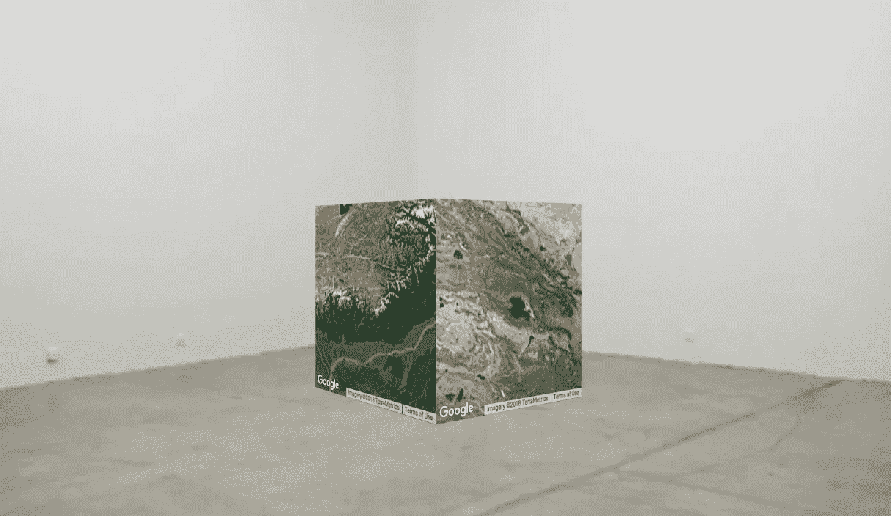

# 艺术界处理数字艺术的令人沮丧的方式

> 原文：<https://medium.datadriveninvestor.com/the-frustrating-way-the-art-world-deals-with-digital-art-9450f101485?source=collection_archive---------9----------------------->

Robert Jan Leegte, [*Google Maps as a Sculpture*](http://www.googlemapsasasculpture.com/), 2013, Javascript, HTML, CSS, Google Maps API website.

我记得 2017 年 2 月底参观阿姆斯特丹的上游画廊，参加荷兰网络艺术家 Jan Robert Leegte 的作品展览。在名为 [*塑造互联网*](http://www.upstreamgallery.nl/exhibitions/140/sculpting-the-internet) 的展览中，里格特描绘了他对概念化和利用各种在线资源和程序作为原始数字材料的兴趣。互联网既是他的画布，也是他的工作室。然而，在展览中，我对展出的实际数字作品的数量感到失望，或者更确切地说，是缺乏这些作品。在其中一个房间的中间放着李格特的作品*谷歌地图雕塑*，更确切地说是 2017 年的作品，而不是[2013 年的原作](http://www.googlemapsasasculpture.com/)。*谷歌地图作为一个雕塑*来自 2013 年，是一个网站，用户可以在其中看到一个旋转的数字 3d 立方体。然而，立方体的每一面都是可以使用谷歌地图的表面。这使得该网站成为一个互动的作品，用户可以在谷歌地图上放大/缩小等。只要立方体的那一面是可见的。然而，2017 年展出的作品是一个物理立方体，每边都有一张通过谷歌地图查看的地球随机截图。原始作品被完全剥夺了与互联网的直接联系，它的互动元素，它的原始数字材料，它的虚拟存在。只有 2013 年作品的概念方面在 2017 年版本中得到了延续，可以说也是视觉美学的一部分，被转化为 IRL 世界。

W 为什么数字艺术作品或网络艺术作品在被放入画廊空间并被视为可行的艺术作品之前，需要转化为后互联网时代的实物复制品？有价值吗？艺术界为什么需要一个独一无二的、真实的、独一无二的(或者至少是精选系列中的一个)实物，才能让一件作品有价值？或者我们甚至还能把罗伯特·扬·里格特 2017 年的作品称为网络艺术吗？在网络艺术的年轻历史和关于它的学术著作中，有许多仍在讨论中。不同的作者为使用互联网艺术、网络艺术或网络艺术作为“网络艺术”的首选术语辩护。根据某些理论，它与互联网的直接联系也是不必要的。就我个人而言，我同意蒂尔曼·鲍姆加尔对网络艺术的定义:

> 处理互联网真实特征的艺术，这种艺术只能通过互联网发生[2]

如果网络艺术作品必须连接到互联网，如果这是其功能的重要部分，是其存在的重要部分，那么李格特 2017 年的作品不能被视为网络艺术。在某种程度上，它更像是一幅画的照片，然后以其自身的权利作为艺术品呈现，这很有可能。但是，这感觉有点不公平，就像我们没有给原创足够的信任，足够的机会。但是，当谈到数字艺术，尤其是网络艺术在艺术世界中的地位时，这就是整个问题。
和鲍姆格特一样，瑞秋·格林是另一位研究和撰写网络艺术历史和发展的先驱。格林在 2000 年为艺术论坛撰写的一篇文章获得成功后，实际上是第一个在互联网之外发表网络艺术的人。早在 2000 年，她就在为艺术论坛撰写的文章中提出了使用网页艺术作品图像作为插图的问题，如下所示:

> *“不管这些网页上有什么 net.art 项目的图片，请注意，从它们的原生 HTML，从它们的网络社交栖息地看，它们就像是动物园里的 net.art 动物。”[3]*

尽管我们已经前进了 18 年，这在互联网的历史上已经是几个世纪了，这个比较，这个小小的警告，仍然和 2000 年一样有意义。艺术品的离线拷贝意味着在线功能，互动作品现在没有反应，物理克隆剥夺了它们的数字来源，它们就是不切实际。在网络艺术和数字艺术存在的大约 25 年里，我们仍然在努力在它们的自然栖息地评估和欣赏这些艺术作品和艺术实践，这怎么可能是真的。与 2000 年不同，我们现在应该有工具和知识来创造新的策展实践和新的平台，以适当地给予在线数字艺术品应有的地位。如果不是这样，网络艺术将会过多地停留在网络文化的领域中，并错过许多观众。网络艺术家可能会一直觉得他们也必须制作实体作品来获得认可和报酬。老实说，这只是一个遗憾。

[1]“net . art”这个用小写字母写的、中间有一个点的特定术语的起源，与其说是特意选择的，不如说是一个偶然。据说 net.art 来自网络艺术先驱 Vuk Cosic 在 1995 年发送的一封支离破碎的电子邮件。在由数字、字母和符号组成的混乱阵列中，术语 net.art 脱颖而出，并一直在网络艺术社区中使用。

[2]这里所选的引文实际上是约瑟芬·博斯玛在 2011 年*网络论坛:让我们谈谈网络艺术*中的德文原文(Baumgä rtel， *net.art 2.0，* 2001)的一个更简洁的英文翻译。第 28 页。

[3]格林，雷切尔，《网络作品:网络艺术史》，*艺术论坛 38 期*，2000 年，页 162

作者: **Stein van der Ziel**