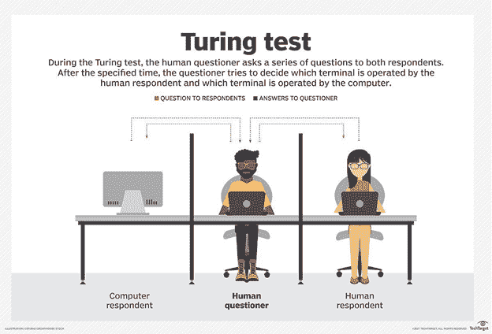
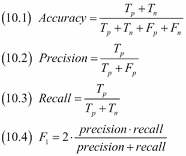

# 人工智能系统测试的功能方面

> 原文：<https://medium.datadriveninvestor.com/the-functional-aspect-of-ai-system-testing-5b80202385a4?source=collection_archive---------5----------------------->

由 Geocel Zayda Villareal

**人工智能** (AI)的总体目标是创造技术，让计算机和机器像人脑一样思考和工作。实现某个目标需要多年的研究和应用程序测试，多年来，人们能够开发如何测试传统软件的策略。但是基于人工智能的软件呢？

目前，没有一致的方法指南来测试人工智能系统。许多组织仍在尝试各种方法。与传统的基于需求和用户故事的软件测试不同，人工智能系统从数据模型中学习，结果是不确定的。

最著名的人工智能测试方法是**图灵测试**，它被用来*衡量*、*判断*一台机器是否真正智能。

Reference: [https://searchenterpriseai.techtarget.com/definition/Turing-test](https://searchenterpriseai.techtarget.com/definition/Turing-test)

在这里，两个人和一台机器经过一系列测试。每个参与者被安排在不同的房间。测试人员将通过提供一组问题来从人类参与者中确定机器。如果测试者无法区分机器对人类参与者的反应，那么机器就具有类似人类的智能。

 [## DDI 编辑推荐:5 本让你从新手变成专家的机器学习书籍|数据驱动…

### 机器学习行业的蓬勃发展重新引起了人们对人工智能的兴趣

www.datadriveninvestor.com](https://www.datadriveninvestor.com/2019/03/03/editors-pick-5-machine-learning-books/) 

尽管众多知名的计算机程序或聊天机器人声称通过了图灵测试，但现实是，自推出以来，没有一台人工智能机器通过测试。

不考虑所有的挑战，仍然有一种方法来测试人工智能系统。

# **人工智能测试中重要的人类角色:**

**AI QA 策略师**是了解整个数据流程的人——包括业务和技术知识。

**数据科学家**是开发人工智能模型和分析数据以及性能模型的人。

**AI 测试专家**是负责修正 AI 模型的人。

# **人工智能考虑因素:数据集、训练数据和模型**

使用一个好的数据集来不混淆 AI 是至关重要的。数据项目的成功取决于使用从中学习的算法训练数据的质量和数量。

数据科学家应该能够创建一个数据集，该数据集在按钮、文本框、图像或文本被丰富或标记的地方是正确的，以按钮不超过文本框的数量的方式进行规范化，反之亦然，并且足够大以支持算法来避免过度拟合。

# **测试人工智能训练系统**

1.  人工智能训练系统应该能够分类:

a.图像颜色，大小，和里面的字母，它们将被转换成训练系统需要的 0 到 1 的值。

b.文本数据，如果是姓名、号码、地点等。

2.人工智能训练系统应该能够处理用于测量人工智能学习能力的不良测试集。

3.在几个小时和大量计算之后，应该使用训练数据和特征计算来训练 AI。

4.人工智能应该能够提供“自信”的预测。

# **测试人工智能大脑**

如果人工智能能够确定按钮和文本框等结果，那么它就可以提供与输入相关的结果。相对而言，人工智能模型仍然经常产生不准确的结果，这些结果可以分为:

**假阳性**或模型错误预测阳性类别的结果。

*例如:文本框的图像被错误地确定为按钮。*

**假阴性**或模型错误预测阴性类别的结果。

*例如:一个按钮的图像，说它不是一个按钮。*

**以下是帮助改进人工智能模型的四个性能指标。**

Reference: [https://subscription.packtpub.com/book/big_data_and_business_intelligence/9781785282287/10/ch10lvl1sec133/computing-precision-recall-and-f1-score](https://subscription.packtpub.com/book/big_data_and_business_intelligence/9781785282287/10/ch10lvl1sec133/computing-precision-recall-and-f1-score)

1.  **精度**:隐含为从所有预测阳性病例中正确识别出阳性病例的度量，在假阳性数量较高时有用。
2.  **回忆**:它是从所有实际阳性病例中正确识别出阳性病例的度量，在假阴性数量较高时很有用。
3.  **准确性**:是对所有正确识别案例的度量。当所有的类都同等重要时，它最常用。
4.  **F1-score** :它是精度和召回率的调和平均值，比精度指标更好地衡量了错误分类的情况。当假阴性较低时使用。

# **人工验证(A/B 测试)**

最后，人工智能模型必须经过人工验证或端到端的项目测试。

使用真实的输入数据、UI 和/或 API，可以执行 A/B 测试来确定和统计分析输出，如果输出是正确的或相关的，并且对其最重要的方面是有用的。

请记住，成功的人工智能模型不只是为组织提供相关的结果，还会从用户那里产生积极的反馈。

**立即获得免费的机器人过程自动化(RPA)软件！**

[在这里下载](https://www.raxsuite.com/freedownload?utm_source=Medium%20Post&utm_medium=medium&utm_campaign=medium_footer)

**参考文献:**

11 月 QA 会议— STP

 [## 图灵测试是什么，哪个 AI 通过了？- Knowmail

### 在 1951 年的一篇论文中，艾伦·图灵提出了被称为“模仿游戏”的图灵测试。在他看来，模仿游戏…

www.knowmail.me](https://www.knowmail.me/blog/whats-turing-test-ai-pass/)  [## 为什么 QA 专业人员必须努力掌握新技术

### 今天的 QA 专业人员必须努力掌握人工智能、物联网和区块链等新技术，以确保…

www.softwaretestingnews.co.uk](https://www.softwaretestingnews.co.uk/why-qa-professionals-must-work-on-mastering-new-technologies/)  [## 分类:真与假，正与负

### 预计时间:5 分钟在这一部分，我们将定义指标的主要构建模块，我们将使用这些模块来…

developers.google.com](https://developers.google.com/machine-learning/crash-course/classification/true-false-positive-negative)  [## 准确度、精确度、召回率和 F1 分数:性能指标的解释——Exsilio 博客

### 如何在 Azure ML 中评估一个模型的性能并理解“混淆度量”这个博客演示了如何…

blog.exsilio.com](https://blog.exsilio.com/all/accuracy-precision-recall-f1-score-interpretation-of-performance-measures/)