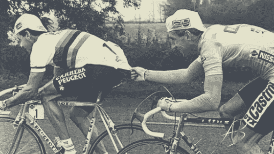

# 高成就的基础是。

> 原文：<https://medium.datadriveninvestor.com/the-fundamentals-of-high-achievement-be-ing-855cfcd2da15?source=collection_archive---------16----------------------->

我怀疑这篇文章可能会让人觉得有点刺耳。

我并不想过分挑剔，只是想和你分享一些成功者认为理所当然的不言而喻的基本原则，从而创造一个停下来反思自己行为和习惯的时刻。

它可能是我们 DNA 中的一条未知链。

那些似乎有着非人的专注、韧性和钛卵巢的人与那些一直在挣扎、沮丧、痛苦的人，以及世界恶劣气候的受害者之间神秘的缺失联系。

我从某些“高成就者”FB 小组的帖子中看到，那里的主持人注意到人们以一种低能的方式出现。

我从我的客户的沮丧中看到了这一点，因为他们不断受到亲人、朋友、同事、雇员的攻击，他们觉得他们冷漠、无情、不体谅别人，而且他们的期望不切实际。

就我个人而言，我总是有点惊讶于大多数人是多么的贫困，以及他们是如何坚持将这种贫困转移给每一个人和任何一个偶然发现他们的人。

他们 ***从外面寻求太多他们不敢从*** 里面索取的东西。

一种无名的恐惧使大众远离生活的真正竞技场。

*以下是我在真正的成功者身上体验到的一些基本要素:*

# 真正的成功者珍惜时间。

你永远也找不回的唯一资源就是时间！成功人士不仅在学术层面上理解这一点，他们已经将这一点根深蒂固地融入到他们的骨子里。

他们感受到时间流逝的压力，他们对自己做的每件事都有一种紧迫感，并渴望得到。

与那些想在下午 5 点整走出办公室的人不同，成功者在完成一天的工作之前是无法休息的。这就是为什么我们经常被告知我们会精疲力尽——胡说八道！

燃烧你的是一个不安的灵魂，因为你今天没有完全展现出来，所以你晚上无法入睡。

让你痛苦的是，认为在指定的时间疯狂地将工作、娱乐、训练和生活分类会给你带来充实的生活。

茁壮成长来自于*根据你的生物节律所显示的能量水平，回收你的时间来专注于你的欲望*。

# 真正的成功者尊重其他玩家——我们不会打断他们的游戏。

作为一名绩优者，你知道场上其他球员的意识是不容置疑的，即使是在最佳状态下。

这是一种你培养和成长的感觉。

把你的意识推出去，这样你就可以调整、反应、增加、转向，而不会把 peloton 带下来。

这是关于理解，即使当我们比赛时，通常是在一条赛道上，当一个更强壮的骑手需要超车时，我们也会他妈的让开。

这叫尊重。

关键是要努力拼搏。当你遇到瓶颈或者需要喘口气时，你可以走出球场，在不影响其他人的情况下进行充电。

我回想起在 IronMan 发生的一件事，当时有一位男性骑手在登山时经过。

当他看到我把车停在他旁边时，他的自尊心爆发了，于是开始加快脚步。

他决心不让我通过，尽管我的存在意味着我的平均水平高于他。

不过，钢铁侠有一条不拉力赛的规定，他冒着我们被处罚的风险。我知道，只要他把火柴烧了，我无论如何都会追上他。

在裁判的指导下，我坐上去让他摆脱自我，让我过去。

我甩掉了他的屁股，在剩下的比赛中再也没有看到他。

这种程度的琐碎行为会让每个人都付出代价。

真正的成功者都待在自己的游戏里。他们与自己竞争。他们尊重场上的其他球员。

换句话说，不要做一个混蛋**。**

# 真正的成功者对自己的生活和结果承担全部责任。

很抱歉，但老实说，我对当前盛行的受害者心态已经忍无可忍了。

人们每天都要走上一整天，抱怨生活有多艰难，人际关系让他们筋疲力尽，他们多么讨厌自己的生活以及生活中的一切。

*如果你不喜欢，就他妈的改变它！*

成功者懂得，每一个行动和话语都需要能量。

它会耗尽你的创造性思维能力。

他们也明白 ***就是这么回事。***

换句话说*昨天的决定造就了今天的结果*。

他们不会把宝贵的精力浪费在抱怨上，相反，他们会把注意力集中在自己最终做出的决定上。

如果他们不喜欢这个结果，他们会在今天改变决定和行为，这样明天就会有不同的结果。

成功者懂得，他们的生活不是由别人的所作所为决定的。

他们选择了授权的立场，在玩游戏的时候也考虑到了其他玩家的举动——想想棋盘。

同样，成功者尊重其他参与者，所以他们不会把自己的屁话强加给别人。

他们会为自己创造专业的空间和支持系统，帮助自己战胜内心的恶魔——我们不会让朋友和亲人成为治疗师。

周期。

# 真正的成功者恰当地给予和接受。

“专家”经常对我说，我付出的太多了。

我应该只分享什么，而不是如何分享。

我需要让他们期望更多。

我不能被操遵循这一哲学。

对我来说，我可以与你们分享的智慧、工具和策略的数量是无限的。

我也不怕付出一切。

原因何在？

因为作为一个真正的成功者，我不相信稀缺性。

对我来说，我能授权的人越多，我就能激励越多的人开始有意识地生活，

全人类获益越多。

我庆祝一个完全陌生的人的胜利，他给我发信息说感谢一个转变的视频，就像我庆祝我的私人客户的胜利一样。

我的客户不和我合作，因为他们在网上找不到答案。

我的客户与我一起工作，因为他们重视我的个人关注和洞察力，我对他们内部战争的清晰认识，我对他们胜利的热情，我诚实的反馈，我对他们的不懈推动，我对他们的高标准期望。

与此同时，作为一个高成就者，我在思维和成就领域追随其他不可思议的领导者的工作，他们自由地给予狗屎吨的价值！

现在，对你来说重要的一点是——***真正的成功者接受可获得的东西，并为个人关注付出。***

归根结底是尊重和重视你的导师、教练和老师。

我从来没有想过要联系我的导师和教练来“喝咖啡”,想要榨干他们的思想。

它创造了不平等的能量流。

没有财务投资，我就无法获得，因为我的容器很浅。

这意味着即使他们不得不把他们最强大的秘密给我，我也没有能力接受。

取而代之的是，我学习他们的教导，然后当我准备好更多的时候，就私下报名。

这是常识，亲爱的——**不要什么都不要。**

事实上，当你回顾以上内容时，你会发现一个共同的价值，

# 尊重:

关于你自己，

其他人，

你的目的，

你的梦想，

人性。

当然，只有当尊重对你和对我都是核心价值时，所有这些才会产生共鸣。

今天，我邀请你看看你的行为，问问你自己，这是否反映了我对自己、我的梦想的爱和尊重，以及对我选择与之交往的人的爱和尊重。

不要感到羞耻或责备——只要带着真正的好奇心和对自我意识的强烈渴望去接近它。

毕竟只有死亡是不可避免的。

繁荣仍然是勇敢者的选择。

带着爱和感激，

阿内尔

