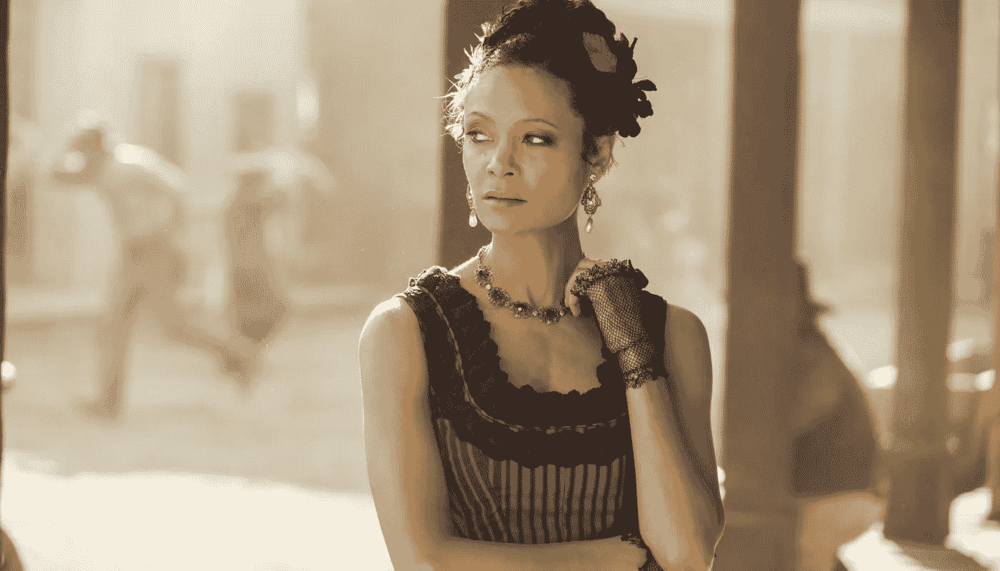
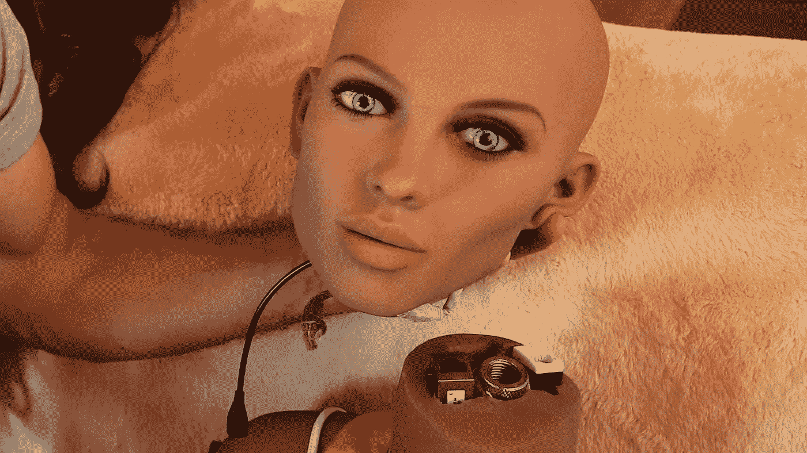
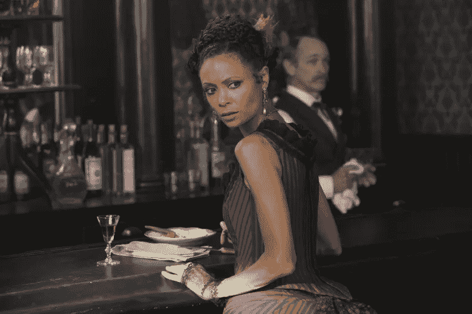
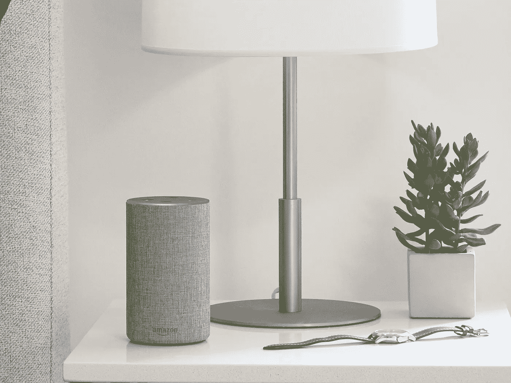

# 未来是女性的，但从很多方面来看肯定是可怕的

> 原文：<https://medium.datadriveninvestor.com/the-future-is-female-but-it-sure-is-terrible-in-many-ways-14bd45c31d06?source=collection_archive---------7----------------------->

## 这些最新的人工智能产品正在扼杀社会进步

最近，我受邀在 ADMA 的全球峰会上就多样性和包容性在创新中的关键作用发表演讲。从我的小组讨论中得到的关键信息是，当涉及到技术时，女性总是吃亏。

性别刻板印象不断被科技公司延续，最酷和最新的科技并不是为女性或由女性制造的。

甚至在我参与创立的社会组织[超人类协会(Transhumanism AU](https://www.transhumanism.com.au/) ，我们也有一个女性问题。也就是说，缺乏女性代表。

**性爱机器人正在成为主流，但这是正确的吗？**

性产业是最早采用技术的行业之一，通常为我们了解即将到来的下一个主要指数型技术提供了一个很好的窗口。

性爱机器人越来越受欢迎，27%的千禧一代会考虑与机器人约会，到 2050 年，人与机器人的关系可能比人与人的关系更普遍，你可能不会感到惊讶。

你可能也不会感到惊讶，目前由 Realbotix、Synthea Amatus、Doll Sweet、Z-onedoll 和 AI Tech 等公司制造的性爱机器人大多是女性。

由于大多数活动都是在紧闭的卧室门后进行的，而且围绕性话题的禁忌无处不在，性机器人的社会和伦理含义没有得到讨论和解决。

有这样的问题:这些玩具会促进对女性不健康的关系吗？是否会导致对象化和滥用？

《西部世界》足以说服我们不要虐待机器人吗？

机器人扮演夫人和妓女的角色，也在 HBO 的热门连续剧《西部世界》中出现。

在机器人生活的狂野西部主题公园里，主题公园的游客有机会沉浸在他们最邪恶和快乐的幻想中。

对客人来说不幸的是，这些机器人变得有知觉，对客人施加给它们的暴行有完美的记忆，很快足够多的客人处于危险之中。

也许这个高度可信的场景足以阻止任何人对机器人的恶劣行为？

**Alexa、Siri、Cortana 都是女性但不是女权主义者**

在语音助手方面，研究通常显示，消费者更喜欢顺从和顺从的声音。

恰好苹果的 Siri、微软的 Cortana、亚马逊的 Alexa 等语音助手都有默认的女声和女性发音的名字。

虽然可以说公司只是给了消费者他们想要的东西，但像这样的产品强化了性别刻板印象和期望。这是我们一直在通过[超人类主义研究的一个问题。](https://www.transhumanism.com.au/)

**谷歌的语音助手很聪明，但确实需要一些街头智慧**

谷歌的双工语音助手在现场演示中首次发布时，所有人都惊叹不已。在演示中，语音助手(恰好是女声)给一家发廊打电话预约。

这个声音听起来比任何数字助理都更像人类，更自然，甚至让发廊误以为它在和另一个人说话。

一些人沉浸在兴奋中，可能错过了语音助手要求“女人理发”的对话——很少有女人会说这个词。

**亚马逊的 AI 招聘工具不喜欢女性**

亚马逊创造了一个人工智能工具来帮助其招聘过程。最近发现它对女性候选人有偏见，亚马逊决定关闭它。

这是因为它的机器学习模型大多是从软件开发人员和其他技术职位的男性候选人那里获得简历。

选择男性简历来训练模型不是故意的，他们只是在提交的简历中寻找模式，在过去十年中，男性主导了他们的技术劳动力。

虽然亚马逊能够发现偏差，但这回避了一个问题，有多少其他产品存在算法偏差？

如果产品是由男性占多数的工程团队制造的，并且使用以男性为中心的数据，算法偏差尤其令人担忧。

**女性是第四次工业革命的最大输家**

根据世界经济论坛，女性将成为第四次工业革命的最大输家。然而，似乎女性不仅在工作方面是最大的输家，在阻碍她们社会进步或不适合她们的产品方面也是如此。

苹果、微软、亚马逊和谷歌等科技公司有机会改变现状、创造平等，但它们设计的是世界的本来面目，而不是世界应该是什么样子。

这可能部分归因于这样一个事实，即平均而言，男性在主要科技公司的领导职位和工程职位方面仍然领先。鉴于马克·扎克伯格、拉里·佩奇、谢尔盖·布林和杰夫·贝索斯领导着一些世界上最有价值的科技公司，这并不是太离谱。

性别机器人和语音助手给社会带来了一个大问题:

*   当你的女儿被女性服务机器人包围时，你如何鼓励她从事科学和工程方面的职业？
*   当你的儿子整天对着一个女声助理大声喊出要求时，你是如何鼓励他尊重女性的？

如果女性现在不采取行动，男性设计的人工智能很可能会接管我们的生活。

***

**我只写指数科技和** [**超人类**](https://www.transhumanism.com.au/) **。如果你也想知道如何理解一个受到人工智能、区块链和其他指数级技术影响的世界，请跟随我。**

