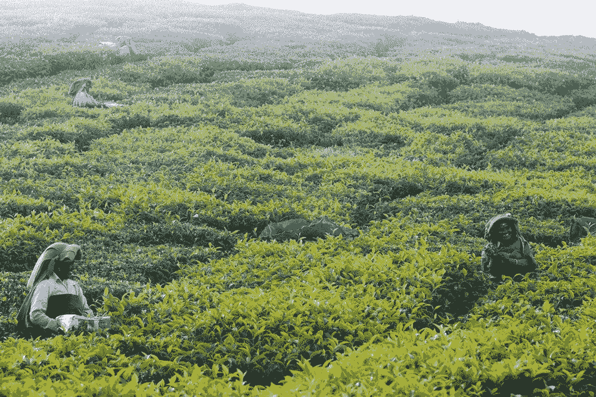
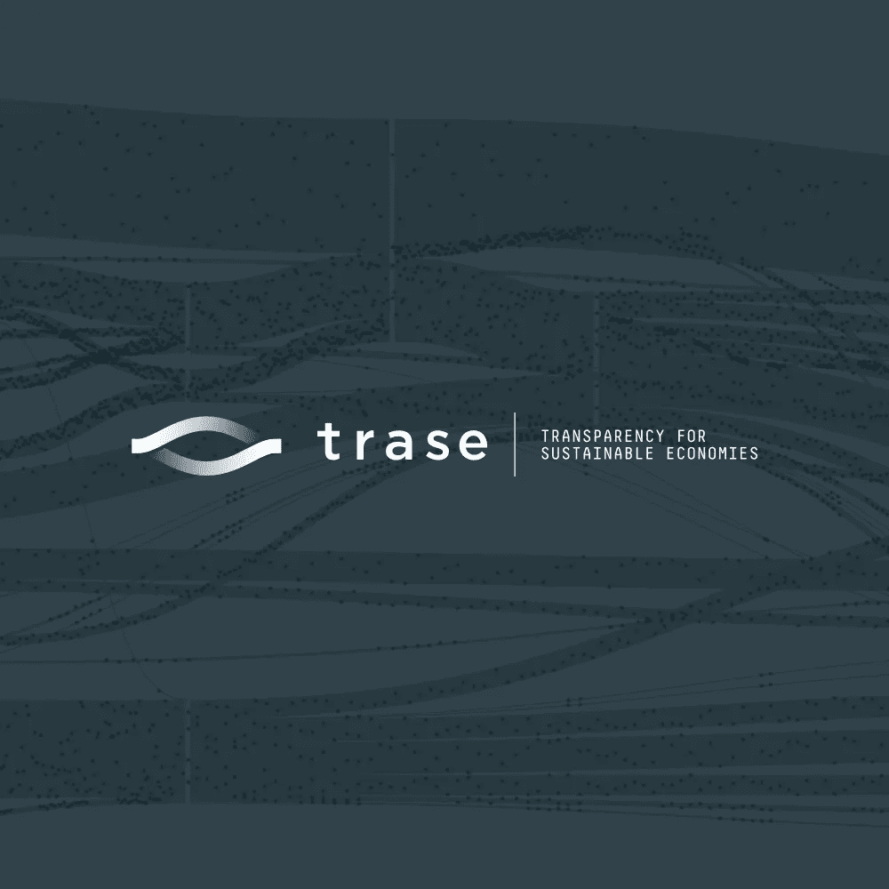
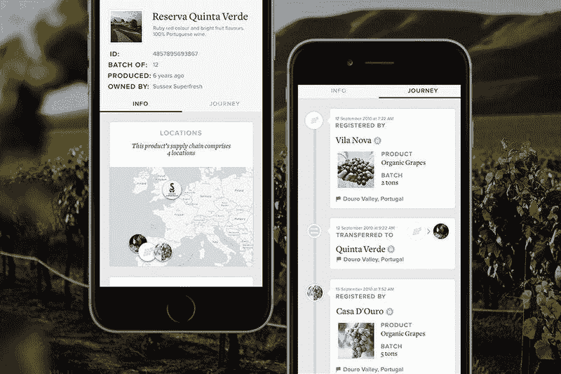
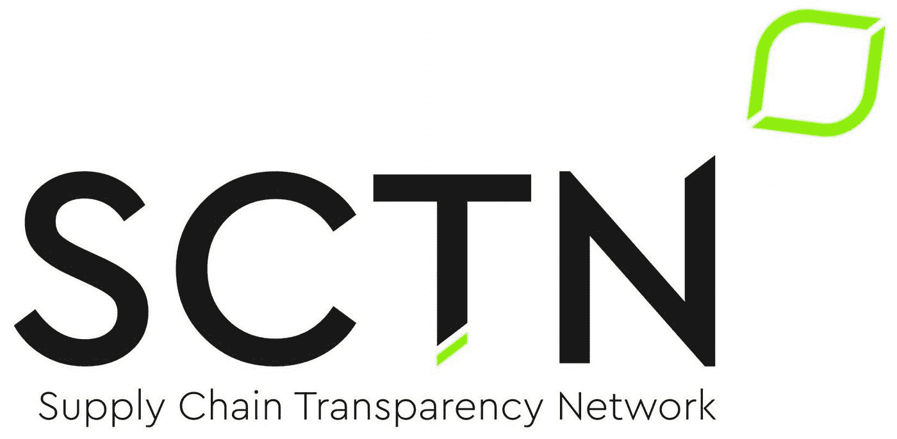
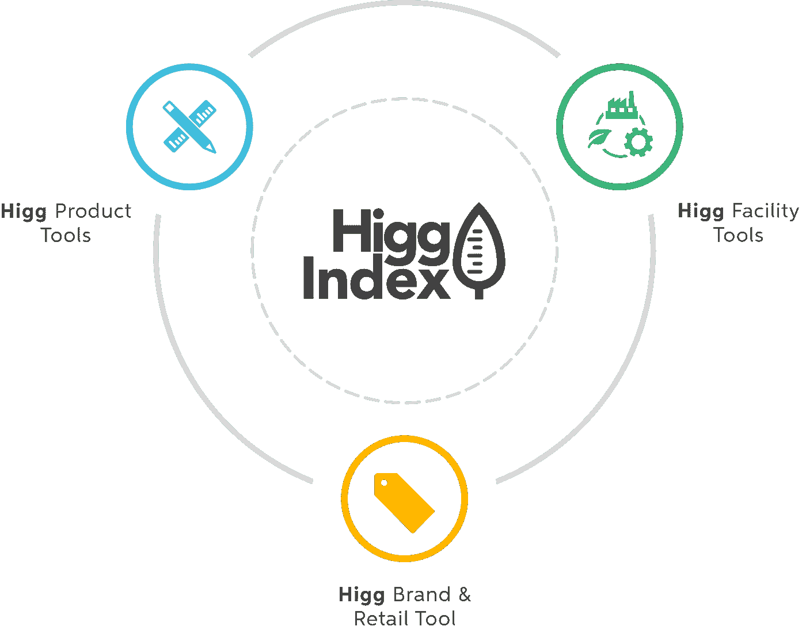

# 未来是透明的——收回对不透明供应链隐性成本的控制权

> 原文：<https://medium.datadriveninvestor.com/the-future-is-transparent-taking-back-control-over-hidden-costs-of-opaque-supply-chains-139e26140327?source=collection_archive---------11----------------------->

目前，在供应链中提供信任方面，组织正面临着巨大的挑战；在全球不透明的环境下，产品越来越复杂，通常无法追溯其来源，社会和环境影响也无法衡量。

# **隐藏在公众视线之外的****

*缺乏透明度和可追溯性会导致各种各样的关键问题，每个问题都是行业特有的。*例如，食品行业面临着巨大的挑战，因为与“森林风险”商品供应链的复杂性相关的森林砍伐不断增加。大豆和棕榈油很少列在配料上，因此顾客几乎看不到。然而，大豆包含在肉类、鱼类和其他动物产品中，棕榈油被添加到从加工食品、糖果到牙膏的各种产品中。这样的设置对消费者甚至供应链顶端的零售商隐藏了生产的影响，使他们意识不到产品正在对雨林造成的破坏。**

*另一个面临供应链不透明的根本性挑战的行业是时装业。*时尚服装的生产依赖于复杂和不透明的供应链，这些供应链往往与不可持续的做法相关联(de Brito，Carbone，& Blanquart，2008)* 。化学品和自然资源的大量使用导致生产国的当地污染，没有公司对此负责，因为无法追踪。缺乏透明度还导致未经授权的分包[【4】](#_ftn4)，这导致不公平的劳动做法、不稳定的工作条件，往往是在社会弱势群体中，随后甚至导致侵犯人权。*

# ****正确的方法****

*斯德哥尔摩环境研究所(Stockholm Environment Institute)推出的供应链可追溯平台 Trase 表示:“毫无疑问，如果供应链下游的人们(例如，消费者、零售商、金融家、进口商、加工行业)希望对田野、种植园和森林中发生的事情产生积极影响，那么透明、可追溯的供应链至关重要。”*

*毫无疑问，提高透明度有助于零售商做出更好的决策，可以识别风险和“热点”，并检查他们是否无意中从非道德供应商或森林砍伐区采购。重要的是，透明度使他们能够应对这些挑战——与供应商合作，以知情和有效的方式解决各种风险，并寻求或创造更可持续的选择[【5】](#_ftn5)。*

# ****集体&透明信息共享****

*可追溯性可以成为提高供应链可持续性的最重要的工具。然而，组织需要有效地这样做——提出正确的问题并有效地使用可用的信息。*

*要有效地开展工作，两个重要方面需要到位。首先，规划整个供应链，发现信息差距和挑战。这有助于进一步理解目标并对信息进行优先排序——什么是有用的，对谁有用？*

*第二个至关重要的方面是对规划好的供应链进行透明和公开的共享。在当前互联供应商和零售商的全球格局下，将数据融合在一起可以显著降低所有利益相关方的成本。因此，可以公平地说，集体方法对于快速跟踪更好的做法和可持续解决方案的发展至关重要，这些做法和解决方案可以进一步分享和推广。*

# ****可用方案****

*当谈到供应链的透明度时，组织将面临巨大的挑战。幸运的是，已经有许多产品和方法可供使用。从区块链驱动的应用程序到地图平台和促进联盟的协作，有着广泛的计划。*

*以下是一些最有前景的项目:*

## *[**特拉斯**](https://trase.earth/?lang=en)*

*规划农产品供应链的平台。Trase 揭示了热带森林地区的环境和社会风险之间的联系，并为改善这些商品的生产、交易和消费的可持续性创造了机会。*

**

## *[**出处**](https://www.provenance.org/)*

*由区块链提供支持，出处是一个开放数据软件，使零售商和生产商能够跟踪货物的旅程，并向客户开放产品数据。*

*目前，出处正在运行“区块链革命:可持续认证供应链的应用”——一个为期 9 个月的试点项目，旨在展示区块链技术可以为可持续标准系统和可持续认证供应链提供哪些机会。*

**

## *[**【供应链透明网络(SCTN)**](https://www.supplychaintransparency.network/)*

*(SCTN)是由 [Global Canopy](http://globalcanopy.org/) 和[Stockholm Environment Institute](https://www.sei-international.org/)召集的非正式联盟，旨在促进合作和推进可持续供应链的新战略，重点关注供应链数据。*

**

## *[**希格指数**](https://apparelcoalition.org/the-higg-index/)*

*希格指数是一套工具，用于品牌、零售商和设施对公司或产品的可持续发展表现进行衡量和评分。希格指数透明度工具只关注透明度，允许利益相关者和消费者使用共同的语言和分享可持续发展的努力。*

**

# ****采取行动****

*归根结底，重要的是企业如何转变供应链，以及它们如何整合可持续发展的实践。可追溯性和透明度是以知情和有效的方式对当前的环境和社会问题采取行动的必要步骤。*

# *…*

*[【1】](#_ftnref1)[https://www . exhausion . org/news/technology/the-区块链-revolution-audit-efficiency-trust-in-sustainable-certified-supply-chains](https://www.provenance.org/news/technology/the-blockchain-revolution-audit-efficiency-trust-in-sustainably-certified-supply-chains)*

*[【2】](#_ftnref2)欧洲棕榈油至少[必须被列为](https://www.theguardian.com/sustainable-business/2014/dec/12/eu-labelling-changes-palm-oil-consumer-change)食品中的一种成分*

*[【3】](#_ftnref3)[https://www . sei . org/perspectives/food-really-sustainable-transparency/？UTM _ content = buffer 5c 060&UTM _ medium = social&UTM _ source = LinkedIn . com&UTM _ campaign = buffer . LinkedIn](https://www.sei.org/perspectives/food-truly-sustainable-transparency/?utm_content=buffer5c060&utm_medium=social&utm_source=linkedin.com&utm_campaign=buffer.linkedin)*

*[【4】](#_ftnref4)供应链的第二层，不直接由零售商承包，而是由零售商的供应商分包。*

*[https://www . sei . org/perspectives/food-really-sustainable-transparency/？UTM _ content = buffer 5c 060&UTM _ medium = social&UTM _ source = LinkedIn . com&UTM _ campaign = buffer . LinkedIn](https://www.sei.org/perspectives/food-truly-sustainable-transparency/?utm_content=buffer5c060&utm_medium=social&utm_source=linkedin.com&utm_campaign=buffer.linkedin)*

*[【6】](#_ftnref6)[https://medium . com/trase/three-recepts-on-the-way-to-traceable-supply-chains-668 b 11692 a65](https://medium.com/trase/three-pitfalls-on-the-way-to-traceable-supply-chains-668b11692a65)*