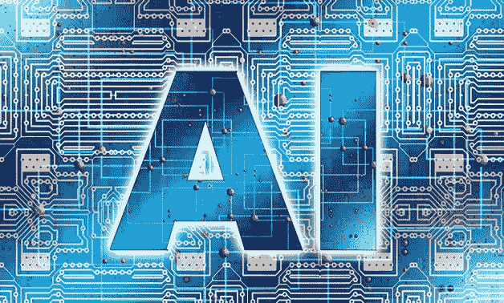

# 人工智能的未来:垂直应用

> 原文：<https://medium.datadriveninvestor.com/the-future-of-ai-vertical-applications-57b21337cd0b?source=collection_archive---------0----------------------->

Artificial Intelligence, AI- CC via pixabay/ geralt

# 垂直人工智能概述

几年前，亿万富翁风险投资家马克·安德森写道:“软件正在吞噬世界。”他可以扩展自己的观点，说:“人工智能也在吞噬世界。”

AI 是用来描述能够做出需要人类智能的决策的软件的术语，例如理解语音、预测天气状况以及决定在谷歌上向用户显示什么结果。机器学习是人工智能的一个子集，专注于分析数据以做出预测，而不是使用硬编码的规则。人工智能远不止埃隆·马斯克(Elon Musk)所说的可怕机器人——它是实现无人驾驶汽车、癌症诊断软件(稍后会有更多介绍)、自动化工厂和无数其他创新的技术。企业正在从使用基于规则的引擎(例如，使用一个公式来计算某人有资格获得多少贷款)进行决策，转向使用人工智能进行数据驱动的决策。

 [## 挑战你对人工智能和社会看法的 4 本书|数据驱动的投资者

### 深度学习、像人类一样思考的机器人、人工智能、神经网络——这些技术引发了…

www.datadriveninvestor.com](https://www.datadriveninvestor.com/2019/02/28/4-books-on-ai/) 

公司的人工智能应用分为两大类:横向人工智能和纵向人工智能。横向人工智能应用解决了许多不同行业的广泛问题。例如，人工智能可以用于区分客户线索的优先顺序，预测哪个招聘最成功，推荐产品或定向广告。无论是金融服务、医疗保健、工业、媒体还是技术领域的公司，都面临着类似的问题。

而垂直 AI 则是应用于特定行业的特定问题，并针对该行业进行高度优化的 AI。垂直 AI 应用公司使用来自目标行业的特定行业类型的数据来训练他们的算法(称为训练数据)，并反过来获得竞争对手无法获得的独特见解。垂直人工智能应用程序旨在解决的问题通常也是特定于行业的。

横向人工智能应用的好处是所有公司都有可能使用它，这使得市场通常比垂直人工智能应用大得多，因为垂直人工智能应用的潜在客户群更具粘性。然而，因为横向人工智能应用程序是为适应许多用例而设计的，它们不能单独地为每个用例执行得很好。有时候垂直的 AI 应用建立在水平的平台上，作为这个问题的解决方案。然而，最好的垂直人工智能应用程序是那些为特定行业定制的应用程序，其中企业家对垂直培训数据、特定于垂直行业的客户需求和特定于行业的工作流有着深刻的理解。

我们刚刚开始了解垂直人工智能的真正潜力；下面提供了三个重要行业的例子。

# 卫生保健

人工智能在医疗保健中应用的主要方式之一是复制和优化医生的决策。人工智能公司正在建立机器学习算法，利用患有或不患有某些医疗问题的人的医疗图像作为训练数据，以便能够进行医疗诊断。医生对病人有深刻的了解和真实的生活经验，但他们仍然容易出现人为错误，最终可能会遗漏一些东西。人工智能可以被认为是一种第二意见或尽职调查。根据一些估计，10%到 20%的癌症病例被误诊。此外，估计每年有 40，000 人因误诊或延误诊断而死亡。幸运的是，人工智能癌症诊断的进步应该会在未来几十年内大幅减少这一数字。

当人类医生和人工智能算法合作诊断疾病时，它们可以具有极高的效率。一名训练有素的医生可能会看着 x 光片，看不出任何问题，但一种算法可能会指出，在图像的特定部分有医生错过的特定疾病的迹象。人类和人工智能“医生”的这种蝙蝠侠和罗宾的组合比他们单独使用要精确得多。以下是医疗人工智能领域创新公司的例子。

Path.ai 是一家提供人工智能系统的公司，该系统通过提供人工智能软件来帮助肿瘤学家(癌症医生)诊断癌症，该软件可以拍摄物理病理图像并将其数字化，以便他们的算法可以使用这些图像结合现有的数字图像进行训练，以诊断癌症。通过将病理图像数字化，Path.ai 将能够访问其所需的大量数据，以提供高度准确的癌症诊断。

现在，机器学习算法被用来给医生提供第二种意见，而不是最终的发言权。在未来的某个时候，当机器学习算法在诊断医疗问题方面更加准确时，它们可以被视为第一选择，医生可能会被叫来进行第二次检查。

实现这一点的唯一方法是为机器学习算法提供足够的数据，不仅可以注意到疾病的明显迹象，还可以检测到算法否则会错过的异常值。这在不久的将来不太可能发生，因为政府监管严格，并且担心如果人工智能系统误诊某人并建议最终致命的治疗会发生什么。以自动驾驶汽车为例:每年有超过 100 万人死于交通事故——即使自动驾驶汽车能够将这个数字减少到只有几百人，人们也会因为害怕失去控制而不敢乘坐它们。这就是为什么现在，人工智能是一种增加医生工作的工具，而不是取代它的工具。

如果机器学习算法达到那种精确度，人们得到诊断所需的时间将会大大减少，医生将只把时间花在计算机系统无法解决的最复杂的问题上。这项技术不仅在发达国家创造了巨大的商机，还让更多缺乏病理学家的发展中国家的人得到诊断，拯救了无数生命。

我们将关注的下一家公司叫做 Viz.ai。中风是由大脑中的血流阻塞引起的，对于怀疑患有中风的患者来说，时间是至关重要的。快速清除患者大脑中的堵塞物可能意味着患者是否患有中风的区别。Viz.ai 的人工智能应用程序可以帮助医生识别疑似大血管闭塞(LVO)中风。他们通过对中风和非中风患者的 CT 扫描训练机器学习算法来实现这一点。该应用程序可以检测患者是否可能中风，并在几分钟内提醒值班医生。该应用程序平均节省了 52 分钟提醒医生潜在的中风。该应用程序还包括一个安全的消息和呼叫平台，供临床团队协调医院之间的患者护理和治疗，以及一个动态医学图像查看器。

Arterys 是第一家获得 FDA 批准在医疗保健行业进行临床基于云的深度学习的公司。通常情况下，放射科医生平均需要 30 分钟到 1 小时来分析心脏图像，但使用 Arterys 基于云的平台，只需 15 秒钟就可以完成，使医生能够更快地为患者提供正确的治疗。他们的平台完全基于云，不需要单独的医疗设备，这意味着它高度可访问，更容易集成。Arterys 提供了多个高度强大的 AI 工具，使医生更加高效。他们的两个核心解决方案是 Cardio AI 和 Lung AI。Cardio AI 在数以千计的图像上接受训练，能够自动分割心脏的不同部分，使检查速度加快 30%，每次检查平均节省 25 分钟。Lung AI 是识别肺结节并自动将其分割成有意义区域的软件。该软件减少了 42–70%的漏检量。Arterys 目前正致力于扩展到更多领域，如分析紧急 x 射线。

# 金融服务

人工智能正在以许多不同的方式扰乱金融服务业，包括提高安全性、评估贷款风险、交易股票等。金融服务行业中最大的银行和金融机构以及大公司都可以访问数量惊人的大量数据。通常，与资金打交道的企业使用基于规则的引擎来识别欺诈，但现在他们正转向使用机器学习算法，这些算法利用了大量数据，因为它们更加准确。这是因为在过去几年中，基于欺诈的攻击变得越来越复杂，基于规则的引擎也越来越难以识别。幸运的是，拥有大量高质量数据的机器学习可以很好地检测这些类型的攻击。

Kount AI 是一个为电子商务企业提供欺诈检测和预防服务的系统。Kount AI 使用 12 年来收集的数十亿笔金融交易数据来检测欺诈交易，这些数据跨越 180 多个不同的国家和多个支付网络。Kount AI 使用无监督的机器学习来检测交易中可能表明支付欺诈的异常情况。他们使用监督学习来找出数据中表明欺诈交易的模式，然后根据过去的欺诈交易来标记任何看起来欺诈的交易。Kount 将这种支付欺诈检测系统称为 Omniscore。当被赋予一项交易进行处理时，Omniscore 通过一种机器学习算法对其进行分析，然后给用户一个从 0.1 到 99.9 的分数，99.9 是最安全的，0.1 是最危险的。由客户根据他们的 Omniscores 输入何时拒绝交易的规则。对于电子商务企业来说，这是一个强大而可靠的工具，可以显著增加收入。

人工智能也被用于贷款行业，以评估借款人偿还贷款的可能性，并相应地分配他们的利率。如果你打算贷款给某人，你可能会对很可能还贷的人收取较低的利息，而对不太可能还贷的人收取较高的利息。这些算法可以通过检查数百万甚至数十亿已经还款和拖欠贷款的借款人的数据点，对某人偿还贷款的可能性做出高度准确的评估。

一家价值 7.5 亿美元的名为 Upstart 的公司正在使用人工智能来预测某人偿还贷款的可能性，从而可以为他们的客户提供更便宜的贷款。由于 Upstart 的利率更低，他们的客户节省了大约 23%的信用利率。Upstart 可以做到这一点，因为他们有高度可靠的机器学习算法作为支持，因此不必收取过高的费用，因为他们不确定某个借款人偿还贷款的可能性有多大。他们利用了这样一个事实，即除了你的信用评分之外的变量，如你的工作、你的教育和你的信用报告，在你偿还贷款的可能性中发挥着作用。该公司使用这些变量来训练他们的机器学习算法，以评估特定借款人偿还贷款的可能性。

在某种程度上，金融服务业关乎预测能力，而这正是机器学习算法要做的事情。在未来 15 年里，欺诈检测行业、股票市场和贷款行业将越来越多地被创新的垂直人工智能初创公司所主导，这些公司利用了大量的金融数据。

# 产业的

工业公司存在于各种各样的行业中，如航空航天、石油和天然气以及一般制造业。这些公司通常投资昂贵的设备，这些设备需要维护以保持生产平稳运行。对于这些客户来说，廉价高效的机器维护是重中之重，因为维护成本越低，利润越大。

传统的维护方式主要有两种:反应性维护和预防性维护。被动维护的理念是在修理或丢弃机器之前等待机器发生故障。从短期来看，被动维护通常更便宜，但修理一台坏掉的机器通常比定期维护更昂贵。这种策略的另一个问题是，以这种方式处理的机器通常寿命更短，因为它们比使用其他策略处理的机器更容易损坏。

另一种维护策略称为预防性维护，其理念是根据机器的时间和/或使用情况提供日常维护，以防止机器发生故障。预防性维护通常比反应性维护便宜得多，因为机器发生故障通常比沿途提供小修理以防止其发生故障的成本更高。预防性维护的另一个好处是，与被动维护相比，它可以减少机器停机时间，并使机器有更多时间保持生产效率。预防性维护的主要缺点是过早提供维护会浪费宝贵的机器寿命。在更大的规模上，例如一个大的制造工厂，这可能是非常昂贵的。那么，如果有一种方法可以知道什么时候需要维护，这样就不会浪费宝贵的机器寿命，那会怎么样呢？有一种方法:叫做预测性维护。

预测性维护的工作方式是:( 1)一家公司收集关于机器不同状况的大量数据，如发动机每个部件的温度或不同阀门中的压力，机器是否健康，如果不健康，它有什么问题，然后(2)它将数据输入机器学习算法，该算法可以根据新机器的状况预测它何时会出现故障,( 3)人工智能应用程序然后向机器的所有者提供何时需要维护的建议。根据麦肯锡在 2015 年进行的一项研究，预测性维护已经使维护成本降低了 10-40 %,并使次优运行的机器产生的浪费性生产减少了 10-20%。对于注重成本效率的企业来说，这些成本的降低可能是巨大的。

这里有两个预测性维护 AI 公司的有趣例子。

C3.ai 是一家销售各种人工智能和机器学习产品的公司，如欺诈检测软件、能源管理软件和库存优化软件。C3.ai 的创始人兼首席执行官是亿万富翁科技企业家托马斯·m·西贝。在创办 C3.ai 之前，他创办了一家名为 Siebel Systems 的公司，销售客户关系管理(CRM)软件。2006 年，他将 Siebel Systems 以 58 亿美元的价格卖给了甲骨文公司。2009 年，他创立了 C3.ai。他也是畅销书[数字化转型](https://www.amazon.com/Digital-Transformation-Survive-Thrive-Extinction/dp/1948122480/ref=sr_1_3?keywords=Digital+transformation&qid=1575218522&sr=8-3)的作者。这本书描述了企业如何利用四种核心技术——弹性云计算、大数据、人工智能和物联网——来推动公司的数字化转型，成为成功的数字化企业。

C3.ai 为企业提供各种 ai 软件应用，包括预测性维护、能源管理、欺诈检测和库存管理。他们的预测性维护软件通过聚集来自传感器、智能设备、企业系统和操作系统的数 Pb 数据，然后训练机器学习算法来预测给定机器资产发生故障的可能性，并为其分配风险分数。该平台使机器操作员能够根据机器风险评分创建维护包。制造、石油和天然气、公用事业、银行、航空航天和国防、医疗保健、零售、电信、智能城市和运输行业的公司都在使用 C3.ai 的平台来节省资金和优化业务。

C3.ai 与美国国防部国防创新实验单位(DIUx)签订合同，为他们的飞机提供 C3 预测维护解决方案。C3.ai 的平台将允许国防部收集关于他们飞机的大量数据，用于帮助训练 C3.ai 的预测维护模型，以预测它们何时会出现故障。所有这些数据都将安全地存储在 AWS GovCloud 中，使他们能够在云中进行大规模的机器学习。这将允许国防部提高飞机的可用性，降低维护费用，减少非计划维护的持续时间和频率。C3.ai 合作的第一架飞机是 E3 哨兵，仅在六个月内，他们就将 E3 的计划外维护事件减少了 28%。自年以来，国防部已与他们签订合同，为更多类型的飞机进行预测性维护。飞机非常昂贵，可能花费数千万美元，因此保持飞机健康是国防部的首要任务。根据 DIU 2018 年度报告，通过扩大该计划，他们每年可以节省 30 至 50 亿美元。C3.ai 的预测性维护平台正在用于其他几个行业，包括制造、零售和电信行业。

Uptake 是一个工业人工智能平台，帮助公司管理硬件资产。他们的平台已经管理了超过 130 万台工业机器。该平台包括故障预测、噪音过滤(清除不必要的数据)、异常检测、维修建议和燃料管理等功能。它专为 800 多种资产而设计，可以预测 55，000 多种不同的机器相关问题。他们的平台已经帮助电厂减少了 20%的劳动力和服务，减少了 25%的零件和行业成本，并减少了 20%的计划外停机时间。有趣的是，他们的平台还用于支持销售和客户服务，而不仅仅是运营。许多工业公司都有经销商合作伙伴(比如面向消费者的零售店)，销售和分销他们的产品。Uptake 还开发了用例来支持其工业客户的这部分业务。

# 结论

上面的初创公司已经表明，垂直人工智能是人工智能的未来。他们已经表明，通过将一组特定的数据应用于一个特定的问题，不可思议的事情会发生。这篇文章只是触及了正在开发的东西的表面。有成千上万更具创新性的垂直人工智能创业公司可供你探索。对于新的初创公司来说，这也应该是一个富有成效的领域，因为有如此多的利基垂直人工智能应用程序有待建立。鉴于其非常早期的发展阶段，安德烈森使用的正确短语可能是:“垂直人工智能即将开始吞噬世界。”

感谢您的阅读。如果你喜欢它，一定要为这篇文章“鼓掌”。如果你想在 LinkedIn 上和我联系，[这里的](https://www.linkedin.com/in/andrew-courey/)是链接。